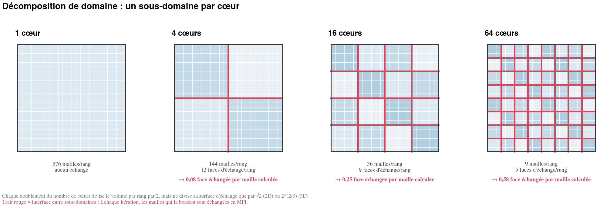
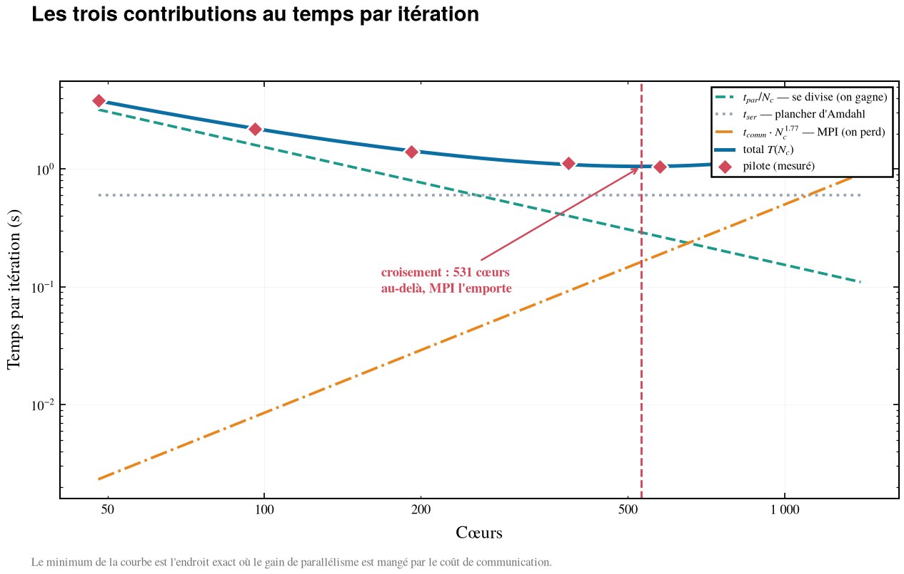
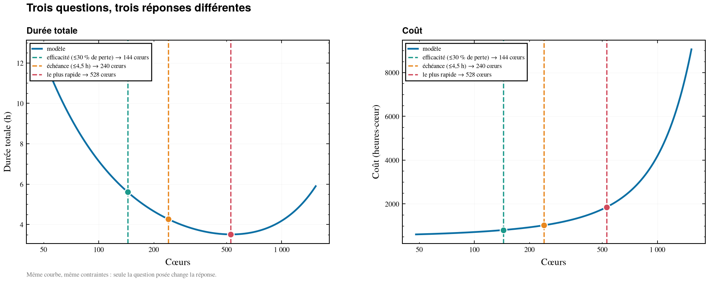
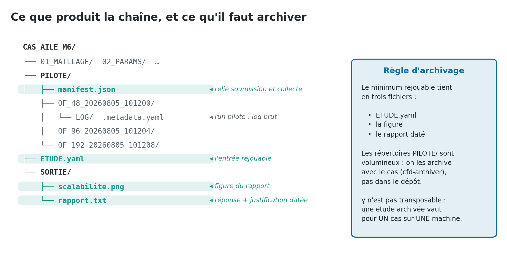
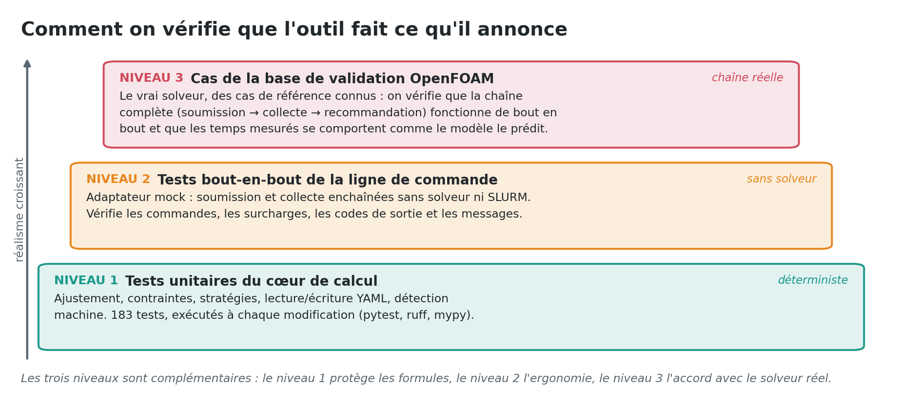

# 1. La problématique

Avant chaque calcul RANS stationnaire revient la même question, banale et mal
outillée : **sur combien de cœurs le lancer ?** On y répond aujourd'hui à
l'habitude, en recopiant le calcul précédent. Trop peu de cœurs immobilise une
file d'attente pendant des jours ; trop de cœurs coûte deux fois plus cher pour
un calcul *plus lent*, les échanges MPI finissant par peser davantage que le
travail qu'ils distribuent. Ce document transmet la méthode retenue pour
répondre par la mesure, l'outil qui l'automatise (`cfd-perf`), et les limites à
connaître avant de s'appuyer dessus.

{width=16.5cm}

```{=openxml}
<w:p><w:r><w:br w:type="page"/></w:r></w:p>
```

# 2. Traitement du problème

## 2.1 Ce qui entre, ce qui sort

La chaîne est volontairement étroite : **une seule donnée réelle en entrée**, les
mesures d'une petite campagne pilote. Tout le reste — modèle, contraintes,
stratégie — n'est que de l'exploitation de ces quelques points.

{width=16.5cm}

| Entrée | Obligatoire | D'où elle vient |
|:---|:---:|:---|
| Cas prêt à lancer (maillage, conditions, réglages solveur) | oui | l'étude en cours |
| Mesures pilotes : cœurs, temps/itération, RAM crête totale | oui | campagne pilote (étapes 1-2) |
| Nombre de mailles | oui | l'adaptateur solveur, ou saisi |
| Nombre d'itérations de production | oui | expérience d'un cas comparable |
| Machine : cœurs/nœud, RAM/nœud, nœuds max, walltime max | non | détection automatique, sinon `hotes.yaml` |
| Contraintes et objectif | non | défauts raisonnables fournis |

| Sortie | Contenu |
|:---|:---|
| La réponse | un nombre de cœurs, arrondi aux **nœuds entiers** de la machine |
| Les chiffres de décision | durée d'horloge, coût en h·cœur, accélération, efficacité, mailles/cœur, Go/cœur |
| Les alternatives | ce qu'auraient répondu les autres stratégies, avec l'écart en durée et en coût |
| Les réserves | qualité de l'ajustement, extrapolation hors plage pilote, mémoire non mesurée |
| Les traces | `ETUDE.yaml` validé, figure PNG, rapport — l'étude est rejouable telle quelle |
| Le code de sortie | 0 succès, 1 erreur, 2 aucune configuration réalisable, 3 runs non terminés |

**Un point de vocabulaire, parce qu'il structure tout le reste.** La *durée* est
le temps d'horloge que vous attendez ; le *coût* est le produit durée × cœurs,
c'est-à-dire ce qui est facturé sur l'allocation. Les deux ne sont pas
minimisés par le même nombre de cœurs — d'où la notion de stratégie.

## 2.2 Le principe physique, en trois images

Sur un maillage **fixe**, ajouter des cœurs a deux effets opposés. Le premier est
celui qu'on attend : chaque rang MPI a moins de mailles à traiter. Le second est
celui qu'on oublie : chaque sous-domaine devient plus petit, donc son rapport
surface/volume augmente, et la part du temps passée à échanger les halos avec
les rangs voisins grandit.

{width=16.5cm}

Le volume de travail utile décroît comme le nombre de mailles par rang, mais la
surface à échanger ne décroît que comme sa puissance 2/3. La conséquence
pratique tient en une règle : sous ~10 000 mailles par cœur, l'échange domine le
travail du solveur. C'est le plancher retenu par défaut dans l'outil — un
plancher, pas une cible.

{width=16.5cm}

Ces deux effets se résument en un modèle à trois termes, ajusté sur les points
pilotes :

$$T(N_c) = t_{ser} + \frac{t_{par}}{N_c} + t_{comm} \cdot N_c^{\gamma}$$

| Terme | Signification physique | Quand $N_c$ augmente |
|:---|:---|:---|
| $t_{ser}$ | travail jamais parallélisé : E/S, initialisation, réductions | constant |
| $t_{par}/N_c$ | travail qui se divise parfaitement | décroît — on gagne |
| $t_{comm} \cdot N_c^{\gamma}$ | coût des échanges MPI | croît — on perd |

{width=16.5cm}

L'exposant $\gamma$ n'est pas une constante universelle : il absorbe la topologie
du réseau, le partitionneur et le solveur. Sur le cas de référence de ce
document, l'ajustement donne
`T(Nc) = 0,6002 + 153,6/Nc + 2,449e-06 · Nc^1,77`, avec 2,5 % d'erreur maximale
et R² = 0,9993. **Ce $\gamma$ n'est pas transposable d'une machine à l'autre.**

```{=openxml}
<w:p><w:r><w:br w:type="page"/></w:r></w:p>
```

## 2.3 Les grandes étapes

{width=16.5cm}

### ÉTAPE 0 — Préparer et vérifier les prérequis

On part d'un **cas qui tourne déjà** : maillage, conditions aux limites et
réglages du solveur figés. La campagne pilote n'a de valeur que si elle mesure le
vrai cas ; un cas dégradé « pour aller plus vite » mesure autre chose.

Trois vérifications, dans l'ordre :

1. l'outil répond — `cfd-perf --help`, et `cfd-perf example -o essai` pour
   dérouler un cas fourni sans solveur ;
2. l'adaptateur du solveur est disponible et le solveur est installé —
   `source ADAPTATEUR/OF.sh && adapt_verifier_installation` ;
3. la machine est connue — détection automatique via l'ordonnanceur, sinon
   inscrite dans `ADAPTATEUR/hotes.yaml`.

> **Renseigner `cores_per_node` n'est pas optionnel en pratique.** Sans lui,
> l'outil peut répondre « 531 cœurs », un nombre inutilisable : vous demanderez
> 12 nœuds de 48, soit 576 cœurs, et serez facturé pour 576.

### ÉTAPE 1 — Soumettre la campagne pilote

Un run court par nombre de cœurs, sur le vrai cas, quelques centaines
d'itérations. C'est la seule mesure de toute la chaîne.

```bash
cfd-perf capture --coeurs "48 96 192 384 768" \
    --adaptateur OF --queue normal --case-dir .
```

La commande crée un répertoire par run dans `PILOTE/`, y copie les entrées,
prépare le cas pour N cœurs, soumet, écrit `PILOTE/manifest.json` et **rend la
main**. Les jobs partent en file d'attente ; on revient plus tard.

Les règles de constitution du pilote conditionnent la qualité de la réponse :

| Règle | Pourquoi |
|:---|:---|
| Le **vrai** cas : vrai maillage, vrai solveur, vrai schéma | $\gamma$ dépend du partitionnement et du solveur |
| **4 à 6** nombres de cœurs (3 minimum) | en dessous de 3 points, le terme MPI n'est pas identifiable |
| Couvrir un facteur **≥ 4** (ex. 48 → 1024) | sinon l'ajustement ne voit aucune dégradation |
| Aller assez haut pour **voir** la dégradation | c'est là qu'est la réponse |
| Ignorer les premières itérations | initialisation et E/S faussent le temps par itération |
| Relever la RAM crête **totale** | sans elle, pas de contrainte mémoire |

Le coût de cette campagne est une fraction du calcul de production. Se tromper
d'un facteur 3 sur le dimensionnement coûte beaucoup plus cher.

### ÉTAPE 2 — Collecter et écrire le fichier d'étude

```bash
cfd-perf capture --collect --case-dir . --figure SORTIE/scalabilite.png
```

La collecte relit le manifeste, interroge l'état de chaque job et, s'il en reste
qui tournent, les liste et s'arrête proprement (code 3) : on relance plus tard,
rien n'est perdu. Pour les runs terminés, elle extrait le temps solveur total, le
nombre d'itérations effectuées — `temps_par_itération = total / itérations` — et
la RAM crête totale, lue sous SLURM comme `MaxRSS × NTasks`. Hors SLURM, la RAM
n'est simplement pas mesurée et les contraintes mémoire sont ignorées, sans
bloquer le reste.

Elle détecte ensuite la machine, puis écrit un `ETUDE.yaml` **validé** : un seul
fichier, versionnable à côté du cas, qui contient le pilote, le maillage, la
machine, les contraintes et l'objectif. C'est ce fichier — et non les répertoires
de runs — qui constitue la mémoire de l'étude.

Deux champs restent à vérifier à la main dans la version actuelle : le nombre
d'itérations de production et le nombre de mailles reposent sur des fonctions
d'adaptateur volontairement simples. Les options `--n-iterations` et
`--num-cells` permettent de les imposer.

### ÉTAPE 3 — Ajuster le modèle et contrôler l'ajustement

À $\gamma$ fixé, le modèle est linéaire en $(t_{ser}, t_{par}, t_{comm})$. On
balaie donc $\gamma$ sur une grille et on résout un moindres carrés linéaire pour
chaque valeur, en gardant la meilleure. Deux détails comptent sur des données
réelles : les résidus sont pondérés en **relatif**, sans quoi les points lents à
bas nombre de cœurs écrasent numériquement les points rapides — précisément ceux
qui décident de la réponse ; et les coefficients sont contraints **positifs**,
puisque ce sont des temps physiques.

La qualité de l'ajustement est un résultat de premier plan, toujours affiché :

| Verdict | Erreur max | Interprétation |
|:---|---:|:---|
| excellent | ≤ 2 % | — |
| bon | ≤ 5 % | comparable à la gigue d'un calculateur réel |
| limite | ≤ 10 % | ajouter des points pilotes |
| mauvais | > 10 % | **ne pas décider sur cette base** |

Le rapport donne l'écart **point par point**, ce qui rend une mauvaise campagne
visible en chiffres avant même d'ouvrir la figure :

```
 Cœurs    Mesuré    Prédit   Erreur
 ──────────────────────────────────
    48   3,850 s   3,803 s   −1,2 %
    96   2,180 s   2,208 s   +1,3 %
   192   1,410 s   1,427 s   +1,2 %
   384   1,120 s   1,092 s   −2,5 %
   576   1,050 s   1,055 s   +0,5 %
   768   1,100 s   1,114 s   +1,2 %
  1024   1,280 s   1,272 s   −0,6 %
```

### ÉTAPE 4 — Décider

L'outil balaie les nombres de cœurs candidats, calcule pour chacun durée, coût,
efficacité et mémoire par cœur, écarte ceux qui violent une contrainte
(mailles/cœur, RAM par nœud, nombre de nœuds, walltime, budget), puis applique la
stratégie demandée.

{width=16.5cm}

| Stratégie | Question posée | Règle appliquée |
|:---|:---|:---|
| `efficiency` *(défaut)* | « je ne veux pas gaspiller l'allocation » | le plus de cœurs en restant sous le seuil de perte (30 % par défaut) |
| `deadline` | « il me le faut pour lundi » | le moins de cœurs qui tiennent l'échéance |
| `fastest` | « le plus vite possible, peu importe le coût » | durée minimale |

Sur le cas de référence, les trois questions donnent trois réponses : 144 cœurs
en efficacité (5,6 h, 808 h·cœur), 240 cœurs pour une échéance à 4,5 h, 528 cœurs
au plus rapide (3,5 h mais 1 853 h·cœur, soit +129 % de coût pour −37 % de
durée).

> **`fastest` n'est jamais « le maximum de cœurs ».** La courbe a un minimum :
> au-delà, plus de cœurs signifie plus lent *et* plus cher. L'outil ne franchit
> jamais ce point.

### ÉTAPE 5 — Documenter

La documentation n'est pas une étape de fin de projet : c'est la sortie normale
de la commande. Le rapport est ordonné **délibérément** — la réponse d'abord, les
réserves ensuite (jamais enterrées plus bas), puis les alternatives, puis la
justification complète : données d'entrée, modèle ajusté, écart point par point,
courbe candidate par candidate.

```
╭──── Réponse  (efficacité : le plus de cœurs sans gaspiller) ─────╮
│ Lancer sur 144 cœurs  =  3 nœuds de 48 cœurs                     │
│                                                                  │
│        Durée  5,6 h              ← durée d'horloge               │
│         Coût  808 h·cœur         ← ce qui est facturé            │
│ Accélération  2,3× vs 48 cœurs                                   │
│   Efficacité  75 %  (25 % perdu)                                 │
│       Charge  138 889 mailles/cœur                               │
│      Mémoire  1,03 Go/cœur                                       │
╰──────────────────────────────────────────────────────────────────╯
```

Deux commandes suffisent à produire la trace écrite complète :

```bash
cfd-perf run ETUDE.yaml --figure SORTIE/scalabilite.png -v \
    | tee SORTIE/rapport.txt
```

La figure et le rapport se lisent ensemble : la figure montre *où* se situe la
réponse sur la courbe et si l'on extrapole hors de la plage pilote ; le rapport
donne les chiffres et les réserves.

### ÉTAPE 6 — Archiver

{width=16.5cm}

Le minimum rejouable tient en trois fichiers, à versionner à côté du cas :
`ETUDE.yaml`, la figure, le rapport daté. À partir du seul `ETUDE.yaml`,
n'importe qui peut rejouer la décision, la contester avec une autre stratégie ou
la mettre à jour sans relancer un seul calcul.

Les répertoires `PILOTE/` sont volumineux et n'ont pas leur place dans un dépôt :
ils suivent le cas dans l'archivage habituel du framework (`cfd-archiver`,
`cfd-archivage-cas`). On conserve `manifest.json` avec eux, puisque c'est lui qui
relie les runs à l'étude.

Une règle d'archivage à retenir : **une étude vaut pour un cas sur une machine.**
Changement de calculateur, de partitionneur ou de solveur : nouvelle campagne
pilote.

## 2.4 Vérification et validation de l'outil

{width=16.5cm}

Le premier niveau protège les formules : 183 tests automatisés couvrent
l'ajustement, les contraintes, les stratégies, la lecture/écriture du YAML et la
détection machine ; ils tournent à chaque modification, avec l'analyse statique
(`pytest`, `ruff`, `mypy`).

Le deuxième niveau protège l'ergonomie : un adaptateur `mock` rejoue la chaîne
complète — soumission puis collecte — sans solveur ni ordonnanceur, ce qui permet
de vérifier les commandes, les surcharges d'options, les codes de sortie et les
messages d'erreur sur n'importe quel poste.

Le troisième niveau est le seul qui engage la physique : **l'outil est exercé sur
les cas de la base de validation d'OpenFOAM**, avec le vrai solveur. Ces cas de
référence, connus et reproductibles, servent à vérifier que la chaîne fonctionne
de bout en bout dans les conditions réelles — soumission, extraction des temps et
de la mémoire, ajustement, recommandation — et que le comportement mesuré est
bien celui que le modèle décrit.

```{=openxml}
<w:p><w:r><w:br w:type="page"/></w:r></w:p>
```

# 3. Difficultés et limites

**Ce que l'outil ne fait pas.** Il ne prédit pas le nombre d'itérations
nécessaires à la convergence : c'est une entrée, qui vient de votre expérience
du cas. Durée et coût lui étant directement proportionnels, une estimation à
±30 % donne une réponse à ±30 %. Il ne dit rien de la qualité du maillage ni de
la physique. Il ne traite pas la scalabilité faible (maillage qui grandit avec
les cœurs), et sort de son cadre pour du LES ou de l'URANS à pas de temps
variable, où l'hypothèse d'un coût constant par itération tombe.

| Limite | Conséquence pratique | Ce qu'on fait |
|:---|:---|:---|
| $\gamma$ absorbe réseau, partitionneur et solveur | non transposable d'une machine à l'autre | une campagne pilote **par machine** |
| Le pilote est la seule mesure | un pilote bâclé donne une réponse fausse mais confiante | règles de l'étape 1, verdict de qualité affiché |
| Extrapolation hors plage pilote | l'incertitude n'est plus contrôlée | zone signalée sur la figure et dans le rapport |
| Mémoire supposée fixe et répartie également | estimation légèrement optimiste à grand nombre de cœurs | contrainte mémoire traitée comme un garde-fou, pas une prédiction |
| RAM non mesurée hors SLURM | contraintes mémoire ignorées | la recommandation reste valable, la réserve est affichée |
| Nombre de mailles et d'itérations issus de fonctions d'adaptateur simples | valeurs à vérifier | options `--num-cells` et `--n-iterations` |
| Un seul run par nombre de cœurs | la gigue du calculateur n'est pas moyennée | relancer la soumission : les points de mêmes cœurs sont moyennés |

**Les pièges d'exploitation**, ceux qui coûtent le plus de temps en pratique :

- *Le manifeste déplacé entre soumission et collecte.* `PILOTE/manifest.json`
  relie les deux phases ; sans lui, les runs sont orphelins.
- *La machine non renseignée.* Réponse en cœurs « libres », impossible à
  demander à l'ordonnanceur, et facturation à la surprise.
- *L'adaptateur `OF.sh` pris tel quel.* Il sert de référence : les chemins, le
  script de soumission et l'extraction des temps sont à adapter à votre
  installation.
- *L'installation non éditable.* Après un `pip install .` classique, `run` et
  `check` fonctionnent mais `example` et `capture` ne trouvent plus les
  répertoires `01_EXEMPLE/` et `ADAPTATEUR/`, qui sont résolus relativement aux
  sources. La panne est sournoise parce qu'elle est partielle : privilégier
  l'installation éditable ou une installation partagée qui conserve
  l'arborescence.

```{=openxml}
<w:p><w:r><w:br w:type="page"/></w:r></w:p>
```

# 4. Aide-mémoire

| Besoin | Commande |
|:---|:---|
| Découvrir l'outil sans solveur | `cfd-perf example -o essai && cfd-perf run essai/*.yaml` |
| Soumettre le pilote | `cfd-perf capture --coeurs "48 96 192 384" --adaptateur OF --queue normal` |
| Collecter et recommander | `cfd-perf capture --collect --figure SORTIE/scalabilite.png` |
| Valider un fichier d'étude | `cfd-perf check ETUDE.yaml` |
| Décider avec une échéance | `cfd-perf run ETUDE.yaml --strategy deadline --deadline 4.5` |
| Rapport complet + trace écrite | `cfd-perf run ETUDE.yaml -v \| tee SORTIE/rapport.txt` |
| Essayer la chaîne complète sans solveur | `cfd-perf capture --coeurs "8 16 32 64" --adaptateur mock` |

**Documentation de référence** (dans `tools/cfd-perf/`) : `README.md` pour
l'ensemble, `00_DOC/01_MODELE.md` pour le modèle, `00_DOC/02_GUIDE_UTILISATEUR.md`
pour l'usage courant, `00_DOC/03_FORMAT_ENTREE.md` pour le format d'étude,
`00_DOC/05_CAPTURE_PILOTE.md` pour la capture automatique et le contrat
d'adaptateur, `00_DOC/06_INSTALLATION_AIR_GAP.md` pour l'installation sur
calculateur isolé.
