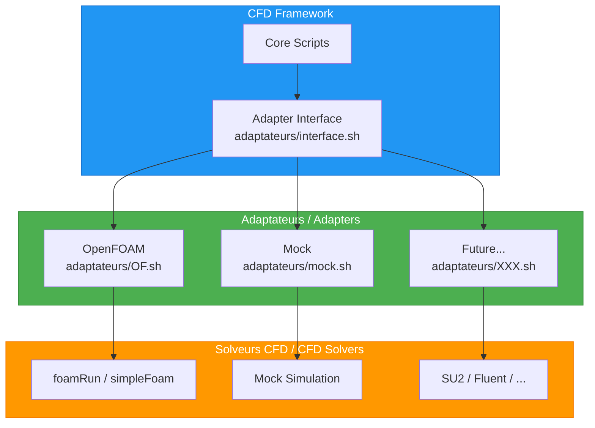
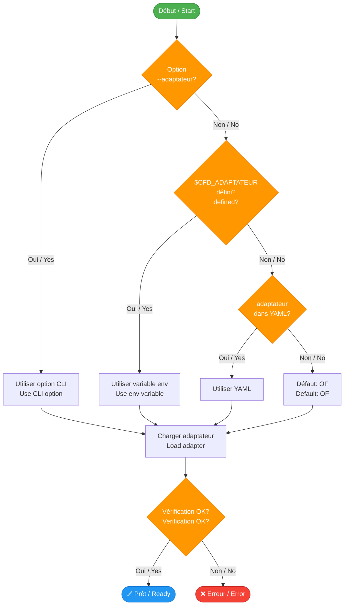

# Adaptateurs / Adapters Overview

## 🔌 Système d'adaptateurs / Adapter System

Les adaptateurs permettent au framework de supporter différents solveurs CFD de manière générique.

Adapters enable the framework to support different CFD solvers in a generic way.

---

## 📊 Architecture / Architecture



---

## 📋 Interface commune / Common Interface

Tous les adaptateurs doivent implémenter ces fonctions:

All adapters must implement these functions:

### Informations / Information

```bash
adapt_nom()          # Retourne le nom du solveur / Returns solver name
adapt_version()       # Retourne la version / Returns version
adapt_description()   # Description courte / Short description
```

### Vérification / Verification

```bash
adapt_verifier_installation()  # Vérifie que le solveur est installé
                               # Checks that solver is installed
```

### Préparation et lancement / Preparation and Launch

```bash
adapt_preparer_entree()      # Prépare les fichiers d'entrée
                             # Prepares input files

adapt_lancer_calcul()        # Lance le solveur
                             # Launches the solver

adapt_liste_elements_a_copier()  # Liste les éléments à copier
                                 # Lists elements to copy
```

---

## 🌊 Adaptateur OpenFOAM

### Description

Adaptateur pour OpenFOAM (toutes versions).

Adapter for OpenFOAM (all versions).

### Fonctionnalités / Features

- ✅ Support solveurs standards / Standard solvers
- ✅ Mode série et parallèle / Serial and parallel mode
- ✅ Décomposition automatique / Automatic decomposition
- ✅ Reconstruction résultats / Results reconstruction
- ✅ Extraction résidus / Residual extraction

### Utilisation / Usage

```bash
# Définir l'adaptateur / Set the adapter
export CFD_ADAPTATEUR="OF"

# Lancer / Launch
cfd-run --adaptateur OF --name CASE

# Ou / Or
cfd-run-parametrique --config STUDY
```

### Configuration

```yaml
# config.yaml
etude:
  nom: "OPENFOAM_STUDY"

adaptateur: "OF"

configurations:
  BASELINE:
    cas:
      - nom: "CASE_1"
        parametres:
          solver: "simpleFoam"
          nb_iterations: 10000
          nb_procs: 8
```

### Templates supportés / Supported Templates

```
02_PARAMS/BASELINE/template/
├── constant/
│   ├── turbulenceProperties.org
│   └── transportProperties.org
├── system/
│   ├── controlDict.org
│   ├── fvSchemes.org
│   ├── fvSolution.org
│   └── decomposeParDict.org
└── 0/
    ├── U.org
    ├── p.org
    └── nut.org
```

**Documentation détaillée:** [OpenFOAM Adapter](openfoam.md)

---

## 🧪 Adaptateur Mock

### Description

Adaptateur de test qui simule un solveur CFD.

Test adapter that simulates a CFD solver.

### Fonctionnalités / Features

- ✅ Simulation rapide / Fast simulation
- ✅ Génération logs factices / Generates fake logs
- ✅ Résultats mock / Mock results
- ✅ Pas de dépendances / No dependencies
- ✅ Idéal pour tests / Ideal for testing

### Utilisation / Usage

```bash
# Test rapide / Quick test
cfd-run --adaptateur mock --name TEST

# Étude paramétrique de test / Test parametric study
export CFD_ADAPTATEUR="mock"
cfd-run-parametrique --config TEST_CONFIG
```

### Cas d'usage / Use Cases

1. **Développement du framework / Framework development**
   - Tester nouvelles fonctionnalités
   - Test new features

2. **CI/CD**
   - Tests automatisés sans solveur réel
   - Automated tests without real solver

3. **Formation / Training**
   - Apprendre le framework
   - Learn the framework

4. **Validation workflow / Workflow validation**
   - Vérifier configuration
   - Check configuration

**Documentation détaillée:** [Mock Adapter](mock.md)

---

## 🚧 Adaptateurs planifiés / Planned Adapters

| Adaptateur / Adapter | Status | Description |
|---------------------|---------|-------------|
| **SU2** | 🔄 Planned | Solveur aérodynamique open-source / Open-source aerodynamic solver |
| **Fluent** | 🔄 Planned | Solveur commercial ANSYS / ANSYS commercial solver |
| **Star-CCM+** | 🔄 Planned | Solveur commercial Siemens / Siemens commercial solver |
| **CFX** | 🔄 Planned | Solveur commercial ANSYS / ANSYS commercial solver |
| **Code Saturne** | 🔄 Planned | Solveur open-source EDF / EDF open-source solver |

---

## 🎯 Sélection d'adaptateur / Adapter Selection

### Graphe de décision / Decision Graph



### Ordre de priorité / Priority Order

1. **Option CLI** (plus haute priorité / highest priority)
   ```bash
   cfd-run --adaptateur OF
   ```

2. **Variable d'environnement**
   ```bash
   export CFD_ADAPTATEUR="OF"
   cfd-run
   ```

3. **Fichier config.yaml**
   ```yaml
   adaptateur: "OF"
   ```

4. **Défaut** (plus basse priorité / lowest priority)
   ```bash
   # Défaut: OF
   cfd-run
   ```

---

## 🔧 Créer un adaptateur / Create an Adapter

### Structure minimale / Minimal Structure

```bash
#!/usr/bin/env bash
# ═══════════════════════════════════════════════════════════════════════════════
#  mon_solveur.sh — Adaptateur pour Mon Solveur CFD
# ═══════════════════════════════════════════════════════════════════════════════

# Charger l'interface / Load interface
source "${CFD_FRAMEWORK}/adaptateurs/interface.sh"

# ══════════════════════════════════════════════════════════════════════════════
#  INFORMATIONS
# ══════════════════════════════════════════════════════════════════════════════

adapt_nom() {
  echo "MonSolveur"
}

adapt_version() {
  mon_solveur --version 2>/dev/null || echo "unknown"
}

adapt_description() {
  echo "Adaptateur pour Mon Solveur CFD"
}

# ══════════════════════════════════════════════════════════════════════════════
#  VÉRIFICATION
# ══════════════════════════════════════════════════════════════════════════════

adapt_verifier_installation() {
  if command -v mon_solveur &>/dev/null; then
    return 0
  else
    _error "mon_solveur n'est pas installé"
    return 1
  fi
}

# ══════════════════════════════════════════════════════════════════════════════
#  PRÉPARATION
# ══════════════════════════════════════════════════════════════════════════════

adapt_preparer_entree() {
  local rep_exec="$1"
  
  # Substituer templates .org
  find "$rep_exec" -name "*.org" | while read template; do
    output="${template%.org}"
    param_substituer_tout "$template" "$output"
  done
  
  return 0
}

adapt_liste_elements_a_copier() {
  cat <<EOF
template
input_files
mesh
EOF
}

# ══════════════════════════════════════════════════════════════════════════════
#  LANCEMENT
# ══════════════════════════════════════════════════════════════════════════════

adapt_lancer_calcul() {
  local rep_exec="$1"
  local nb_procs="${2:-1}"
  
  cd "$rep_exec" || return 1
  
  # Créer répertoire LOG
  mkdir -p LOG
  
  # Lancer le solveur
  if [[ $nb_procs -gt 1 ]]; then
    mpirun -np "$nb_procs" mon_solveur input.dat > LOG/log.solver 2>&1
  else
    mon_solveur input.dat > LOG/log.solver 2>&1
  fi
  
  local exit_code=$?
  
  if [[ $exit_code -eq 0 ]]; then
    _result "Calcul terminé avec succès"
    return 0
  else
    _error "Échec du calcul (exit code: $exit_code)"
    return 1
  fi
}
```

**Guide complet:** [Créer un adaptateur](create-adapter.md)

---

## 📊 Comparaison des adaptateurs / Adapter Comparison

| Caractéristique / Feature | OpenFOAM | Mock | SU2 (Futur) |
|---------------------------|----------|------|-------------|
| **Type** | Production | Test | Production |
| **Parallélisation** | ✅ MPI | ❌ Non | ✅ MPI |
| **Templates .org** | ✅ Oui | ✅ Oui | 🔄 Prévu |
| **Extraction résidus** | ✅ Oui | ✅ Oui | 🔄 Prévu |
| **Dépendances** | OpenFOAM | Aucune | SU2 |
| **Temps setup** | ~1min | <1s | 🔄 TBD |

---

## 🔍 Debugging d'adaptateur / Adapter Debugging

### Vérifier qu'un adaptateur fonctionne / Check if Adapter Works

```bash
# 1. Vérifier existence / Check existence
ls $CFD_FRAMEWORK/adaptateurs/OF.sh

# 2. Sourcer l'adaptateur / Source the adapter
source $CFD_FRAMEWORK/adaptateurs/OF.sh

# 3. Tester les fonctions / Test functions
adapt_nom
adapt_version
adapt_verifier_installation

# 4. Test complet / Complete test
export CFD_ADAPTATEUR="OF"
cfd-run --adaptateur OF --dry-run --name TEST
```

### Logs de debug / Debug Logs

```bash
# Mode verbose / Verbose mode
export VERBOSE=2
cfd-run --adaptateur OF --name TEST 2>&1 | tee debug.log

# Vérifier dans les logs / Check in logs:
grep "Chargement de l'adaptateur" debug.log
grep "adapt_" debug.log
```

---

## 📖 Voir aussi / See Also

- [OpenFOAM Adapter](openfoam.md) - Documentation détaillée OF / Detailed OF documentation
- [Mock Adapter](mock.md) - Documentation Mock / Mock documentation
- [Créer un adaptateur](create-adapter.md) - Guide création / Creation guide
- [CLI cfd-run](../cli/cfd-run.md) - Utilisation / Usage

---

## 💡 Bonnes pratiques / Best Practices

### ✅ DO / À FAIRE

- ✅ Implémenter toutes les fonctions de l'interface / Implement all interface functions
- ✅ Vérifier l'installation du solveur / Check solver installation
- ✅ Documenter les paramètres supportés / Document supported parameters
- ✅ Tester avec `--dry-run` / Test with `--dry-run`

### ❌ DON'T / À ÉVITER

- ❌ Modifier l'interface commune / Modify the common interface
- ❌ Hardcoder des chemins / Hardcode paths
- ❌ Oublier la gestion d'erreurs / Forget error handling
