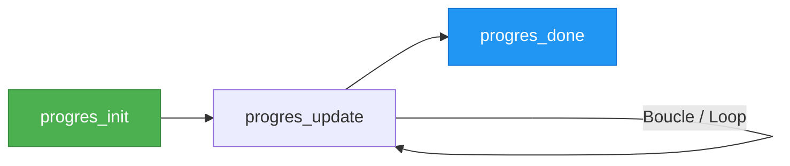
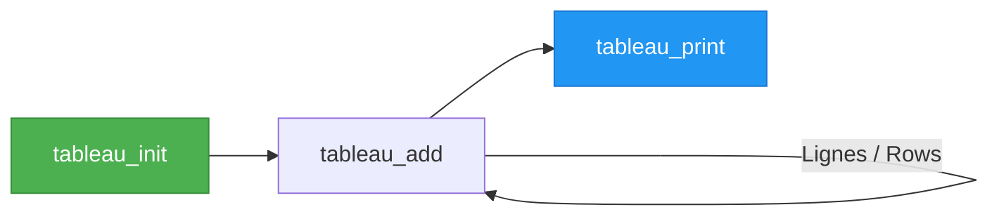

# format.sh - Bibliothèque de formatage / Formatting Library

## 📋 Vue d'ensemble / Overview

`lib/format.sh` est une bibliothèque de formatage professionnelle pour scripts Bash, optimisée pour les workflows CFD. Elle fournit des fonctions de logging, titres hiérarchiques, barres de progression, interactivité et bannières ASCII.

`lib/format.sh` is a professional formatting library for Bash scripts, optimized for CFD workflows. It provides logging functions, hierarchical titles, progress bars, interactivity, and ASCII banners.

---

## 🚀 Utilisation / Usage

### Import

```bash
#!/usr/bin/env bash
source "${CFD_FRAMEWORK}/lib/format.sh"
```

!!! note "Auto-détection TTY"
    La bibliothèque détecte automatiquement si la sortie est un terminal et active/désactive les couleurs en conséquence.
    
    The library automatically detects if output is a terminal and enables/disables colors accordingly.

---

## 📝 Fonctions de logging / Logging Functions

### Messages d'information / Information Messages

#### `_info "message"`

Affiche un message d'information avec icône ℹ️.

Displays an information message with icon ℹ️.

```bash
_info "Chargement des paramètres..."
# ℹ️  Chargement des paramètres...
```

#### `_warn "message"`

Affiche un avertissement avec icône ⚠️ en jaune.

Displays a warning with icon ⚠️ in yellow.

```bash
_warn "Configuration non optimale détectée"
# ⚠️  Configuration non optimale détectée
```

#### `_error "message"`

Affiche une erreur avec icône ❌ en rouge.

Displays an error with icon ❌ in red.

```bash
_error "Fichier introuvable: config.yaml"
# ❌ Fichier introuvable: config.yaml
```

#### `_result "message"`

Affiche un message de succès avec icône ✅ en vert.

Displays a success message with icon ✅ in green.

```bash
_result "Configuration chargée avec succès"
# ✅ Configuration chargée avec succès
```

#### `_debug "message"`

Affiche un message de debug (si `$VERBOSE >= 2`) avec icône 🔍.

Displays a debug message (if `$VERBOSE >= 2`) with icon 🔍.

```bash
_debug "Valeur de CASE_NAME: $CASE_NAME"
# 🔍 Valeur de CASE_NAME: AIRFOIL
```

#### `_note "message"`

Affiche une note informative avec icône 📝.

Displays an informative note with icon 📝.

```bash
_note "Vous pouvez utiliser --dry-run pour tester"
# 📝 Vous pouvez utiliser --dry-run pour tester
```

#### `_bullet "message"`

Affiche un élément de liste avec puce •.

Displays a list item with bullet •.

```bash
_bullet "Fichier copié: mesh.cgns"
# • Fichier copié: mesh.cgns
```

### Actions et états / Actions and States

#### `_start "message"` / `_end "message"`

Marque le début/fin d'une action avec icônes 🚀 / 🏁.

Marks the start/end of an action with icons 🚀 / 🏁.

```bash
_start "Lancement du calcul CFD..."
# ... calcul ...
_end "Calcul terminé"
# 🚀 Lancement du calcul CFD...
# 🏁 Calcul terminé
```

#### `_check "message"` / `_cross "message"`

Affiche un succès ✓ ou échec ✗.

Displays success ✓ or failure ✗.

```bash
_check "Test de convergence"
_cross "Test de qualité maillage"
# ✓ Test de convergence
# ✗ Test de qualité maillage
```

#### `die "message" [exit_code]`

Affiche une erreur et arrête le script.

Displays an error and stops the script.

```bash
[[ -f "$FILE" ]] || die "Fichier requis: $FILE"
# ❌ Fichier requis: config.yaml
# [Script exits with code 1]
```

---

## 🎨 Titres et organisation / Titles and Organization

### Titres / Titles

#### `title "Texte"`

Affiche un titre principal encadré.

Displays a main framed title.

```bash
title "CFD Framework"
# ═══════════════════════════════════
#  CFD Framework
# ═══════════════════════════════════
```

#### `title_icon "emoji" "Texte"`

Titre avec icône personnalisée.

Title with custom icon.

```bash
title_icon "🚀" "Lancement Simulation"
```

### En-têtes hiérarchiques / Hierarchical Headers

#### `h1 "Section"`, `h2 "Sous-section"`, `h3 "Détail"`

En-têtes numérotés automatiquement.

Automatically numbered headers.

```bash
h1 "Configuration"
h2 "Chargement YAML"
h2 "Validation"
h3 "Schéma"
h3 "Paramètres"
h1 "Lancement"
# 1. Configuration
# 1.1 Chargement YAML
# 1.2 Validation
#   ▸ 1.2.1 Schéma
#   ▸ 1.2.2 Paramètres
# 2. Lancement
```

#### `reset_counters`

Réinitialise la numérotation.

Resets numbering.

```bash
reset_counters
h1 "Nouvelle section"
# 1. Nouvelle section
```

---

## 📏 Séparateurs / Separators

### `separator`, `separator_eq`, `separator_double`, `separator_wave`

Lignes de séparation visuelles.

Visual separation lines.

```bash
separator        # ───────────────────────────────────
separator_eq     # ═══════════════════════════════════
separator_double # ━━━━━━━━━━━━━━━━━━━━━━━━━━━━━━━━━━
separator_wave   # ~~~~~~~~~~~~~~~~~~~~~~~~~~~~~~~~~~~
```

---

## 📊 Barres de progression / Progress Bars

### Workflow / Workflow



### `progres_init "Message" Total`

Initialise une barre de progression.

Initializes a progress bar.

```bash
progres_init "Calcul CFD" 100
```

### `progres_update Valeur`

Met à jour la progression (avec ETA et vitesse).

Updates progress (with ETA and speed).

```bash
for i in {1..100}; do
  progres_update $i
  sleep 0.1
done
```

### `progres_done "Message final"`

Termine la barre à 100%.

Completes the bar at 100%.

```bash
progres_done "Calcul terminé"
```

### Exemple complet / Complete Example

```bash
TOTAL=50
progres_init "Traitement des cas" "$TOTAL"

for i in $(seq 1 $TOTAL); do
  # Faire le travail / Do work
  process_case "$i"
  
  # Mettre à jour / Update
  progres_update "$i"
done

progres_done "Tous les cas traités"
```

**Affichage / Output:**
```
Traitement des cas: [████████████████████] 100% (50/50) ETA: 0s [1.2 cas/s] ✓
✅ Tous les cas traités
```

---

## 📋 Tableaux formatés / Formatted Tables

### Workflow / Workflow



### Exemple / Example

```bash
tableau_init "Adaptateur" "Version" "Status"
tableau_add "OpenFOAM" "v2312" "✓ Installé"
tableau_add "SU2" "7.5.1" "✗ Non installé"
tableau_add "Mock" "1.0" "✓ Disponible"
tableau_print "Adaptateurs CFD"
```

**Affichage / Output:**
```
╔═══════════════════════════════════════╗
║      Adaptateurs CFD                  ║
╠═══════════╦═════════╦═════════════════╣
║ Adaptateur║ Version ║ Status          ║
╠═══════════╬═════════╬═════════════════╣
║ OpenFOAM  ║ v2312   ║ ✓ Installé      ║
║ SU2       ║ 7.5.1   ║ ✗ Non installé  ║
║ Mock      ║ 1.0     ║ ✓ Disponible    ║
╚═══════════╩═════════╩═════════════════╝
```

---

## 📦 Boîtes encadrées / Framed Boxes

### `boite_info`, `boite_result`, `boite_warn`, `boite_error`

Affiche un message dans une boîte colorée.

Displays a message in a colored box.

```bash
boite_info "Configuration chargée depuis config.yaml"
boite_result "Calcul terminé avec succès"
boite_warn "Attention: Convergence lente détectée"
boite_error "Erreur critique: Maillage invalide"
```

---

## 🔄 Interactivité / Interactivity

### `confirmer "Question" [defaut]`

Demande confirmation oui/non.

Asks for yes/no confirmation.

```bash
if confirmer "Voulez-vous continuer ?" o; then
  echo "Continuation..."
else
  echo "Annulé"
  exit 0
fi
```

### `choisir_option "Titre" "Option1" "Option2" ...`

Affiche un menu de choix numéroté.

Displays a numbered choice menu.

```bash
config=$(choisir_option "Choisir la configuration" \
  "BASELINE" \
  "ANGLE_OF_ATTACK" \
  "REYNOLDS") || exit 1

echo "Configuration sélectionnée: $config"
```

**Affichage / Output:**
```
Choisir la configuration:
  1) BASELINE
  2) ANGLE_OF_ATTACK
  3) REYNOLDS
Choix [1-3]: 2
Configuration sélectionnée: ANGLE_OF_ATTACK
```

---

## 🎭 Bannières CFD / CFD Banners

### Bannières spécialisées / Specialized Banners

#### `title_launch_simulation`

Bannière ASCII pour lancement de simulation.

ASCII banner for simulation launch.

```bash
title_launch_simulation
```

#### `titre_surveillance`

Bannière pour monitoring.

Banner for monitoring.

```bash
titre_surveillance
```

#### `titre_archivage`

Bannière pour archivage.

Banner for archiving.

```bash
titre_archivage
```

#### `titre_deploiement`

Bannière pour déploiement.

Banner for deployment.

```bash
titre_deploiement
```

#### `title_post_processing`

Bannière pour post-traitement.

Banner for post-processing.

```bash
title_post_processing
```

---

## ⚙️ Configuration

### Variables d'environnement / Environment Variables

| Variable | Description | Défaut / Default |
|----------|-------------|------------------|
| `VERBOSE` | Niveau de verbosité (0-2) | `2` |
| `NO_COLOR` | Désactiver couleurs | Non défini / Unset |
| `FORCE_COLOR` | Forcer couleurs | Non défini / Unset |

```bash
# Désactiver les messages debug / Disable debug messages
export VERBOSE=1

# Désactiver toutes les couleurs / Disable all colors
export NO_COLOR=1

# Forcer les couleurs même en non-TTY / Force colors even in non-TTY
export FORCE_COLOR=1
```

---

## 💡 Exemples d'utilisation / Usage Examples

### Script complet / Complete Script

```bash
#!/usr/bin/env bash
source "${CFD_FRAMEWORK}/lib/format.sh"

title "Mon Script CFD"

h1 "Chargement de la configuration"
_info "Lecture de config.yaml..."
if [[ -f "config.yaml" ]]; then
  _check "Fichier trouvé"
else
  die "Fichier config.yaml introuvable"
fi

h1 "Traitement des cas"
CASES=("CAS_1" "CAS_2" "CAS_3")
TOTAL=${#CASES[@]}

progres_init "Traitement" "$TOTAL"

for i in "${!CASES[@]}"; do
  case="${CASES[$i]}"
  _bullet "Traitement: $case"
  
  # Travail ici / Work here
  sleep 1
  
  progres_update $((i + 1))
done

progres_done "Terminé"

h1 "Résumé"
boite_result "Tous les cas traités avec succès"
```

---

## 📖 Voir aussi / See Also

- [gestion_config.sh](gestion-config.md) - Gestion de configuration / Configuration management
- [utils.sh](utils.md) - Utilitaires généraux / General utilities
- [CLI Reference](../cli/cfd-run.md) - Documentation des commandes / Command documentation

---

## 📝 Notes techniques / Technical Notes

- Compatible bash ≥ 4.0
- Détection automatique TTY pour couleurs / Automatic TTY detection for colors
- Thread-safe pour barres de progression / Thread-safe for progress bars
- Pas de dépendances externes / No external dependencies
