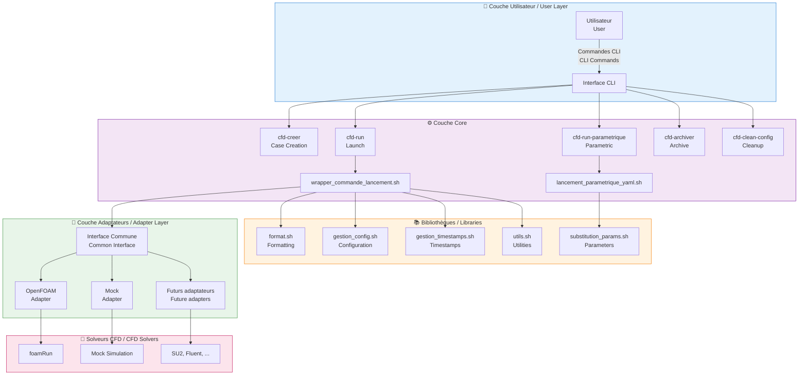
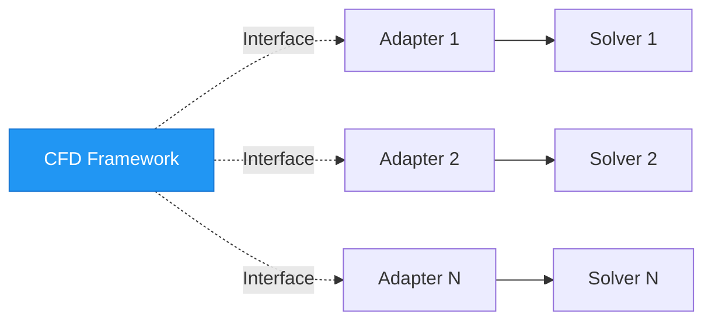
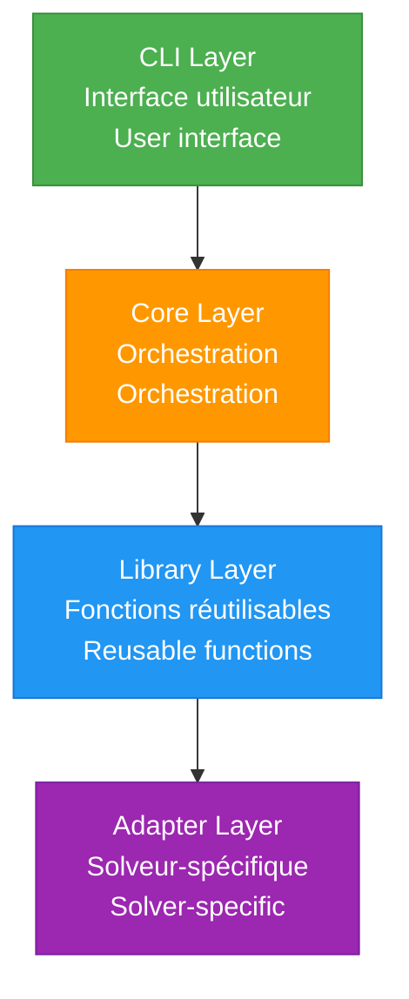
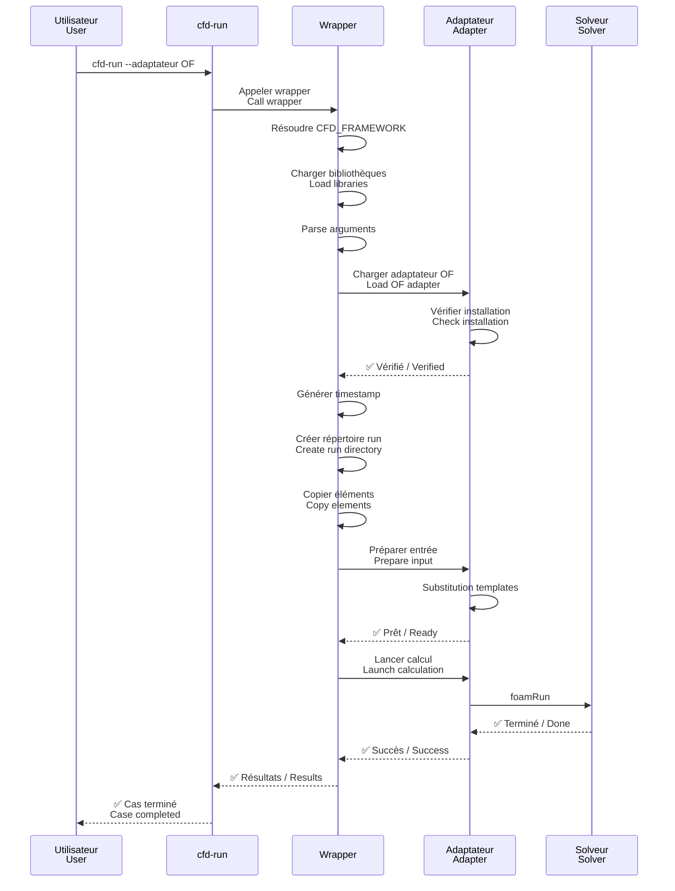
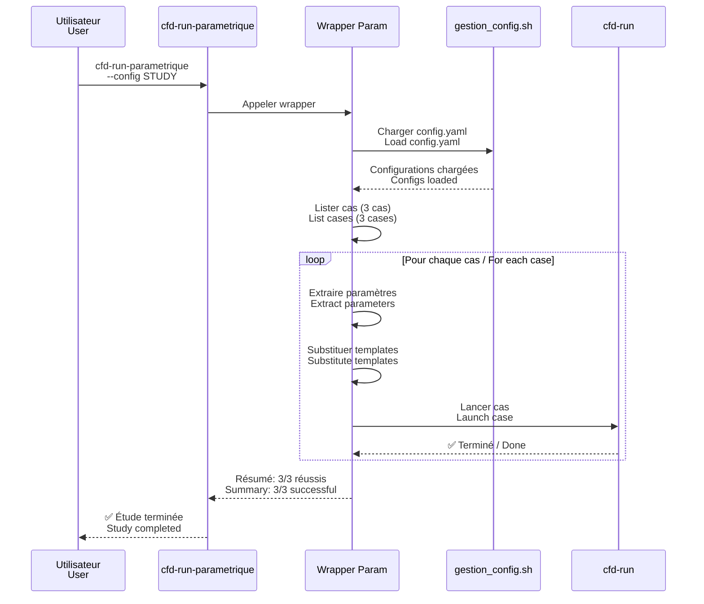
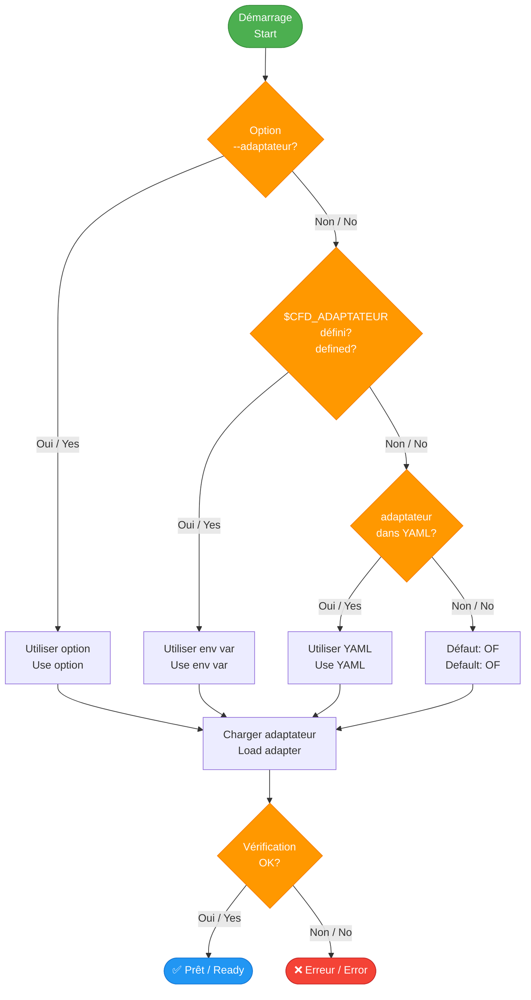
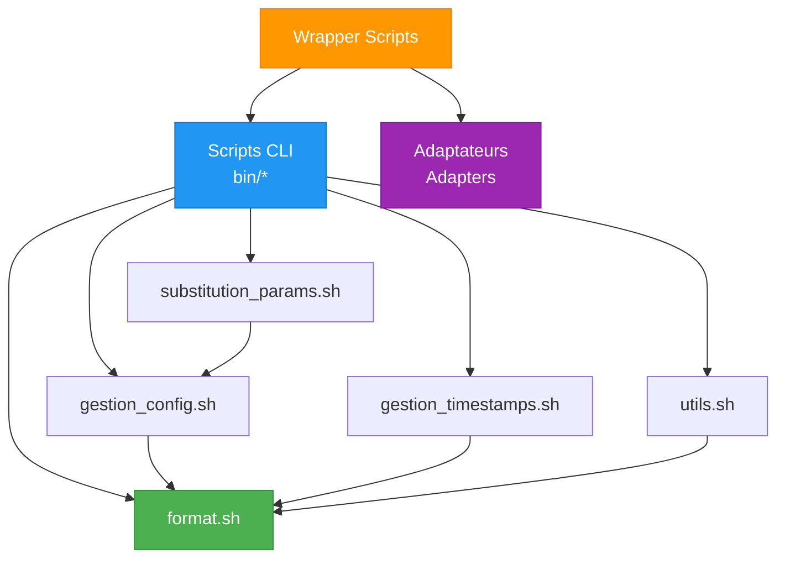

# Architecture du Framework / Framework Architecture

## 🏗️ Vue d'ensemble / Overview

Le CFD Framework adopte une architecture modulaire et extensible permettant de gérer différents solveurs CFD via un système d'adaptateurs.

The CFD Framework adopts a modular and extensible architecture enabling management of different CFD solvers through an adapter system.

---

## 📊 Architecture globale / Global Architecture



---

## 🎯 Principes de conception / Design Principles

### 1. Code-Agnostic

Le framework ne dépend d'aucun solveur spécifique.

The framework doesn't depend on any specific solver.



### 2. Séparation des responsabilités / Separation of Concerns



### 3. Configuration as Code

Tout est défini dans des fichiers versionnés.

Everything is defined in versioned files.

```yaml
# config.yaml - Version controllable
etude:
  nom: "STUDY_NAME"
  description: "..."

adaptateur: "OF"

configurations:
  CONFIG:
    cas:
      - nom: "CASE_1"
        parametres: {...}
```

### 4. Traçabilité / Traceability

Chaque run est horodaté et documenté.

Each run is timestamped and documented.

```
Run: OF_V13_CASE_20260131_151234
     ││  │   │    └─ Timestamp
     ││  │   └─ Case name
     ││  └─ Adapter version
     │└─ Adapter
```

---

## 📁 Structure des répertoires / Directory Structure

### Répertoire framework / Framework Directory

```
CFD_FRAMEWORK/
├── bin/                    # Exécutables CLI / CLI executables
│   ├── cfd-creer
│   ├── cfd-run
│   ├── cfd-run-parametrique
│   ├── cfd-archiver
│   └── cfd-clean-config
│
├── lib/                    # Bibliothèques Bash / Bash libraries
│   ├── format.sh
│   ├── gestion_config.sh
│   ├── substitution_params.sh
│   ├── gestion_timestamps.sh
│   └── utils.sh
│
├── adaptateurs/            # Adaptateurs solveurs / Solver adapters
│   ├── interface.sh
│   ├── OF.sh
│   └── mock.sh
│
├── scripts/                # Scripts d'orchestration / Orchestration scripts
│   ├── lancement/
│   │   ├── wrapper_commande_lancement.sh
│   │   └── lancement_parametrique_yaml.sh
│   └── archivage/
│       └── deplacer_resultats.sh
│
├── templates/              # Templates de cas / Case templates
│   └── TEMPLATE_CASE_DEFAULT/
│
├── docs/                   # Documentation
│   └── docs/
│
└── tests/                  # Tests unitaires / Unit tests
    └── lib/
```

### Répertoire de cas / Case Directory

```
MON_CAS/
├── 01_MAILLAGE/           # Fichiers de maillage / Mesh files
├── 02_PARAMS/             # Configurations
│   ├── config.yaml
│   ├── BASELINE/
│   │   ├── template/
│   │   └── OF_V13_CASE_20260131_151234/  # Run horodaté / Timestamped run
│   ├── ANGLE_STUDY/
│   └── REYNOLDS_STUDY/
├── 03_DECOMPOSITION/      # Décomposition domaine / Domain decomposition
├── 04_CONDITION_INITIALE/ # Conditions initiales / Initial conditions
├── 05_DOCUMENTATION/      # Documentation projet / Project documentation
├── 06_REFERENCE/          # Données de référence / Reference data
├── 07_NOTE/               # Notes / Notes
├── 08_RESULTAT/           # Résultats archivés / Archived results
│   ├── BASELINE/
│   ├── ANGLE_STUDY/
│   └── REYNOLDS_STUDY/
├── 09_POST_TRAITEMENT/    # Post-traitement / Post-processing
│   ├── DATA/
│   └── FIGURE/
└── 10_SCRIPT/             # Scripts personnalisés / Custom scripts
    ├── LANCEMENT_CALCUL/
    └── POST_TRAITEMENT/
```

---

## 🔄 Flux de données / Data Flow

### Lancement d'un cas unique / Single Case Launch



### Étude paramétrique / Parametric Study



---

## 🔌 Système d'adaptateurs / Adapter System

### Interface commune / Common Interface

```bash
# adaptateurs/interface.sh
adapt_nom()                    # Nom du solveur / Solver name
adapt_version()                # Version / Version
adapt_description()            # Description
adapt_verifier_installation()  # Vérifier installation / Check installation
adapt_preparer_entree()        # Préparer fichiers / Prepare files
adapt_lancer_calcul()          # Lancer / Launch
adapt_liste_elements_a_copier() # Éléments à copier / Elements to copy
```

### Graphe de décision : Sélection adaptateur / Decision Graph: Adapter Selection



---

## 📚 Bibliothèques / Libraries

### Dépendances entre bibliothèques / Library Dependencies



### Fonctions clés par bibliothèque / Key Functions per Library

| Bibliothèque / Library | Fonctions principales / Main Functions |
|------------------------|---------------------------------------|
| **format.sh** | `_info`, `_error`, `h1`, `progres_init`, `confirmer` |
| **gestion_config.sh** | `cfg_charger`, `cfg_obtenir_valeur`, `cfg_lister_cas` |
| **substitution_params.sh** | `param_substituer_tout`, `param_valider_template` |
| **gestion_timestamps.sh** | `ts_generer`, `ts_supprimer_timestamp`, `ts_plus_recent` |
| **utils.sh** | `util_copier_recursif`, `util_obtenir_taille` |

---

## 🎯 Points d'extension / Extension Points

### 1. Créer un adaptateur / Create an Adapter

```bash
# adaptateurs/mon_solveur.sh
source "${CFD_FRAMEWORK}/adaptateurs/interface.sh"

adapt_nom() { echo "MonSolveur"; }
adapt_version() { mon_solveur --version; }

adapt_lancer_calcul() {
    local rep_exec="$1"
    cd "$rep_exec"
    mon_solveur input.dat > log.txt 2>&1
}

# ... autres fonctions
```

### 2. Créer un template / Create a Template

```bash
cp -r $CFD_FRAMEWORK/templates/TEMPLATE_CASE_DEFAULT \
      $CFD_FRAMEWORK/templates/MON_TEMPLATE

# Personnaliser / Customize
# Utiliser / Use:
cfd-creer --template MON_TEMPLATE
```

### 3. Ajouter une bibliothèque / Add a Library

```bash
# lib/ma_bibliotheque.sh
#!/usr/bin/env bash

ma_fonction() {
    # Implementation
}

# Utiliser / Use:
source "${CFD_FRAMEWORK}/lib/ma_bibliotheque.sh"
```

---

## 📖 Voir aussi / See Also

- [Structure détaillée](structure.md) - Détails de la structure / Structure details
- [Adaptateurs](adapters.md) - Système d'adaptateurs / Adapter system
- [Bibliothèques](libraries.md) - Documentation bibliothèques / Library documentation
- [Créer un adaptateur](../adapters/create-adapter.md) - Guide création / Creation guide
