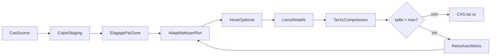
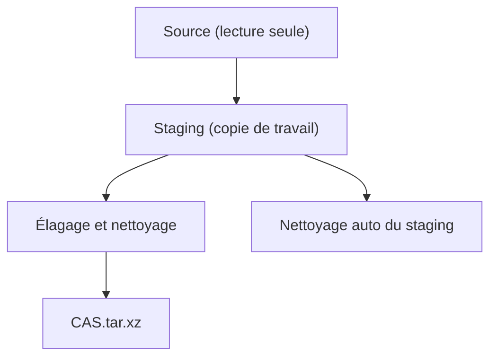

# cfd-archivage-cas

## 💾 Archivage complet d'un cas CFD / Complete CFD Case Archiving

Archive un cas CFD complet en `.tar.xz` via un espace de staging sécurisé. Le dossier source n'est jamais modifié.

Archives a complete CFD case into `.tar.xz` using a safe staging area. The source directory is never modified.

---

## 📋 Synopsis

```bash
cfd-archivage-cas [OPTIONS] <CAS>
```

Par défaut le wrapper applique une stratégie de **repli par taille** :

1. Tentative avec `--keep-vol --keep-surf`
2. Si l'archive dépasse le seuil (`--max-size`, défaut `100G`) → retente avec `--keep-surf` seulement
3. Si toujours trop grosse → retente sans rien conserver (ni vol, ni surf)

Les tentatives successives **réutilisent le staging** (pas de recopie du cas source).

Pour court-circuiter cette logique et contrôler exactement ce qui est conservé, passez explicitement `--keep-vol` et/ou `--keep-surf`.

---

## 📖 Description

`cfd-archivage-cas` prépare une archive allégée d'un cas CFD terminé. Le script :

1. Copie le cas dans un espace de staging temporaire
2. Applique des règles de conservation/suppression zone par zone
3. Nettoie les runs dans `02_PARAMS` via l'adaptateur (`adapt_nettoyer_run`, piloté par `--keep-vol` / `--keep-surf`)
4. Exécute un hook bash optionnel pour les nettoyages spécifiques
5. Convertit les liens symboliques absolus pointant dans le cas vers du chemin relatif (portabilité)
6. Génère `CAS.tar.xz` à côté du dossier source (ou le saute avec `--no-archive`)
7. Nettoie le staging — le dossier source reste intact

---

## 🔄 Workflow d'archivage / Archiving Workflow



---

## 🎯 Options de nettoyage / Cleanup Options

| Option | Description FR | Description EN |
|--------|----------------|----------------|
| `--keep-vol` | Conserver la dernière solution volumique | Keep last volumetric solution |
| `--keep-surf` | Conserver la solution surfacique (patterns adaptateur : `postProcessing/`, `VTK/`, …) | Keep surface solution (adapter-defined patterns) |
| `--solutions-volumiques <keep\|remove>` | **Legacy** — `keep` ⇒ `--keep-vol` ; `remove` ⇒ rien | **Legacy** — `keep` ⇒ `--keep-vol` ; `remove` ⇒ nothing |
| `--max-size <TAILLE>` | Seuil au-delà duquel le wrapper retente avec moins de conservation (défaut `100G`, suffixes `K/M/G/T`) | Size threshold above which the wrapper retries with less retention |

> Si aucun `--keep-*` n'est passé, le wrapper applique la logique de repli progressif.

---

## 🎯 Options générales / General Options

| Option | Description FR | Description EN |
|--------|----------------|----------------|
| `-h, --help` | Afficher l'aide | Display help |
| `-o, --output <FICHIER>` | Chemin de l'archive de sortie | Output archive path |
| `--staging-dir <DIR>` | Répertoire de staging explicite (non supprimé en fin) | Explicit staging directory (not removed at end) |
| `--skip-copy` | Réutiliser le staging existant (pas de recopie) | Reuse existing staging (no copy) |
| `--hook <SCRIPT>` | Script bash complémentaire | Complementary bash script |
| `--threads <N>` | Threads xz (0 = auto) | xz threads (0 = auto) |
| `--copy-jobs <N>` | Copies parallèles (défaut nproc) | Parallel copies |
| `--dry-run` | Afficher les actions sans exécuter | Show actions without executing |
| `--no-compress` | Créer un `.tar` sans compression | Create `.tar` without compression |
| `--no-archive` | Nettoyer le staging sans compresser ni supprimer (utile pour mettre au point les `adapt_*`) | Clean staging, skip compression, keep staging (useful for tweaking `adapt_*`) |
| `--no-relative-links` | Ne pas convertir les liens absolus en relatifs | Do not convert absolute symlinks to relative |
| `--copy-external-links` | Remplacer les liens absolus pointant **hors du cas** par une copie déréférencée de la cible (archive portable) | Replace absolute symlinks pointing **outside the case** with a dereferenced copy of their target (portable archive) |

---

## 🌍 Variables d'environnement / Environment Variables

| Variable | Description | Requis / Required |
|----------|-------------|-------------------|
| `CFD_FRAMEWORK` | Chemin vers le framework | ✅ Oui / Yes |
| `ADAPTATEUR` | Adaptateur utilisé (défaut : `OF`) | ❌ Non |
| `CFD_ARCHIVE_OF_BASE_KEEP` | Patterns « socle » pour OF (surcharge) | ❌ Non |
| `CFD_ARCHIVE_OF_SURF_KEEP` | Patterns « surfacique » pour OF (surcharge) | ❌ Non |

---

## 📐 Règles de conservation par zone / Retention Rules by Zone

### 01_MAILLAGE

| Conservé / Kept | Supprimé / Removed |
|-----------------|--------------------|
| `FICHIER_PARAMETRE/` (dossier complet) | Tout le reste |
| `*SURFACIQUE*` | |
| `*.html` | |
| `*.stp` | |

### 02_PARAMS

Chaque run dans chaque configuration est nettoyé par `adapt_nettoyer_run` de l'adaptateur actif. Pour l'adaptateur **OF** :

| Flags CLI | Conservé dans chaque run |
|-----------|--------------------------|
| _(aucun)_ | `0/`, `constant/`, `system/`, `LOG/`, `.metadata.yaml`, `job.data*`, `*.yaml`, `*.org` |
| `--keep-vol` | socle + **dernier répertoire de temps** |
| `--keep-surf` | socle + `postProcessing/`, `VTK/`, `surfaces/`, `sampleDict*` |
| `--keep-vol --keep-surf` | socle + dernier temps + postProcessing / VTK / surfaces |

Les patterns sont définis dans `adaptateurs/OF.sh` (tableaux `_OF_BASE_KEEP_PATTERNS` et `_OF_SURF_KEEP_PATTERNS`) et peuvent être surchargés via `CFD_ARCHIVE_OF_BASE_KEEP` / `CFD_ARCHIVE_OF_SURF_KEEP`.

### 03_DECOMPOSITION

| Conservé / Kept | Supprimé / Removed |
|-----------------|--------------------|
| `job.data*` | Tout le reste |

### Autres dossiers

Les dossiers non listés (`04_CONDITION_INITIALE`, `05_DOCUMENTATION`, …) sont conservés intégralement.

---

## 🔗 Conversion des liens symboliques / Symlink Relativization

À la fin du nettoyage, le script parcourt le staging et :

- **Liens relatifs** → laissés intacts
- **Liens absolus pointant dans le cas** (vers le source ou le staging) → réécrits en **chemin relatif** par rapport au dossier du lien. Le cas reste cohérent quand l'archive est extraite ailleurs.
- **Liens absolus pointant hors du cas** (p.ex. `/scratch/shared/...`) :
  - Par défaut → conservés absolus, avec une **alerte** (l'archive ne sera pas portable)
  - Avec `--copy-external-links` → remplacés par une **copie intégrale déréférencée** de la cible (fichier ou dossier). L'archive devient portable mais peut grossir.
  - Liens cassés (cible inexistante) → signalés, laissés en l'état.

Désactivable entièrement avec `--no-relative-links`.

---

## 📝 Exemples / Examples

### Exemple 1 : Archivage automatique avec repli (recommandé)

```bash
cfd-archivage-cas /data/projets/AILE_DELTA
```

- Essaie `--keep-vol --keep-surf`
- Si l'archive dépasse 100G → retente `--keep-surf`
- Si encore trop grosse → retente sans rien

### Exemple 2 : Forcer la conservation (désactive le repli)

```bash
cfd-archivage-cas --keep-vol --keep-surf /data/projets/AILE_DELTA
cfd-archivage-cas --keep-surf           /data/projets/AILE_DELTA
cfd-archivage-cas                       /data/projets/AILE_DELTA   # rien conservé, MAIS le wrapper appliquera le repli !
```

> ⚠️ Pour forcer « rien conserver » sans repli, utilisez le script sous-jacent directement ou passez simplement `--keep-surf` / `--keep-vol` explicitement.

### Exemple 3 : Seuil de repli personnalisé

```bash
cfd-archivage-cas --max-size 50G /data/projets/AILE_DELTA
```

### Exemple 4 : Nettoyage seul (sans compression)

Utile pour mettre au point un hook ou les patterns de l'adaptateur :

```bash
cfd-archivage-cas --keep-vol --keep-surf \
    --no-archive --staging-dir /scratch/stage \
    /data/projets/AILE_DELTA
```

Le staging nettoyé reste sur disque — inspectez `/scratch/stage/AILE_DELTA`, ajustez les règles, puis relancez sans `--no-archive`.

### Exemple 5 : Hook de nettoyage

```bash
cfd-archivage-cas --keep-vol \
    --hook ./scripts/pre_archive.sh \
    /data/projets/AILE_DELTA
```

Le hook reçoit deux arguments :

1. `$1` — chemin du staging (écriture autorisée)
2. `$2` — chemin du cas source (lecture seule par convention)

### Exemple 6 : Staging explicite et sortie personnalisée

```bash
cfd-archivage-cas --keep-vol \
    --staging-dir /scratch/staging \
    --output /archives/AILE_DELTA_v2.tar.xz \
    /data/projets/AILE_DELTA
```

### Exemple 7 : Dry-run

```bash
cfd-archivage-cas --dry-run /data/projets/AILE_DELTA
```

---

## 🔒 Sécurité du staging / Staging Safety

Le dossier source n'est **jamais** modifié. Toutes les suppressions sont effectuées dans une copie temporaire :



- Par défaut le staging est créé via `mktemp -d` et supprimé automatiquement (même en cas d'erreur via `trap EXIT`)
- Avec `--staging-dir` ou `--no-archive`, le staging **n'est pas supprimé** automatiquement (inspection/debug)

---

## ⚠️ Messages d'erreur fréquents

| Message | Cause | Solution |
|---------|-------|----------|
| `ERREUR: un seul argument positionnel attendu` | Zéro ou plusieurs chemins de cas | Passez exactement un `<CAS>` |
| `--skip-copy nécessite --staging-dir` | `--skip-copy` sans staging | Fournir `--staging-dir` |
| `--skip-copy demandé mais staging introuvable` | Le staging fourni ne contient pas `<CAS>` | Lancer d'abord une passe normale qui peuple le staging |
| `Script hook introuvable / non exécutable` | Chemin du hook invalide | `chmod +x` et chemin correct |

---

## 💡 Bonnes pratiques / Best Practices

### ✅ DO

1. **Utiliser `--dry-run`** pour prévisualiser sans risque
2. **Utiliser `--no-archive`** pour mettre au point les `adapt_*` ou les hooks avant la compression
3. **Spécifier `--staging-dir`** sur HPC si `/tmp` est petit
4. **Ajuster `--max-size`** à la capacité de votre archive cible

### ❌ DON'T

1. Ne pas archiver un cas dont le calcul est encore en cours
2. Ne pas modifier le dossier source pendant l'exécution du script

---

## 📖 Voir aussi / See Also

- [cfd-archiver](cfd-archiver.md) — Déplacement des résultats / Results relocation
- [cfd-run](cfd-run.md) — Lancement de calculs / Launch calculations

---

## 🔍 Scripts sous-jacents / Underlying Scripts

- `bin/cfd-archivage-cas` — wrapper (logique de repli par taille)
- `scripts/archivage/archivage_cas.sh` — cœur de l'archivage (copie, élagage, compression)
- `adaptateurs/<NOM>.sh` — fonction `adapt_nettoyer_run <run_dir> [--keep-vol] [--keep-surf]`
