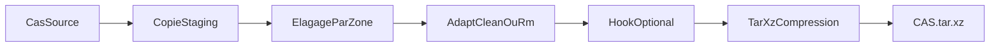
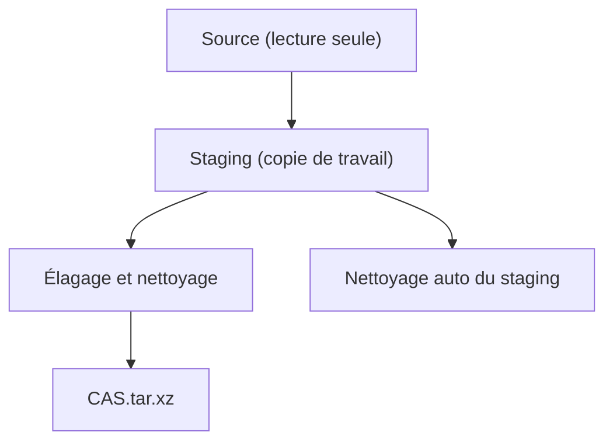

# cfd-archivage-cas

## 💾 Archivage complet d'un cas CFD / Complete CFD Case Archiving

Archive un cas CFD complet en `.tar.xz` via un espace de staging sécurisé. Le dossier source n'est jamais modifié.

Archives a complete CFD case into `.tar.xz` using a safe staging area. The source directory is never modified.

---

## 📋 Synopsis

```bash
cfd-archivage-cas --solutions-volumiques <keep|remove> [OPTIONS] <CAS>
```

---

## 📖 Description

`cfd-archivage-cas` prépare une archive allégée d'un cas CFD terminé. Le script :

1. Copie le cas dans un espace de staging temporaire
2. Applique des règles de conservation/suppression zone par zone
3. Nettoie les runs dans `02_PARAMS` via l'adaptateur (`adapt_clean` ou `adapt_rm`)
4. Exécute un hook bash optionnel pour les nettoyages spécifiques
5. Génère `CAS.tar.xz` à côté du dossier source
6. Nettoie le staging — le dossier source reste intact

---

## 🔄 Workflow d'archivage / Archiving Workflow



---

## 🎯 Argument obligatoire / Required Argument

| Argument | Description FR | Description EN |
|----------|---------------|----------------|
| `--solutions-volumiques keep` | Conserver la dernière solution volumique (`adapt_clean`) | Keep last volumetric solution (`adapt_clean`) |
| `--solutions-volumiques remove` | Supprimer toutes les solutions volumiques (`adapt_rm`) | Remove all volumetric solutions (`adapt_rm`) |

---

## 🎯 Options

| Option | Description FR | Description EN |
|--------|---------------|----------------|
| `-h, --help` | Afficher l'aide | Display help |
| `-o, --output <FICHIER>` | Chemin de l'archive de sortie | Output archive path |
| `--staging-dir <DIR>` | Répertoire de staging explicite | Explicit staging directory |
| `--hook <SCRIPT>` | Script bash complémentaire | Complementary bash script |
| `--threads <N>` | Threads xz (0 = auto) | xz threads (0 = auto) |
| `--dry-run` | Afficher les actions sans exécuter | Show actions without executing |
| `--no-compress` | Créer un `.tar` sans compression | Create `.tar` without compression |

---

## 🌍 Variables d'environnement / Environment Variables

| Variable | Description | Requis / Required |
|----------|-------------|-------------------|
| `CFD_FRAMEWORK` | Chemin vers le framework | ✅ Oui / Yes |
| `ADAPTATEUR` | Adaptateur utilisé (pour nettoyage) | ❌ Non (défaut: OF) |

---

## 📐 Règles de conservation par zone / Retention Rules by Zone

### 01_MAILLAGE

| Conservé / Kept | Supprimé / Removed |
|-----------------|-------------------|
| `FICHIER_PARAMETRE/` (dossier complet) | Tout le reste |
| `*SURFACIQUE*` | |
| `*.html` | |
| `*.stp` | |

### 02_PARAMS

Chaque run dans chaque configuration est traité par l'adaptateur :

- `keep` → `adapt_clean` : conserve `0/`, la dernière solution volumique, `constant/`, `system/`
- `remove` → `adapt_rm` : conserve `0/`, `constant/`, `system/` uniquement

### 03_DECOMPOSITION

| Conservé / Kept | Supprimé / Removed |
|-----------------|-------------------|
| `job.data*` | Tout le reste |

### Autres dossiers

Les dossiers non listés ci-dessus (`04_CONDITION_INITIALE`, `05_DOCUMENTATION`, etc.) sont conservés intégralement dans l'archive.

---

## 📝 Exemples / Examples

### Exemple 1 : Archivage avec conservation des solutions

```bash
cfd-archivage-cas --solutions-volumiques keep /data/projets/AILE_DELTA
```

**Résultat / Result :**
```
/data/projets/AILE_DELTA/           # Intact (non modifié)
/data/projets/AILE_DELTA.tar.xz    # Archive allégée
```

---

### Exemple 2 : Archivage léger (sans solutions volumiques)

```bash
cfd-archivage-cas --solutions-volumiques remove /data/projets/AILE_DELTA
```

**Résultat / Result :** L'archive ne contient que les fichiers nécessaires à une relance (maillage, paramètres, conditions initiales).

---

### Exemple 3 : Avec un hook de nettoyage de figures

```bash
cfd-archivage-cas --solutions-volumiques keep \
    --hook ./scripts/pre_archive.sh \
    /data/projets/AILE_DELTA
```

**Contenu de `pre_archive.sh` :**

```bash
#!/usr/bin/env bash
set -euo pipefail

STAGING_CASE="$1"    # Copie de travail (staging)
SOURCE_CASE="$2"     # Dossier original (lecture seule)

# Supprimer les figures temporaires du staging
rm -rf "$STAGING_CASE/09_POST_TRAITEMENT/figures/tmp"

# Régénérer des figures propres à partir du source
python3 "$SOURCE_CASE/10_SCRIPT/regenerate_figures.py" \
    --output-dir "$STAGING_CASE/09_POST_TRAITEMENT/figures"

echo "Hook terminé."
```

Le hook reçoit deux arguments :

1. `$1` — chemin du staging (écriture autorisée)
2. `$2` — chemin du cas source (lecture seule par convention)

---

### Exemple 4 : Staging explicite et sortie personnalisée

```bash
cfd-archivage-cas --solutions-volumiques keep \
    --staging-dir /scratch/staging \
    --output /archives/AILE_DELTA_v2.tar.xz \
    /data/projets/AILE_DELTA
```

Utile pour les systèmes HPC où `/tmp` est limité en espace.

---

### Exemple 5 : Dry-run pour prévisualiser

```bash
cfd-archivage-cas --solutions-volumiques remove --dry-run /data/projets/AILE_DELTA
```

Affiche toutes les actions qui seraient effectuées sans rien modifier.

---

### Exemple 6 : Cas complet — avant / après

**Arborescence source (avant) :**
```
AILE_DELTA/
├── 01_MAILLAGE/
│   ├── FICHIER_PARAMETRE/
│   │   └── params.cfg
│   ├── MAILLAGE_SURFACIQUE_V1.meshb
│   ├── rapport.html
│   ├── geometry.stp
│   ├── MAILLAGE_VOLUMIQUE.meshb          # lourd, régénérable
│   └── mesh_quality_check.log
├── 02_PARAMS/
│   └── BASELINE/
│       └── OF_V13_CASE_1_20260126_143052/
│           ├── 0/
│           ├── 500/
│           ├── 1000/                      # dernière itération
│           ├── constant/
│           ├── system/
│           ├── processor0/
│           ├── processor1/
│           └── LOG/
├── 03_DECOMPOSITION/
│   ├── job.data
│   ├── job.data.1
│   └── logs_decomp.txt
├── 05_DOCUMENTATION/
│   └── notes.md
└── 09_POST_TRAITEMENT/
    └── figures/
```

**Contenu de l'archive (après `--solutions-volumiques keep`) :**
```
AILE_DELTA/
├── 01_MAILLAGE/
│   ├── FICHIER_PARAMETRE/
│   │   └── params.cfg
│   ├── MAILLAGE_SURFACIQUE_V1.meshb      # conservé (pattern *SURFACIQUE*)
│   ├── rapport.html                       # conservé (*.html)
│   └── geometry.stp                       # conservé (*.stp)
├── 02_PARAMS/
│   └── BASELINE/
│       └── OF_V13_CASE_1_20260126_143052/
│           ├── 0/                         # conservé
│           ├── 1000/                      # dernière solution (adapt_clean)
│           ├── constant/
│           ├── system/
│           └── LOG/
├── 03_DECOMPOSITION/
│   ├── job.data                           # conservé (job.data*)
│   └── job.data.1                         # conservé (job.data*)
├── 05_DOCUMENTATION/
│   └── notes.md
└── 09_POST_TRAITEMENT/
    └── figures/
```

**Contenu de l'archive (après `--solutions-volumiques remove`) :**
```
AILE_DELTA/
├── 01_MAILLAGE/
│   ├── FICHIER_PARAMETRE/
│   │   └── params.cfg
│   ├── MAILLAGE_SURFACIQUE_V1.meshb
│   ├── rapport.html
│   └── geometry.stp
├── 02_PARAMS/
│   └── BASELINE/
│       └── OF_V13_CASE_1_20260126_143052/
│           ├── 0/                         # minimum pour relance (adapt_rm)
│           ├── constant/
│           ├── system/
│           └── LOG/
├── 03_DECOMPOSITION/
│   ├── job.data
│   └── job.data.1
├── 05_DOCUMENTATION/
│   └── notes.md
└── 09_POST_TRAITEMENT/
    └── figures/
```

---

## 🔒 Sécurité du staging / Staging Safety

Le dossier source n'est **jamais** modifié. Toutes les suppressions sont effectuées dans une copie temporaire :



- Par défaut, le staging est créé via `mktemp -d` et supprimé automatiquement (même en cas d'erreur via `trap EXIT`)
- Avec `--staging-dir`, le dossier de staging **n'est pas supprimé** automatiquement (utile pour inspection/debug)

---

## ⚠️ Messages d'erreur / Error Messages

### Erreur 1 : Argument obligatoire manquant

```
❌ L'argument --solutions-volumiques <keep|remove> est obligatoire
```

**Solution :**
```bash
cfd-archivage-cas --solutions-volumiques keep /chemin/vers/CAS
```

### Erreur 2 : Valeur invalide

```
❌ Valeur invalide pour --solutions-volumiques : 'skip' (attendu: keep ou remove)
```

### Erreur 3 : Hook non trouvé ou non exécutable

```
❌ Script hook introuvable : ./mon_hook.sh
❌ Script hook non exécutable : ./mon_hook.sh (chmod +x ?)
```

---

## 💡 Bonnes pratiques / Best Practices

### ✅ DO / À FAIRE

1. **Utiliser `--dry-run` d'abord** pour vérifier le comportement
   ```bash
   cfd-archivage-cas --solutions-volumiques keep --dry-run MON_CAS
   ```

2. **Spécifier `--staging-dir` sur HPC** si `/tmp` est petit
   ```bash
   cfd-archivage-cas --solutions-volumiques keep --staging-dir /scratch/$USER/staging MON_CAS
   ```

3. **Tester le hook séparément** avant de l'utiliser avec l'archivage

### ❌ DON'T / À ÉVITER

1. Ne pas archiver un cas dont le calcul est encore en cours
2. Ne pas modifier le dossier source entre le lancement et la fin du script

---

## 📖 Voir aussi / See Also

- [cfd-archiver](cfd-archiver.md) — Déplacement des résultats / Results relocation
- [cfd-run](cfd-run.md) — Lancement de calculs / Launch calculations

---

## 🔍 Script sous-jacent / Underlying Script

`cfd-archivage-cas` est un wrapper qui appelle :

```bash
${CFD_FRAMEWORK}/scripts/archivage/archivage_cas.sh
```
