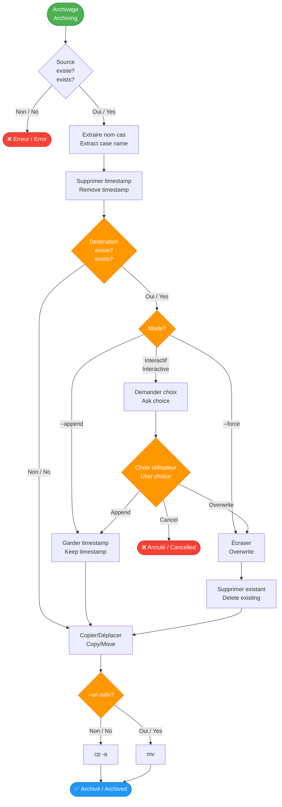
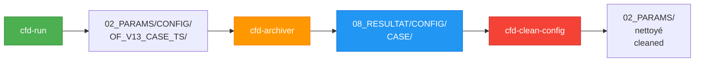

# cfd-archiver

## 📦 Archivage des résultats CFD / CFD Results Archiving

Déplace ou copie les résultats depuis `02_PARAMS/` vers `08_RESULTAT/`.

Moves or copies results from `02_PARAMS/` to `08_RESULTAT/`.

---

## 📋 Synopsis

```bash
cfd-archiver [OPTIONS] <SOURCE_DIRECTORY> <DESTINATION_DIRECTORY>
```

---

## 📖 Description

`cfd-archiver` gère l'archivage des résultats de calculs CFD. Il déplace (ou copie) les runs horodatés depuis les répertoires de configuration vers les répertoires de résultats, en supprimant le timestamp pour simplifier l'organisation.

`cfd-archiver` manages archiving of CFD calculation results. It moves (or copies) timestamped runs from configuration directories to results directories, removing the timestamp to simplify organization.

---

## 🔄 Workflow d'archivage / Archiving Workflow



---

## 🎯 Options

| Option | Description FR | Description EN |
|--------|---------------|----------------|
| `-h, --help` | Afficher l'aide | Display help |
| `--append` | Ajouter timestamp si conflit | Add timestamp if conflict |
| `--force` | Écraser sans confirmation | Overwrite without confirmation |
| `--un-safe` | Utiliser `mv` au lieu de `cp -a` | Use `mv` instead of `cp -a` |

---

## 🌍 Variables d'environnement / Environment Variables

| Variable | Description | Requis / Required |
|----------|-------------|-------------------|
| `CFD_FRAMEWORK` | Chemin vers le framework | ✅ Oui / Yes |
| `ADAPTATEUR` | Adaptateur utilisé (pour filtrage) | ❌ Non (défaut: OF) |

---

## 📝 Exemples / Examples

### Exemple 1 : Archivage safe (défaut) / Safe Archiving (Default)

Copie les résultats (conserve l'original).

Copies results (preserves original).

```bash
cfd-archiver 02_PARAMS/BASELINE 08_RESULTAT/BASELINE
```

**Avant / Before:**
```
02_PARAMS/BASELINE/
└── OF_V13_CASE_1_20260131_151234/
```

**Après / After:**
```
02_PARAMS/BASELINE/
└── OF_V13_CASE_1_20260131_151234/  # Original conservé / Original preserved

08_RESULTAT/BASELINE/
└── CASE_1/                          # Copie sans timestamp / Copy without timestamp
```

---

### Exemple 2 : Archivage unsafe (déplacement) / Unsafe Archiving (Move)

Déplace les résultats (supprime l'original).

Moves results (deletes original).

```bash
cfd-archiver --un-safe 02_PARAMS/BASELINE 08_RESULTAT/BASELINE
```

**Avant / Before:**
```
02_PARAMS/BASELINE/
└── OF_V13_CASE_1_20260131_151234/
```

**Après / After:**
```
02_PARAMS/BASELINE/
└── (vide / empty)

08_RESULTAT/BASELINE/
└── CASE_1/  # Déplacé / Moved
```

!!! warning "Attention / Warning"
    Le mode `--un-safe` supprime les fichiers source. Utilisez avec prudence !
    
    `--un-safe` mode deletes source files. Use with caution!

---

### Exemple 3 : Gestion des conflits avec --append

Si la destination existe, garde le timestamp.

If destination exists, keeps timestamp.

```bash
cfd-archiver --append 02_PARAMS/BASELINE 08_RESULTAT/BASELINE
```

**Scénario / Scenario:**
```
08_RESULTAT/BASELINE/
└── CASE_1/  # Existe déjà / Already exists

02_PARAMS/BASELINE/
└── OF_V13_CASE_1_20260131_151234/  # Nouveau run / New run
```

**Résultat / Result:**
```
08_RESULTAT/BASELINE/
├── CASE_1/                          # Original conservé / Original preserved
└── CASE_1_20260131_151234/          # Nouveau avec timestamp / New with timestamp
```

---

### Exemple 4 : Écrasement avec --force

Écrase sans confirmation.

Overwrites without confirmation.

```bash
cfd-archiver --force 02_PARAMS/BASELINE 08_RESULTAT/BASELINE
```

**Avant / Before:**
```
08_RESULTAT/BASELINE/
└── CASE_1/  # Ancien résultat / Old result
```

**Après / After:**
```
08_RESULTAT/BASELINE/
└── CASE_1/  # Nouveau résultat (écrasé) / New result (overwritten)
```

---

### Exemple 5 : Mode interactif (défaut)

Sans options, demande confirmation en cas de conflit.

Without options, asks for confirmation in case of conflict.

```bash
cfd-archiver 02_PARAMS/BASELINE 08_RESULTAT/BASELINE
```

**Affichage / Output:**
```
ℹ️  Chargement de l'adaptateur: OF
✅ Adaptateur OpenFOAM chargé et vérifié
ℹ️  Liste des cas-tests à déplacer vers 08_RESULTAT/BASELINE
• 02_PARAMS/BASELINE/OF_V13_CASE_1_20260131_151234
───────────────────────────────────────────────────────

1. Déplacement du cas-test 02_PARAMS/BASELINE/OF_V13_CASE_1_20260131_151234

⚠️  Le cas-test existe déjà dans le répertoire de destination
Que faire avec le cas-test existant?
  1) Append
  2) Overwrite
  3) Cancel
Choix [1-3]: 1

ℹ️  Append le cas-test existant avec le timestamp
ℹ️  Déplacement : .../OF_V13_CASE_1_20260131_151234 -> .../CASE_1_20260131_151234
✅ Résultats archivés : .../CASE_1_20260131_151234
```

---

## 🔍 Format des noms / Name Format

### Source (horodaté) / Source (Timestamped)

```
Format: ${ADAPTATEUR}_V${VERSION}_${CASE_NAME}_${TIMESTAMP}
Exemple: OF_V13_AIRFOIL_20260131_151234
```

### Destination (standardisé) / Destination (Standardized)

```
Format: ${CASE_NAME}
Exemple: AIRFOIL
```

Le timestamp est automatiquement supprimé pour simplifier l'organisation.

The timestamp is automatically removed to simplify organization.

---

## ⚖️ Comparaison des modes / Mode Comparison

| Mode | Commande | Comportement / Behavior | Usage |
|------|----------|-------------------------|-------|
| **Safe** | `cfd-archiver SRC DEST` | Copie (cp -a) | Production |
| **Unsafe** | `cfd-archiver --un-safe SRC DEST` | Déplacement (mv) | Nettoyage |
| **Append** | `cfd-archiver --append SRC DEST` | Garde timestamp si conflit | Multi-versions |
| **Force** | `cfd-archiver --force SRC DEST` | Écrase sans confirmation | Automation |

---

## 📊 Workflow complet / Complete Workflow

### Workflow typique / Typical Workflow



### Commandes / Commands

```bash
# 1. Lancer le calcul / Launch calculation
cd 02_PARAMS/BASELINE
export CASE_NAME="TEST"
cfd-run --adaptateur OF

# 2. Archiver / Archive
cd ../..
cfd-archiver 02_PARAMS/BASELINE 08_RESULTAT/BASELINE

# 3. Nettoyer / Clean
cfd-clean-config 02_PARAMS/BASELINE
```

---

## ⚠️ Messages d'erreur / Error Messages

### Erreur 1 : Arguments manquants / Missing Arguments

```
❌ Expected SOURCE_DIRECTORY and DESTINATION_DIRECTORY
❌ Usage: cfd-archiver [options] <SOURCE_DIRECTORY> <DESTINATION_DIRECTORY>
```

**Solution:**
```bash
cfd-archiver 02_PARAMS/BASELINE 08_RESULTAT/BASELINE
```

### Erreur 2 : Source inexistante / Source Not Found

```
❌ Le répertoire de configuration n'existe pas: 02_PARAMS/BASELINE
```

**Solution:**
```bash
# Vérifier le chemin / Check path
ls -la 02_PARAMS/
cd 02_PARAMS/BASELINE  # Si besoin / If needed
```

### Erreur 3 : Aucun cas à archiver / No Cases to Archive

```
ℹ️  Liste des cas-tests à déplacer vers 08_RESULTAT/BASELINE
(vide / empty)
```

**Cause:** Aucun run horodaté trouvé.

**Solution:**
```bash
# Lancer un calcul d'abord / Launch a calculation first
cfd-run --adaptateur OF --name TEST
```

---

## 💡 Bonnes pratiques / Best Practices

### ✅ DO / À FAIRE

1. **Archiver régulièrement / Archive Regularly**
   ```bash
   # Après chaque étude / After each study
   cfd-archiver 02_PARAMS/CONFIG 08_RESULTAT/CONFIG
   ```

2. **Utiliser safe par défaut / Use Safe by Default**
   ```bash
   # Toujours sans --un-safe d'abord / Always without --un-safe first
   cfd-archiver 02_PARAMS/BASELINE 08_RESULTAT/BASELINE
   ```

3. **Vérifier avant nettoyage / Check Before Cleanup**
   ```bash
   # Archiver puis vérifier / Archive then check
   cfd-archiver 02_PARAMS/BASELINE 08_RESULTAT/BASELINE
   ls -la 08_RESULTAT/BASELINE/
   # Si OK, nettoyer / If OK, clean
   cfd-clean-config 02_PARAMS/BASELINE
   ```

### ❌ DON'T / À ÉVITER

1. **Ne pas utiliser --un-safe sans backup / Don't use --un-safe without backup**
   ```bash
   # ❌ Risqué / Risky
   cfd-archiver --un-safe 02_PARAMS/BASELINE 08_RESULTAT/BASELINE
   
   # ✅ Sûr / Safe
   cfd-archiver 02_PARAMS/BASELINE 08_RESULTAT/BASELINE
   ```

2. **Ne pas archiver pendant le calcul / Don't archive during calculation**
   ```bash
   # Attendre la fin du calcul / Wait for calculation to finish
   # Puis archiver / Then archive
   ```

---

## 🔧 Scripts d'automatisation / Automation Scripts

### Archivage de toutes les configurations / Archive All Configurations

```bash
#!/usr/bin/env bash
# archive_all.sh

for config in 02_PARAMS/*/; do
  config_name=$(basename "$config")
  echo "Archivage $config_name..."
  
  mkdir -p "08_RESULTAT/$config_name"
  cfd-archiver "$config" "08_RESULTAT/$config_name"
done

echo "✅ Toutes les configurations archivées"
```

### Archivage avec backup / Archive with Backup

```bash
#!/usr/bin/env bash
# archive_safe.sh

SOURCE="$1"
DEST="$2"
BACKUP="${DEST}.backup_$(date +%Y%m%d_%H%M%S)"

# Backup si destination existe
if [[ -d "$DEST" ]]; then
  echo "📦 Backup: $DEST -> $BACKUP"
  cp -a "$DEST" "$BACKUP"
fi

# Archiver
cfd-archiver "$SOURCE" "$DEST"

echo "✅ Archivé avec backup: $BACKUP"
```

---

## 📖 Voir aussi / See Also

- [cfd-run](cfd-run.md) - Lancement de calculs / Launch calculations
- [cfd-clean-config](cfd-clean-config.md) - Nettoyage / Cleanup
- [Workflow](../guide/workflow.md) - Flux complet / Complete workflow
- [Archiving Workflow](../workflows/archiving.md) - Guide détaillé / Detailed guide

---

## 🔍 Script sous-jacent / Underlying Script

`cfd-archiver` est un wrapper qui appelle:

`cfd-archiver` is a wrapper that calls:

```bash
${CFD_FRAMEWORK}/scripts/archivage/deplacer_resultats.sh
```
