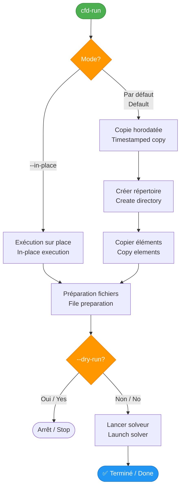
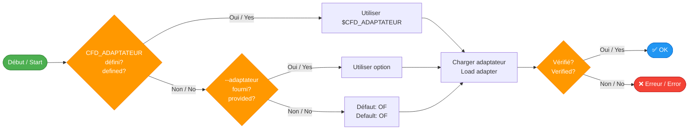
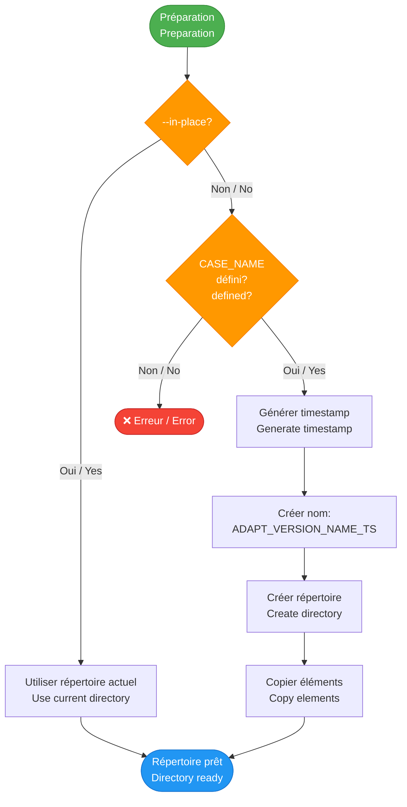

# cfd-run

## 🚀 Lancement de calculs CFD / CFD Calculation Launch

Wrapper générique pour lancer un calcul CFD avec un adaptateur.

Generic wrapper for launching a CFD calculation with an adapter.

---

## 📋 Synopsis

```bash
cfd-run [OPTIONS]
```

---

## 📖 Description

`cfd-run` est le point d'entrée principal pour lancer des calculs CFD. Il charge l'adaptateur approprié, prépare les fichiers d'entrée et lance le solveur.

`cfd-run` is the main entry point for launching CFD calculations. It loads the appropriate adapter, prepares input files, and launches the solver.

### Modes de fonctionnement / Operating Modes



---

## 🎯 Options

### Options principales / Main Options

| Option | Description FR | Description EN |
|--------|---------------|----------------|
| `-h, --help` | Afficher l'aide | Display help |
| `--adaptateur <ID>` | Adaptateur à utiliser (défaut: `$CFD_ADAPTATEUR` ou `OF`) | Adapter to use (default: `$CFD_ADAPTATEUR` or `OF`) |
| `--in-place` | Exécuter dans le répertoire actuel | Execute in current directory |
| `--dry-run` | Préparer sans lancer | Prepare without launching |
| `--name <NOM>` | Nom du cas (remplace `$CASE_NAME`) | Case name (replaces `$CASE_NAME`) |
| `--new-dir-name <DIR>` | Nom complet du répertoire de calcul | Full calculation directory name |

---

## 🌍 Variables d'environnement / Environment Variables

| Variable | Description | Exemple |
|----------|-------------|---------|
| `CFD_FRAMEWORK` | Chemin vers le framework (requis / required) | `/opt/CFD_FRAMEWORK` |
| `CFD_ADAPTATEUR` | Adaptateur par défaut / Default adapter | `OF`, `mock` |
| `CASE_NAME` | Nom du cas (requis si pas `--in-place` / required if not `--in-place`) | `AIRFOIL_2D` |

---

## 📝 Exemples / Examples

### Exemple 1 : Exécution sur place / In-place Execution

Exécute le calcul directement dans le répertoire actuel sans créer de copie.

Executes the calculation directly in the current directory without creating a copy.

```bash
cd 02_PARAMS/BASELINE
cfd-run --adaptateur OF --in-place
```

**Résultat / Result:**
- Pas de copie / No copy
- Exécution dans `02_PARAMS/BASELINE/`
- Fichier `.metadata.yaml` créé / created

---

### Exemple 2 : Copie horodatée / Timestamped Copy

Crée une copie horodatée et lance le calcul.

Creates a timestamped copy and launches the calculation.

```bash
cd 02_PARAMS/BASELINE
export CASE_NAME="TEST"
cfd-run --adaptateur OF
```

**Résultat / Result:**
- Copie créée / Copy created: `02_PARAMS/BASELINE/OF_V13_TEST_20260131_143052/`
- Calcul lancé dans la copie / Calculation launched in copy
- Répertoire source préservé / Source directory preserved

---

### Exemple 3 : Mode dry-run

Prépare le cas sans lancer le calcul (utile pour debug).

Prepares the case without launching the calculation (useful for debugging).

```bash
cfd-run --adaptateur OF --name NACA0012 --dry-run
```

**Affichage / Output:**
```
ℹ️  Chargement de l'adaptateur: OF
✅ Adaptateur OpenFOAM chargé et vérifié
ℹ️  Création du répertoire: .../OF_V13_NACA0012_20260131_143052
✅ Copie terminée : 5 élément(s) copié(s)
📝 Mode --dry-run activé: le calcul ne sera pas lancé
✅ Cas préparé dans: .../OF_V13_NACA0012_20260131_143052
```

---

### Exemple 4 : Nom de répertoire personnalisé / Custom Directory Name

```bash
cfd-run --adaptateur OF --new-dir-name "EXPERIMENT_001"
```

**Résultat / Result:**
- Répertoire créé / Directory created: `02_PARAMS/BASELINE/EXPERIMENT_001/`
- Pas de timestamp ajouté / No timestamp added

---

## 🔄 Workflow détaillé / Detailed Workflow

### Phase 1 : Résolution de l'adaptateur / Adapter Resolution



### Phase 2 : Préparation du répertoire / Directory Preparation



### Phase 3 : Éléments copiés / Copied Elements

Les éléments copiés sont déterminés par `adapt_liste_elements_a_copier()` de l'adaptateur.

Elements copied are determined by `adapt_liste_elements_a_copier()` from the adapter.

**Exemple pour OpenFOAM / Example for OpenFOAM:**
- `constant/`
- `system/`
- `0/` ou `0.orig/`
- `.metadata.yaml`
- Templates `.org` (si présents / if present)

---

## 📊 Format du répertoire horodaté / Timestamped Directory Format

```
Format: ${ADAPTATEUR}_V${VERSION}_${CASE_NAME}_${TIMESTAMP}
Exemple: OF_V13_AIRFOIL_20260131_143052
```

| Composant / Component | Description | Exemple |
|-----------------------|-------------|---------|
| `ADAPTATEUR` | Nom de l'adaptateur / Adapter name | `OF` |
| `VERSION` | Version de l'adaptateur / Adapter version | `V13` |
| `CASE_NAME` | Nom du cas / Case name | `AIRFOIL` |
| `TIMESTAMP` | Date et heure / Date and time | `20260131_143052` |

---

## 📁 Fichier .metadata.yaml

Chaque run génère un fichier `.metadata.yaml` contenant les métadonnées.

Each run generates a `.metadata.yaml` file containing metadata.

```yaml
cas:
  nom: "OF_V13_AIRFOIL_20260131_143052"
  chemin: "/path/to/02_PARAMS/BASELINE/OF_V13_AIRFOIL_20260131_143052"
  adaptateur: "OF"
  timestamp: "20260131_143052"
  in_place: "false"

etude:
  nom: "AIRFOIL_2D"
  description: "Étude profil NACA0012"
  auteur: "KL"

configuration:
  nom: "BASELINE"
  description: "Configuration de référence"
```

---

## 🔧 Adaptateurs disponibles / Available Adapters

| Adaptateur | ID | Description | Status |
|------------|-----|-------------|--------|
| **OpenFOAM** | `OF` | Solveur open-source CFD | ✅ Stable |
| **Mock** | `mock` | Adaptateur de test | ✅ Stable |
| **SU2** | `su2` | Solveur aérodynamique | 🚧 Planifié / Planned |

---

## ⚠️ Messages d'erreur courants / Common Error Messages

### Erreur 1 : CASE_NAME non défini / not defined

```
❌ CASE_NAME non défini
❌ Définissez la variable d'environnement CASE_NAME ou utilisez --name
```

**Solution:**
```bash
export CASE_NAME="MON_CAS"
# ou / or
cfd-run --name MON_CAS
```

### Erreur 2 : Adaptateur introuvable / not found

```
❌ Adaptateur introuvable: SU2
❌ Chemin recherché: .../adaptateurs/SU2.sh
```

**Solution:**
```bash
# Vérifier les adaptateurs disponibles / Check available adapters
ls $CFD_FRAMEWORK/adaptateurs/

# Utiliser un adaptateur valide / Use a valid adapter
cfd-run --adaptateur OF
```

### Erreur 3 : Échec de vérification adaptateur / adapter verification failed

```
❌ Échec de vérification de l'adaptateur OpenFOAM
```

**Solution:**
```bash
# Vérifier que le solveur est installé / Check that solver is installed
which foamRun
source /opt/openfoam/etc/bashrc
```

---

## 💡 Bonnes pratiques / Best Practices

### ✅ DO / À FAIRE

- ✅ Toujours définir `CASE_NAME` pour le mode copie / Always define `CASE_NAME` for copy mode
- ✅ Utiliser `--dry-run` pour vérifier avant lancement / Use `--dry-run` to check before launching
- ✅ Tester avec adaptateur `mock` d'abord / Test with `mock` adapter first
- ✅ Archiver les runs réussis avec `cfd-archiver` / Archive successful runs with `cfd-archiver`

### ❌ DON'T / À ÉVITER

- ❌ Ne pas utiliser `--in-place` sur des cas précieux / Don't use `--in-place` on valuable cases
- ❌ Ne pas modifier manuellement les répertoires horodatés / Don't manually modify timestamped directories
- ❌ Ne pas commiter les répertoires horodatés / Don't commit timestamped directories

---

## 📖 Voir aussi / See Also

- [cfd-run-parametrique](cfd-run-parametrique.md) - Études paramétriques / Parametric studies
- [cfd-archiver](cfd-archiver.md) - Archivage des résultats / Results archiving
- [Adaptateurs](../adapters/overview.md) - Documentation des adaptateurs / Adapter documentation
- [Workflow](../guide/workflow.md) - Flux de travail complet / Complete workflow

---

## 🔍 Script sous-jacent / Underlying Script

`cfd-run` est un wrapper qui appelle:

`cfd-run` is a wrapper that calls:

```bash
${CFD_FRAMEWORK}/scripts/lancement/wrapper_commande_lancement.sh
```

Consultez le code source pour plus de détails.

See the source code for more details.
