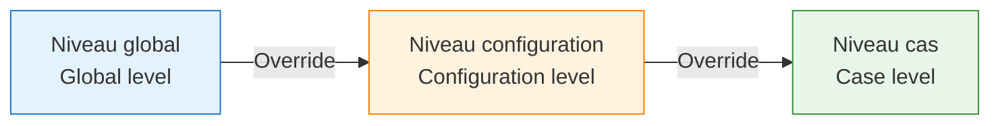

# Configuration

## ⚙️ Configuration du Framework / Framework Configuration

Guide complet pour configurer vos études CFD avec le framework.

Complete guide for configuring your CFD studies with the framework.

---

## 📋 Format config.yaml

### Structure de base / Basic Structure

```yaml
# Métadonnées de l'étude / Study metadata
etude:
  nom: "NOM_ETUDE"
  description: "Description de l'étude"
  date_creation: "2026-01-31"
  auteur: "Votre nom / Your name"

# Adaptateur par défaut / Default adapter
adaptateur: "OF"  # Options: OF, mock, su2

# Ressources de calcul / Computing resources (optionnel / optional)
ressources:
  nb_coeurs: 8
  memoire: "16GB"
  temps_max: "24:00:00"

# Configurations d'étude / Study configurations
configurations:
  CONFIG_NAME:
    description: "Description configuration"
    adaptateur: "OF"  # Override global adapter (optionnel / optional)
    cas:
      - nom: "CAS_1"
        parametres:
          param1: valeur1
          param2: valeur2
      - nom: "CAS_2"
        parametres:
          param1: valeur3
          param2: valeur4
```

---

## 🎯 Exemples complets / Complete Examples

### Exemple 1 : Étude d'angle d'attaque / Angle of Attack Study

```yaml
etude:
  nom: "NACA0012_ALPHA_STUDY"
  description: "Influence de l'angle d'attaque sur NACA0012"
  date_creation: "2026-01-31"
  auteur: "John Doe"

adaptateur: "OF"

configurations:
  BASELINE:
    description: "Points de validation"
    cas:
      - nom: "ALPHA_M5"
        parametres:
          angle_attaque: -5.0
          reynolds: 6000000
          maillage: "mesh_medium.cgns"
          nb_iterations: 10000
      
      - nom: "ALPHA_0"
        parametres:
          angle_attaque: 0.0
          reynolds: 6000000
          maillage: "mesh_medium.cgns"
          nb_iterations: 10000
      
      - nom: "ALPHA_P5"
        parametres:
          angle_attaque: 5.0
          reynolds: 6000000
          maillage: "mesh_medium.cgns"
          nb_iterations: 10000
      
      - nom: "ALPHA_P10"
        parametres:
          angle_attaque: 10.0
          reynolds: 6000000
          maillage: "mesh_medium.cgns"
          nb_iterations: 15000
```

### Exemple 2 : Étude de Reynolds / Reynolds Study

```yaml
etude:
  nom: "NACA0012_REYNOLDS"
  description: "Influence du nombre de Reynolds"

adaptateur: "OF"

configurations:
  REYNOLDS_SWEEP:
    description: "Variation Reynolds à alpha=5°"
    cas:
      - nom: "RE_1M"
        parametres:
          angle_attaque: 5.0
          reynolds: 1000000
          maillage: "mesh_coarse.cgns"
      
      - nom: "RE_3M"
        parametres:
          angle_attaque: 5.0
          reynolds: 3000000
          maillage: "mesh_medium.cgns"
      
      - nom: "RE_6M"
        parametres:
          angle_attaque: 5.0
          reynolds: 6000000
          maillage: "mesh_fine.cgns"
      
      - nom: "RE_9M"
        parametres:
          angle_attaque: 5.0
          reynolds: 9000000
          maillage: "mesh_fine.cgns"
```

### Exemple 3 : Multi-configurations / Multi-Configuration

```yaml
etude:
  nom: "AIRFOIL_COMPLETE_STUDY"
  description: "Étude complète profil"

adaptateur: "OF"

configurations:
  # Configuration 1: Validation
  VALIDATION:
    description: "Cas de validation avec données expérimentales"
    cas:
      - nom: "EXP_POINT_1"
        parametres:
          angle_attaque: 0.0
          reynolds: 6000000
          maillage: "mesh_validation.cgns"
      
      - nom: "EXP_POINT_2"
        parametres:
          angle_attaque: 4.0
          reynolds: 6000000
          maillage: "mesh_validation.cgns"
  
  # Configuration 2: Angle d'attaque
  ANGLE_OF_ATTACK:
    description: "Balayage angle d'attaque"
    cas:
      - nom: "ALPHA_M10"
        parametres: {angle_attaque: -10.0, reynolds: 6000000}
      - nom: "ALPHA_M5"
        parametres: {angle_attaque: -5.0, reynolds: 6000000}
      - nom: "ALPHA_0"
        parametres: {angle_attaque: 0.0, reynolds: 6000000}
      - nom: "ALPHA_P5"
        parametres: {angle_attaque: 5.0, reynolds: 6000000}
      - nom: "ALPHA_P10"
        parametres: {angle_attaque: 10.0, reynolds: 6000000}
  
  # Configuration 3: Convergence maillage
  MESH_CONVERGENCE:
    description: "Étude de convergence en maillage"
    cas:
      - nom: "MESH_COARSE"
        parametres:
          angle_attaque: 5.0
          reynolds: 6000000
          maillage: "mesh_coarse.cgns"
          nb_cells: 10000
      
      - nom: "MESH_MEDIUM"
        parametres:
          angle_attaque: 5.0
          reynolds: 6000000
          maillage: "mesh_medium.cgns"
          nb_cells: 40000
      
      - nom: "MESH_FINE"
        parametres:
          angle_attaque: 5.0
          reynolds: 6000000
          maillage: "mesh_fine.cgns"
          nb_cells: 160000
```

---

## 🏷️ Balises dans templates / Tags in Templates

### Syntaxe / Syntax

Utilisez `@NOM_PARAM@` dans vos fichiers templates.

Use `@PARAM_NAME@` in your template files.

**Exemple template OpenFOAM / OpenFOAM template example:**

```cpp
// system/controlDict.org
application     simpleFoam;
startFrom       startTime;
startTime       0;
endTime         @NB_ITERATIONS@;
deltaT          1;
writeControl    timeStep;
writeInterval   @WRITE_INTERVAL@;
```

**Après substitution / After substitution:**

```cpp
// system/controlDict
application     simpleFoam;
startFrom       startTime;
startTime       0;
endTime         10000;
deltaT          1;
writeControl    timeStep;
writeInterval   100;
```

### Balises supportées / Supported Tags

| Balise / Tag | Description | Exemple |
|--------------|-------------|---------|
| `@ANGLE_ATTAQUE@` | Angle d'attaque / Angle of attack | `5.0` |
| `@REYNOLDS@` | Nombre de Reynolds / Reynolds number | `6000000` |
| `@MAILLAGE@` | Fichier maillage / Mesh file | `mesh.cgns` |
| `@NB_ITERATIONS@` | Nombre d'itérations / Number of iterations | `10000` |
| `@DT@` | Pas de temps / Time step | `0.001` |
| Toute clé de `parametres` / Any key from `parametres` | - | - |

---

## 🔍 Validation du fichier / File Validation

### Vérifier la syntaxe YAML / Check YAML Syntax

```bash
# Avec yq / With yq
yq '.' config.yaml

# Si erreur / If error:
yq -P '.' config.yaml  # Pretty print pour debug
```

### Valider avec le framework / Validate with Framework

```bash
cd 02_PARAMS
source ${CFD_FRAMEWORK}/lib/gestion_config.sh

cfg_charger "config.yaml"
cfg_valider_schema

# Lister les configurations / List configurations
cfg_lister_configurations

# Lister les cas d'une configuration / List cases from a configuration
cfg_lister_cas "BASELINE"
```

### Erreurs courantes / Common Errors

#### Erreur 1 : Indentation incorrecte / Incorrect Indentation

❌ **Mauvais / Bad:**
```yaml
configurations:
BASELINE:  # Pas assez indenté / Not indented enough
  cas:
```

✅ **Bon / Good:**
```yaml
configurations:
  BASELINE:  # Indenté correctement / Correctly indented
    cas:
```

#### Erreur 2 : Guillemets manquants pour valeurs spéciales / Missing Quotes for Special Values

❌ **Mauvais / Bad:**
```yaml
nom: Case 1  # Espace non quoté / Unquoted space
```

✅ **Bon / Good:**
```yaml
nom: "Case 1"  # ou / or
nom: Case_1    # Sans espace / Without space
```

#### Erreur 3 : Tabulations au lieu d'espaces / Tabs Instead of Spaces

```bash
# Vérifier / Check:
cat -A config.yaml

# ^I = tabulation (remplacer par espaces / replace with spaces)
```

---

## 📊 Configurations avancées / Advanced Configurations

### Cascade de paramètres / Parameter Cascade

Les paramètres peuvent être définis à 3 niveaux (priorité croissante):

Parameters can be defined at 3 levels (increasing priority):



**Exemple / Example:**

```yaml
# Niveau global / Global level
adaptateur: "OF"
reynolds: 6000000

configurations:
  CONFIG_1:
    # Niveau configuration / Configuration level
    reynolds: 3000000  # Override global
    
    cas:
      - nom: "CASE_1"
        parametres:
          # Niveau cas / Case level
          angle_attaque: 5.0
          reynolds: 1000000  # Override configuration
          # reynolds final = 1000000
```

### Paramètres calculés / Computed Parameters

Vous pouvez utiliser des scripts pour générer des paramètres.

You can use scripts to generate parameters.

**Script de génération / Generation Script:**

```bash
# 10_SCRIPT/LANCEMENT_CALCUL/BASELINE.sh
#!/usr/bin/env bash

YAML_PATH="$1"
CONFIG_FILE="$2"
LOCAL_DIR="$3"

# Extraire paramètres / Extract parameters
ANGLE=$(yq "${YAML_PATH}.parametres.angle_attaque" "$CONFIG_FILE")
REYNOLDS=$(yq "${YAML_PATH}.parametres.reynolds" "$CONFIG_FILE")

# Calculer paramètres dérivés / Compute derived parameters
MACH=$(echo "scale=4; $REYNOLDS / 6000000 * 0.15" | bc)
CFL=$(echo "scale=2; 1.0 / $REYNOLDS * 10000000" | bc)

# Ajouter au .metadata.yaml / Add to .metadata.yaml
yq -i ".parametres_derives.mach = $MACH" "$LOCAL_DIR/.metadata.yaml"
yq -i ".parametres_derives.cfl = $CFL" "$LOCAL_DIR/.metadata.yaml"
```

---

## 🎯 Bonnes pratiques / Best Practices

### ✅ DO / À FAIRE

1. **Noms descriptifs / Descriptive names**
   ```yaml
   nom: "ALPHA_5_RE_6M_MESH_FINE"  # ✅ Clair / Clear
   nom: "CASE_1"                    # ❌ Pas descriptif / Not descriptive
   ```

2. **Commentaires / Comments**
   ```yaml
   # Configuration pour validation avec données exp.
   # Configuration for validation with exp. data
   VALIDATION:
     description: "Points de validation"
   ```

3. **Versionnement / Versioning**
   ```bash
   git add config.yaml
   git commit -m "Add REYNOLDS_STUDY configuration"
   ```

### ❌ DON'T / À ÉVITER

1. **Espaces dans les noms / Spaces in names**
   ```yaml
   nom: "My Case 1"     # ❌
   nom: "My_Case_1"     # ✅
   ```

2. **Valeurs hardcodées / Hardcoded values**
   ```yaml
   # ❌ Mauvais / Bad:
   maillage: "/home/user/meshes/mesh.cgns"
   
   # ✅ Bon / Good:
   maillage: "mesh.cgns"  # Dans 01_MAILLAGE/ / In 01_MAILLAGE/
   ```

3. **Trop de paramètres / Too many parameters**
   ```yaml
   # Garder simple et utiliser des scripts pour dérivation
   # Keep simple and use scripts for derivation
   parametres:
     angle_attaque: 5.0
     reynolds: 6000000
     # mach: ...        # À calculer / To compute
     # cfl: ...         # À calculer / To compute
   ```

---

## 📖 Voir aussi / See Also

- [Workflow](workflow.md) - Flux de travail complet / Complete workflow
- [Études paramétriques](../workflows/parametric-study.md) - Guide détaillé / Detailed guide
- [API gestion_config](../api/gestion-config.md) - Fonctions de configuration / Configuration functions
- [Templates](../examples/templates.md) - Exemples de templates / Template examples

---

## 🔧 Outils utiles / Useful Tools

### Générer config.yaml depuis tableur / Generate config.yaml from Spreadsheet

```python
# generate_config.py
import yaml
import pandas as pd

# Lire CSV / Read CSV
df = pd.read_csv("cases.csv")

config = {
    "etude": {
        "nom": "GENERATED_STUDY",
        "description": "Auto-generated from spreadsheet"
    },
    "adaptateur": "OF",
    "configurations": {
        "PARAMETRIC": {
            "description": "Auto-generated cases",
            "cas": []
        }
    }
}

# Générer cas / Generate cases
for _, row in df.iterrows():
    case = {
        "nom": row["name"],
        "parametres": {
            "angle_attaque": float(row["alpha"]),
            "reynolds": float(row["re"])
        }
    }
    config["configurations"]["PARAMETRIC"]["cas"].append(case)

# Sauvegarder / Save
with open("config.yaml", "w") as f:
    yaml.dump(config, f, default_flow_style=False)
```

### Visualiser la structure / Visualize Structure

```bash
# Afficher toutes les configurations et cas
# Display all configurations and cases
yq '.configurations | keys' config.yaml

# Compter les cas par configuration
# Count cases per configuration
for config in $(yq '.configurations | keys | .[]' config.yaml); do
  nb=$(yq ".configurations.${config}.cas | length" config.yaml)
  echo "$config: $nb cas"
done
```
