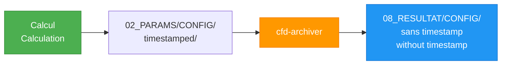

# FAQ - Foire aux questions / Frequently Asked Questions

## 🌍 Général / General

### Qu'est-ce que le CFD Framework? / What is the CFD Framework?

Le CFD Framework est un système générique pour gérer, lancer et analyser des études CFD paramétriques avec différents solveurs.

The CFD Framework is a generic system for managing, launching, and analyzing parametric CFD studies with different solvers.

### Est-ce compatible avec mon solveur CFD? / Is it compatible with my CFD solver?

Le framework utilise un système d'adaptateurs. OpenFOAM est supporté nativement. Vous pouvez créer votre propre adaptateur pour tout solveur.

The framework uses an adapter system. OpenFOAM is natively supported. You can create your own adapter for any solver.

---

## 🚀 Installation / Installation

### Où installer le framework? / Where to install the framework?

```bash
# Option 1: Home directory (recommandé / recommended)
~/Documents/CFD_FRAMEWORK

# Option 2: System-wide
/opt/CFD_FRAMEWORK

# Option 3: Projet-specific
/path/to/projet/CFD_FRAMEWORK
```

### Comment mettre à jour? / How to update?

```bash
cd $CFD_FRAMEWORK
git pull origin main
```

### yq est-il obligatoire? / Is yq required?

Non, mais fortement recommandé. Le framework a un fallback en bash pur (plus lent).

No, but highly recommended. The framework has a pure bash fallback (slower).

---

## ⚙️ Configuration / Configuration

### Où placer mes maillages? / Where to place my meshes?

```
MON_CAS/
└── 01_MAILLAGE/
    ├── mesh.cgns
    ├── mesh.msh
    └── ...
```

### Format du fichier config.yaml? / config.yaml file format?

```yaml
etude:
  nom: "NOM_ETUDE"
  description: "Description"
  auteur: "Votre nom"

adaptateur: "OF"  # ou "mock", "su2"

configurations:
  CONFIG_NAME:
    description: "Description"
    cas:
      - nom: "CAS_1"
        parametres:
          param1: valeur1
          param2: valeur2
```

### Comment utiliser les templates .org? / How to use .org templates?

Les balises `@PARAM@` sont automatiquement substituées:

The `@PARAM@` tags are automatically substituted:

**Template:**
```
angle_of_attack = @ANGLE_ATTAQUE@
reynolds = @REYNOLDS@
```

**Après substitution / After substitution:**
```
angle_of_attack = 5.0
reynolds = 6000000
```

---

## 🔧 Utilisation / Usage

### Différence entre cfd-run et cfd-run-parametrique? / Difference between cfd-run and cfd-run-parametrique?

| Commande | Usage | Cas multiples |
|----------|-------|---------------|
| `cfd-run` | Cas unique / Single case | ❌ Non / No |
| `cfd-run-parametrique` | Étude paramétrique / Parametric study | ✅ Oui / Yes |

### Comment lancer en parallèle? / How to launch in parallel?

```bash
# Avec GNU Parallel (si installé / if installed)
# Le framework détecte et utilise automatiquement
# The framework detects and uses automatically

cfd-run-parametrique --config STUDY
```

### Puis-je modifier un run en cours? / Can I modify a running case?

Oui pour `--in-place`, mais déconseillé pour les runs horodatés.

Yes for `--in-place`, but not recommended for timestamped runs.

### Comment relancer un cas échoué? / How to relaunch a failed case?

```bash
# Option 1: Relancer depuis le répertoire horodaté
cd 02_PARAMS/BASELINE/OF_V13_CAS_20260131_151234
cfd-run --in-place

# Option 2: Nouveau run
cd 02_PARAMS/BASELINE
cfd-run --name CAS_RETRY
```

---

## 📊 Résultats / Results

### Où sont stockés les résultats? / Where are results stored?



### Comment extraire les données? / How to extract data?

```bash
# 1. Post-traitement personnalisé / Custom post-processing
cd RUN_DIRECTORY
bash 10_SCRIPT/POST_TRAITEMENT/PP.sh

# 2. Extraction automatique / Automatic extraction
# (dépend de l'adaptateur / depends on adapter)
```

### Que faire des fichiers volumineux? / What to do with large files?

```bash
# Ne pas commiter dans git / Don't commit to git
echo "processor*/" >> .gitignore
echo "*.vtk" >> .gitignore
echo "*.vtu" >> .gitignore

# Compresser pour archivage / Compress for archiving
tar -czf results.tar.gz --exclude="processor*" RUN_DIRECTORY/
```

---

## 🗑️ Nettoyage / Cleanup

### Comment supprimer tous les runs? / How to delete all runs?

```bash
# Tous les runs d'une config / All runs from a config
cfd-clean-config 02_PARAMS/BASELINE

# Tous les runs de toutes les configs / All runs from all configs
for config in 02_PARAMS/*/; do
  cfd-clean-config "$config"
done
```

### Quelle est la différence --append vs --force? / What is the difference --append vs --force?

| Option | Comportement / Behavior |
|--------|-------------------------|
| Défaut / Default | Demande confirmation / Asks confirmation |
| `--append` | Garde timestamp si conflit / Keeps timestamp if conflict |
| `--force` | Écrase sans confirmation / Overwrites without confirmation |

```bash
# --append: CAS_1 existe → crée CAS_1_20260131_151234
cfd-archiver --append SOURCE DEST

# --force: CAS_1 existe → écrase CAS_1
cfd-archiver --force SOURCE DEST
```

---

## 🔌 Adaptateurs / Adapters

### Comment choisir l'adaptateur? / How to choose the adapter?

```bash
# Méthode 1: Variable d'environnement / Environment variable
export CFD_ADAPTATEUR="OF"
cfd-run

# Méthode 2: Option CLI / CLI option
cfd-run --adaptateur OF

# Méthode 3: Dans config.yaml / In config.yaml
adaptateur: "OF"
```

### Comment créer un adaptateur? / How to create an adapter?

Consultez [Créer un adaptateur](../adapters/create-adapter.md).

See [Create an adapter](../adapters/create-adapter.md).

### L'adaptateur mock est-il utile? / Is the mock adapter useful?

Oui ! Pour:

Yes! For:
- Tester le framework / Testing the framework
- Développer des scripts / Developing scripts
- Valider la configuration / Validating configuration
- CI/CD sans solveur réel / CI/CD without real solver

---

## ⚠️ Erreurs courantes / Common Errors

### `❌ CASE_NAME non défini`

**Cause:** Variable `$CASE_NAME` manquante en mode copie.

**Solution:**
```bash
export CASE_NAME="MON_CAS"
# ou / or
cfd-run --name MON_CAS
```

### `❌ Adaptateur introuvable: XXX`

**Cause:** Adaptateur n'existe pas ou nom incorrect.

**Solution:**
```bash
# Lister adaptateurs disponibles / List available adapters
ls $CFD_FRAMEWORK/adaptateurs/

# Utiliser un adaptateur valide / Use a valid adapter
cfd-run --adaptateur OF
```

### `❌ Fichier config.yaml invalide`

**Cause:** Syntaxe YAML incorrecte.

**Solution:**
```bash
# Valider avec yq / Validate with yq
yq '.' config.yaml

# Vérifier indentation (espaces, pas tabs)
# Check indentation (spaces, not tabs)
cat -A config.yaml
```

### `❌ Échec de vérification de l'adaptateur OpenFOAM`

**Cause:** OpenFOAM non sourcé ou non installé.

**Solution:**
```bash
# Sourcer OpenFOAM / Source OpenFOAM
source /opt/openfoam/etc/bashrc

# Vérifier installation / Check installation
which foamRun
foamRun -help
```

---

## 🎯 Workflow

### Puis-je travailler sans tmux? / Can I work without tmux?

Oui, tmux est optionnel. Il améliore juste l'expérience.

Yes, tmux is optional. It just enhances the experience.

```bash
# Sans tmux / Without tmux
cd MON_CAS
# Travailler normalement / Work normally
```

### Comment organiser plusieurs études? / How to organize multiple studies?

```
~/CFD_STUDIES/
├── AIRFOIL_2D/
│   ├── 02_PARAMS/
│   │   ├── BASELINE/
│   │   ├── ANGLE_STUDY/
│   │   └── REYNOLDS_STUDY/
│   └── ...
├── TURBINE_3D/
│   ├── 02_PARAMS/
│   │   ├── DESIGN_POINT/
│   │   └── OFF_DESIGN/
│   └── ...
└── VALIDATION_CASES/
    └── ...
```

### Puis-je utiliser Docker? / Can I use Docker?

Oui, exemple:

Yes, example:

```bash
# Dockerfile
FROM ubuntu:22.04
RUN apt-get update && apt-get install -y \
    bash git yq rsync openfoam-default

COPY CFD_FRAMEWORK /opt/CFD_FRAMEWORK
ENV CFD_FRAMEWORK=/opt/CFD_FRAMEWORK
ENV PATH="${PATH}:/opt/CFD_FRAMEWORK/bin"

# Utilisation / Usage
docker run -v $(pwd):/workspace cfd-framework cfd-run --help
```

---

## 📈 Performance

### Combien de cas puis-je lancer en parallèle? / How many cases can I launch in parallel?

Dépend de vos ressources:

Depends on your resources:

```bash
# Règle générale / General rule
N_parallel = N_cores / N_cores_per_case

# Exemple: 64 cores, 8 cores par cas / Example: 64 cores, 8 cores per case
# → 8 cas en parallèle / → 8 cases in parallel
```

### Le framework ralentit-il les calculs? / Does the framework slow down calculations?

Non, l'overhead est négligeable (<1s par cas).

No, the overhead is negligible (<1s per case).

---

## 🔐 Sécurité / Security

### Puis-je commiter les résultats? / Can I commit results?

**Non recommandé.** Utilisez Git LFS ou archivage externe.

**Not recommended.** Use Git LFS or external archiving.

```gitignore
# .gitignore
02_PARAMS/*/*_[0-9]*_*
08_RESULTAT/
09_POST_TRAITEMENT/DATA/
09_POST_TRAITEMENT/FIGURE/
*.vtk
*.vtu
processor*/
```

### Les données sont-elles isolées? / Are data isolated?

Oui, chaque run est dans son propre répertoire horodaté.

Yes, each run is in its own timestamped directory.

---

## 🆘 Support

### Où obtenir de l'aide? / Where to get help?

1. 📖 Documentation: [docs/](../index.md)
2. 🐛 Issues: [GitHub Issues](https://github.com/user/CFD_FRAMEWORK/issues)
3. 💬 Discussions: [GitHub Discussions](https://github.com/user/CFD_FRAMEWORK/discussions)

### Comment signaler un bug? / How to report a bug?

```bash
# 1. Vérifier la version / Check version
git -C $CFD_FRAMEWORK log -1 --oneline

# 2. Reproduire avec --debug
export VERBOSE=2
cfd-run ... 2>&1 | tee debug.log

# 3. Ouvrir une issue avec debug.log / Open an issue with debug.log
```

---

## 🗺️ Roadmap

### Quelles sont les prochaines fonctionnalités? / What are the upcoming features?

- Dashboard web de monitoring / Web monitoring dashboard
- Support GPU pour calculs / GPU support for calculations
- Intégration CI/CD / CI/CD integration
- Plus d'adaptateurs (SU2, Fluent) / More adapters (SU2, Fluent)

### Comment contribuer? / How to contribute?

Consultez [Guide de contribution](../dev/contributing.md).

See [Contribution guide](../dev/contributing.md).

---

**Votre question n'est pas listée?** Ouvrez une [issue](https://github.com/user/CFD_FRAMEWORK/issues).

**Your question isn't listed?** Open an [issue](https://github.com/user/CFD_FRAMEWORK/issues).
