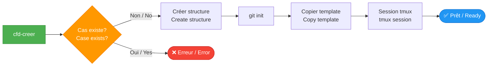
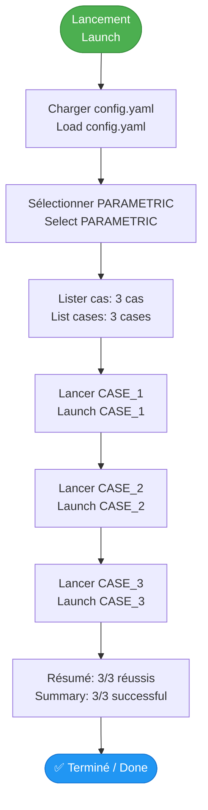

# Démarrage rapide / Quick Start

## ⚡ Premier cas en 5 minutes / First Case in 5 Minutes

Ce guide vous permet de créer et lancer votre premier cas CFD en moins de 5 minutes.

This guide allows you to create and launch your first CFD case in less than 5 minutes.

---

## 📋 Prérequis / Prerequisites

- [x] CFD Framework installé / installed
- [x] Variable `$CFD_FRAMEWORK` définie / defined
- [x] Commandes `cfd-*` dans le PATH

!!! tip "Vérification rapide / Quick Check"
    ```bash
    echo $CFD_FRAMEWORK
    cfd-run --help
    ```

---

## 🚀 Étape 1 : Créer un cas / Create a Case

### Option A : Mode interactif / Interactive Mode

```bash
cd ~/Documents
cfd-creer
# Entrez le nom: MY_FIRST_CASE
```

### Option B : Mode direct / Direct Mode

```bash
cd ~/Documents
cfd-creer --name MY_FIRST_CASE
```

**Ce qui se passe / What happens:**



**Structure créée / Created Structure:**
```
MY_FIRST_CASE/
├── 01_MAILLAGE/
├── 02_PARAMS/
│   └── BASELINE/
│       └── template/
├── 08_RESULTAT/
├── 09_POST_TRAITEMENT/
└── 10_SCRIPT/
```

---

## ⚙️ Étape 2 : Configuration minimale / Minimal Configuration

### Créer un fichier de configuration / Create a configuration file

```bash
cd MY_FIRST_CASE/02_PARAMS
cat > config.yaml << 'EOF'
etude:
  nom: "MY_FIRST_CASE"
  description: "Mon premier cas CFD"
  auteur: "Votre nom"
  date_creation: "2026-01-31"

adaptateur: "mock"

configurations:
  BASELINE:
    description: "Configuration de test"
    cas:
      - nom: "TEST_1"
        parametres:
          iterations: 100
          dt: 0.001
EOF
```

---

## 🎯 Étape 3 : Lancer un calcul / Launch a Calculation

### Option 1 : Test rapide avec adaptateur mock / Quick test with mock adapter

```bash
cd MY_FIRST_CASE/02_PARAMS/BASELINE
export CASE_NAME="TEST"
cfd-run --adaptateur mock --name TEST_RUN
```

**Affichage attendu / Expected Output:**
```
═══════════════════════════════════════════════════════════
 🚀 Lancement du calcul
═══════════════════════════════════════════════════════════

ℹ️  Chargement de l'adaptateur: mock
✅ Adaptateur Mock chargé et vérifié
✅ Adaptateur Mock chargé et vérifié
ℹ️  Version de l'adaptateur: 1.0

ℹ️  Nom de répertoire généré: mock_V1.0_TEST_RUN_20260131_151234
ℹ️  Création du répertoire: .../mock_V1.0_TEST_RUN_20260131_151234
ℹ️  Copie des fichiers d'entrée...
• Copie : template
✅ Copie terminée : 1 élément(s) copié(s)
✅ Répertoire d'exécution: .../mock_V1.0_TEST_RUN_20260131_151234

ℹ️  Préparation des fichiers d'entrée...
✅ Fichiers préparés

🚀 Lancement du calcul avec adaptateur Mock...
✅ Simulation mock terminée
🏁 Calcul terminé
✅ Résultats disponibles dans: .../mock_V1.0_TEST_RUN_20260131_151234
```

---

## 📊 Étape 4 : Vérifier les résultats / Check Results

```bash
# Lister les runs créés / List created runs
ls -lhrt 02_PARAMS/BASELINE/mock_V1.0_*

# Aller dans le dernier run / Go to last run
cd $(ls -td 02_PARAMS/BASELINE/mock_V1.0_* | head -1)

# Vérifier les fichiers / Check files
ls -lha
```

**Fichiers créés / Created Files:**
```
mock_V1.0_TEST_RUN_20260131_151234/
├── .metadata.yaml        # Métadonnées du run
├── LOG/                  # Logs du solveur
│   └── log.mock
├── results.dat           # Résultats mock
└── ...
```

---

## 💾 Étape 5 : Archiver / Archive

```bash
# Revenir au cas / Return to case
cd MY_FIRST_CASE

# Archiver les résultats / Archive results
cfd-archiver 02_PARAMS/BASELINE 08_RESULTAT/BASELINE
```

**Structure finale / Final Structure:**
```
MY_FIRST_CASE/
├── 02_PARAMS/
│   └── BASELINE/
│       ├── mock_V1.0_TEST_RUN_20260131_151234/  # Run original
│       └── template/
└── 08_RESULTAT/
    └── BASELINE/
        └── TEST_RUN/                             # Archivé (timestamp supprimé)
```

---

## 🎓 Étape bonus : Étude paramétrique / Parametric Study

### Configuration pour multiple cas / Configuration for multiple cases

```yaml
# 02_PARAMS/config.yaml
etude:
  nom: "MY_FIRST_CASE"
  description: "Étude paramétrique"

adaptateur: "mock"

configurations:
  PARAMETRIC:
    description: "Variation de paramètres"
    cas:
      - nom: "CASE_1"
        parametres:
          iterations: 100
          dt: 0.001
      - nom: "CASE_2"
        parametres:
          iterations: 200
          dt: 0.0005
      - nom: "CASE_3"
        parametres:
          iterations: 300
          dt: 0.00025
```

### Lancement / Launch

```bash
cd MY_FIRST_CASE
export CASE_NAME="MY_FIRST_CASE"
cfd-run-parametrique --config PARAMETRIC
```

**Workflow exécuté / Workflow Executed:**



---

## 🧹 Nettoyage / Cleanup

```bash
# Supprimer tous les runs temporaires / Delete all temporary runs
cfd-clean-config 02_PARAMS/BASELINE

# Ou supprimer le cas complet / Or delete the complete case
cd ..
rm -rf MY_FIRST_CASE
```

---

## ✅ Checklist de réussite / Success Checklist

- [ ] Cas créé avec `cfd-creer`
- [ ] Configuration `config.yaml` créée
- [ ] Premier run lancé avec `cfd-run`
- [ ] Résultats visibles dans le répertoire horodaté
- [ ] Résultats archivés dans `08_RESULTAT/`
- [ ] Étude paramétrique testée (optionnel)

---

## 🎯 Prochaines étapes / Next Steps

### Niveau débutant / Beginner Level
- [Configuration avancée](configuration.md) - Paramètres YAML
- [Workflow complet](workflow.md) - Flux de travail détaillé

### Niveau intermédiaire / Intermediate Level
- [Études paramétriques](../workflows/parametric-study.md) - Multi-cas
- [Post-traitement](../workflows/post-processing.md) - Analyse des résultats

### Niveau avancé / Advanced Level
- [Créer un adaptateur](../adapters/create-adapter.md) - Support nouveau solveur
- [API Bash](../api/format.md) - Bibliothèques internes

---

## 💡 Astuces / Tips

### Alias utiles / Useful Aliases

Ajoutez à votre `~/.bashrc`:

```bash
# Aller au dernier run / Go to last run
alias cfd-last='cd $(ls -td ./*_[0-9][0-9][0-9][0-9][0-9][0-9][0-9][0-9]_* 2>/dev/null | head -1)'

# Lister tous les runs / List all runs
alias cfd-ls='ls -lhrt *_[0-9][0-9][0-9][0-9][0-9][0-9][0-9][0-9]_* 2>/dev/null'

# Compter les runs / Count runs
alias cfd-count='ls -d *_[0-9][0-9][0-9][0-9][0-9][0-9][0-9][0-9]_* 2>/dev/null | wc -l'
```

### Templates personnalisés / Custom Templates

```bash
# Copier le template par défaut / Copy default template
cp -r $CFD_FRAMEWORK/templates/TEMPLATE_CASE_DEFAULT \
      $CFD_FRAMEWORK/templates/MY_TEMPLATE

# Modifier le template / Modify template
# Puis l'utiliser / Then use it:
cfd-creer --name NEW_CASE --template MY_TEMPLATE
```

---

## ❓ Problèmes courants / Common Issues

### Problème 1 : cfd-run ne trouve pas l'adaptateur

```bash
❌ Adaptateur introuvable: mock
```

**Solution:**
```bash
# Vérifier que l'adaptateur existe
ls $CFD_FRAMEWORK/adaptateurs/

# L'adaptateur mock doit être présent
ls $CFD_FRAMEWORK/adaptateurs/mock.sh
```

### Problème 2 : CASE_NAME non défini

```bash
❌ CASE_NAME non défini
```

**Solution:**
```bash
export CASE_NAME="MON_CAS"
# Ou utiliser --name
cfd-run --name MON_CAS
```

### Problème 3 : Pas de session tmux

Si `cfd-creer` ne lance pas tmux:

```bash
# Installer tmux
sudo apt install tmux  # Ubuntu/Debian
brew install tmux      # macOS

# Ou ne pas utiliser tmux
cd MY_FIRST_CASE
# Travailler normalement
```

---

## 📚 Ressources / Resources

- [Installation complète](installation.md)
- [Guide workflow](workflow.md)
- [Documentation CLI](../cli/cfd-run.md)
- [FAQ](faq.md)

---

**Félicitations ! 🎉** Vous avez créé votre premier cas CFD !

**Congratulations! 🎉** You've created your first CFD case!

**Continuez avec** : [Configuration avancée →](configuration.md)

**Continue with**: [Advanced configuration →](configuration.md)
