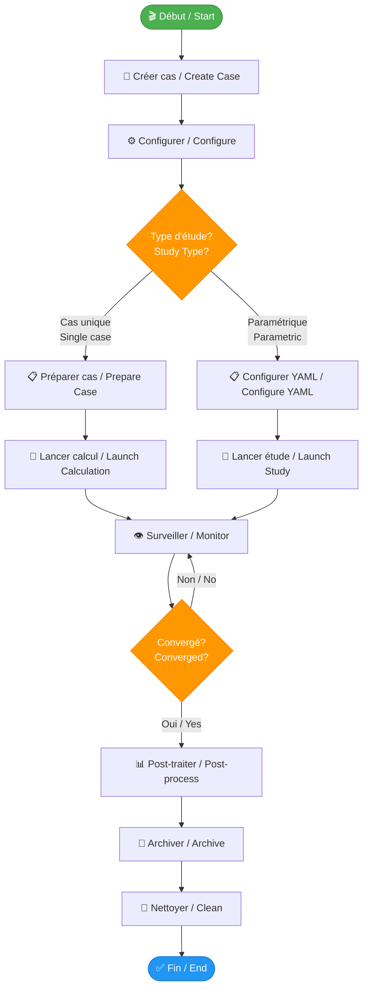
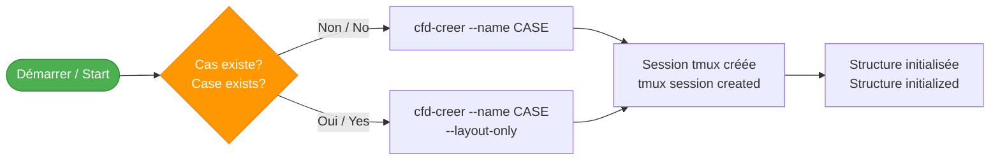
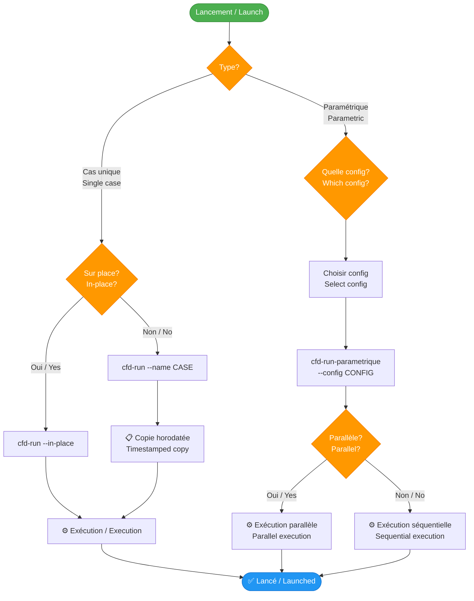
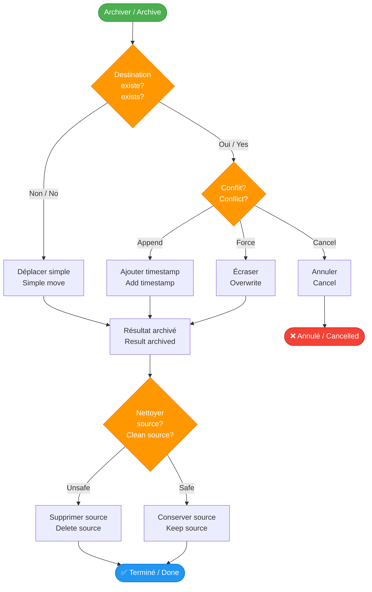
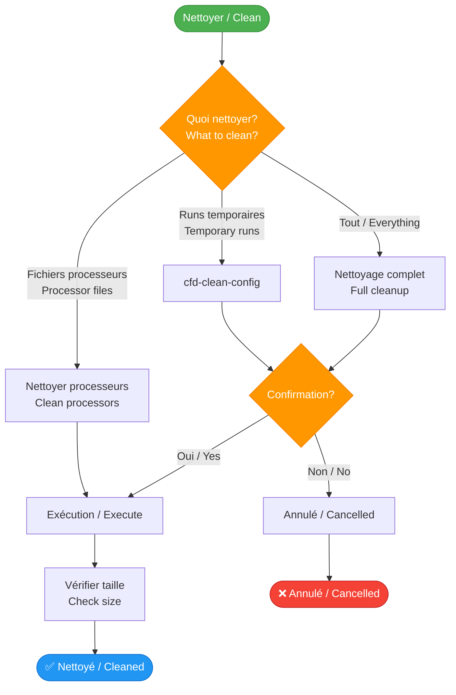
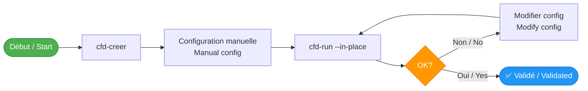

# Workflow

## 🔄 Flux de travail complet / Complete Workflow

Ce guide présente le flux de travail typique pour utiliser le CFD Framework, de la création d'un cas à l'archivage des résultats.

This guide presents the typical workflow for using the CFD Framework, from case creation to results archiving.

---

## 📊 Vue d'ensemble du workflow / Workflow Overview



---

## 🎯 Workflow détaillé / Detailed Workflow

### Phase 1 : Création du cas / Case Creation

#### Décision : Nouveau cas ou existant ? / Decision: New or Existing Case?



**Commandes / Commands:**

```bash
# Nouveau cas / New case
cfd-creer --name AIRFOIL_2D

# Cas existant / Existing case
cfd-creer --name AIRFOIL_2D --layout-only
```

---

### Phase 2 : Configuration / Configuration

#### Structure du cas / Case Structure

```
AIRFOIL_2D/
├── 01_MAILLAGE/           # Fichiers de maillage / Mesh files
├── 02_PARAMS/             # Configurations et paramètres / Configs and parameters
│   ├── BASELINE/          # Configuration de référence / Baseline config
│   │   └── template/      # Templates avec balises @...@ / Templates with @...@ tags
│   └── config.yaml        # Configuration paramétrique / Parametric config
├── 08_RESULTAT/           # Résultats archivés / Archived results
├── 09_POST_TRAITEMENT/    # Données et figures / Data and figures
│   ├── DATA/
│   └── FIGURE/
└── 10_SCRIPT/             # Scripts personnalisés / Custom scripts
    ├── LANCEMENT_CALCUL/
    └── POST_TRAITEMENT/
```

#### Fichier config.yaml

```yaml
etude:
  nom: "AIRFOIL_2D"
  description: "Étude paramétrique profil NACA"
  auteur: "Votre nom / Your name"

adaptateur: "OF"  # ou "mock" pour test / or "mock" for testing

configurations:
  BASELINE:
    description: "Configuration de référence"
    cas:
      - nom: "ALPHA_0"
        parametres:
          angle_attaque: 0.0
          reynolds: 6e6
      - nom: "ALPHA_5"
        parametres:
          angle_attaque: 5.0
          reynolds: 6e6
```

---

### Phase 3 : Lancement / Launching

#### Graphe de décision : Type de lancement / Decision Graph: Launch Type



**Exemples de commandes / Command Examples:**

```bash
# 1. Cas unique sur place / Single case in-place
cd 02_PARAMS/BASELINE
cfd-run --adaptateur OF --in-place

# 2. Cas unique avec copie horodatée / Single case with timestamp
cd 02_PARAMS/BASELINE
export CASE_NAME="TEST"
cfd-run --adaptateur OF

# 3. Étude paramétrique / Parametric study
cd AIRFOIL_2D
export CASE_NAME="AIRFOIL_2D"
cfd-run-parametrique --config BASELINE

# 4. Mode dry-run pour tester / Dry-run mode for testing
cfd-run --adaptateur OF --name TEST --dry-run
```

---

### Phase 4 : Surveillance / Monitoring

#### Pendant le calcul / During Calculation

Le framework crée automatiquement des répertoires horodatés :

The framework automatically creates timestamped directories:

```
02_PARAMS/BASELINE/
└── OF_V13_ALPHA_5_20260131_143052/  # Format: ADAPTER_VERSION_NAME_TIMESTAMP
    ├── LOG/                          # Logs du solveur / Solver logs
    ├── .metadata.yaml                # Métadonnées / Metadata
    └── ...                           # Fichiers du cas / Case files
```

**Commandes de surveillance / Monitoring Commands:**

```bash
# Lister les runs actifs / List active runs
ls -lhrt 02_PARAMS/BASELINE/OF_V13_*

# Suivre les logs / Follow logs
tail -f 02_PARAMS/BASELINE/OF_V13_*/LOG/log.foamRun

# Vérifier la convergence / Check convergence
grep "Time =" 02_PARAMS/BASELINE/OF_V13_*/LOG/log.foamRun | tail -20
```

---

### Phase 5 : Post-traitement / Post-Processing

#### Extraction des données / Data Extraction

```bash
# 1. Aller dans le répertoire du run / Go to run directory
cd 02_PARAMS/BASELINE/OF_V13_ALPHA_5_20260131_143052

# 2. Exécuter le script de post-traitement / Execute post-processing script
bash 10_SCRIPT/POST_TRAITEMENT/PP.sh

# 3. Vérifier les données extraites / Check extracted data
ls -lh 09_POST_TRAITEMENT/DATA/
```

---

### Phase 6 : Archivage / Archiving

#### Graphe de décision : Archivage / Decision Graph: Archiving



**Commandes d'archivage / Archiving Commands:**

```bash
# 1. Archivage safe (copie) / Safe archiving (copy)
cfd-archiver 02_PARAMS/BASELINE 08_RESULTAT/BASELINE

# 2. Archivage unsafe (déplacement) / Unsafe archiving (move)
cfd-archiver --un-safe 02_PARAMS/BASELINE 08_RESULTAT/BASELINE

# 3. Écraser les résultats existants / Overwrite existing results
cfd-archiver --force 02_PARAMS/BASELINE 08_RESULTAT/BASELINE

# 4. Ajouter timestamp si conflit / Add timestamp if conflict
cfd-archiver --append 02_PARAMS/BASELINE 08_RESULTAT/BASELINE
```

---

### Phase 7 : Nettoyage / Cleanup

#### Graphe de décision : Nettoyage / Decision Graph: Cleanup



**Commandes de nettoyage / Cleanup Commands:**

```bash
# 1. Nettoyer tous les runs d'une config / Clean all runs from a config
cfd-clean-config 02_PARAMS/BASELINE

# 2. Mode force (sans confirmation) / Force mode (no confirmation)
cfd-clean-config --force 02_PARAMS/BASELINE

# 3. Vérifier la taille avant/après / Check size before/after
du -sh 02_PARAMS/BASELINE/
cfd-clean-config 02_PARAMS/BASELINE
du -sh 02_PARAMS/BASELINE/
```

---

## 🔄 Workflows spécifiques / Specific Workflows

### Workflow A : Cas de debug / Debug Case



### Workflow B : Production / Production


---

## 💡 Bonnes pratiques / Best Practices

### ✅ DO / À FAIRE

- ✅ Utiliser des noms descriptifs pour les cas / Use descriptive names for cases
- ✅ Commiter les templates et config.yaml / Commit templates and config.yaml
- ✅ Tester avec `--dry-run` avant lancement / Test with `--dry-run` before launching
- ✅ Archiver régulièrement les résultats / Archive results regularly
- ✅ Documenter dans 05_DOCUMENTATION/ / Document in 05_DOCUMENTATION/

### ❌ DON'T / À ÉVITER

- ❌ Commiter les résultats de calculs / Commit calculation results
- ❌ Lancer sans `CASE_NAME` défini / Launch without `CASE_NAME` defined
- ❌ Modifier manuellement les répertoires horodatés / Manually modify timestamped directories
- ❌ Utiliser `--un-safe` sans backup / Use `--un-safe` without backup

---

## 📊 Métriques de performance / Performance Metrics

### Temps typiques / Typical Times

| Opération / Operation | Temps / Time | Dépend de / Depends on |
|-----------------------|--------------|------------------------|
| Création cas / Case creation | < 1s | - |
| Copie horodatée / Timestamped copy | 1-10s | Taille des fichiers / File size |
| Lancement calcul / Launch calculation | Variable | Solveur et config / Solver and config |
| Archivage / Archiving | 5-30s | Nombre de fichiers / Number of files |
| Nettoyage / Cleanup | 1-5s | Nombre de runs / Number of runs |

---

## 📖 Voir aussi / See Also

- [Cas unique](../workflows/single-case.md) - Workflow détaillé cas unique / Detailed single case workflow
- [Étude paramétrique](../workflows/parametric-study.md) - Workflow études paramétriques / Parametric study workflow
- [CLI Reference](../cli/cfd-run.md) - Documentation des commandes / Command documentation
- [FAQ](faq.md) - Questions fréquentes / Frequently asked questions

---

**Prêt à commencer ?** Suivez le [guide de démarrage rapide](quickstart.md) !

**Ready to start?** Follow the [quick start guide](quickstart.md)!
