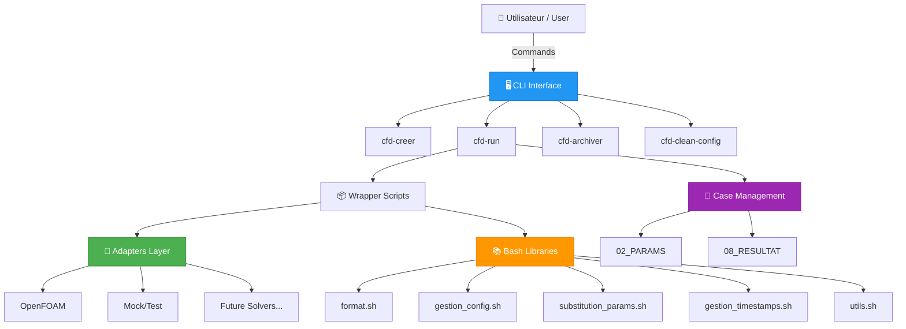

# CFD Framework

## 🚀 Framework Générique pour Études CFD Paramétriques

### Generic Framework for Parametric CFD Studies

---

## Vue d'ensemble / Overview

Le **CFD Framework** est un système complet et générique pour gérer, lancer et analyser des études CFD (Computational Fluid Dynamics) paramétriques. Il offre une interface unifiée et code-agnostique pour travailler avec différents solveurs CFD.

The **CFD Framework** is a comprehensive and generic system for managing, launching, and analyzing parametric CFD (Computational Fluid Dynamics) studies. It provides a unified, solver-agnostic interface for working with different CFD solvers.

---

## ✨ Caractéristiques principales / Key Features

### 🎯 Code-Agnostique / Solver-Agnostic
Support de multiples solveurs CFD via un système d'adaptateurs modulaires.

Support for multiple CFD solvers through a modular adapter system.

### 📊 Études Paramétriques / Parametric Studies
Automatisation complète des études multi-paramètres avec génération de cas en masse.

Full automation of multi-parameter studies with batch case generation.

### 🔄 Traçabilité / Traceability
Gestion des versions avec horodatage automatique et archivage structuré.

Version management with automatic timestamping and structured archiving.

### 🛠️ Interface CLI Intuitive / Intuitive CLI
Commandes simples et cohérentes pour toutes les opérations.

Simple and consistent commands for all operations.

### 📈 Monitoring en Temps Réel / Real-Time Monitoring
Surveillance des calculs avec extraction des résidus et métriques.

Calculation monitoring with residual and metric extraction.

### 🧩 Extensible
Architecture modulaire permettant l'ajout facile de nouveaux adaptateurs.

Modular architecture enabling easy addition of new adapters.

---

## 🏗️ Architecture



---

## 🚀 Démarrage rapide / Quick Start

### Installation

```bash
# Cloner le framework / Clone the framework
git clone https://github.com/user/CFD_FRAMEWORK.git
cd CFD_FRAMEWORK

# Définir la variable d'environnement / Set environment variable
export CFD_FRAMEWORK="$(pwd)"
echo "export CFD_FRAMEWORK=\"$(pwd)\"" >> ~/.bashrc

# Ajouter les binaires au PATH / Add binaries to PATH
export PATH="$CFD_FRAMEWORK/bin:$PATH"
echo "export PATH=\"\$CFD_FRAMEWORK/bin:\$PATH\"" >> ~/.bashrc

# Vérifier l'installation / Verify installation
cfd-run --help
```

### Premier cas / First Case

```bash
# 1. Créer un nouveau cas / Create a new case
cfd-creer --name MY_FIRST_CASE

# 2. Lancer un calcul / Launch a calculation
cd MY_FIRST_CASE/02_PARAMS/BASELINE
cfd-run --adaptateur mock --in-place

# 3. Archiver les résultats / Archive results
cfd-archiver 02_PARAMS/BASELINE 08_RESULTAT/BASELINE
```

---

## 📚 Documentation

### Pour commencer / Getting Started
- [Installation](guide/installation.md) - Configuration initiale / Initial setup
- [Démarrage rapide](guide/quickstart.md) - Premier cas en 5 minutes / First case in 5 minutes
- [Workflow](guide/workflow.md) - Flux de travail typique / Typical workflow

### Référence / Reference
- [CLI Commands](cli/cfd-creer.md) - Documentation des commandes / Command documentation
- [API Bash](api/format.md) - Bibliothèques disponibles / Available libraries
- [Adaptateurs](adapters/overview.md) - Systèmes supportés / Supported systems

### Guides avancés / Advanced Guides
- [Études paramétriques](workflows/parametric-study.md) - Configuration multi-cas / Multi-case configuration
- [Créer un adaptateur](adapters/create-adapter.md) - Ajouter un solveur / Add a solver
- [Post-traitement](workflows/post-processing.md) - Analyse des résultats / Results analysis

---

## 🎯 Cas d'usage / Use Cases

### Cas unique / Single Case
Développement et mise au point d'une configuration CFD.

Development and tuning of a CFD configuration.

### Étude paramétrique / Parametric Study
Exploration systématique de l'espace des paramètres (angle d'attaque, Reynolds, etc.).

Systematic exploration of parameter space (angle of attack, Reynolds, etc.).

### Validation et vérification / Validation and Verification
Études de convergence en maillage et reproductibilité.

Mesh convergence studies and reproducibility.

### Production / Production
Lancement de calculs en série avec archivage automatique.

Batch calculation launches with automatic archiving.

---

## 🔌 Adaptateurs disponibles / Available Adapters

| Adaptateur / Adapter | Status | Description |
|---------------------|---------|-------------|
| 🌊 **OpenFOAM** | ✅ Stable | Solveur open-source CFD / Open-source CFD solver |
| 🧪 **Mock** | ✅ Stable | Adaptateur de test / Test adapter |
| 🚧 **SU2** | 🔄 Planned | À venir / Coming soon |
| 🚧 **Fluent** | 🔄 Planned | À venir / Coming soon |

---

## 🤝 Contribution

Les contributions sont les bienvenues ! Consultez le [guide de contribution](dev/contributing.md).

Contributions are welcome! See the [contribution guide](dev/contributing.md).

---

## 📄 Licence / License

MIT License - Copyright © 2026 KL

---

## 📞 Support

- 📖 [Documentation complète](guide/installation.md)
- ❓ [FAQ](guide/faq.md)
- 🐛 [Signaler un bug / Report a bug](https://github.com/user/CFD_FRAMEWORK/issues)

---

## 🗺️ Roadmap

### Version 1.0 (Actuelle / Current)
- ✅ Support OpenFOAM
- ✅ Études paramétriques YAML
- ✅ Archivage automatique
- ✅ CLI complète

### Version 1.1 (Prochaine / Next)
- 🔄 Dashboard web de monitoring
- 🔄 Support parallélisation GPU
- 🔄 Intégration CI/CD

### Version 2.0 (Future)
- 🔮 Support multi-adaptateurs simultanés
- 🔮 Interface graphique
- 🔮 Cloud deployment

---

**Commencez maintenant** : [Installation →](guide/installation.md)

**Get started now**: [Installation →](guide/installation.md)
