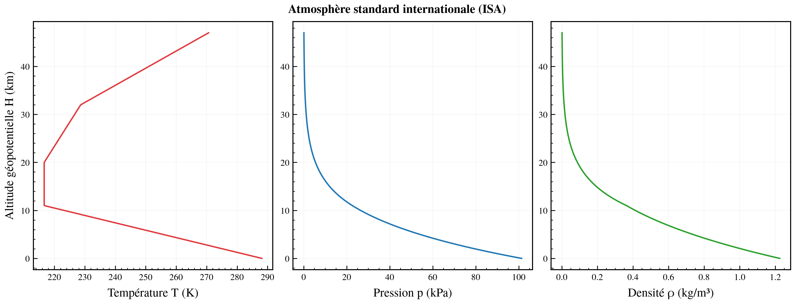

# Le modèle d'atmosphère

> Ce document décrit le **bloc atmosphère** de `cfd-atm` : ses entrées, ses sorties, et les
> équations qui les relient. La reconstruction des grandeurs de vitesse (Mach, Vc, EAS, TAS)
> fait l'objet du document séparé [`02_GRANDEURS_VITESSE.md`](02_GRANDEURS_VITESSE.md).

## 1. Le bloc et ses entrées/sorties

Le modèle se pense comme **un bloc** dans un schéma-bloc :

```
                      ┌─────────────────────────────────────┐
   altitude  ───────▶ │                                     │ ─────▶  p, T, ρ        (sortie fonctionnelle)
   (géom. / géopot.   │        MODÈLE D'ATMOSPHÈRE           │ ─────▶  a, μ, ν        (grandeurs dérivées)
    / pression)       │                                     │ ─────▶  θ, δ, σ        (ratios)
                      │   ISA | ISA±ΔT | profil T° custom    │
   choix du modèle ─▶ │                                     │ ─────▶  z, H, zp, zρ   (altitudes équivalentes,
                      └─────────────────────────────────────┘           sortie monitorable)
```

- **Entrée principale — une altitude.** Trois natures possibles, voir §3 :
  - `z`  — altitude **géométrique** (la hauteur réelle au-dessus du niveau mer) ;
  - `H`  — altitude **géopotentielle** (corrige la variation de `g` avec l'altitude) ;
  - `zp` — altitude-**pression** (celle que lit un altimètre calé au 1013,25 hPa).
- **Entrée secondaire — le modèle de température.** Trois familles, voir §4 :
  - `ISA` — atmosphère standard internationale ;
  - `ISA±ΔT` — standard décalée d'un écart de température constant (ex. `ISA+35`) ;
  - `CUSTOM` — un profil de température `T(H)` quelconque fourni par l'utilisateur.
- **Sortie fonctionnelle** — les conditions de l'air : pression `p`, température `T`, densité `ρ`.
- **Grandeurs dérivées** — vitesse du son `a`, viscosité dynamique `μ`, viscosité cinématique `ν`.
- **Ratios** (adimensionnés, très utilisés en mécanique du vol et en performances moteur) :
  `θ = T/T₀`, `δ = p/p₀`, `σ = ρ/ρ₀`.
- **Sortie monitorable** — les **altitudes équivalentes** : à partir de l'état atmosphérique,
  le bloc restitue les quatre altitudes `z`, `H`, `zp`, `zρ` qui correspondent au même point.

## 2. Constantes de référence

Toutes les constantes sont en unités **SI**. Le cœur du modèle ne connaît que le SI ; l'affichage
en unités aéronautiques (pieds, nœuds) est une couche de présentation séparée.

| Constante | Symbole | Valeur | Unité |
|---|---|---|---|
| Accélération de la pesanteur (référence) | `g₀` | 9,806 65 | m/s² |
| Constante spécifique de l'air sec | `R` | 287,052 87 | J/(kg·K) |
| Rapport des chaleurs spécifiques | `γ` | 1,4 | – |
| Rayon terrestre géopotentiel | `r` | 6 356 766 | m |
| Température niveau mer | `T₀` | 288,15 | K |
| Pression niveau mer | `p₀` | 101 325 | Pa |
| Densité niveau mer | `ρ₀` | 1,225 | kg/m³ |
| Vitesse du son niveau mer | `a₀` | 340,294 | m/s |

`a₀ = √(γ·R·T₀)` et `ρ₀ = p₀/(R·T₀)` sont **dérivées**, pas indépendantes.

Viscosité par la loi de **Sutherland** (air) : `μ₀ = 1,716×10⁻⁵ Pa·s`, `T_réf = 273,15 K`,
`S = 110,4 K`.

## 3. Les altitudes et leurs conversions

Quatre altitudes décrivent le **même** point ; elles ne coïncident qu'au niveau mer et sous ISA.

### 3.1 Géométrique ↔ géopotentielle

L'altitude géopotentielle absorbe la décroissance de la pesanteur avec l'altitude, ce qui permet
d'écrire l'équilibre hydrostatique avec un `g₀` constant. La relation est purement géométrique :

```
        r · z                     r · H
H = ───────────         z = ───────────
        r + z                     r − H
```

Aux altitudes aéronautiques l'écart reste petit (à 11 km, `H` est ≈ 19 m sous `z`) mais il n'est
pas négligeable pour un calcul soigné.

### 3.2 Altitude-pression `zp`

L'altitude-pression est **définie par la pression seule** : `zp` est l'altitude géopotentielle qui,
**dans l'atmosphère ISA**, produirait la pression mesurée `p`.

```
   p  ──(inversion de la loi ISA de pression)──▶  zp
```

C'est ce que lit un altimètre baro calé au QNE (1013,25 hPa). Point capital : `zp` ne dépend **que**
de `p`, jamais de la température réelle. Deux journées, l'une ISA l'autre ISA+35, à la même pression,
sont à la **même** altitude-pression mais à des altitudes géométriques différentes.

### 3.3 Altitude-densité `zρ`

Symétriquement, `zρ` est l'altitude ISA qui reproduirait la densité `ρ` mesurée :

```
   ρ  ──(inversion de la loi ISA de densité)──▶  zρ
```

C'est l'altitude « ressentie » par une hélice ou une aile — celle qui gouverne les performances.

## 4. Les modèles de température

### 4.1 ISA — l'atmosphère standard

L'ISA découpe l'atmosphère en **couches** définies sur l'altitude géopotentielle `H`. Chaque couche
possède une température de base `T_b`, un gradient thermique `L` (lapse rate) et une pression de
base `p_b` (chaînée depuis le niveau mer).



| # | `H_base` (m) | `T_base` (K) | Gradient `L` (K/km) | Nature |
|---|---|---|---|---|
| 0 | 0       | 288,15  | −6,5 | troposphère |
| 1 | 11 000  | 216,65  |  0,0 | tropopause (isotherme) |
| 2 | 20 000  | 216,65  | +1,0 | stratosphère 1 |
| 3 | 32 000  | 228,65  | +2,8 | stratosphère 2 |
| 4 | 47 000  | 270,65  |  0,0 | stratopause (isotherme) |
| 5 | 51 000  | 270,65  | −2,8 | mésosphère 1 |
| 6 | 71 000  | 214,65  | −2,0 | mésosphère 2 (→ 84 852 m) |

Dans une **couche à gradient** (`L ≠ 0`) :

```
   T(H) = T_b + L · (H − H_b)

                    ⎛  T(H) ⎞ ^(−g₀ / (L·R))
   p(H) = p_b · ⎜ ───── ⎟
                    ⎝  T_b  ⎠
```

Dans une **couche isotherme** (`L = 0`) :

```
                       ⎛   −g₀ · (H − H_b)  ⎞
   p(H) = p_b · exp ⎜ ──────────────── ⎟
                       ⎝      R · T_b       ⎠
```

et dans les deux cas la densité vient de la loi des gaz parfaits :

```
           p
   ρ = ─────────
         R · T
```

Ces formules sont **inversibles couche par couche**, ce qui donne directement `zp` (à partir de `p`)
et `zρ` (à partir de `ρ`) sans itération.

### 4.2 ISA±ΔT — l'écart standard

`ISA+ΔT` (par ex. `ISA+35`) est la convention aéronautique d'une atmosphère plus chaude ou plus
froide que le standard d'un **écart constant** `ΔT` :

```
   T(H) = T_ISA(H) + ΔT
```

> **Convention retenue — et pourquoi elle compte.** L'écart `ΔT` décale la **température**, mais
> **la pression reste la pression ISA** à altitude-pression donnée. C'est ce qui préserve le sens de
> `zp` : l'altimètre ne « sait » rien de la température, il ne lit que la pression. On a donc, à `zp`
> fixé : `p` inchangée, `T = T_ISA(zp) + ΔT`, puis `ρ = p/(R·T)` recalculée (donc `ρ` **diminue**
> quand `ΔT` augmente). Les grandeurs qui dépendent de la température (`a`, `TAS`, `zρ`) bougent ;
> celles qui ne dépendent que de la pression (`zp`, la relation Mach↔Vc) ne bougent pas. Cette
> distinction est le fil rouge du document [`02_GRANDEURS_VITESSE.md`](02_GRANDEURS_VITESSE.md).
>
> **`ΔT` est référencé à `zp`, pas à `H`.** C'est la convention aéronautique : la déviation ISA est
> *définie* par `ΔT = OAT − T_ISA(zp)`, où `T_ISA(zp)` se lit à l'**altitude-pression** (c'est sur
> `zp` que sont tabulées toutes les performances avion). Donc à l'entrée par `zp`, on lit la
> température **directement à `zp`** : `T = T_ISA(zp) + ΔT`. On **ne** repasse **pas** par l'altitude
> géopotentielle `H*` de la surface de pression (qui, pour une atmosphère chaude, est plus haute que
> `zp`) : lire `T_ISA(H*) + ΔT` donnerait une température plus froide de plusieurs kelvins (≈ 7 K à
> `ISA+35`, FL300). `H*` reste néanmoins restitué comme **altitude-monitorable** (hauteur physique de
> la surface de pression). Ceci distingue l'`ISA±ΔT` du profil **custom** (§4.3), qui est un vrai
> champ physique ancré à `H` et pour lequel `T` se lit bien à `H*`.
>
> **Attention à l'entrée choisie.** Ce qui précède vaut « à altitude-pression donnée ». Si l'on
> entre au contraire par l'altitude **géométrique** `z`, la pression n'est plus la pression ISA :
> comme pour un profil custom (§4.3), on **intègre l'équilibre hydrostatique** du profil `T_ISA+ΔT`.
> Une atmosphère plus chaude est moins dense, donc à `z` fixé sa pression décroît plus lentement et
> reste **plus élevée** que l'ISA. C'est précisément ce mécanisme que met en évidence le **diagramme
> A** de l'exemple.

### 4.3 CUSTOM — un profil de température quelconque

L'utilisateur fournit un profil `T(H)` arbitraire (fonction ou table interpolée linéairement — par
exemple une inversion de basse couche, ou une tropopause abaissée). Deux régimes selon l'entrée :

- **À altitude-pression `zp` donnée** (usage mécanique du vol) : `p` est fixée par `zp` (loi ISA).
  Contrairement à l'`ISA±ΔT`, un profil custom est un **vrai champ physique** en équilibre
  hydrostatique : on retrouve d'abord la hauteur géopotentielle `H*` où *ce* modèle atteint la
  pression `p` (inversion de sa propre loi de pression `p_model(H*) = p`), puis on lit `T = T(H*)`,
  et `ρ = p/(R·T)`. L'aller-retour `H → zp → H` est alors exact.
- **À altitude géométrique `z` donnée** (usage physique complet) : la pression n'est plus la pression
  ISA — il faut **intégrer l'équilibre hydrostatique** à travers le vrai profil de température :

```
   dp            g₀                              ⌠ H     g₀
   ──── = − ─────────── · p      ⟹    p(H) = p₀ · exp⎜ −  ─────────── dH′ ⎟
   dH         R · T(H)                              ⌡ 0   R · T(H′)
```

L'intégrale est évaluée **numériquement** (grille fine, cumul trapézoïdal — pas de dépendance SciPy,
comme le reste des sous-projets). C'est ce chemin `T° → p → ρ` qui rend le **diagramme A** du script
d'exemple sensible au modèle de température (voir [`02_GRANDEURS_VITESSE.md`](02_GRANDEURS_VITESSE.md) §6).

## 5. Grandeurs dérivées

Une fois `T`, `p`, `ρ` connues :

| Grandeur | Formule | Remarque |
|---|---|---|
| Vitesse du son | `a = √(γ · R · T)` | ne dépend que de `T` |
| Viscosité dynamique (Sutherland) | `μ = μ₀ · (T/T_réf)^{3/2} · (T_réf + S)/(T + S)` | ne dépend que de `T` |
| Viscosité cinématique | `ν = μ / ρ` | |
| Ratio de température | `θ = T / T₀` | |
| Ratio de pression | `δ = p / p₀` | |
| Ratio de densité | `σ = ρ / ρ₀` | `σ = δ / θ` |
| Reynolds linéique | `Re/L = ρ · V / μ` | nécessite une vitesse `V` |

## 6. Résumé du flux de calcul

```
   entrée : altitude + nature + modèle T°
        │
        ▼
   ┌──────────────┐   ISA / ISA±ΔT : formes fermées par couche
   │  T, p, ρ     │   CUSTOM(z)     : intégration hydrostatique numérique
   └──────┬───────┘
          │
          ├────────────▶  a, μ, ν, θ, δ, σ                (dérivées)
          │
          └────────────▶  z, H, zp, zρ                    (altitudes équivalentes)
                                │
                                └──▶  + une info vitesse  ⟶  Mach, Vc, EAS, TAS
                                          (voir 02_GRANDEURS_VITESSE.md)
```

## 7. Limites connues

- Modèle **sec** (pas d'humidité) et **standard** jusqu'à 84 852 m géopotentiels.
- À `zp` donnée, la pression = pression ISA (convention altimétrique). Pour l'`ISA±ΔT`, la
  température est référencée à `zp` (`T = T_ISA(zp) + ΔT`), conformément à la définition de la
  déviation ISA ; le couple `(p, T)` ainsi obtenu n'est donc pas en équilibre hydrostatique strict
  avec la hauteur géopotentielle restituée — c'est inhérent à la convention. Le chemin `CUSTOM(z)`
  fournit, lui, la pression physiquement cohérente du vrai profil.
- Interpolation **linéaire** des profils custom entre points de table.
