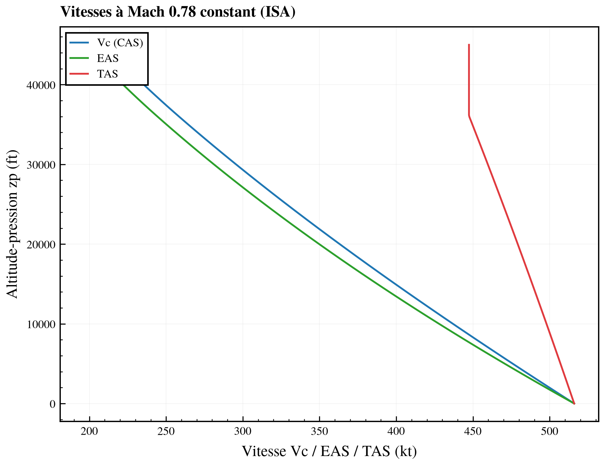

# Reconstruction des grandeurs de vitesse

> Ce document explique comment, à partir d'**une** information de vitesse et de l'état
> atmosphérique fourni par le [modèle d'atmosphère](01_MODELE_ATMOSPHERE.md), on reconstruit
> **toutes** les grandeurs de vitesse de la mécanique du vol — en **subsonique et supersonique**.

## 1. Les quatre vitesses

Un aéronef possède plusieurs « vitesses » qui ne coïncident qu'au niveau mer standard :

| Grandeur | Symbole | Ce que c'est |
|---|---|---|
| Nombre de **Mach** | `M` | `V_vraie / a` — le rapport à la vitesse du son locale |
| Vitesse **vraie** (True Airspeed) | `TAS` | la vitesse réelle de l'avion par rapport à l'air |
| Vitesse **conventionnelle** (Calibrated) | `Vc` / `CAS` | ce que lit l'anémomètre (badin), corrigé des erreurs d'instrument |
| Vitesse **équivalente** (Equivalent) | `EAS` | `TAS·√σ` — la vitesse qui donne la même pression dynamique au niveau mer |

`Vc` (aussi notée `CAS` ou `VC`) est la « vitesse conventionnelle » : elle se déduit uniquement de la
**pression d'impact** `qc` mesurée, via les constantes du **niveau mer**. C'est la grandeur pilote
(limites structurales, vitesses de manœuvre) car elle reflète la charge aérodynamique ressentie.

## 2. La pression d'impact `qc` — la charnière

Tout passe par la **pression d'impact** `qc = p_t − p` (pression totale moins pression statique)
mesurée par le tube de Pitot. Les conversions se font en deux temps :

```
   Vc  ◀──(constantes niveau mer)──▶  qc  ◀──(pression locale p)──▶  M  ──(a)──▶ TAS
                                                                       └────────▶ EAS
```

Le point subtil est que `qc ↔ Vc` utilise **toujours** les constantes du niveau mer (`p₀`, `a₀`),
tandis que `qc ↔ M` utilise la pression **locale** `p`. C'est de là que découle toute la §5.

### 2.1 Régime subsonique (M ≤ 1)

Écoulement compressible isentropique arrêté sur le Pitot (`γ = 1,4`, donc `(γ−1)/2 = 0,2`) :

```
              ⎡ ⎛        V² ⎞^3,5      ⎤
   qc = p · ⎢ ⎜ 1 + 0,2·──── ⎟     − 1 ⎥          avec  M = V/a
              ⎣ ⎝        a²  ⎠          ⎦
```

- **`qc` depuis `Vc`** : on prend `p = p₀`, `a = a₀` (niveau mer).
- **`qc` depuis `M`**  : on prend `p` et `a` **locales**  ⟺  `qc = p·[(1 + 0,2·M²)^3,5 − 1]`.

### 2.2 Régime supersonique (M > 1) — Rayleigh

Au-delà de M = 1 une onde de choc se forme devant le Pitot ; la relation isentropique ne vaut plus.
On utilise la formule du **tube de Pitot supersonique (Rayleigh)** :

```
   p_t         ⎛ (γ+1)·M² ⎞^{γ/(γ−1)}     ⎛     2γ            γ−1  ⎞^{−1/(γ−1)}
   ──── = ⎜ ──────── ⎟             · ⎜ ─────·M²  −  ──── ⎟
    p          ⎝    2      ⎠                 ⎝    γ+1           γ+1  ⎠
```

soit, avec `γ = 1,4` (exposants 3,5 et 2,5) :

```
   qc          (1,2·M²)^3,5
   ──── =  ─────────────────────────  −  1
    p        (1,166 67·M² − 0,166 67)^2,5
```

La bascule subso/superso se fait à M = 1 pour la relation `qc ↔ M` (pression locale), et à
`Vc = a₀` pour la relation `qc ↔ Vc` (constantes niveau mer).

## 3. Inverser `qc → M` et `qc → Vc`

- **Subsonique**, l'inversion est **analytique** :

```
             ⎡ ⎛  qc      ⎞^{1/3,5}       ⎤
   M = √ ⎢ 5·⎜ ──── + 1 ⎟         − 5 ⎥          (idem pour Vc avec p₀, a₀)
             ⎣ ⎝  p        ⎠              ⎦
```

- **Supersonique**, la formule de Rayleigh n'est pas inversible en forme fermée : on résout
  `f(M) = qc/p` par **Newton amorti, replié sur une bisection** garantie sur `[1, 30]` (aucune
  dépendance SciPy, cohérent avec le reste des sous-projets). Le solveur choisit automatiquement la
  branche subso ou superso selon que `qc/p` est en-deçà ou au-delà de la valeur à M = 1.

## 4. Reconstruire TAS et EAS

Une fois `M` connu et l'état atmosphérique disponible :

```
   TAS = M · a = M · √(γ · R · T)                     (dépend de la température !)

   EAS = TAS · √σ = TAS · √(ρ/ρ₀) = a₀ · M · √(p/p₀)   (ne dépend que de la pression)
```

La dernière égalité vient de `ρ·a² = γ·p` : `EAS = √(γ·p/ρ₀)·M = a₀·M·√(p/p₀)`. Elle est
pratique car elle montre que **EAS, comme Vc, ne dépend que de la pression** (à `M` fixé), alors que
**TAS dépend explicitement de la température** via `a`.

Le helper `airspeeds(state, mach=… | cas=… | tas=… | eas=…)` accepte **n'importe laquelle** des
quatre grandeurs en entrée et restitue les trois autres + la pression dynamique
`q = ½·ρ·TAS²`.



À Mach constant, la TAS reste élevée (constante au-dessus de la tropopause, où `a` ne varie plus)
tandis que Vc et EAS chutent avec l'altitude ; les trois coïncident au niveau mer.

## 5. La subtilité centrale : Mach ↔ Vc ne dépend pas de la température

C'est le résultat à retenir, et la raison d'être des deux diagrammes de l'exemple :

```
   Vc  ──(p₀,a₀ : niveau mer)──▶  qc  ──(p locale)──▶  M
        \_______________________________________________/
                     aucune température n'intervient
```

À **altitude-pression `zp` fixée**, la pression `p` est fixée (par définition de `zp`). Donc :

- la relation **`Vc ↔ M`** est **entièrement déterminée par `p`** — la température n'y entre pas ;
- une courbe **iso-Vc** sur un plan **Mach–zp** est donc **la même** sous ISA, ISA+35 ou T° custom :
  les trois modèles donnent des courbes iso-Vc **strictement superposées** ;
- en revanche **`TAS` dépend de `T`** (`TAS = M·√(γRT)`) : les courbes **iso-TAS**, elles,
  **se séparent** selon le modèle de température.

| Grandeur (à `M` fixé) | Dépend de `p` ? | Dépend de `T` ? | iso-courbe sur Mach–zp |
|---|---|---|---|
| `Vc` (CAS) | oui | **non** | invariante avec le modèle T° |
| `EAS` | oui | **non** | invariante avec le modèle T° |
| `TAS` | oui (via a₀√(p/p₀)) | **oui** | se déplace avec le modèle T° |

## 6. Application : les deux diagrammes de l'exemple

Le script [`01_EXEMPLE/tracer_iso_vitesses.py`](../01_EXEMPLE/tracer_iso_vitesses.py) matérialise
cette subtilité en traçant **deux** diagrammes complémentaires.

### 6.1 Diagramme A — iso-Vc sur Mach vs altitude **géométrique** `z`

Pour rendre l'effet de la température **visible**, on change d'axe vertical : on prend l'altitude
**géométrique** `z`. Le chemin de calcul devient sensible au modèle :

```
   (M, z)  ──▶  p = p_modèle(z)   [ISA : loi ISA ; ISA±ΔT / custom : intégration hydrostatique]
                    │
                    └──▶  Vc = Vc(qc(M, p))
```

Comme `p(z)` dépend du profil de température (via l'équilibre hydrostatique, cf.
[`01_MODELE_ATMOSPHERE.md`](01_MODELE_ATMOSPHERE.md) §4.3), les familles d'iso-Vc des modèles
ISA / ISA+35 / ISA−35 / custom **divergent** nettement en altitude. C'est le diagramme qui illustre
« combien » la température déplace l'enveloppe.

### 6.2 Diagramme B — iso-Vc + iso-TAS sur Mach–`zp`

Sur l'axe altitude-**pression** classique, on superpose :

- les **iso-Vc**, tracées **une seule fois** (elles sont T°-invariantes, §5) ;
- les **iso-TAS**, tracées pour les **trois** modèles (ISA / ISA±35), qui **se séparent**.

Ce diagramme démontre directement le tableau du §5 : les iso-Vc ne bougent pas, seules les iso-TAS
répondent au modèle de température.

## 7. Conventions d'unités

Le **cœur** de `cfd-atm` travaille exclusivement en **SI** (m, m/s, Pa, K). L'**affichage** (rapport
CLI, axes des figures) privilégie les **conventions aéronautiques** — altitude en **pieds (ft)**,
vitesses en **nœuds (kt)**, `M` sans dimension — avec la **conversion SI** rappelée en regard
(1 ft = 0,3048 m, 1 kt = 0,514 444 m/s). Les fonctions de conversion vivent dans
`src/cfd_atm/report/units.py`.
