# cfd-dispersion

Lois de dispersion, tirage Monte-Carlo, validation et polaires dispersées —
bâti sur [OpenTURNS](https://openturns.github.io/).

Vous décrivez vos coefficients par une **table de lois**. Le paquet en tire des
réalisations à passer à votre modèle, vérifie que le modèle a bien tiré ce que
vous lui demandiez, et superpose la dispersion sur les polaires que le framework
produit déjà.

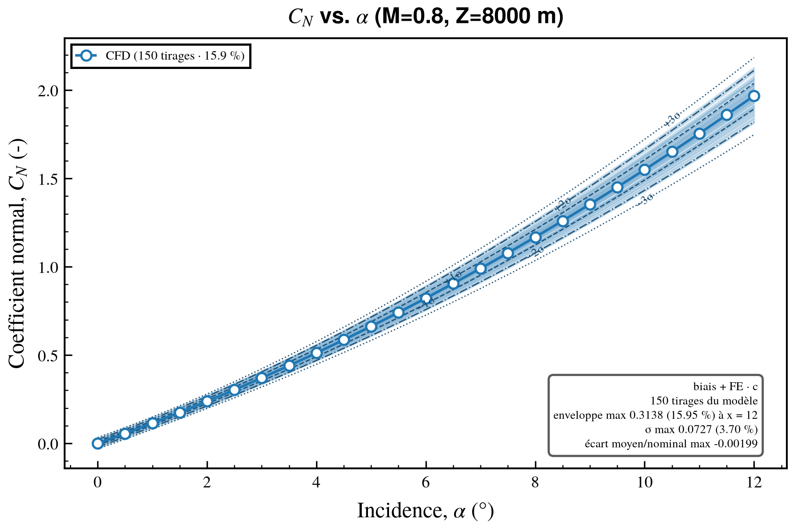

*Cette figure n'est pas une illustration reconstituée : c'est une sortie de
`cfd_plot.batch_plot` avec une seule ligne en plus,
`on_before_save=hook_dispersion(lois, serie="CFD", tirages=tirages)`.*

---

## Sommaire

- [Ce que fait le paquet](#ce-que-fait-le-paquet)
- [Installation](#installation)
- [Prise en main en cinq minutes](#prise-en-main-en-cinq-minutes)
- [Les données que vous fournissez](#les-données-que-vous-fournissez)
  - [1. La table de lois](#1-la-table-de-lois)
  - [2. Ce que reçoit votre modèle](#2-ce-que-reçoit-votre-modèle)
  - [3. Ce que votre modèle doit rendre](#3-ce-que-votre-modèle-doit-rendre)
- [Guide d'utilisation](#guide-dutilisation)
  - [1. Charger et tirer](#1-charger-et-tirer)
  - [2. Reconstruire : les conventions](#2-reconstruire--les-conventions)
  - [3. La loi du coefficient dispersé](#3-la-loi-du-coefficient-dispersé)
  - [4. Parcourir les points de vol](#4-parcourir-les-points-de-vol)
  - [5. Valider mille appels du modèle](#5-valider-mille-appels-du-modèle)
  - [6. Synthétiser, et ne tracer que les rejets](#6-synthétiser-et-ne-tracer-que-les-rejets)
  - [7. Propager le long d'un balayage](#7-propager-le-long-dun-balayage)
  - [8. La polaire dispersée](#8-la-polaire-dispersée)
  - [9. La greffe sur `batch_plot`](#9-la-greffe-sur-batch_plot)
  - [10. Corréler deux coefficients](#10-corréler-deux-coefficients)
  - [11. La ligne de commande](#11-la-ligne-de-commande)
  - [12. Les figures, et leur format](#12-les-figures-et-leur-format)
  - [13. Les erreurs](#13-les-erreurs)
- [Recettes](#recettes)
- [Référence de l'API publique](#référence-de-lapi-publique)
- [Limites du modèle](#limites-du-modèle)
- [Documentation](#documentation)
- [Structure](#structure)
- [Vérification](#vérification)

---

## Ce que fait le paquet

Trois questions, dans l'ordre où elles se posent.

| | la question | ce qu'on écrit |
|:--|:--|:--|
| **1** | Qu'est-ce qu'un tirage de mes lois, et que devient mon coefficient ? | `tirer(lois)` → `figure_tirage(...)` |
| **2** | Après mille appels du modèle, le tirage réalisé suit-il la loi prescrite ? | `valider_lot(resultats, lois, par=…)` |
| **3** | À quoi ressemble ma polaire une fois dispersée ? | `superposer_dispersion(...)`, ou le hook sur `batch_plot` |

Et un fil rouge : **`ET` est une demi-étendue, pas un écart-type**. Pour les
familles gaussiennes, `σ = ET/2`. Une table écrite en écarts-types et lue ici
donne des dispersions deux fois trop larges, ce qui reste parfaitement crédible
à l'œil. C'est l'erreur la plus coûteuse que le modèle permette, et la raison
d'être de la validation.

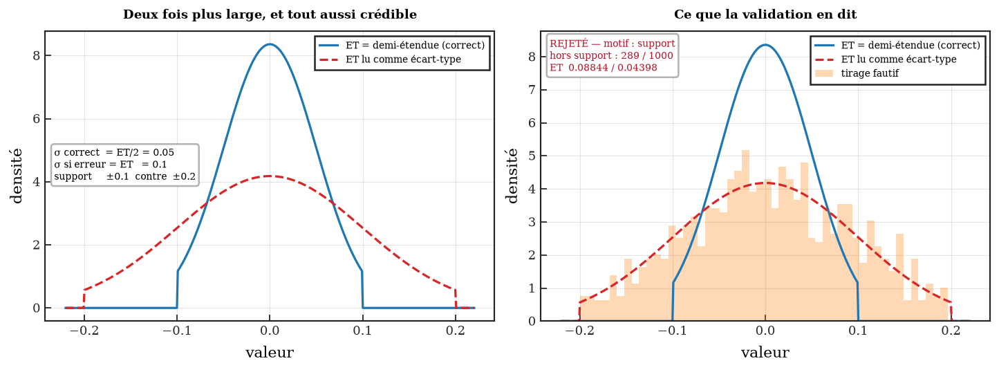

À gauche, deux densités : rien ne dit laquelle est la bonne. À droite, le tirage
fautif confronté à la loi demandée — 289 points sur 1000 tombent hors du support
prescrit, et la validation le dit sans ambiguïté.

---

## Installation

```bash
cd tools/cfd-dispersion
pip install -e ".[dev]"
pip install -e ../cfd-plot        # requis pour toutes les figures
```

Python ≥ 3.9. Dépendances : `openturns`, `numpy`, `matplotlib`, `pandas`,
`rich`, `pyyaml`. Pas de SciPy.

**Le calcul tourne sans cfd-plot ; les figures, non.** Lois, tirage, validation
et synthèse chiffrée n'ont besoin de rien d'autre. Tout ce qui se dessine passe
en revanche par [`cfd-plot`](../cfd-plot), qui définit le format du framework —
police, tailles, marges, palette, gabarit d'export. Une figure de dispersion
tracée en Matplotlib nu serait juste, et détonnerait au milieu d'un dossier.
`cfd-plot` étant un paquet frère de ce dépôt et non une publication PyPI, il ne
peut pas figurer dans les dépendances : il s'installe à la main, et son absence
donne un `ImportError` qui nomme la commande.

> **Calculateur isolé.** La roue OpenTURNS est marquée `cp39-abi3` /
> `manylinux_2_28` : elle s'installe donc sur RHEL 8 / Rocky 8 (glibc 2.28),
> mais elle pèse 63 Mo. Sur une machine sans réseau, il faut qu'elle soit déjà
> dans le cache de roues.

---

## Prise en main en cinq minutes

L'exemple livré fait tourner les quatre cas d'usage sur un modèle jouet :

```bash
cfd-dispersion exemple /tmp/ex && cd /tmp/ex && bash RUN_EXEMPLE.sh
```

Il écrit dans `SORTIE/` les figures de tirage, le damier de validation, les
polaires dispersées via `batch_plot`, et les CSV intermédiaires. Voir
[`01_EXEMPLE/README.md`](src/cfd_dispersion/01_EXEMPLE/README.md) pour ce que
chaque script montre et ce qu'il faut y regarder.

En Python, l'enchaînement complet tient en quinze lignes :

```python
from cfd_dispersion import charger_lois, tirer, valider_lot, pdv_rejetes

# 1. la table de lois — six clés par coefficient
lois = charger_lois(
    {
        "Cm_alpha": {
            "Biais_Type": 5,
            "Biais_M": 0.0,
            "Biais_ET": 0.015,
            "FE_Type": 4,
            "FE_M": 1.0,
            "FE_ET": 0.10,
        },
    }
)

# 2. un tirage : c'est le DICT_DISP_DRAWN que votre modèle attend
tirage = tirer(lois, graine=42)
tirage["Cm_alpha"]["Biais"]  # -> un flottant
tirage.appliquer({"Cm_alpha": -2.5})  # -> le coefficient dispersé

# 3. mille appels du modèle plus tard, un verdict par (point de vol × composante)
verdicts = valider_lot(resultats, lois, par=("Mach", "Altitude_m"))
pdv_rejetes(verdicts)  # -> [{"Mach": 0.85, "Altitude_m": 10000.0}]
```

---

## Les données que vous fournissez

Trois objets, et vous n'en écrivez que deux : la table de lois, et le modèle.

```
DICT_DISP_LAWS            ->  JeuDeLois        ->  Tirage            ->  DataFrame
{coeff: {Biais_*, FE_*}}      charger_lois()       tirer()               votre modèle
ce que vous écrivez           les lois            {coeff: {Biais, FE}}  ce qu'il rend
```

Et si votre modèle croise des listes d'axes puis rend un tableau large — points
de vol, coefficients, métadonnées, plus les dictionnaires `DICT_LAW_DISPERSION`
et `DICT_TIRAGE` —, le branchement tient en deux lignes :

```python
from cfd_dispersion import plan_croise, lire_sortie_modele

pdv = plan_croise(Mach=L_MACH, Altitude_m=L_ALTITUDE, alpha=L_ALPHA)
df = mon_modele(pdv, DICT_LAW_DISPERSION, ...)

resultats, lois = lire_sortie_modele(df)  # aplatit, numérote, relit les lois
```

### 1. La table de lois

Un dictionnaire Python, ou le même en YAML. **Une entrée par coefficient, six
clés chacune** — les noms sont exacts :

```python
DICT_DISP_LAWS = {
    "CN": {
        "Biais_Type": 5,  # la famille du biais, entier 1..6
        "Biais_M": 0.0,  # sa moyenne
        "Biais_ET": 0.02,  # sa DEMI-ÉTENDUE (σ = ET/2), pas son écart-type
        "FE_Type": 6,  # idem pour le facteur d'échelle
        "FE_M": 1.0,  #   1 est le facteur neutre de la convention par défaut
        "FE_ET": 0.08,
    },
}
```

Les six familles :

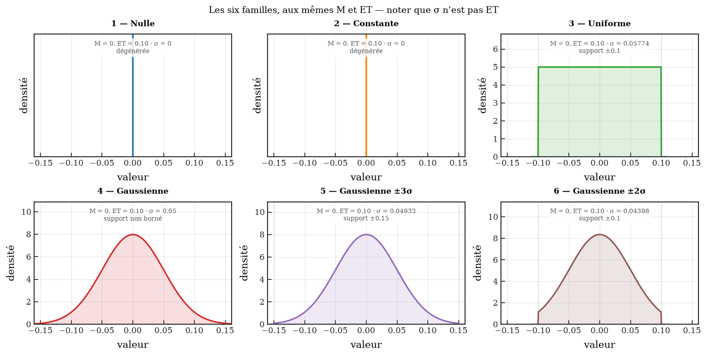

| type | libellé | OpenTURNS | support | écart-type réel |
|:--:|:--|:--|:--|:--|
| 1 | Nulle | `Dirac(0)` | {0} | 0 |
| 2 | Constante | `Dirac(M)` | {M} | 0 |
| 3 | Uniforme | `Uniform(M−ET, M+ET)` | M ± ET | 0.577·ET |
| 4 | Gaussienne | `Normal(M, ET/2)` | non borné | ET/2 |
| 5 | Gaussienne ±3σ | `TruncatedNormal(M, ET/2, M±1.5·ET)` | M ± 1.5·ET | 0.4933·ET |
| 6 | Gaussienne ±2σ | `TruncatedNormal(M, ET/2, M±1.0·ET)` | M ± 1.0·ET | 0.4398·ET |

Noter la dernière colonne. Au type 6, l'écart-type **réel** vaut 88 % de `ET/2` :
la troncature resserre la loi. C'est pourquoi la validation compare aux moments
exacts d'OpenTURNS et non aux paramètres — sans quoi elle rejetterait des
tirages parfaitement corrects.

Le même en YAML, avec la corrélation en option :

```yaml
lois:
  CN:
    Biais_Type: 5
    Biais_M: 0.0
    Biais_ET: 0.02
    FE_Type: 6
    FE_M: 1.0
    FE_ET: 0.08
correlation:
  "CN, Cm_alpha": 0.6
```

```python
lois = charger_lois(DICT_DISP_LAWS)  # ou
lois = charger_lois_yaml("LOIS.yaml")
```

### 2. Ce que reçoit votre modèle

`Tirage` **est** un `Mapping` : c'est le `DICT_DISP_DRAWN` attendu, utilisable
tel quel, sans conversion.

```python
tirage = tirer(lois, graine=42)

tirage["CN"]["Biais"]  # -> float
tirage["CN"]["FE"]  # -> float
dict(tirage)  # -> {"CN": {"Biais": …, "FE": …}, …}, si vous préférez
```

Il porte en plus ce qu'un dictionnaire nu ne peut pas porter : `.appliquer`, la
convention employée, la graine et le plan d'échantillonnage — qui finissent dans
les boîtes de paramètres des figures, pour qu'aucune ne puisse cacher la
dispersion qui l'a produite.

### 3. Ce que votre modèle doit rendre

**C'est le seul point d'accroche du paquet**, et il tient en un tableau de noms
de colonnes. Un tableau à plat, une ligne par (point de vol × tirage) :

| colonne | obligatoire | contenu |
|:--|:--:|:--|
| `<coefficient>_Biais` | **oui** | le biais tiré, tel qu'il a servi |
| `<coefficient>_FE` | **oui** | le facteur d'échelle tiré |
| `<coefficient>` | pour le panneau de reconstruction | le coefficient dispersé obtenu |
| les clés de point de vol | si `par=` | `Mach`, `Altitude_m`, … |
| `tirage` | pratique | le numéro d'appel |

C'est exactement ce que `tableau_des_tirages` produit à partir de votre lot (ou
`tirer_tableau` directement) : en partant de lui, il n'y a rien à faire.
`lois.colonnes` énumère les noms attendus.

Si votre modèle nomme ses colonnes autrement, ne renommez pas le tableau —
donnez la correspondance :

```python
valider_lot(
    resultats, lois, par=("Mach",), colonnes={("CN", "Biais"): "bias_CN", ("CN", "FE"): "scale_CN"}
)
```

**Ou bien votre modèle rend un tableau large**, ce qui est la forme habituelle
d'un modèle d'établissement : une ligne par (tirage × point croisé), portant le
point de vol, les coefficients, autant de métadonnées qu'on veut, et les
dictionnaires eux-mêmes.

| colonne | contenu |
|:--|:--|
| `Mach`, `Altitude_m`, `alpha`, … | le point croisé |
| `CN`, `CA`, `Cm_alpha`, … | les coefficients rendus par le solveur |
| `version_solveur`, `convergence`, … | vos métadonnées, en nombre libre |
| `DICT_LAW_DISPERSION` | la table de lois de l'étude |
| `DICT_TIRAGE` | le tirage appliqué à cette ligne |

```python
resultats, lois = lire_sortie_modele(df)
```

Cette ligne étale `DICT_TIRAGE` en colonnes `<coeff>_Biais` / `<coeff>_FE`,
**numérote les tirages distincts** dans une colonne `tirage`, et relit les lois
depuis le tableau — personne n'a à redonner le YAML de l'époque. Les métadonnées
voyagent intactes, le paquet ne lisant que les colonnes qu'il nomme, et un
aller-retour par CSV ne casse rien : les dictionnaires en reviennent en chaînes,
JSON ou `repr` Python, et les deux sont relus.

> **Le piège du croisement.** Un appel croisé applique le **même tirage à tous
> les points du balayage** : sur sept incidences, chaque valeur tirée apparaît
> sept fois. La valider telle quelle ne change pas la statistique *D* mais
> multiplie l'effectif par sept, resserre le seuil de √7 et rejette des tirages
> corrects — 500 tirages conformes passent à p = 0.61 et sont rejetés à
> p = 8·10⁻⁷ une fois croisés sur treize points. D'où `unique_par=("tirage",)`
> sur `valider_lot` et `figures_par_pdv`. L'oubli n'est pas silencieux : la
> validation refuse un groupe massivement redondant en nommant le remède.

Le squelette complet de la boucle d'appels, dans les deux formes, est dans
[00_DOC/05 §5.3](00_DOC/05_BRANCHER_SON_MODELE.md#53-votre-fonction-modèle) ;
`01_EXEMPLE/modele.py` en est la version exécutable, et
`01_EXEMPLE/05_modele_croise.py` la chaîne complète sur un modèle croisé.

---

## Guide d'utilisation

### 1. Charger et tirer

```python
charger_lois(table, *, correlation=None) -> JeuDeLois
charger_lois_yaml(chemin, *, correlation=None) -> JeuDeLois

tirer(lois, *, graine=None, convention_=None, methode="mc") -> Tirage
tirer_lot(lois, n, *, graine=None, convention_=None, methode="mc") -> list[Tirage]

tableau_des_tirages(tirages) -> pd.DataFrame      # le même lot, à plat
tirer_tableau(lois, n, ...) -> pd.DataFrame       # les deux d'un coup
```

`tirer_lot` rend la **liste** des tirages, dans la forme qu'un modèle
consomme — chaque élément est un `Mapping` `{coeff: {"Biais": …, "FE": …}}` :

```python
for tirage in tirer_lot(lois, 1000, graine=42, methode="lhs"):
    resultats.append(mon_modele(L_MACH, L_ALPHA, tirage))  # tirage = DICT_DISP_DRAWN
```

C'est la même chose qu'une boucle `tirer(lois, graine=graine + i)`, à une
différence près : le lot est tiré **d'un coup**, seule façon d'honorer une
corrélation déclarée et seule où `"lhs"` et `"sobol"` apportent quelque chose —
ce qu'ils améliorent est le remplissage conjoint, qui n'existe pas à l'échelle
d'un tirage isolé. Chaque tirage porte son `numero` dans le lot, la `graine` du
lot et le plan employé.

`methode` vaut `"mc"`, `"lhs"` ou `"sobol"`. Le tirage passe par la loi
**jointe** de toutes les composantes : c'est la seule façon d'honorer une
corrélation déclarée, et la seule où LHS et Sobol apportent quelque chose — ce
qu'ils améliorent est le remplissage conjoint.

**La reproductibilité est globale.** OpenTURNS n'a pas de générateur par appel :
il n'y a donc pas de `rng=` ici, mais un `graine=`. L'état antérieur du
générateur est restauré après chaque tirage, si bien qu'un `graine=` ne coûte
jamais la reproductibilité de l'appelant.

Une `LoiDispersion` porte `distribution`, `pdf`, `cdf`, `quantile`, `tirer`,
`support`, `plage_utile`, `M_theorique`, `ET_theorique`, `sigma_nominal`,
`est_degeneree`, `est_bornee`, `label`.

La figure du tirage, trois panneaux par coefficient :

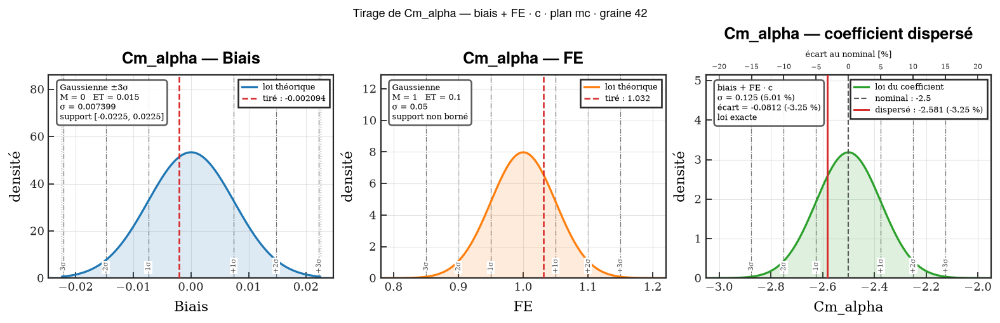

```python
rendue = figure_tirage(
    "CN", lois["CN"], tirage, nominal=0.85, chemin=sortie / "tirage_CN"
)  # -> tirage_CN.svg
pages = figure_tirage_matrice(
    lois, tirage, nominaux=NOMINAUX, chemin=sortie / "tirage"
)  # -> tirage_01.svg, …

rendue.figure, rendue.axes, rendue.fichiers  # la figure, ses axes, ses fichiers
```

**Tracer et écrire ne font qu'un appel.** `chemin=` — sans extension — suffit :
le fichier part en **SVG**, par le gabarit d'export de cfd-plot. Sans `chemin`,
rien n'est écrit et `rendue.fichiers` est vide.

**Le coefficient que le modèle a rendu se confronte au calcul.**
`disperse_modele=` donne la valeur que votre modèle a produite pour ce tirage ;
la figure la repère à côté de celle qu'elle recalcule
(`convention(nominal, biais, FE)`) et **dit si les deux concordent**. Elles
doivent tomber sur le même nombre : quand elles n'y tombent pas, c'est une
convention différente de part et d'autre, une valeur nominale de référence qui
n'est pas celle qu'a vue le modèle, ou un modèle qui n'applique pas la
dispersion là où on croit. C'est le seul contrôle du paquet qui porte sur le
**modèle**, et il ne coûte rien puisque les deux nombres sont là.

**`nominal` est facultatif.** Sans lui — vous ne l'avez pas encore, ou il ne
vous intéresse pas — les deux panneaux de composantes sont tracés normalement et
le troisième reste vide **en disant ce qui lui manque** : la loi du coefficient
dispersé se calcule en un point, le facteur d'échelle multipliant le nominal.
`nominaux` peut de même être omis ou incomplet ; chaque coefficient est traité
pour lui-même.

**Quatre coefficients par figure au plus** (`MAX_COEFFICIENTS_PAR_FIGURE`).
Au-delà, `figure_tirage_matrice` passe à la figure suivante plutôt que de
rétrécir des panneaux jusqu'à l'illisible, et numérote les fichiers
`_01`, `_02`… d'elle-même. Elle rend donc une **liste** de pages.

Chaque panneau porte ses lignes **±1/2/3 σ** (`cfd_plot.add_reference_lines`),
σ étant l'écart-type *exact* de la loi — celui d'une tronquée vaut moins que
`ET/2`.

Le troisième panneau est celui qui compte : c'est la **loi du coefficient
dispersé**, biais et facteur d'échelle combinés par la relation de
reconstruction. Pas un histogramme — une densité calculée (voir
[§3](#3-la-loi-du-coefficient-dispersé)) — le nominal et la valeur tirée
repérés, et un axe supérieur gradué en **pourcentage d'écart au nominal**, qui
est la façon dont une dispersion se lit.

### 2. Reconstruire : les conventions

Le tirage rend deux nombres par coefficient. Il ne dit pas comment les
recombiner avec la valeur nominale — or la relation varie d'une équipe à
l'autre, et deux d'entre elles diffèrent d'un facteur 100.

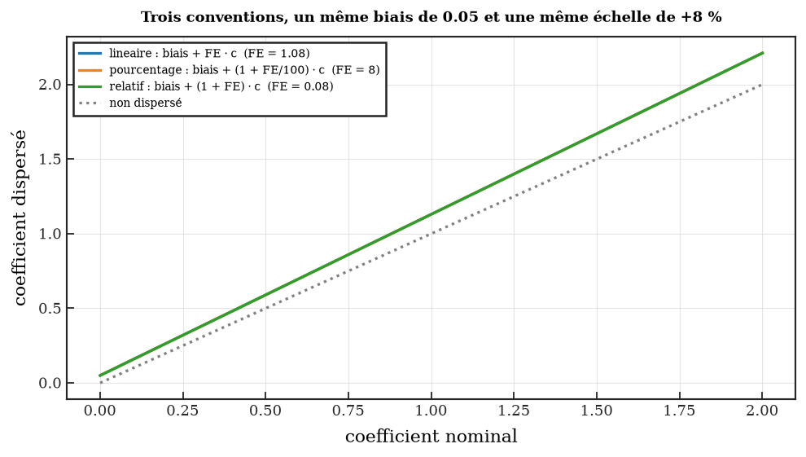

| nom | relation | FE neutre |
|:--|:--|:--:|
| `lineaire` *(défaut)* | `biais + FE · c` | 1 |
| `pourcentage` | `biais + (1 + FE/100) · c` | 0 |
| `relatif` | `biais + (1 + FE) · c` | 0 |

Rien dans une figure ne trahit qu'on s'est trompé de convention : la courbe
reste lisse et l'ordre de grandeur reste crédible. La relation est donc un objet
à part entière, qui **porte sa formule en clair**, imprimée dans chaque boîte de
paramètres.

```python
tirage.appliquer(NOMINAUX, convention_="pourcentage")


def ma_relation(c, biais, fe):  # de niveau module : voir §7
    return biais + fe * c * (1 + c**2)


MAISON = Convention(nom="maison", formule="biais + FE · c · (1 + c²)", appliquer=ma_relation)
```

### 3. La loi du coefficient dispersé

```python
loi_combinee(lois["CN"], nominal, *, convention_=None, n=20_000) -> LoiCombinee
```

La question posée n'est pas « comment se répartit le biais » mais **comment se
répartit le coefficient**. Deux chemins, essayés dans cet ordre :

| | quand | comment |
|:--|:--|:--|
| **exact** | la relation est affine en (biais, FE) à nominal fixé — les trois conventions livrées, et toute relation `biais + f(c)·FE` | `ot.LinearCombinationDistribution` : loi exacte de `a·biais + b·FE + cst`, quelles que soient les familles |
| **lissé** | relation maison non affine | 20 000 tirages LHS passés dans la relation, densité estimée par noyau (`ot.KernelSmoothing`) |

L'affinité n'est pas supposée, elle est **mesurée** : la relation est évaluée en
trois points pour en extraire `(a, b, cst)`, puis en trois autres pour vérifier
qu'elle s'y superpose. Une relation non affine bascule donc sur le lissage au
lieu de produire une loi « exacte » exactement fausse. La figure dit toujours
lequel des deux chemins elle montre.

```python
combinee = loi_combinee(lois["CN"], 0.85)
combinee.M_theorique, combinee.ET_theorique  # les moments du coefficient dispersé
combinee.pourcent(0.87)  # +2.35 (%), None si le nominal est nul
combinee.bornes()  # le support, ou None s'il est infini
combinee.exacte, combinee.methode  # True, "loi exacte (combinaison linéaire)"
```

Une loi combinée n'existe qu'**en un point** : le facteur d'échelle multiplie le
nominal, donc la dispersion absolue du coefficient change le long d'un balayage.
Passer tout un balayage à `figure_tirage` est admis — le panneau en choisit un
point (le milieu, ou celui que désigne `reference=`) et écrit lequel.

### 4. Parcourir les points de vol

Votre modèle rend un tableau de 400 lignes — 4 points de vol × 100 tirages — et
les figures du tirage parlent d'**un** tirage. Entre les deux :

```python
from cfd_dispersion import figures_tirage_par_pdv

inventaire = figures_tirage_par_pdv(
    df,
    points_de_vol={  # la forme du flight_point_dict
        "Mach": {"values": [0.70, 0.85], "label": "M", "save_name": "M"},
        "Altitude_m": {"values": [0, 10_000], "label": "Z", "save_name": "Z", "unit": " m"},
    },
    racine=sortie / "TIRAGES",
    max_tirages=15,  # par point de vol
    n_jobs=-1,  # une figure coûte une demi-seconde
)
```

```
TIRAGES/M_0.7/Z_0/tirage_000/CN.svg        les trois panneaux d'un coefficient
TIRAGES/M_0.7/Z_0/tirage_000/matrice.svg   les coefficients empilés
```

Un dossier par clé **qui varie**, le point de vol rappelé dans le titre de
chaque figure — un SVG se transmet seul — et en retour l'**inventaire** : une
ligne par fichier écrit, avec son point de vol, son tirage et sa figure. Les
figures sont fermées au fur et à mesure ; un parcours en écrit des centaines.

| | |
|:--|:--|
| **15 tirages par point de vol** | quatre cents figures par coefficient, personne ne les regarde. `max_tirages=None` les prend toutes |
| **la valeur nominale vient de `reference=`** | la sortie du **même modèle**, tourné une fois avec un tirage neutre (`tirage_neutre`) : ses coefficients *sont* les nominaux. À défaut, `nominaux=` ou une colonne `<coeff>_nominal`. Sans elle, le troisième panneau le dit |
| **la colonne `<coeff>` est la sortie dispersée** | pas un nominal. Le paquet recalcule `convention(nominal, biais, FE)` et confronte les deux ; le verdict est sur la figure et dans l'inventaire (`calcul`, `modele`, `ecart`, `accord`) |
| **lois et sorties peuvent différer** | la table de lois disperse ce que le modèle *consomme*, le tableau rend ce qu'il *produit*. Un `CX0` interne garde ses deux premiers panneaux et un troisième qui dit ce qui lui manque ; un `CA` rendu sans loi n'est pas tracé, et le demander est refusé en le nommant |
| **une figure coûte 0.5 s** | la police du gabarit est vectorisée glyphe par glyphe. 240 fichiers : une minute sur tous les cœurs, quatre en séquence |

**Pourquoi pas `batch_plot` directement ?** Son point de greffe
`on_before_save(fig, ax, context)` arrive sur une figure qu'il a **déjà
construite** : un axe, une courbe par source, un balayage en abscisse. Les
figures de tirage n'ont ni balayage, ni courbe, ni axe unique. C'est donc sa
*logique de parcours* qui est reprise — le `flight_point_dict` et
l'arborescence — et non la fonction. Pour les polaires dispersées, c'est bien
`batch_plot` qui trace : voir §9.

**La base de référence** est un second tableau, de même structure, obtenu en
faisant tourner le modèle une fois avec un tirage neutre :

```python
from cfd_dispersion import tirage_neutre

neutre = tirage_neutre(lois)  # {'CN': {'Biais': 0.0, 'FE': 1.0}}
df_neutre = mon_modele(L_MACH, L_ALTITUDE, neutre)
```

Le facteur neutre **dépend de la convention** — `FE = 1` pour `biais + FE · c`,
`FE = 0` pour `biais + (1 + FE/100) · c` — et `tirage_neutre` le résout depuis
la relation plutôt que de le coder en dur : se tromper d'un ou de zéro donnerait
une base de référence nulle ou doublée, et toute l'étude avec.

Un exemple de tableau de sortie est livré, écrit en dur :
`01_EXEMPLE/sortie_modele.py` (4 points de vol × 100 tirages, les deux
dictionnaires, les métadonnées, plus `sortie_modele_reference()` pour la base
neutre), et `01_EXEMPLE/06_tirages_par_pdv.py` en fait le parcours complet.

### 5. Valider mille appels du modèle

```python
valider(echantillon, loi, *, alpha=0.05, tol_M=0.10, tol_ET=0.10, n_min=20) -> Verdict
valider_lot(df, lois, *, par=(), correction="sidak", ...) -> pd.DataFrame
```

Trois contrôles, dans cet ordre, parce qu'ils échouent pour des raisons
différentes et que le `motif` doit dire laquelle :

1. **support** — un point hors bornes est rédhibitoire. Attrape la loi tronquée
   tirée comme une gaussienne pleine, que Kolmogorov–Smirnov valide (p = 0.13).
2. **moments** — contre les valeurs exactes d'OpenTURNS, pas contre `ET/2`.
3. **Kolmogorov–Smirnov** — attrape ce que les moments laissent passer : une loi
   bimodale de mêmes moments et même support est rejetée à p ≈ 10⁻²³⁵.

Motifs possibles : `effectif`, `support`, `moyenne`, `écart-type`, `forme`.

Un cas conforme, puis le même coefficient avec un `ET` doublé :

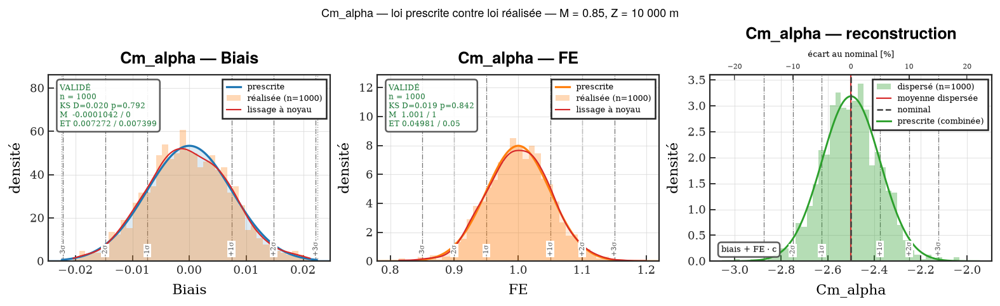

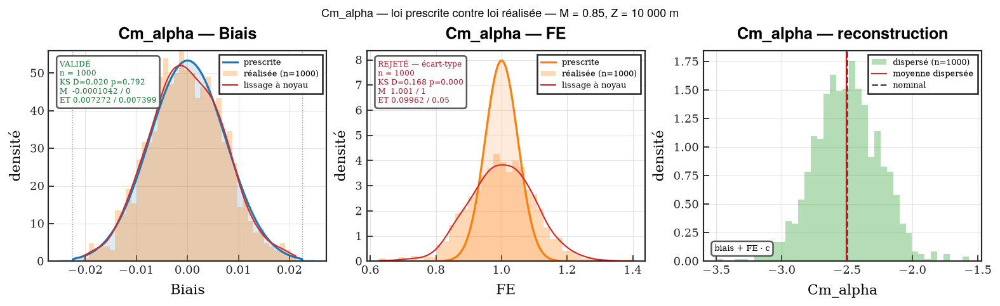

Chaque loi théorique porte la densité empirique du modèle (lissage à noyau
`ot.KernelSmoothing`), plus la boîte de verdict. On *voit* le FE réalisé
déborder de son support prescrit. `qq=True` remplace la densité par un diagramme
quantile-quantile : un histogramme se lit bien au centre et mal dans les queues,
or c'est dans les queues qu'une loi tronquée dérape.

**`valider_lot` corrige la multiplicité.** Le test rejette à tort dans α des cas,
par définition ; sur cinquante points de vol et quatre composantes, cela fait
deux cents tests, donc une dizaine de cases rouges de pur bruit — dans un
livrable dont tout l'intérêt est qu'on ne regarde *que* les cases rouges.

| sur 20 études de 12 PDV × 4 composantes, toutes conformes | fausses alertes | études intactes |
|:--|--:|--:|
| sans correction | 58 / 960 | 3 / 20 |
| avec Šidák *(défaut)* | 1 / 960 | 19 / 20 |

### 6. Synthétiser, et ne tracer que les rejets

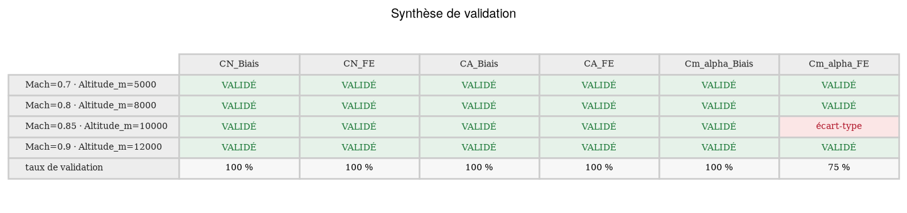

```python
synthese(verdicts)  # taux de validation et motifs, par composante
tableau_par_pdv(verdicts)  # le damier
table_rich(verdicts)  # le même au terminal
figure_synthese(verdicts)  # et en figure
pdv_rejetes(verdicts)  # -> [{"Mach": 0.85, "Altitude_m": 10000.0}]
```

Le raccord entre les deux derniers est l'essentiel du cas d'usage : sur
cinquante points de vol et six composantes, on ne regarde pas trois cents
figures — on regarde les quatre qui ont échoué.

```python
for cles, coefficient, figure in figures_par_pdv(
    resultats, lois, par=PAR, seulement=pdv_rejetes(verdicts)
):
    enregistrer(figure, sortie / f"{coefficient}", formats=("png",))
```

`figures_par_pdv` est un **générateur** : un millier de figures n'est jamais tout
en mémoire à la fois.

### 7. Propager le long d'un balayage

```python
bande_depuis_loi(x, nominal, *, loi, n=20000, intervalle="percentile",
                 couverture=None, k=None, correle=True, graine=None)
bande_depuis_points(x, nominal, lois, ...)
```

`BandeDispersion` porte `x`, `nominal`, `moyenne`, `bas`, `haut`,
`echantillons` (le nuage complet), `ecart_type`, `demi_largeur`, `label`,
`reduire()` et `enveloppe_sigma(k)`.

Le réglage qui décide du sens de l'enveloppe est `correle` :

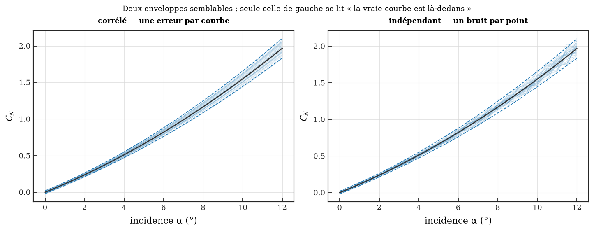

Une erreur de recalage est normalement *la même erreur* en tout point du
balayage : une réalisation décale ou incline la courbe entière (`correle=True`,
le défaut). Tirer une erreur indépendante par point modélise un bruit point à
point — un résidu mal convergé, par exemple. Les deux enveloppes se ressemblent ;
**seule celle de gauche se lit « la vraie courbe est là-dedans »**, qui est
pourtant l'affirmation qu'on croit faire.

### 8. La polaire dispersée

```python
superposer_dispersion(ax, x, nominal, *, loi=None, tirages=None,
                      serie=None, couleur=None, remplissage="minmax",
                      sigmas=(1, 2, 3), etiquettes_sigma=True,
                      boite_parametres=True, max_tirages=200, ...) -> dict
courbes_par_tirage(df, *, x, y, par) -> (x, courbes)
```

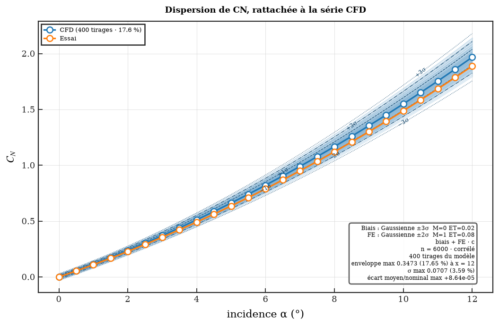

Cinq choses s'y superposent, et chacune s'enlève :

* la **bande théorique**, calculée depuis `loi=` ;
* les **courbes réellement obtenues**, `tirages=`, forme `(n_tirages, npts)` —
  les donner toutes les deux est précisément l'intérêt : on les voit s'accorder ;
* le **remplissage**, dans la teinte de la série ;
* les **lignes ±kσ**, étiquetées *sur* la courbe ;
* la **boîte de paramètres**, qui nomme la loi employée.

`serie="CFD"` reprend la couleur de cette courbe-là : le remplissage en
transparence, la moyenne dispersée en plus sombre. La dispersion se lit alors
comme appartenant à cette série, sans légende supplémentaire — ce qui compte dès
qu'il y en a trois sur la figure. À défaut, `couleur="C3"` trace un faisceau
autonome.

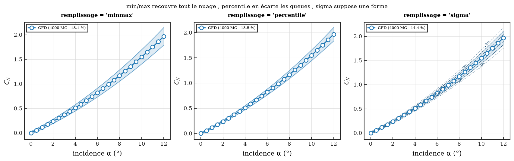

| `remplissage` | ce que la bande recouvre |
|:--|:--|
| `"minmax"` *(défaut)* | tout le nuage, sans hypothèse |
| `"percentile"` | une fraction de couverture, queues écartées |
| `"sigma"` | moyenne ± kσ — suppose une forme |

Préférer les percentiles aux σ pour des composantes uniformes ou tronquées, dont
les queues ne sont pas gaussiennes.

Les lignes ±kσ sont étiquetées avec l'inclinaison calculée en coordonnées
**d'affichage** — donc juste sur un axe logarithmique comme sur des échelles sans
rapport. Elles sont posées en dernier, après tout artiste susceptible de déplacer
les limites.

Mille appels du modèle donnent un tableau à plat, une ligne par (tirage × point
du balayage) ; `courbes_par_tirage` le remet en matrice :

```python
x, courbes = courbes_par_tirage(resultats, x="alpha", y="CN", par=["tirage"])
courbes.shape  # (n_tirages, npts)
```

`par=` nomme les colonnes qui identifient un tirage. La fonction **refuse** des
tirages qui ne partagent pas la même abscisse : les empiler donnerait une matrice
dont les colonnes ne correspondent pas au même point du balayage — une figure
fausse, et lisse.

### 9. La greffe sur `batch_plot`

C'est le livrable. `batch_plot` (paquet [cfd-plot](../cfd-plot)) prend quatre
dictionnaires et écrit tout un arbre de figures ; la dispersion s'y ajoute par
son unique point de greffe.

```python
from cfd_plot import batch_plot
from cfd_dispersion.batch import hook_dispersion

batch_plot(
    configuration_dict={
        "CFD": {"name": "CFD", "label": "CFD", "df": donnees, "color": "C0", "marker": "o"}
    },
    y_axis_dict={
        "CN": {
            "col_name": "CN",
            "literal_name": "Coefficient normal",
            "symbol": r"$C_N$",
            "unit": "-",
            "y_save_name": "CN",
        }
    },
    sweep_dict={
        "alpha": {
            "col_name": "alpha",
            "literal_name": "Incidence",
            "symbol": r"$\alpha$",
            "unit": "°",
            "x_save_name": "alpha",
            "polar_prefix": "ALPHA_POLAR",
            "label": r"$\alpha$",
            "save_name": "ALPHA",
        }
    },
    flight_point_dict={
        "Mach": {"values": [0.80], "label": "M", "save_name": "M", "unit": "-"},
        "Altitude_m": {"values": [8000.0], "label": "Z", "save_name": "Z", "unit": "m"},
    },
    output_base="09_POST_TRAITEMENT/FIGURE",
    formats=("png",),
    on_before_save=hook_dispersion(lois, serie="CFD", tirages=tirages, n=6000),
)
```

Quatre points, et ce sont eux qui font marcher la greffe du premier coup :

* **la courbe nominale n'est pas à redonner.** Le hook va chercher sur les axes
  la courbe intitulée `serie=`, en lit l'abscisse et l'ordonnée, et disperse
  celles-là. Une divergence entre ce qui est tracé et ce qui est dispersé devient
  impossible ;
* **le nom de la grandeur doit valoir le nom du coefficient** — `context.y_key`
  est confronté aux clés de `lois`. Sinon,
  `coefficients={"CN_total": "CN"}`. Une grandeur sans loi n'est pas une erreur :
  le hook passe son tour, ce qui permet de tracer vingt grandeurs et d'en
  disperser trois ;
* **le dictionnaire `tirages` est indexé par `(y_key, sweep_key)`**, ce que rend
  `cle_par_defaut` :

  ```python
  tirages = {}
  for coefficient in lois:
      _, courbes = courbes_par_tirage(a_plat, x="alpha", y=coefficient, par=["tirage"])
      tirages[(coefficient, "alpha")] = courbes
  ```

  Une dispersion qui change d'un point de vol à l'autre demande une clé plus
  fine, donc votre propre fonction `cle=`, de niveau module ;
* **tout ce que reçoit le hook doit être sérialisable.** `batch_plot` envoie son
  hook aux processus de travail et retombe silencieusement sur `n_jobs=1`, avec
  un simple `UserWarning`, quand il n'y parvient pas. D'où une classe de niveau
  module (`HookDispersion`) et non une fermeture, une fonction de clé de niveau
  module et non une `lambda`, et le *nom* d'une convention plutôt qu'une
  `Convention` bâtie sur une `lambda`.

Tout ce que le hook dessine se retrouve dans le fichier **et** dans la page du
rapport PDF, `on_before_save` étant appelé juste avant l'enregistrement.

Le détail clé par clé des quatre dictionnaires est dans
[00_DOC/05 §5.9](00_DOC/05_BRANCHER_SON_MODELE.md#59-la-greffe-sur-batch_plot) ;
`01_EXEMPLE/03_polaire_batch_plot.py` en est la version exécutable.

### 10. Corréler deux coefficients

Sans argument, les composantes sont **indépendantes**. C'est presque toujours ce
qu'on veut, et presque jamais ce qu'on a vérifié : deux coefficients issus du
même recalage partagent une erreur.

```python
lois = charger_lois(DICT, correlation={("CN", "Cm_alpha"): 0.6})
```

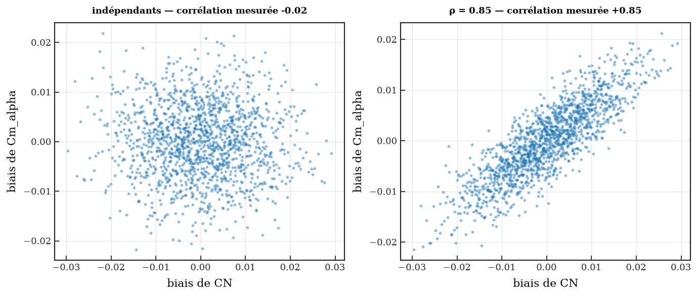

Nommer deux **coefficients** corrèle leurs composantes de même nature : biais
avec biais, FE avec FE. Ce n'est pas une commodité — appliquer un même ρ aux
quatre croisements produit, dès deux coefficients, une matrice non définie
positive qu'aucune loi jointe ne réalise. C'est aussi la lecture physique : le
recalage lie les biais entre eux, pas le biais de l'un à l'échelle de l'autre.
Pour cibler une paire croisée, nommer les deux composantes :
`{("CN_Biais", "Cm_alpha_FE"): 0.4}`.

L'hypothèse d'indépendance étant invisible sur une figure, elle est rendue
explicite : `lois.independantes` est reportée dans chaque boîte de paramètres.

### 11. La ligne de commande

```bash
cfd-dispersion check   --lois LOIS.yaml
cfd-dispersion tirage  --lois LOIS.yaml -n 1000 --methode lhs --sortie lot.csv
cfd-dispersion valider --lois LOIS.yaml --donnees resultats.csv \
                       --par Mach Altitude_m --figures FIG/ --strict
cfd-dispersion exemple /tmp/ex
```

`--strict` sort en code 1 dès qu'un point de vol est rejeté, pour une chaîne
d'intégration. `--correction aucune` retrouve le seuil test par test.

Le script console de pip fige le chemin de l'interpréteur ;
`python -m cfd_dispersion.cli.main` est l'équivalent qui marche partout — venv
déplacé, image Apptainer, chemin trop long pour un `#!`.

### 12. Les figures, et leur format

Toutes les figures passent par cfd-plot — y compris les lignes de repère
(`add_reference_lines`, sous les ±kσ des figures de tirage). Les primitives sont
exportées pour que les vôtres en fassent autant :

```python
from cfd_dispersion import style, nouvelle_figure, tracer_ligne, enregistrer

with style("paper"):  # style local, pas de rcParams globaux
    figure, ax = nouvelle_figure()
    tracer_ligne(ax, x, y, label="CFD", color="C0")
    superposer_dispersion(ax, x, y, loi=lois["CN"], serie="CFD")
    (chemin,) = enregistrer(figure, sortie / "CN_M0.85", formats=("png", "svg"))
```

Les figures du paquet, elles, s'écrivent d'elles-mêmes : `figure_tirage` et
`figure_tirage_matrice` prennent un `chemin=` et rendent leurs `fichiers`, en
**SVG** par défaut. `enregistrer` reste là pour vos propres figures.

`enregistrer` écrit par `cfd_plot.save_figure` — c'est ce qui donne au fichier le
DPI, les marges et le fond du profil. Le chemin se donne **sans extension**, mais
un point dans le nom est admis : `save_figure` compose son fichier avec
`Path.with_suffix`, qui remplace tout ce qui suit le dernier point, et un nom
aussi banal que `CN_M0.85` y perdrait son `.85` — toute une série de points de
vol s'écrasant alors dans un seul fichier, sans erreur. `enregistrer` s'en
protège, et un test le vérifie.

### 13. Les erreurs

Toutes les erreurs sont des `ValueError` nommant le coupable :

```
coefficient 'CN' : clé(s) manquante(s) ['Biais_ET', 'FE_Type', 'FE_M', 'FE_ET']
coefficient 'CN', FE : ET est une demi-étendue et ne peut pas être négatif, reçu -0.1
colonne(s) absente(s) du tableau : ['CN_FE'] ; il porte ['CN', 'CN_Biais', 'Mach']
aucune courbe intitulée 'EXP' sur ces axes ; libellés présents : ['CFD', 'Essai']
les tirages ne partagent pas la même abscisse ; les empiler donnerait un tableau…
```

En ligne de commande, elles ressortent en panneau encadré et non en trace
d'exécution : le public est un ingénieur qui disperse des coefficients, pas un
développeur Python qui débogue cet outil.

---

## Recettes

**Rejouer exactement une étude.** Une graine par appel, dérivée d'une graine
d'étude : `tirer(lois, graine=1000 + i)`. Une graine *constante* donne mille fois
le même tirage, ce qui ne se voit qu'à la validation.

**Ne valider qu'un bloc, sans points de vol.** `valider_lot(df, lois)` — `par=()`
valide tout le tableau d'un coup.

**Comparer ±1σ et ±3σ sans repayer le Monte-Carlo.**
`bande.reduire(intervalle="sigma", niveau=3)` : rien n'est retiré, seule la
réduction est refaite.

**Alléger un fichier vectoriel.** `max_tirages=150` : mille courbes opaques ne
montrent rien de plus que deux cents, et coûtent dix fois le poids.

**Ne décorer que certains panneaux d'une figure de comparaison.**
`hook_dispersion(..., panneaux=("M 0.80",))`.

**Tracer les figures d'un point de vol précis.**
`figures_par_pdv(..., seulement=[{"Mach": 0.85, "Altitude_m": 10000.0}])`.

**Vérifier une table avant de lancer quoi que ce soit.**
`cfd-dispersion check --lois LOIS.yaml` — les erreurs de table sortent là, pas
après huit heures de calcul.

---

## Référence de l'API publique

| symbole | rôle |
|:--|:--|
| `LoiDispersion`, `LoiCoefficient`, `JeuDeLois` | les lois |
| `charger_lois`, `charger_lois_yaml`, `libelle_type` | la table |
| `plan_croise` | le plan d'appels croisé |
| `lire_sortie_modele`, `aplatir_tirage`, `lois_depuis_tableau`, `lire_dict` | le tableau du modèle |
| `LIBELLES_TYPE`, `TYPES_VALIDES`, `CLES_ATTENDUES`, `COMPOSANTES` | les constantes |
| `Convention`, `CONVENTIONS`, `CONVENTION_PAR_DEFAUT`, `convention` | la reconstruction |
| `Tirage`, `tirer`, `tirer_lot`, `tirer_tableau`, `tableau_des_tirages`, `tirage_neutre`, `graine_temporaire` | le tirage |
| `BandeDispersion`, `bande_depuis_loi`, `bande_depuis_points`, `INTERVALLES` | la propagation |
| `Verdict`, `valider`, `valider_lot`, `alpha_corrige` | la validation |
| `LoiCombinee`, `loi_combinee` | la loi du coefficient dispersé |
| `AccordModele`, `comparer_au_modele`, `TOLERANCE_ACCORD` | le calcul confronté au modèle |
| `figures_tirage_par_pdv`, `MAX_TIRAGES_DEFAUT` | le parcours des points de vol |
| `tirage_depuis_ligne` | le tirage que porte une ligne de la sortie |
| `tracer_loi`, `tracer_loi_combinee`, `figure_tirage`, `figure_tirage_matrice`, `FigureTirage`, `MAX_COEFFICIENTS_PAR_FIGURE` | figures du tirage |
| `figure_comparaison`, `figures_par_pdv` | figures Monte-Carlo |
| `synthese`, `tableau_par_pdv`, `pdv_rejetes`, `figure_synthese`, `table_rich` | la synthèse |
| `superposer_dispersion`, `courbes_par_tirage` | la polaire dispersée |
| `style`, `nouvelle_figure`, `tracer_ligne`, `enregistrer` | les primitives de tracé |
| `cfd_dispersion.batch` : `hook_dispersion`, `HookDispersion`, `cle_par_defaut` | la greffe sur `batch_plot` |

---

## Limites du modèle

* **Six familles, pas davantage.** Ni log-normale, ni Weibull, ni loi tabulée.
  Le format d'entrée est celui d'une table de lois d'établissement, pas d'un
  langage de description de distributions.
* **Deux composantes par coefficient**, un biais et un facteur d'échelle. Une
  dispersion à trois termes demande une `Convention` maison.
* **La corrélation est gaussienne** (`ot.NormalCopula`) et porte sur les
  composantes. La corrélation de rang réalisée est légèrement inférieure au ρ
  demandé, la copule agissant sur les marginales uniformes sous-jacentes.
* **Rien sur la sensibilité.** « Quel coefficient pilote la dispersion ? » est
  une autre question ; OpenTURNS sait y répondre (`SobolIndicesAlgorithm`), ce
  paquet ne l'expose pas.
* **La validation juge un tirage, pas un modèle.** Elle dit si les *entrées*
  tirées suivent leurs lois, non si le modèle en fait quelque chose de juste.
* **`valider_lot` suppose les tests indépendants** pour sa correction de Šidák.
  Avec des composantes corrélées, la correction est légèrement conservatrice.

---

## Documentation

| | |
|:--|:--|
| [00_DOC/01](00_DOC/01_LOIS_DE_DISPERSION.md) | les six familles, la convention `M`/`ET`, les pièges OpenTURNS |
| [00_DOC/02](00_DOC/02_CONVENTIONS_ET_TIRAGE.md) | les trois relations, les plans MC/LHS/Sobol, la loi du coefficient dispersé |
| [00_DOC/03](00_DOC/03_VALIDATION_MONTE_CARLO.md) | les trois contrôles, la multiplicité, la synthèse |
| [00_DOC/04](00_DOC/04_POLAIRE_DISPERSEE.md) | la superposition, corrélé/indépendant, `batch_plot` |
| [00_DOC/05](00_DOC/05_BRANCHER_SON_MODELE.md) | **brancher son modèle** : les dictionnaires, les colonnes, les quatre dicts de `batch_plot` |
| [01_EXEMPLE](src/cfd_dispersion/01_EXEMPLE/README.md) | l'exemple exécutable, script par script |

Régénérer les figures : `python 00_DOC/generer_figures.py`.

---

## Structure

```
cfd-dispersion/
├── 00_DOC/                        docs FR + FIGURES/ + generer_figures.py
├── README.md
├── pyproject.toml
├── src/cfd_dispersion/
│   ├── __init__.py, _compat.py, paths.py
│   ├── core/
│   │   ├── alea.py          graine globale d'OpenTURNS, conversion (n,1) -> (n,)
│   │   ├── loi.py           les six familles
│   │   ├── lois.py          la table {coeff: {Biais_*, FE_*}}, la corrélation
│   │   ├── convention.py    les relations de reconstruction
│   │   ├── combinaison.py   la loi du coefficient dispersé (exacte ou lissée)
│   │   ├── tirage.py        tirer / tirer_lot (la liste) / tableau_des_tirages
│   │   ├── bande.py         propagation le long d'un balayage
│   │   ├── tableau.py       plan croisé, tableau large, tirage d'une ligne
│   │   └── validation.py    support / moments / Kolmogorov–Smirnov
│   ├── report/              theme.py, console.py, _plotting_lib.py
│   ├── figures/             _base, tirage, par_pdv, monte_carlo, synthese, polaire
│   ├── batch.py             la greffe sur cfd_plot.batch_plot
│   ├── cli/main.py
│   └── 01_EXEMPLE/          livré comme donnée de paquet
└── tests/                   miroir de src/
```

---

## Vérification

```bash
pytest                                  # 660 tests
ruff check . && ruff format --check .
mypy src tests                          # strict
python 00_DOC/generer_figures.py        # les 12 figures de doc
cfd-dispersion exemple /tmp/ex && bash /tmp/ex/RUN_EXEMPLE.sh
```

Quelques invariants que la suite tient :

| invariant | où |
|:--|:--|
| les six familles reproduisent l'implémentation SciPy d'origine (moments et supports, 400 000 tirages) | `test_loi.py::TestPortageDepuisScipy` |
| `getSample` est aplati en `(n,)`, et le tableau rendu est modifiable | `test_loi.py::TestPiegesOpenTurns` |
| un `graine=` ne décale pas le flux global de l'appelant | `test_loi.py`, `test_tirage.py` |
| une erreur de facteur 2 sur `ET` est rejetée à n = 50 … 20 000, bornée ou non | `test_validation.py::TestErreurDeFacteurDeux` |
| chacun des cinq motifs attrape ce que les autres laissent passer | `test_validation.py::TestLesQuatreMotifs` |
| le taux de faux rejet vaut α, et la correction nettoie le tableau | `test_validation.py::TestCalibration` |
| toute figure passe par cfd-plot, primitive par primitive | `test_base.py::TestToutPasseParCfdPlot` |
| la loi exacte du coefficient dispersé retrouve un tirage de 200 000 points, et la lissée aussi | `test_combinaison.py` |
| une relation non affine est détectée, et bascule sur le lissage | `test_combinaison.py::TestDecompositionAffine` |
| au-delà de quatre coefficients, la matrice pagine et numérote ses fichiers | `test_tirage.py::TestFigureTirageMatrice` |
| une colonne qui varie dans un point de vol n'est pas prise pour un nominal | `test_par_pdv.py::TestValeursNominales` |
| le travail d'un parcours se sérialise, donc `n_jobs` tient ses promesses | `test_par_pdv.py::TestParallelisme` |
| un modèle qui n'applique pas la même convention est repéré, coefficient par coefficient | `test_par_pdv.py::TestAccordAvecLeModele` |
| le facteur neutre vaut 1 en linéaire et 0 en pourcentage, et il est résolu, pas codé | `test_tirage.py::TestTirageNeutre` |
| un point dans un nom de figure ne fait pas disparaître le fichier | `test_base.py`, `test_exemple.py` |
| un tableau croisé est refusé tant qu'il n'est pas dédoublonné, et le message dit comment | `test_tableau.py::TestPiegeDuCroisement` |
| les dictionnaires du modèle survivent à un aller-retour par CSV | `test_tableau.py::TestLireSortieModele` |
| le hook survit à `pickle`, donc à `n_jobs > 1` | `test_batch.py::TestSerialisation` |
| l'exemple livré tourne, et son défaut volontaire est détecté | `test_exemple.py` |
