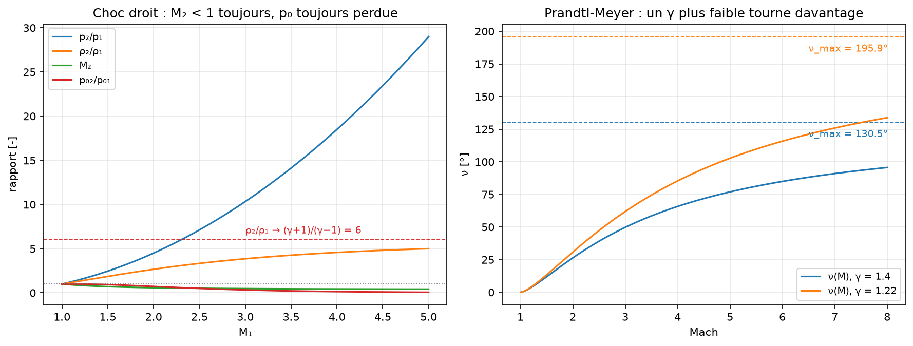

# 2. Chocs et détentes

## L'idée à retenir

Un choc est **le seul endroit** du modèle quasi-1D où de l'entropie est créée.
Ce qui se conserve et ce qui se perd :

| Grandeur | À travers un choc |
|---|---|
| Débit, quantité de mouvement, énergie | conservés (Rankine-Hugoniot) |
| **T0** (température d'arrêt) | **conservée** — le choc ne chauffe pas globalement |
| **p0** (pression d'arrêt) | **perdue** : p02/p01 < 1 |
| Entropie | créée : Δs = −R·ln(p02/p01) |

La perte de pression d'arrêt est ce qui pilote toute la carte des régimes d'une
tuyère de Laval : en aval d'un choc interne, la section sonique de référence
**grandit**,

```
A2* = At / (p02/p01)
```

et c'est précisément ce qui permet à l'écoulement de ressortir en subsonique à
la pression aval imposée. Voir [`03_REGIMES_ET_PERFORMANCES.md`](03_REGIMES_ET_PERFORMANCES.md).

## Choc droit

```
M₂²     = (1 + (γ−1)/2·M₁²) / (γ·M₁² − (γ−1)/2)
p₂/p₁   = (2γ·M₁² − (γ−1)) / (γ+1)
ρ₂/ρ₁   = (γ+1)M₁² / ((γ−1)M₁² + 2)
T₂/T₁   = (p₂/p₁) / (ρ₂/ρ₁)
p₀₂/p₀₁ = [ (γ+1)M₁²/((γ−1)M₁²+2) ]^(γ/(γ−1)) · [ (γ+1)/(2γM₁²−(γ−1)) ]^(1/(γ−1))
```

Deux bornes utiles pour garder un œil critique sur un résultat CFD :

- **M₂ < 1 toujours** : un choc droit rend l'écoulement subsonique, sans exception.
- **ρ₂/ρ₁ est bornée par (γ+1)/(γ−1)** — soit 6 pour l'air. Un choc ne comprime
  pas indéfiniment ; au-delà, c'est la température qui encaisse.

```bash
cfd-nozzle choc --mach 3.0
```



## Détente de Prandtl-Meyer

```
ν(M) = √((γ+1)/(γ−1)) · atan(√((γ−1)/(γ+1)·(M²−1))) − atan(√(M²−1))
```

ν(M) est **l'angle total dont un écoulement sonique doit tourner pour atteindre
M**. Une détente est isentropique : contrairement au choc, elle ne coûte pas de
pression d'arrêt.

`ν_max = π/2·(√((γ+1)/(γ−1)) − 1)` est la détente vers le vide (M → ∞). Elle
**croît quand γ baisse** : 130.45° pour γ = 1.4, mais 195.9° pour γ = 1.22. Un
gaz de combustion dispose donc de **plus** d'angle de détente qu'un gaz froid —
et pour un même Mach il tourne déjà davantage (voir la figure : la courbe
γ = 1.22 est partout au-dessus).

```bash
cfd-nozzle detente --mach 2.4
cfd-nozzle detente --nu 30 --gaz lox_rp1
```

## Choc oblique

La relation θ-β-M relie la déviation θ imposée par une paroi à l'angle β du choc :

```
tan θ = 2·cot β · (M₁²sin²β − 1) / ( M₁²(γ + cos 2β) + 2 )
```

Le principe de calcul : **seule la composante normale traverse le choc**. On
applique les relations du choc droit à Mn₁ = M₁·sin β, la composante tangentielle
étant inchangée, puis M₂ = Mn₂/sin(β − θ).

Trois choses à savoir :

1. Pour une déviation θ donnée, il existe **deux solutions** : la faible
   (β petit, aval en général supersonique) et la forte (β grand, aval subsonique).
   La faible est celle qui se réalise presque toujours. `--forte` donne l'autre.
2. Au-delà d'un **θ_max**, aucune solution attachée n'existe : le choc se détache
   en choc de proue (bow shock), que cette théorie ne décrit pas. `theta_max_oblique`
   le donne, et le rapport affiche la marge.
3. θ = 0 est dégénéré : la solution faible est l'onde de Mach elle-même
   (β = μ), la forte le choc droit (β = 90°).

```bash
cfd-nozzle oblique --mach 3.0 --theta 20
cfd-nozzle oblique --mach 3.0 --theta 20 --forte
```

| M₁ | θ_max |
|---|---|
| 1.5 | 12.11° |
| 2.0 | 22.97° |
| 3.0 | 34.07° |
| 5.0 | 41.12° |

## Où ça sert dans une tuyère

- **Choc droit** → le choc interne du divergent en régime sur-détendu profond
  (régime 2 du chapitre 3), et sa position.
- **Choc oblique** → le système de chocs *extérieur* d'une tuyère sur-détendue :
  la pression de sortie est inférieure à l'ambiante et la recompression se fait
  dans le jet, hors de la tuyère.
- **Prandtl-Meyer** → le faisceau de détente *extérieur* d'une tuyère
  sous-détendue, et — surtout — la construction du noyau de détente dans la
  méthode des caractéristiques.

## Vérification

Tout ce chapitre est testé contre les tables publiées : `tests/core/test_shocks.py`
compare M₂, p₂/p₁, ρ₂/ρ₁, T₂/T₁, p₀₂/p₀₁, ν(M) et β(θ, M) aux valeurs
tabulées, et vérifie les invariants (M₂ < 1, ρ₂/ρ₁ bornée, Δs > 0,
aller-retour des inversions).
