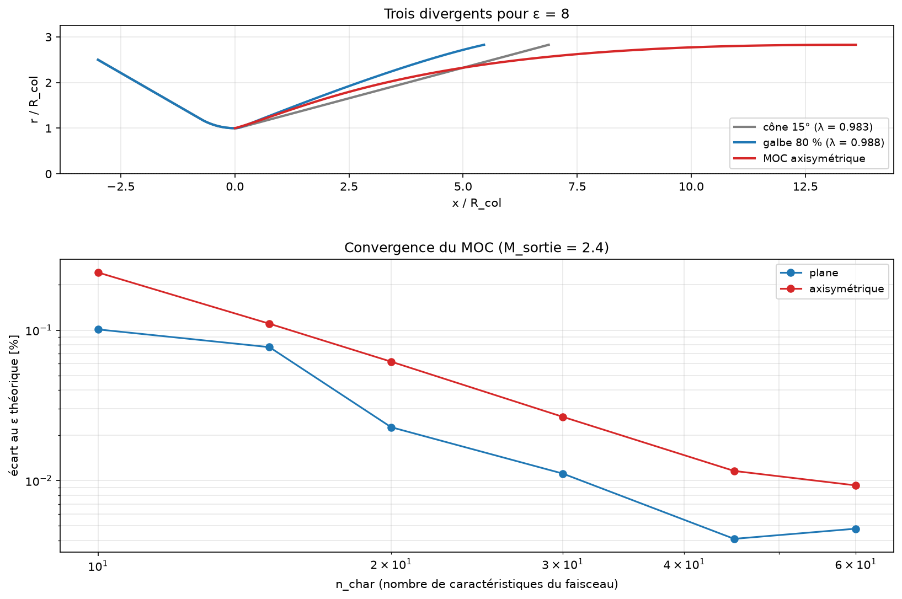

# 4. Géométries : cône, galbe de Rao, méthode des caractéristiques

Trois niveaux d'ambition pour tracer un divergent, du plus rustique au plus
exact.



## 1. Cône

`conical_contour(rayon_col, eps, demi_angle)` — raccord circulaire au col puis
cône droit.

Le seul paramètre qui compte est le demi-angle α, et c'est un **compromis pur** :

```
λ = (1 + cos α) / 2
```

Ouvrir le cône raccourcit la tuyère (moins de masse, moins de refroidissement à
prévoir) mais oriente le jet de sortie vers l'extérieur, et cette composante
radiale de vitesse est de la poussée perdue. Le 15° classique donne
λ = 0.983 — 1.7 % de perte.

| α | λ | perte |
|---|---|---|
| 10° | 0.992 | 0.8 % |
| 15° | 0.983 | 1.7 % |
| 20° | 0.970 | 3.0 % |
| 25° | 0.953 | 4.7 % |

## 2. Galbe de Rao (« bell »)

`bell_contour(rayon_col, eps, pourcentage_longueur)` — arc de col de rayon
0.382·Rt, puis une parabole (Bézier quadratique) qui quitte l'arc à θn et arrive
à la sortie à θe.

L'idée de Rao : ouvrir **vite** juste après le col (θn ≈ 20–27°, bien plus qu'un
cône), puis refermer progressivement pour ré-aligner le jet (θe ≈ 6–13°). On
obtient à la fois une tuyère **plus courte** qu'un cône à 15° et un λ
**meilleur** — d'où sa domination sur les moteurs réels.

La longueur se cite en pourcentage de celle d'un cône à 15° de même ε ; 80 % est
le standard.

Les angles θn et θe viennent d'une lecture lissée des abaques de Rao,
interpolée en ε, avec une correction empirique linéaire hors des 80 % où elles
sont tabulées. Un galbe **plus court** doit ouvrir plus vite au col *et* a moins
de longueur pour redresser l'écoulement : **les deux angles montent**.

> ⚠️ Le script d'origine corrigeait θe **dans le mauvais sens** (un galbe plus
> court y ressortait *plus* aligné, ce qui contredisait son propre commentaire).
> Corrigé ici, et testé (`tests/core/test_geometry.py::test_bell_length_scales_with_the_percentage`).

`rao_angles()` reste une **approximation d'avant-projet**. Pour un tracé
définitif, la méthode des caractéristiques ci-dessous.

```bash
cfd-nozzle geometrie --rayon-col 0.10 --eps 16 --type bell --pourcentage 80 \
    --export contour.dat --figure SORTIE
```

## 3. Méthode des caractéristiques (MOC)

`moc_nozzle(mach_sortie, n_char, y_col, gamma, axisymmetric=…)` — tuyère à
longueur minimale, écoulement de sortie uniforme et axial par construction.

### Les équations de compatibilité

Avec δ = 0 (plane) ou δ = 1 (axisymétrique), y la distance à l'axe :

```
le long de C⁻, de pente dy/dx = tan(θ − μ) :
    d(θ + ν) = + δ · sin μ · sin θ / sin(θ − μ) · dy/y

le long de C⁺, de pente dy/dx = tan(θ + μ) :
    d(θ − ν) = − δ · sin μ · sin θ / sin(θ + μ) · dy/y
```

En **plan** (δ = 0), les invariants de Riemann K⁻ = θ + ν et K⁺ = θ − ν sont
constants. En **axisymétrique** ils ne le sont plus : le terme source est
exactement ce qui distingue les deux géométries, et l'ignorer est la façon
classique d'obtenir un galbe faux.

*Vérification* : l'écoulement source sphérique est une solution exacte des
équations axisymétriques (θ = φ, A/A* = (r/r*)²). Injecté dans les relations
ci-dessus, il donne des résidus **nuls à la précision machine** —
`check_axisymmetric_compatibility()`, testé sur 18 combinaisons (M, φ, γ).

### Pourquoi une méthode inverse

En plan, la région entre la dernière caractéristique du col et la paroi est une
onde simple : l'état est constant le long de chaque C⁺, ce qui donne directement
les points de paroi. **Cette propriété disparaît en axisymétrique**, où une
paroi n'apporte qu'**une** condition aux limites (l'angle) pour **deux**
inconnues (θ, ν) : le problème de conception est mal posé tel quel. D'où la
méthode inverse classique :

1. **Noyau** — détente centrée sur le coin du col, calculée avec les seuls
   processus unitaires « point intérieur » et « point sur l'axe » (aucune paroi
   requise). θ_max est ajusté par dichotomie jusqu'à ce que le dernier point
   axial atteigne exactement M_sortie ; en plan on retrouve θ_max = ν_e/2 exact.
2. **Caractéristique de sortie** — issue de ce point axial, elle porte un
   écoulement uniforme (θ = 0, M = M_e) : c'est bien une solution, le terme
   source s'annulant identiquement quand θ = 0.
3. **Région de redressement** — problème de Goursat posé sur ces deux
   caractéristiques sécantes, entièrement déterminé sans connaître la paroi.
4. **Paroi** — la ligne de courant issue du coin du col, tracée dans ce champ
   jusqu'à la caractéristique de sortie.

### Le maillage du faisceau : un piège

Un faisceau **uniforme en θ** est singulier au coin sonique. La première
caractéristique part à μ → 90°, et l'abscisse à laquelle elle rencontre l'axe se
comporte en θ^(1/3) : sa dérivée est infinie en θ = 0. Raffiner un faisceau
uniforme **détruit** donc le maillage près de l'axe au lieu de l'améliorer — et
en axisymétrique, où le terme source est en 1/y, le calcul diverge purement et
simplement (constaté dès n_char ≈ 60).

Le faisceau est donc gradué, θ_i = θ_max·(i/n)^3 (`FAN_EXPONENT`) : l'exposant 3
compense exactement la loi en θ^(1/3) et répartit les premiers points axiaux
régulièrement. La convergence redevient monotone et propre.

### Domaine validé

Le contrôle : le contour doit reproduire le ε que A/A*(M_sortie) impose, puisque
la conception fixe le Mach de sortie. Écart mesuré à n_char = 40, γ = 1.4 :

| M_sortie | plane | axisymétrique |
|---|---|---|
| 1.4 – 2.4 | < 0.01 % | < 0.02 % |
| 3.0 | 0.06 % | 0.02 % |
| 4.0 | 0.32 % | 0.03 % |
| 5.0 | 0.88 % | maillage dégénéré |

Les deux branches convergent **monotonement** avec `n_char` (0.11 % → 0.03 % →
0.01 % en axisymétrique pour n = 15 → 30 → 60). Au-delà de M_sortie ≈ 4 en
axisymétrique, la région de redressement devient assez longue pour que l'erreur
de marche dégénère le maillage : `moc_nozzle` lève alors une `RuntimeError` qui
le dit, plutôt que de renvoyer un contour faux.

θ_max axisymétrique est nettement plus petit que la valeur plane ν_e/2 — le
terme source accélère l'axe, il faut donc moins ouvrir le col :

| M_sortie | ν_e/2 (plan) | θ_max axisymétrique |
|---|---|---|
| 2.0 | 13.19° | 5.75° |
| 2.4 | 18.37° | 8.33° |
| 3.0 | 24.88° | 11.72° |
| 4.0 | 32.89° | 16.11° |

### Limites

Col à **coin vif** (détente centrée) et **ligne sonique droite** au col.
L'écoulement transsonique réel au col est courbe (correction de Sauer) ; pour un
dimensionnement définitif il faut partir d'une ligne initiale transsonique et
d'un arc de raccord au col. Le contour obtenu ici est le divergent seul : le
convergent est à ajouter (`conical_contour` en fournit un).

```bash
cfd-nozzle moc --mach-sortie 2.4 --n 30 --axisymetrique \
    --export contour_moc.dat --figure SORTIE
```

```python
from cfd_nozzle import moc_nozzle

res = moc_nozzle(2.4, n_char=40, y_throat=0.05, gamma=1.4, axisymmetric=True)
res.theta_max_deg, res.length, res.area_ratio, res.area_ratio_error
```

## Quelle géométrie choisir

| Besoin | Outil |
|---|---|
| Un ordre de grandeur, une masse, un encombrement | `conical_contour` |
| Un avant-projet réaliste, un λ crédible | `bell_contour` |
| Une soufflerie supersonique, un jet uniforme, un maillage CFD de référence | `moc_nozzle` |
