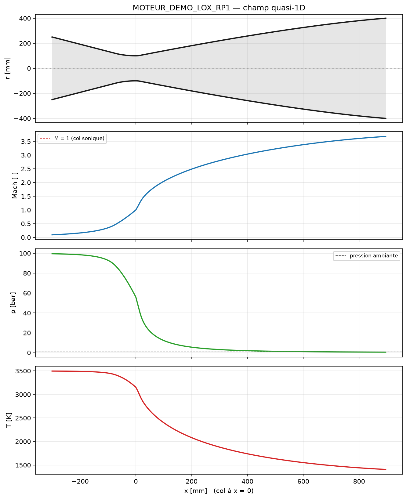
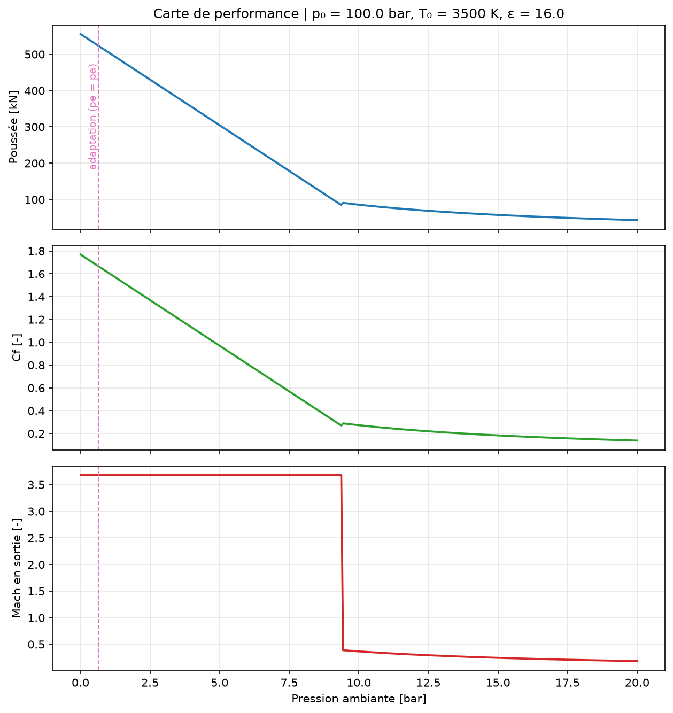
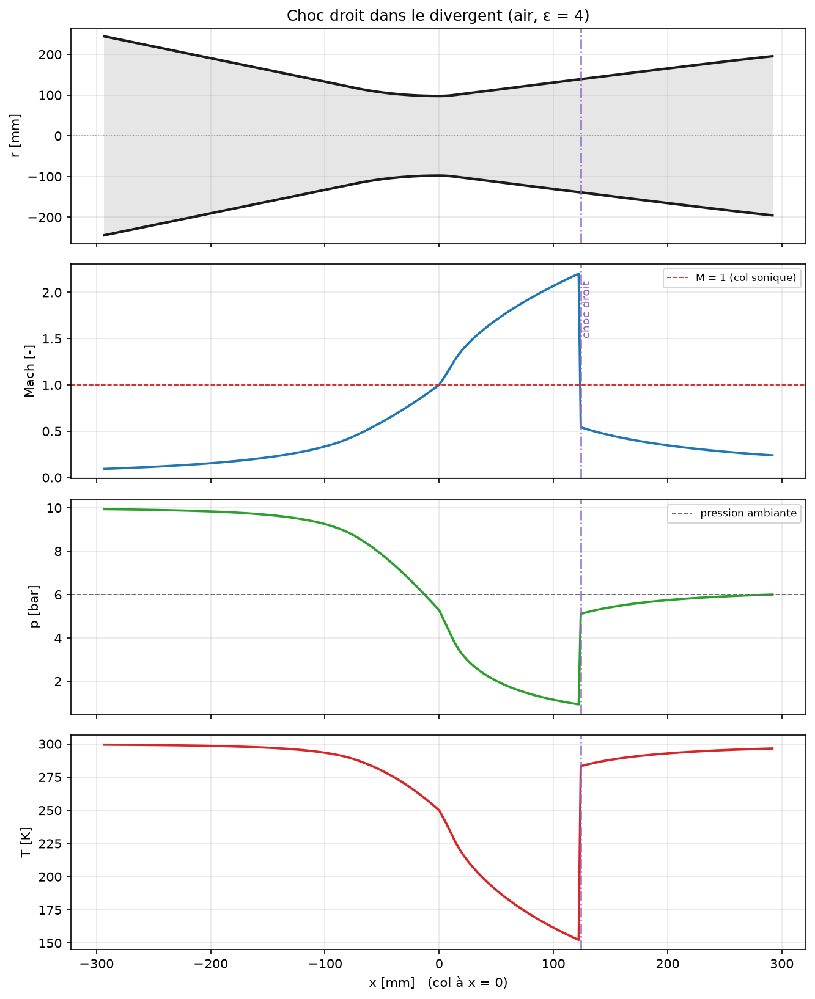
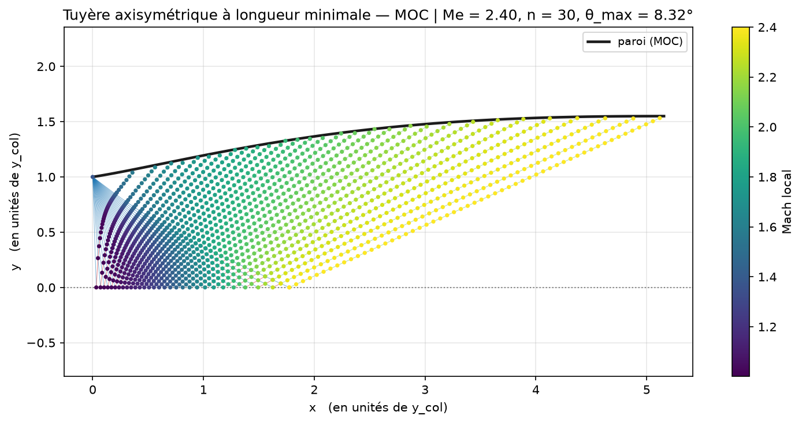
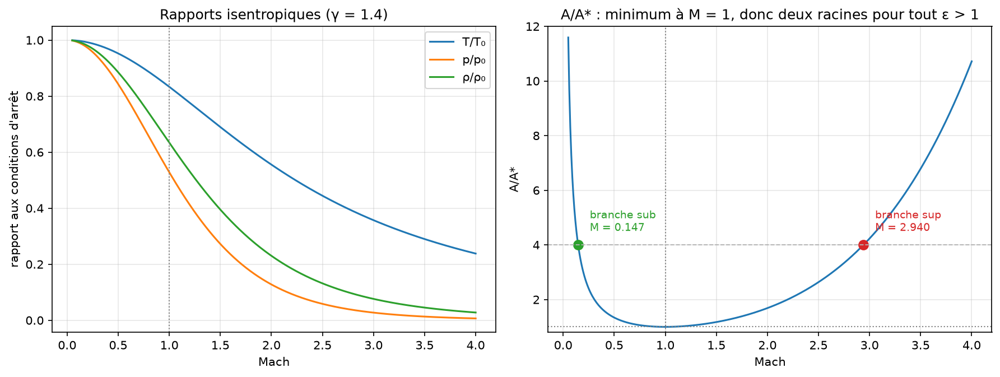
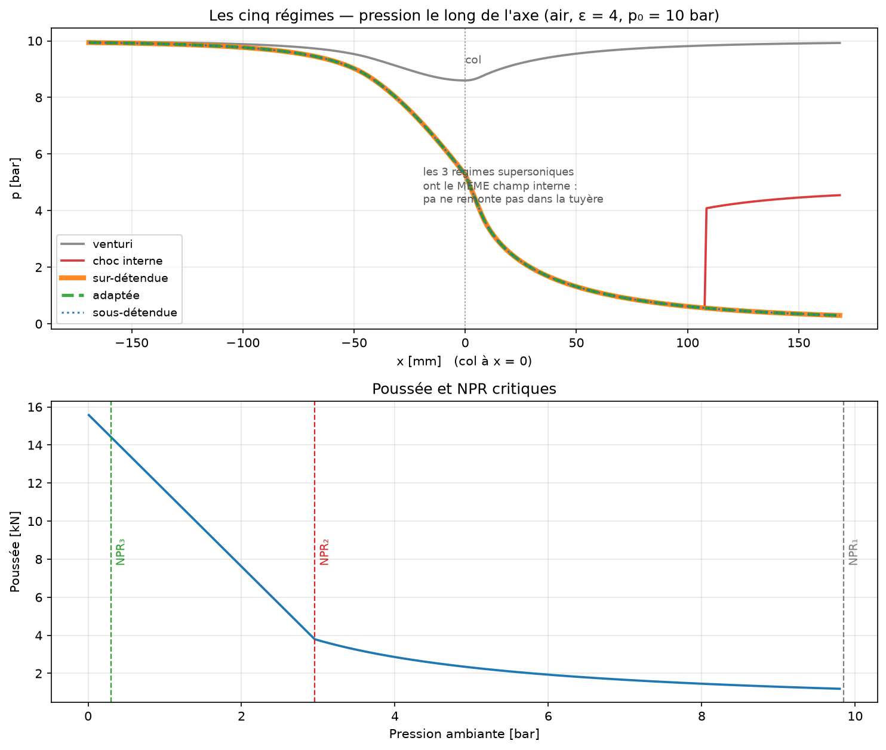

# cfd-nozzle

Une **boîte à outils quasi-1D pour les tuyères convergentes-divergentes** (de
Laval), solver-agnostic, utilisable en ligne de commande **et comme API Python**.

Elle répond aux trois questions qu'on se pose avant de mailler quoi que ce soit :

1. **Dans quel régime** cette tuyère fonctionne-t-elle à cette pression aval ?
2. **Qu'est-ce qu'elle délivre** — débit, poussée, Cf, Isp, c\* ?
3. **Quel contour** tracer — cône, galbe de Rao, ou méthode des caractéristiques ?

Elle fournit aussi les briques élémentaires de la dynamique des gaz compressibles
(relations isentropiques, choc droit, choc oblique, détente de Prandtl-Meyer),
utiles pour vérifier un résultat CFD à la main.



---

## Sommaire

- [Installation](#installation)
- [Prise en main (CLI)](#prise-en-main-cli)
- [Ce que ça produit](#ce-que-ça-produit)
- [**Guide API**](#guide-api)
  - [Conventions](#conventions)
  - [1. Le gaz](#1-le-gaz)
  - [2. Relations isentropiques](#2-relations-isentropiques)
  - [3. Chocs et détentes](#3-chocs-et-détentes)
  - [4. La tuyère : régimes et performances](#4-la-tuyère--régimes-et-performances)
  - [5. Le champ le long de l'axe](#5-le-champ-le-long-de-laxe)
  - [6. Les contours](#6-les-contours)
  - [7. Méthode des caractéristiques](#7-méthode-des-caractéristiques)
  - [8. Fichiers de cas YAML](#8-fichiers-de-cas-yaml)
  - [9. Rapports et figures](#9-rapports-et-figures)
  - [10. Gestion des erreurs](#10-gestion-des-erreurs)
  - [Exemple complet](#exemple-complet-de-bout-en-bout)
  - [Référence de l'API publique](#référence-de-lapi-publique)
- [Limites du modèle](#limites-du-modèle)
- [Documentation](#documentation)
- [Structure](#structure)
- [Vérification](#vérification)

---

## Installation

```bash
cd tools/cfd-nozzle
python3 -m venv .venv && .venv/bin/pip install -e ".[dev]"
pip install -e ../cfd-plot   # facultatif : style maison des figures
```

Python ≥ 3.12. Dépendances : NumPy, Matplotlib, Rich, PyYAML. **Pas de SciPy**,
pas de dépendance à `$CFD_FRAMEWORK` — le package est déployable seul.

---

## Prise en main (CLI)

### Les briques élémentaires

```bash
cfd-nozzle iso --mach 2.5                            # relations isentropiques
cfd-nozzle iso --rapport-section 4.0 --branche sup   # A/A* → M, branche supersonique
cfd-nozzle choc --mach 3.0                           # choc droit
cfd-nozzle oblique --mach 3.0 --theta 20             # choc oblique (θ-β-M)
cfd-nozzle detente --mach 2.4                        # Prandtl-Meyer
```

### Une tuyère

```bash
# En ligne de commande
cfd-nozzle tuyere --p0 100e5 --t0 3500 --pa 1.013e5 \
    --diametre-col 0.20 --eps 16 --gaz lox_rp1 --eta-cstar 0.96 --lambda-contour

# Ou depuis un fichier de cas versionnable, à côté du maillage
cfd-nozzle check CAS.yaml
cfd-nozzle run   CAS.yaml --figure SORTIE
```

### Un contour

```bash
cfd-nozzle geometrie --rayon-col 0.10 --eps 16 --type bell --export contour.dat
cfd-nozzle moc --mach-sortie 2.4 --n 30 --axisymetrique --export contour_moc.dat
```

### L'exemple complet

```bash
cfd-nozzle example mon_exemple && cd mon_exemple && bash RUN_EXEMPLE.sh
```

---

## Ce que ça produit

**Le rapport terminal** (Rich, en français) mène avec la réponse — le régime —
puis déroule géométrie, NPR critiques, état de sortie et performances :

```
╭──────────────────── cfd-nozzle — point de fonctionnement ────────────────────╮
│ Amorcée — sur-détendue (pe < pa, chocs obliques en sortie)                    │
│                                                                              │
│ NPR = p₀/pa = 98.7167   ·   col sonique   ·   pe/pa = 0.6276                  │
╰──────────────────────────────────────────────────────────────────────────────╯
                         NPR critiques (p₀/pa)
┏━━━━━━━┳━━━━━━━━━━┳━━━━━━━━━━━━━━━━━━━━━━━━━━━━━━━━━━━━━━━━━━━━━━━━━━┓
┃ Seuil ┃      NPR ┃ Signification                                    ┃
┡━━━━━━━╇━━━━━━━━━━╇━━━━━━━━━━━━━━━━━━━━━━━━━━━━━━━━━━━━━━━━━━━━━━━━━━┩
│ NPR₁  │   1.0008 │ amorçage du col, sortie subsonique (Me = 0.0369) │
│ NPR₂  │  10.6387 │ choc droit pile dans le plan de sortie           │
│ NPR₃  │ 157.2866 │ adaptation, pe = pa (Me = 3.6799)                │
└───────┴──────────┴──────────────────────────────────────────────────┘
                        Performances
┏━━━━━━━━━━━━━━━━━━━━━━┳━━━━━━━━━━━━━━━━┳━━━━━━━━━━━━━━━━━━┓
┃ Grandeur             ┃         Valeur ┃                  ┃
┡━━━━━━━━━━━━━━━━━━━━━━╇━━━━━━━━━━━━━━━━╇━━━━━━━━━━━━━━━━━━┩
│ débit ṁ              │ 194.28531 kg/s │ = p₀·At/c*       │
│ poussée F            │    504947.28 N │ 504.947 kN       │
│ coefficient Cf       │         1.6073 │ = F/(p₀·At)      │
│ impulsion Isp        │       265.02 s │ = Cf·c*/g₀       │
│ vitesse caract. c*   │    1617.00 m/s │ = η_c*·√(R·T₀)/Γ │
│ vitesse éjection éq. │    2599.00 m/s │ = F/ṁ            │
└──────────────────────┴────────────────┴──────────────────┘
! Le système de chocs obliques est extérieur : la tuyère est trop longue pour
  cette altitude.
```

**La carte de performance** montre la poussée, le Cf et le Mach de sortie en
fonction de la pression ambiante. La cassure à ~9.4 bar, c'est NPR₂ : le choc
droit entre dans le divergent et le Mach de sortie chute d'un coup de 3.68 au
subsonique.



**Le champ quasi-1D** repère le choc interne quand il y en a un :



**Le tracé MOC** donne le maillage des caractéristiques et la paroi obtenue.
Le noyau de détente part du coin du col, se réfléchit sur l'axe, et la zone
uniforme de sortie (en jaune, M = 2.4) est bornée par la caractéristique de
sortie :



---

## Guide API

### Conventions

| Règle | Détail |
|---|---|
| **Unités** | SI strict partout : Pa, K, m, m², kg/s, N, m/s. Les degrés n'apparaissent que dans les champs suffixés `_deg` et dans les rapports. |
| **Angles** | En **radians** dans les fonctions (`prandtl_meyer`, `oblique_shock`, `beta_from_theta`), en **degrés** dans les dataclasses de résultat. |
| **γ par défaut** | `1.4` (air) pour toutes les fonctions libres ; les objets (`Nozzle`, `MOCResult`) portent leur propre gaz. |
| **Résultats** | Des `@dataclass(frozen=True)` — immuables, introspectables, sûrs à stocker. Jamais de dictionnaires libres. |
| **Erreurs** | `ValueError` pour une entrée physiquement impossible, `RuntimeError` pour un échec numérique, `CaseError` pour un fichier de cas invalide. Les messages sont en français et destinés à l'utilisateur final. |
| **Typage** | Le package passe `mypy --strict`. Les littéraux `Branch = Literal["sub","sup"]` sont exportés. |

Tout l'essentiel s'importe depuis la racine :

```python
from cfd_nozzle import (
    GAS_LIBRARY, GasModel, Nozzle, NozzleState, Regime, CriticalRatios, FlowField,
    NozzleContour, MOCResult, IsentropicState, NormalShockState, ObliqueShockState,
    area_ratio, bell_contour, beta_from_theta, conical_contour, gas_from_name,
    isentropic_state, mach_angle, mach_from_area_ratio, mach_from_p0_over_p,
    mach_from_prandtl_meyer, moc_nozzle, normal_shock_state, nu_max, oblique_shock,
    p0_over_p, prandtl_meyer, rao_angles, t0_over_t, theta_max_oblique,
)
```

---

### 1. Le gaz

`GasModel` est un gaz calorifiquement parfait : γ et R constants, tout le reste
en découle.

```python
from cfd_nozzle import GAS_LIBRARY, GasModel, gas_from_name

gaz = GAS_LIBRARY["lox_rp1"]          # γ = 1.22, R = 345 J/(kg·K)
gaz = gas_from_name("lox_rp1")        # idem, avec un KeyError qui liste les gaz connus
gaz = GasModel(1.22, 345.0, "mon mélange")
gaz = GasModel.from_molar_mass(1.22, 24.1, "mon mélange")   # depuis la masse molaire

gaz.cp                 # 1913.2  J/(kg·K)
gaz.cv                 # 1568.2  J/(kg·K)
gaz.vandenkerckhove    # 0.65239 — la constante Γ(γ) du débit sonique
gaz.sound_speed(3500)  # a = √(γ·R·T)  [m/s]
gaz.velocity(2.0, 1400)
gaz.density(1e5, 1400) # p = ρ·R·T
gaz.limit_velocity(3500)   # 3659.5 m/s — l'asymptote M → ∞, jamais dépassable
```

Gaz disponibles : `air`, `air_chaud`, `n2`, `co2`, `he`, `vapeur`, `lox_lh2`,
`lox_rp1`, `n2o4_mmh`, `apcp`.

> ⚠️ Les entrées « propergol » sont des **ordres de grandeur**. Pour un moteur
> réel, γ et R doivent venir d'un calcul d'équilibre (CEA, RPA) aux conditions
> de chambre.

---

### 2. Relations isentropiques

Fonctions libres, γ en second argument optionnel :

```python
from cfd_nozzle import area_ratio, isentropic_state, mach_from_area_ratio, p0_over_p, t0_over_t
from cfd_nozzle.core.isentropic import mach_from_p0_over_p, mach_from_t0_over_t, mach_star, rho0_over_rho

t0_over_t(2.0)          # 1.8
p0_over_p(2.0)          # 7.824
rho0_over_rho(2.0)      # 4.347
area_ratio(2.0)         # 1.6875
mach_star(2.0)          # 1.633 — reste fini quand M → ∞
```

**Les inversions.** `A/A*` admet deux racines (c'est tout l'intérêt d'une
tuyère de Laval), il faut donc choisir la branche :

```python
mach_from_area_ratio(1.6875, 1.4, "sub")   # 0.3722  — branche subsonique
mach_from_area_ratio(1.6875, 1.4, "sup")   # 2.0000  — branche supersonique
mach_from_p0_over_p(7.824)                 # 2.0     — monotone, racine unique
mach_from_t0_over_t(1.8)                   # 2.0
```



**L'état complet**, sous forme de dataclass :

```python
etat = isentropic_state(2.0, gamma=1.4)
etat.mach            # 2.0
etat.t_over_t0       # 0.5556
etat.p_over_p0       # 0.127805
etat.rho_over_rho0   # 0.230048
etat.area_ratio      # 1.6875
etat.mach_star       # 1.6330
etat.mu_deg          # 30.0    — None en subsonique
etat.nu_deg          # 26.3798 — None en subsonique
```

---

### 3. Chocs et détentes

```python
import math
from cfd_nozzle import normal_shock_state, oblique_shock, prandtl_meyer, nu_max
from cfd_nozzle.core.shocks import (
    beta_from_theta, mach_from_prandtl_meyer, mach_from_shock_p0_ratio,
    pitot_p0_ratio, shock_entropy_rise, shock_m2, shock_p0_ratio, shock_p_ratio,
    shock_rho_ratio, shock_t_ratio, theta_from_beta, theta_max_oblique,
)
```

**Choc droit** :

```python
choc = normal_shock_state(2.0)
choc.m2          # 0.5774 — toujours < 1
choc.p_ratio     # 4.5000
choc.rho_ratio   # 2.6667 — borné par (γ+1)/(γ−1)
choc.t_ratio     # 1.6875
choc.p0_ratio    # 0.7209 — la perte de pression d'arrêt

shock_entropy_rise(2.0, GAS_LIBRARY["air"])   # Δs = −R·ln(p₀₂/p₀₁)  [J/(kg·K)]
mach_from_shock_p0_ratio(0.7209)              # 2.0 — inversion, sert à situer un choc interne
pitot_p0_ratio(2.0)                           # 5.6404 — Rayleigh, ce que lit une sonde
```

**Détente de Prandtl-Meyer** :

```python
prandtl_meyer(2.4)                    # 0.6413 rad  (36.75°)
math.degrees(nu_max(1.4))             # 130.45° — la détente vers le vide
math.degrees(nu_max(1.22))            # 195.90° — ν_max croît quand γ baisse
mach_from_prandtl_meyer(math.radians(36.75))   # 2.4001
```


**Choc oblique** — l'angle de déviation est en radians :

```python
theta_max, beta_at_max = theta_max_oblique(3.0)     # limite de détachement
math.degrees(theta_max)                             # 34.0734°

obl = oblique_shock(3.0, math.radians(20.0))        # solution faible par défaut
obl.beta_deg        # 37.7636
obl.m2              # 1.9941 — encore supersonique
obl.mn1, obl.mn2    # 1.8372, 0.6084 — les composantes normales
obl.p_ratio         # 3.7713
obl.solution_label  # "faible"

fort = oblique_shock(3.0, math.radians(20.0), weak=False)   # solution forte
fort.beta_deg, fort.m2      # 82.1467, 0.5394 — aval subsonique
```

Au-delà de θ_max, `oblique_shock` lève un `ValueError` disant que le choc est
détaché — un choc de proue, hors du domaine de cette théorie.

---

### 4. La tuyère : régimes et performances

```python
import math
from cfd_nozzle import GAS_LIBRARY, Nozzle, Regime

tuyere = Nozzle(
    throat_area=0.25 * math.pi * 0.20**2,   # At [m²]
    area_ratio=16.0,                        # ε = Ae/At
    gas=GAS_LIBRARY["lox_rp1"],
    eta_cstar=0.96,      # rendement de combustion c*_réel/c*_idéal
    lambda_div=0.9923,   # perte par divergence — cf. NozzleContour.divergence_lambda
)

# Ou depuis les diamètres :
tuyere = Nozzle.from_diameters(0.20, 0.80, gas=GAS_LIBRARY["lox_rp1"])

tuyere.exit_area, tuyere.throat_diameter, tuyere.exit_diameter
tuyere.mach_exit("sup")     # 3.6799 — Mach de sortie de la solution supersonique
tuyere.mach_exit("sub")     # 0.0369
```

**Les trois NPR critiques** délimitent les cinq régimes :

```python
crit = tuyere.critical_ratios()
crit.npr_choked          #   1.0008 — NPR₁ : amorçage du col
crit.npr_shock_at_exit   #  10.6387 — NPR₂ : choc droit dans le plan de sortie
crit.npr_design          # 157.2866 — NPR₃ : adaptation, pe = pa
crit.mach_exit_sub, crit.mach_exit_sup
```



**Résoudre un point de fonctionnement** :

```python
etat = tuyere.solve(p0=100e5, t0=3500.0, pa=1.013e5)

etat.regime              # <Regime.OVEREXPANDED: 'sur_detendue'>
etat.regime.label        # "Amorcée — sur-détendue (pe < pa, chocs obliques en sortie)"
etat.regime.is_choked    # True
etat.npr                 # 98.7167
etat.choked              # True

# État de sortie
etat.mach_exit           # 3.6799
etat.p_exit              # 63578.2 Pa
etat.t_exit              # 1405.86 K
etat.rho_exit            # 0.13108 kg/m³
etat.v_exit              # 2830.71 m/s — vitesse gaz-dynamique locale
etat.pressure_ratio_exit # 0.6276 — pe/pa

# Performances (décomposition de Sutton)
etat.mdot                # 194.2853 kg/s   = p₀·At/c*
etat.thrust              # 504940.6 N      = Cf·p₀·At
etat.cf                  # 1.6073
etat.isp                 # 265.02 s        = Cf·c*/g₀
etat.c_star              # 1617.00 m/s     = η_c*·√(R·T₀)/Γ
etat.v_effective         # 2598.96 m/s     = F/ṁ
etat.area_ratio_opt      # 11.2581 — le ε qui adapterait ce point

# Choc interne (None hors du régime concerné)
etat.mach_shock, etat.area_ratio_shock

# Avertissements physiques, en français, prêts à afficher
etat.warnings
# ["Le système de chocs obliques est extérieur : la tuyère est trop longue …"]
```

Les cinq membres de `Regime` : `VENTURI`, `SHOCK_IN_DIVERGENT`, `OVEREXPANDED`,
`ADAPTED`, `UNDEREXPANDED`.

**Les briques de performance** sont accessibles séparément :

```python
tuyere.c_star(3500.0)                         # 1617.0 m/s
tuyere.mdot_choked(100e5, 3500.0)             # 194.2853 kg/s
tuyere.mdot_subsonic(3e5, 300.0, 2.9e5)       # régime non amorcé
tuyere.momentum_cf(100e5, 63578.2)            # Cf_mom, sans λ ni terme de pression
tuyere.thrust_coefficient(100e5, 1.013e5)     # Cf complet
tuyere.optimal_area_ratio(100e5, 1.013e5)     # 11.2581
tuyere.shock_in_divergent(100e5, 40e5)        # (M_choc, A_choc/A_col)
```

> **Pourquoi Sutton.** `c*` mesure la chambre, `Cf` mesure la détente, et les
> deux sont indépendants : `ṁ·c* = p₀·At` **exactement**, et `Isp = Cf·c*/g₀`.
> Baisser η_c\* fait donc *monter* le débit nécessaire pour tenir p₀ et *baisser*
> l'Isp, sans toucher à la poussée. Détail dans
> [`00_DOC/03`](00_DOC/03_REGIMES_ET_PERFORMANCES.md).

---

### 5. Le champ le long de l'axe

`flow_field` distribue M, p, T, ρ et V le long d'un contour, choc interne inclus.

```python
from cfd_nozzle import bell_contour

contour = bell_contour(0.10, 16.0, 80.0)
champ = tuyere.flow_field(contour.x, contour.area, p0=100e5, t0=3500.0, pa=1.013e5)

champ.x, champ.area          # les entrées, en np.ndarray
champ.mach, champ.p, champ.t, champ.rho, champ.v
champ.x_shock                # abscisse du choc droit interne, ou None
champ.state                  # le NozzleState correspondant
```

C'est la distribution **purement gaz-dynamique** : η_c\* et λ n'agissent que sur
les performances intégrales, pas sur le champ local. Le débit ρ·V·A y est
conservé à 10⁻⁶ près (c'est un test).

Le contour peut venir d'ailleurs — il suffit de fournir `x` et `area` :

```python
import numpy as np

x = np.linspace(-0.3, 0.9, 400)
rayon = 0.10 * (1.0 + 3.0 * np.maximum(x, 0.0))     # une géométrie à soi
champ = tuyere.flow_field(x, np.pi * rayon**2, 100e5, 3500.0, 1.013e5,
                          x_throat=0.0)
```

---

### 6. Les contours

```python
from cfd_nozzle import bell_contour, conical_contour, rao_angles

cone = conical_contour(0.10, 16.0, half_angle_deg=15.0)
galbe = bell_contour(0.10, 16.0, pct_length=80.0)

galbe.x, galbe.r, galbe.area    # np.ndarray, col à x = 0
galbe.label                     # "galbée Rao 80 %"
galbe.divergence_lambda         # 0.9923 — à passer à Nozzle(lambda_div=…)
galbe.divergent_length          # 0.8957 m
galbe.theta_n_deg               # 23.44 — None pour un cône
galbe.theta_e_deg               # 10.06
galbe.throat_radius, galbe.exit_radius, galbe.area_ratio

rao_angles(16.0, 80.0)          # (23.44, 10.06) — les abaques seules
```

Paramètres avancés (rayons de raccord, rayon de chambre, angle du convergent,
finesse de discrétisation) :

```python
cone = conical_contour(
    0.10, 16.0, 15.0,
    convergent_half_angle_deg=30.0, chamber_ratio=2.5,
    upstream_radius_ratio=1.5, downstream_radius_ratio=0.4, n=800,
)
galbe = bell_contour(0.10, 16.0, 80.0, theta_n_deg=25.0, theta_e_deg=8.0)
```


---

### 7. Méthode des caractéristiques

Tuyère à longueur minimale, écoulement de sortie uniforme et axial par
construction. **Plane et axisymétrique**.

```python
from cfd_nozzle import moc_nozzle

res = moc_nozzle(
    mach_exit=2.4,
    n_char=40,          # nombre de caractéristiques du faisceau
    y_throat=0.05,      # rayon au col [m] (ou demi-hauteur en plan)
    gamma=1.4,
    axisymmetric=True,
)

res.wall_x, res.wall_y      # le contour du divergent, coin du col à x = 0
res.theta_max_deg           # 8.3250 — bien moins que ν_e/2 = 18.37 en plan
res.length                  # 0.25785 m
res.y_exit                  # 0.07750 m
res.area_ratio              # 2.40273
res.area_ratio_theory       # 2.40310 — ce que A/A*(M_sortie) impose
res.area_ratio_error        # 1.55e-4 → 0.0155 %, le contrôle de cohérence
res.label                   # "axisymétrique"
res.n_transition            # nombre de lignes de redressement

# Le maillage, pour tracer ou post-traiter
res.kernel[(i, j)]          # noyau : j = 1 sur l'axe, j = i près du coin
res.transition[k][j]        # région de redressement (problème de Goursat)
res.points                  # tous les nœuds, chacun un MOCPoint
res.wall_points             # la paroi comme nœuds

pt = res.points[0]
pt.x, pt.y, pt.theta, pt.nu, pt.mach, pt.mu, pt.kind
```

Export direct pour le maillage :

```python
import numpy as np
np.savetxt("contour.dat", np.column_stack([res.wall_x, res.wall_y]),
           header="x [m]   y [m]", comments="# ")
```

**Domaine validé** (γ = 1.4, contrôlé contre ε = A/A\*(M_sortie)) :

| M_sortie | plane | axisymétrique |
|---|---|---|
| 1.4 – 2.4 | < 0.01 % | < 0.02 % |
| 3.0 | 0.06 % | 0.02 % |
| 4.0 | 0.32 % | 0.03 % |
| 5.0 | 0.88 % | maillage dégénéré → `RuntimeError` explicite |

Au-delà, le code refuse plutôt que de renvoyer un contour faux. Le fond
théorique (équations de compatibilité, méthode inverse, graduation du faisceau)
est dans [`00_DOC/04`](00_DOC/04_GEOMETRIES.md).

---

### 8. Fichiers de cas YAML

Un cas fige une tuyère et un point de fonctionnement, pour que l'étude soit
reproductible et versionnable à côté du maillage.

```yaml
tuyere:
  nom: "MOTEUR_DEMO_LOX_RP1"
  gaz: lox_rp1              # ou le couple gamma: / r:
  diametre_col: 0.20        # m   (ou aire_col: en m²)
  rapport_section: 16.0     # ε
  eta_cstar: 0.96
  lambda_divergence: null   # null → déduit du contour

fonctionnement:
  p0: 100.0e+5              # Pa
  t0: 3500.0                # K
  pa: 1.013e+5              # Pa

geometrie:
  type: bell                # bell | conique
  pourcentage_longueur: 80.0
  demi_angle: 15.0          # conique uniquement
```

```python
from cfd_nozzle.data import CaseError, load_case

cas = load_case("CAS.yaml")
cas.name, cas.gas, cas.throat_area, cas.area_ratio, cas.p0, cas.t0, cas.pa

contour = cas.build_contour()
tuyere = cas.build_nozzle(contour)     # λ vient du contour si lambda_divergence est null
etat = tuyere.solve(cas.p0, cas.t0, cas.pa)
```

Toute anomalie lève un `CaseError` nommant la clé fautive, message prêt à
afficher. Les exposants non signés (`100.0e5`, que YAML 1.1 lit comme une
chaîne) sont acceptés.

---

### 9. Rapports et figures

Les rapports Rich s'écrivent sur **n'importe quelle** `Console` — celle d'un
script appelant, un fichier, un buffer :

```python
from rich.console import Console
from cfd_nozzle.report import console as report

sortie = Console(record=True, width=110)
report.print_nozzle_report(sortie, tuyere, etat, contour=contour)
sortie.save_text("rapport.txt")     # ou .save_html(…)
```

Fonctions disponibles : `print_isentropic_report`, `print_normal_shock_report`,
`print_oblique_shock_report`, `print_prandtl_meyer_report`, `print_nozzle_report`,
`print_contour_report`, `print_moc_report`, `print_gas_line`.

Les figures renvoient une `Figure` Matplotlib — libre à vous de la retoucher
avant de l'enregistrer :

```python
from pathlib import Path
from cfd_nozzle.report.figures import (
    plot_contour, plot_flow_field, plot_moc, plot_performance_map, save_figure,
)

fig = plot_flow_field(contour, champ, title="Mon moteur")
fig.axes[1].set_ylim(0, 4)                     # retouche libre
save_figure(fig, Path("SORTIE/champ"))         # écrit .png et .svg

save_figure(plot_moc(res, show_mesh=True), Path("SORTIE/moc"))
save_figure(plot_performance_map(tuyere, 100e5, 3500.0, 1e3, 20e5), Path("SORTIE/carte"))
save_figure(plot_contour(contour), Path("SORTIE/contour"))
```

Le thème du terminal est centralisé dans `report/theme.py` et **évite
délibérément le gras** — beaucoup de terminaux le rendent par une couleur plus
claire, illisible sur fond clair. `CFD_NOZZLE_GRAS=1` le rétablit. Les figures
passent par le package frère `cfd-plot` quand il est installé, et retombent sur
Matplotlib nu sinon.

---

### 10. Gestion des erreurs

```python
from cfd_nozzle.data import CaseError

try:
    etat = tuyere.solve(p0=1e5, t0=3500.0, pa=2e5)
except ValueError as exc:
    print(exc)
    # pa = 200000 Pa doit être < p0 = 100000 Pa : sans différence de pression
    # il n'y a pas d'écoulement, et pour pa > p0 il s'inverserait — situation
    # hors du modèle
```

| Exception | Quand |
|---|---|
| `ValueError` | entrée physiquement impossible : γ ≤ 1, ε < 1, M₁ < 1 pour un choc, θ > θ_max, ν ≥ ν_max, pa ≥ p0, A/A\* < 1… |
| `RuntimeError` | échec numérique : maillage MOC dégénéré hors du domaine validé |
| `CaseError` | fichier de cas illisible, YAML invalide, clé manquante ou hors bornes |
| `KeyError` | gaz inconnu — le message liste les gaz disponibles |

Les avertissements **physiques** (et non les erreurs) sortent dans
`NozzleState.warnings` : décollement probable, tuyère trop longue, recompression
interne. Ils ne bloquent rien, mais méritent d'être relayés.

---

### Exemple complet de bout en bout

```python
"""Dimensionner un divergent : quel ε pour quelle altitude ?"""
import math
from pathlib import Path

from cfd_nozzle import GAS_LIBRARY, Nozzle, bell_contour
from cfd_nozzle.core.nozzle import SEPARATION_RATIO
from cfd_nozzle.report.figures import plot_flow_field, save_figure

GAZ = GAS_LIBRARY["lox_rp1"]
P0, T0 = 100e5, 3500.0
RAYON_COL = 0.10

for eps in (8.0, 16.0, 30.0):
    contour = bell_contour(RAYON_COL, eps, pct_length=80.0)
    tuyere = Nozzle(math.pi * RAYON_COL**2, eps, GAZ,
                    eta_cstar=0.96, lambda_div=contour.divergence_lambda)

    mer = tuyere.solve(P0, T0, 1.013e5)
    vide = tuyere.solve(P0, T0, 1.0)

    decolle = mer.pressure_ratio_exit < SEPARATION_RATIO
    print(f"ε = {eps:4.0f} | {mer.regime.value:14s} | "
          f"F(mer) = {mer.thrust/1e3:7.1f} kN | Isp(vide) = {vide.isp:6.1f} s"
          f"{'  [!] décollement probable' if decolle else ''}")

    champ = tuyere.flow_field(contour.x, contour.area, P0, T0, 1.013e5)
    save_figure(plot_flow_field(contour, champ, title=f"ε = {eps:g}"),
                Path(f"SORTIE/champ_eps{eps:g}"))
```

```
ε =    8 | sous_detendue  | F(mer) =   503.7 kN | Isp(vide) =  277.7 s
ε =   16 | sur_detendue   | F(mer) =   504.9 kN | Isp(vide) =  291.7 s
ε =   30 | sur_detendue   | F(mer) =   479.6 kN | Isp(vide) =  301.8 s  [!] décollement probable
```

Lecture : ε = 30 gagne 24 s d'Isp sous vide, mais perd 24 kN au niveau de la mer
**et** y décolle probablement. Le compromis se joue là.

Une version plus complète, avec balayage en altitude ISA, est livrée dans
`01_EXEMPLE/balayage_altitude.py` (`cfd-nozzle example` la copie).

---

### Référence de l'API publique

| Objet | Rôle |
|---|---|
| `GasModel`, `GAS_LIBRARY`, `gas_from_name` | gaz calorifiquement parfait |
| `t0_over_t`, `p0_over_p`, `rho0_over_rho`, `area_ratio`, `mach_star`, `mach_angle` | relations isentropiques |
| `mach_from_area_ratio`, `mach_from_p0_over_p`, `mach_from_t0_over_t` | inversions |
| `isentropic_state` → `IsentropicState` | l'état isentropique complet |
| `shock_m2`, `shock_p_ratio`, `shock_rho_ratio`, `shock_t_ratio`, `shock_p0_ratio` | choc droit |
| `normal_shock_state` → `NormalShockState` | choc droit complet |
| `shock_entropy_rise`, `mach_from_shock_p0_ratio`, `pitot_p0_ratio` | dérivés du choc droit |
| `prandtl_meyer`, `nu_max`, `mach_from_prandtl_meyer` | détente |
| `theta_from_beta`, `beta_from_theta`, `theta_max_oblique` | relation θ-β-M |
| `oblique_shock` → `ObliqueShockState` | choc oblique complet |
| `Nozzle` → `NozzleState`, `CriticalRatios`, `FlowField`, `Regime` | la tuyère |
| `conical_contour`, `bell_contour`, `rao_angles` → `NozzleContour` | contours |
| `moc_nozzle` → `MOCResult`, `MOCPoint` | méthode des caractéristiques |
| `check_axisymmetric_compatibility` | validation du terme source axisymétrique |
| `load_case` → `NozzleCase`, `CaseError` | fichiers de cas YAML |
| `cfd_nozzle.report.console.*` | rapports Rich |
| `cfd_nozzle.report.figures.*` | figures Matplotlib |
| `cfd_nozzle.core.numerics.find_root`, `maximise` | le socle numérique (sans SciPy) |

---

## Limites du modèle

- **Pas de couche limite.** En sur-détente profonde, la couche limite décolle
  dans le divergent bien avant que ce modèle ne le laisse deviner. Le critère de
  Summerfield (`pe/pa < 0.35`, `SEPARATION_RATIO`) déclenche un avertissement ;
  quand il apparaît, les chiffres de poussée sont **optimistes** et il faut du
  visqueux.
- **Gaz calorifiquement parfait** : pas de chimie, pas de figeage. Les gaz de
  propergol de `GAS_LIBRARY` sont des ordres de grandeur.
- **Écoulement uniforme sur chaque section**, variation de section lente. Faux
  près d'un col très serré ou d'un divergent très ouvert.
- **Chocs internes traités comme des chocs droits localisés** : la structure
  réelle (choc en λ, décollement) est hors modèle.
- **`rao_angles` est une approximation d'avant-projet** — abaques lissées, avec
  correction empirique hors des 80 %. Pour un tracé définitif : la MOC.
- **La MOC suppose un col à coin vif et une ligne sonique droite.** L'écoulement
  transsonique réel au col est courbe (correction de Sauer).

---

## Documentation

- [`00_DOC/01_MODELE_QUASI_1D.md`](00_DOC/01_MODELE_QUASI_1D.md) — hypothèses,
  modèle de gaz, relations isentropiques, la relation de section et ses deux racines.
- [`00_DOC/02_CHOCS_ET_DETENTES.md`](00_DOC/02_CHOCS_ET_DETENTES.md) — choc droit,
  choc oblique (θ-β-M, détachement), Prandtl-Meyer.
- [`00_DOC/03_REGIMES_ET_PERFORMANCES.md`](00_DOC/03_REGIMES_ET_PERFORMANCES.md) —
  les trois NPR critiques, les cinq régimes, la décomposition de Sutton, le décollement.
- [`00_DOC/04_GEOMETRIES.md`](00_DOC/04_GEOMETRIES.md) — cône, galbe de Rao,
  méthode des caractéristiques (équations de compatibilité, méthode inverse,
  graduation du faisceau, domaine validé).

Les figures se régénèrent avec `python 00_DOC/generer_figures.py`.

---

## Structure

```
00_DOC/                     documentation FR + FIGURES/ + le script d'origine (référence)
src/cfd_nozzle/
  core/                     physique : gas, isentropic, shocks, nozzle, geometry, moc, numerics
  data/                     lecture et validation du fichier de cas YAML
  report/                   thème Rich, rapports terminal FR, figures Matplotlib
  cli/                      point d'entrée cfd-nozzle
  01_EXEMPLE/               exemple exécutable (package data, copié par `cfd-nozzle example`)
tests/                      272 tests : tables publiées, invariants, CLI, figures, exemple
```

---

## Vérification

```bash
.venv/bin/python -m pytest        # 272 tests
.venv/bin/ruff check .
.venv/bin/mypy src tests          # strict
```

Le socle physique est comparé aux **tables publiées** (Anderson, *Modern
Compressible Flow*, annexes A–C) : relations isentropiques, choc droit, θ-β-M,
θ_max, ν(M). Au-delà, les tests vérifient des **invariants** que le modèle doit
respecter exactement :

| Invariant | Ce qu'il attrape |
|---|---|
| `ṁ · c* = p₀·At` et `Isp = Cf·c*/g₀` | toute incohérence de la décomposition des rendements |
| `F = ṁ·Ve` au point adapté idéal | une erreur dans le coefficient de poussée |
| `ρVA` constant à 10⁻⁶ près le long de l'axe | une erreur dans le champ quasi-1D |
| ε du contour MOC = A/A\*(M_sortie) | une erreur dans le terme source, un processus unitaire ou le tracé de paroi |
| résidus nuls sur l'écoulement source sphérique | le terme source axisymétrique lui-même |
