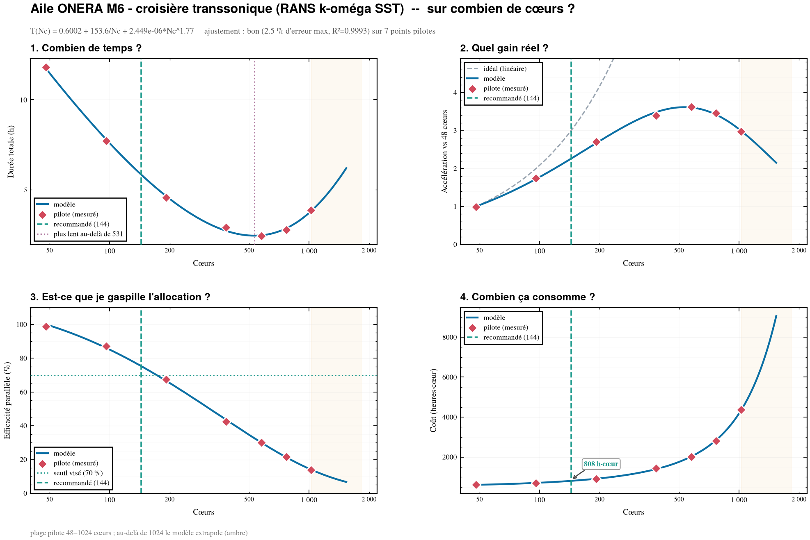

# Guide utilisateur

## 0. Deux voies

- **Automatique** *(recommandée)* — depuis un cas prêt à lancer, `cfd-perf
  capture` lance les runs pilotes, mesure temps/itérations/RAM, et génère le
  fichier d'étude tout seul. Voir [05_CAPTURE_PILOTE.md](05_CAPTURE_PILOTE.md).

  ```bash
  cfd-perf capture --coeurs "48 96 192 384" --adaptateur OF --queue normal --case-dir .
  cfd-perf capture --collect --case-dir . --figure SORTIE/scalabilite.png
  ```

- **Manuelle** — vous relevez le pilote et écrivez le YAML vous-même (sections
  ci-dessous). Utile pour comprendre ce que la capture automatise, ou quand
  aucun adaptateur n'existe pour votre solveur.

## 1. En trois commandes (voie manuelle)

```bash
cfd-perf example -o mon_etude      # copie l'exemple prêt à l'emploi
cd mon_etude
cfd-perf run ONERA_M6_CRUISE.yaml --figure SORTIE/scalabilite.png -v
```

Puis remplacez les mesures pilotes de l'exemple par les vôtres.

## 2. La méthode

```
   ┌─ 1. Lancer un pilote ─────────────────────────────────────┐
   │  Le VRAI cas, quelques centaines d'itérations,            │
   │  à 4-6 nombres de cœurs différents (facteur ≥ 4).         │
   └───────────────────────────┬───────────────────────────────┘
                               │  temps/itération, RAM crête
   ┌───────────────────────────▼───────────────────────────────┐
   │  2. Décrire l'étude dans un YAML (maillage, machine,      │
   │     contraintes, objectif, mesures pilotes)               │
   └───────────────────────────┬───────────────────────────────┘
                               │
   ┌───────────────────────────▼───────────────────────────────┐
   │  3. cfd-perf run → réponse + figure + traçabilité         │
   └───────────────────────────────────────────────────────────┘
```

### Étape 1 : le pilote

**C'est la seule donnée réelle.** Tout le reste en découle.

| Règle | Pourquoi |
|:---|:---|
| Utiliser le **vrai cas** (vrai maillage, vrai solveur, vrai schéma) | γ dépend du partitionnement et du solveur |
| **4 à 6** nombres de cœurs | 3 est le minimum, 4+ identifie bien le terme MPI |
| Couvrir un facteur **≥ 4** (ex. 48 → 1024) | sinon le fit ne voit aucune dégradation |
| **Ignorer les premières itérations** | initialisation et E/S faussent le temps/itération |
| Aller **assez haut pour voir la dégradation** | c'est là qu'est la réponse |
| Relever la **RAM crête totale** | sinon pas de contrainte mémoire |

> Un pilote de quelques centaines d'itérations coûte une fraction du calcul
> final. Se tromper de facteur 3 sur le dimensionnement coûte beaucoup plus.

`cfd-perf` signale lui-même les faiblesses du pilote :

```bash
cfd-perf check mon_etude.yaml
```

### Étape 2 : le fichier d'étude

Voir [03_FORMAT_ENTREE.md](03_FORMAT_ENTREE.md) pour le schéma complet.

### Étape 3 : lire la réponse

```
╭──── Réponse  (efficacité : le plus de cœurs sans gaspiller l'allocation) ───╮
│ Lancer sur 144 cœurs  =  3 nœuds de 48 cœurs                                │
│                                                                             │
│        Durée  5,6 h              ← durée d'horloge
│         Coût  808 h·cœur         ← ce qui est facturé
│ Accélération  2,3× vs 48 cœurs
│   Efficacité  75 %  (25 % perdu)
│       Charge  138 889 mailles/cœur
│      Mémoire  1,03 Go/cœur
╰─────────────────────────────────────────────────────────────────────────────╯
```

Le rapport est ordonné ainsi, **délibérément** :

1. **Réponse** — la réponse ;
2. **À lire** — les réserves qui la qualifient (jamais enterrées plus bas) ;
3. **Alternatives** — ce que les autres stratégies auraient choisi ;
4. **justification** — entrées, modèle, ajustement point par point.

## 3. Choisir sa stratégie


**Même courbe, mêmes contraintes : seule la question change la réponse.**

| Stratégie | Question posée | Règle |
|:---|:---|:---|
| `efficiency` *(défaut)* | « je ne veux pas gaspiller » | le plus de cœurs en restant sous le seuil de perte |
| `deadline` | « il me le faut pour lundi » | le moins de cœurs qui tiennent l'échéance |
| `fastest` | « le plus vite possible, peu importe le coût » | durée minimale |

```bash
cfd-perf run etude.yaml --strategy deadline --deadline 4.5
cfd-perf run etude.yaml --strategy fastest
```

> **`fastest` n'est jamais « le maximum de cœurs ».** La courbe a un minimum :
> au-delà, plus de cœurs = plus lent **et** plus cher. cfd-perf ne franchit
> jamais ce point.

### Quel seuil d'efficacité ?

| `max_efficiency_loss` | Usage typique |
|---:|:---|
| 0,10–0,20 | production de masse, allocation contrainte |
| **0,30** | défaut raisonnable |
| 0,50+ | cas urgent, on accepte de gaspiller pour aller vite |

## 4. Lire la figure



| Élément | Sens |
|:---|:---|
| ligne bleue | le modèle |
| losanges rouges | **vos mesures pilotes** |
| tiret vert | la recommandation |
| pointillé violet | au-delà, le calcul est **plus lent** |
| zone ambre | le modèle **extrapole** (hors plage pilote) |
| zone rouge | contrainte matérielle non respectée |

**Le premier contrôle à faire : la ligne bleue passe-t-elle par les losanges
rouges ?** Si non, le modèle ne décrit pas votre cas — ajoutez des points
pilotes et ne décidez pas sur cette figure. Le rapport le dit aussi en chiffres
(la ligne « Qualité » et le tableau *Modèle vs mesures pilotes*).

## 5. Cas particuliers

**« Aucune configuration réalisable »** — toutes les configurations violent une
contrainte. Le tableau des rejets donne la contrainte bloquante ; relâchez-la
ou élargissez la recherche (`--cores-max`).

**Ajustement « mauvais »** — le pilote est bruité ou trop court. Rejouez les
points suspects, moyennez les répétitions, allongez le pilote.

**Nombre de cœurs non multiple d'un nœud** — cfd-perf ne propose que des nœuds
entiers dès que `machine.cores_per_node > 1`, car c'est la seule chose que
l'ordonnanceur sait allouer.

## 6. Utilisation en Python

```python
from cfd_perf import load_study, fit_model, recommend

study = load_study("etude.yaml")
model = fit_model(study.pilot)

print(model.describe())               # T(Nc) = 0.6 + 153.6/Nc + 2.4e-06*Nc^1.77
print(model.quality.verdict)          # 'good'
print(model.time_minimum_cores(2048)) # 531 -> au-delà, plus lent

rec = recommend(
    model=model, mesh=study.mesh, pilot=study.pilot,
    machine=study.machine, constraints=study.constraints,
)
print(rec.choice.cores, rec.choice.nodes, rec.choice.runtime_hours)

for note in rec.notes:
    print("!", note)
```

## 7. Installation

```bash
cd tools/cfd-perf
pip install -e ".[dev]"
pytest
```

Dépendances : `numpy`, `matplotlib`, `rich`, `pyyaml` — toutes disponibles en
*wheels*, donc installables hors ligne :

```bash
# sur un poste connecté
pip download cfd-perf -d wheels/
# puis, sur le calculateur isolé
pip install --no-index --find-links wheels/ -e .
```

Les figures utilisent la bibliothèque interne `plotting`
(`scripts/post/plot`), trouvée automatiquement via `$CFD_FRAMEWORK` ou
l'arborescence du dépôt. Si elle est absente, cfd-perf bascule sur Matplotlib
nu : le style change, les chiffres non.
