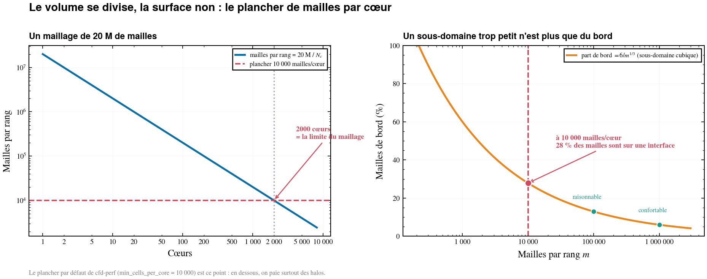
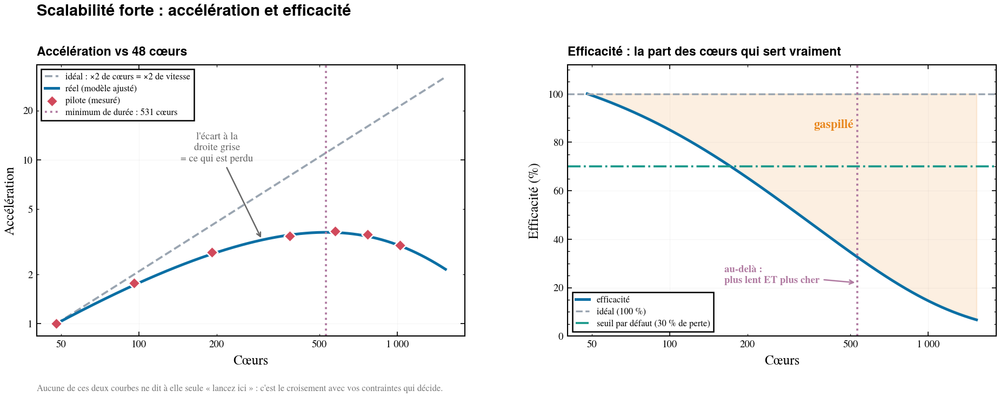

# cfd-perf — sur combien de cœurs lancer ma simulation CFD ?

**cfd-perf répond à une seule question, mais complètement :** *combien de nœuds
demander à l'ordonnanceur pour ce calcul-là, sur cette machine-là ?*

Vous lancez votre vrai cas quelques centaines d'itérations sur 4 à 6 nombres de
cœurs différents. cfd-perf ajuste un modèle de scalabilité sur ces mesures, le
croise avec vos contraintes (mémoire, budget, échéance, taille des nœuds) et
répond par **un nombre de nœuds demandable tel quel**, avec la durée, le coût,
et les réserves qui vont avec.

```
╭──── Réponse  (efficacité : le plus de cœurs sans gaspiller l'allocation) ────╮
│ Lancer sur 144 cœurs  =  3 nœuds de 48 cœurs                                 │
│                                                                              │
│        Durée  5,6 h                                                          │
│         Coût  808 h·cœur                                                     │
│ Accélération  2,3× vs 48 cœurs                                               │
│   Efficacité  75 %  (25 % perdu)                                             │
│       Charge  138 889 mailles/cœur                                           │
│      Mémoire  1,03 Go/cœur                                                   │
╰──────────────────────────────────────────────────────────────────────────────╯
```


Ce que cfd-perf **n'est pas** : un profileur, un outil de scalabilité faible, un
prédicteur du nombre d'itérations nécessaires à la convergence. Il ne remplace
pas la mesure — il l'exploite.

---

## Sommaire

- [En une minute](#en-une-minute)
- [1. Comprendre — HPC, décomposition et communication](#1-comprendre--hpc-décomposition-et-communication)
  - [1.1 Ce que « lancer sur 144 cœurs » veut dire](#11-ce-que--lancer-sur-144-cœurs--veut-dire)
  - [1.2 Le volume se divise, la surface non](#12-le-volume-se-divise-la-surface-non)
  - [1.3 Où passe le temps, itération par itération](#13-où-passe-le-temps-itération-par-itération)
  - [1.4 Accélération et efficacité](#14-accélération-et-efficacité)
  - [1.5 Le modèle de cfd-perf](#15-le-modèle-de-cfd-perf)
  - [1.6 Vocabulaire](#16-vocabulaire)
- [2. Utiliser l'outil](#2-utiliser-loutil)
  - [2.1 Les deux voies](#21-les-deux-voies)
  - [2.2 Voie automatique — `cfd-perf capture`](#22-voie-automatique--cfd-perf-capture)
  - [2.3 Voie manuelle — le fichier d'étude](#23-voie-manuelle--le-fichier-détude)
  - [2.4 Bien relever son pilote](#24-bien-relever-son-pilote)
  - [2.5 Les trois stratégies](#25-les-trois-stratégies)
  - [2.6 Lire le rapport](#26-lire-le-rapport)
  - [2.7 Lire la figure](#27-lire-la-figure)
  - [2.8 Référence des commandes](#28-référence-des-commandes)
  - [2.9 Utilisation en Python](#29-utilisation-en-python)
- [3. Rendre `cfd-perf` disponible partout](#3-rendre-cfd-perf-disponible-partout)
  - [3.1 Choisir sa méthode](#31-choisir-sa-méthode)
  - [3.2 Option A — venv dédié + lien dans `~/bin`](#32-option-a--venv-dédié--lien-dans-bin)
  - [3.3 Option B — environnement conda](#33-option-b--environnement-conda)
  - [3.4 Option C — installation partagée + `module`](#34-option-c--installation-partagée--module)
  - [3.5 Option D — script d'enrobage bash](#35-option-d--script-denrobage-bash)
  - [3.6 Option E — `PYTHONPATH`, sans aucune installation](#36-option-e--pythonpath-sans-aucune-installation)
  - [3.7 Option F — Python fourni par une image conteneur (`.sif`)](#37-option-f--python-fourni-par-une-image-conteneur-sif)
  - [3.8 Vérifier que l'installation est saine](#38-vérifier-que-linstallation-est-saine)
  - [3.9 Les pièges classiques](#39-les-pièges-classiques)
- [4. Développement](#4-développement)
  - [4.1 Architecture](#41-architecture)
  - [4.2 Le trajet d'une donnée](#42-le-trajet-dune-donnée)
  - [4.3 Installation de développement](#43-installation-de-développement)
  - [4.4 Tests, style, types](#44-tests-style-types)
  - [4.5 Regénérer les figures](#45-regénérer-les-figures)
  - [4.6 Ajouter un adaptateur solveur](#46-ajouter-un-adaptateur-solveur)
  - [4.7 Conventions du paquet](#47-conventions-du-paquet)
- [5. Dépannage](#5-dépannage)
- [6. Pour aller plus loin](#6-pour-aller-plus-loin)

---

## En une minute

```bash
cd cfd-perf                                     # le répertoire de ce README
python3 -m venv ~/.venvs/cfd-perf
~/.venvs/cfd-perf/bin/pip install .             # Python ≥ 3.9, aucune compilation
mkdir -p ~/bin && ln -s ~/.venvs/cfd-perf/bin/cfd-perf ~/bin/   # ~/bin sur le PATH

cfd-perf example -o mon_etude                   # exemple prêt à l'emploi
cd mon_etude && ./RUN_EXEMPLE.sh                # le rejoue sous les 3 stratégies
```

Puis remplacez les mesures pilotes de l'exemple par les vôtres :

```bash
cfd-perf check mon_etude.yaml                             # valider + qualité du pilote
cfd-perf run   mon_etude.yaml --figure SORTIE/fig.png -v  # répondre
```

Aucun solveur CFD n'est nécessaire pour l'exemple : les mesures pilotes du YAML
tiennent lieu de données d'entrée.

---

## 1. Comprendre — HPC, décomposition et communication

> Cette partie explique **pourquoi la question « combien de cœurs ? » a une
> réponse non triviale**. Si vous connaissez déjà la scalabilité forte, sautez
> au [§2](#2-utiliser-loutil).

### 1.1 Ce que « lancer sur 144 cœurs » veut dire

Un solveur CFD parallèle ne découpe pas *le travail*, il découpe **le maillage**.
Avant le calcul, un partitionneur (`decomposePar`, METIS, ParMETIS…) coupe le
domaine en autant de sous-domaines qu'il y a de rangs MPI. Chaque rang ne
possède plus que sa part de mailles — et ne connaît rien de celles du voisin.


À chaque itération, chaque rang :

1. **calcule** sur ses mailles — c'est le travail utile, et il se divise
   proprement : deux fois plus de cœurs, deux fois moins de mailles par rang ;
2. **échange ses halos** — pour appliquer un schéma numérique aux mailles
   collées à l'interface (traits rouges ci-dessus), il faut les valeurs des
   mailles d'en face, qui appartiennent à un autre rang. C'est un message MPI ;
3. **participe aux réductions globales** — résidus, sommes, critères d'arrêt :
   tous les rangs doivent se synchroniser, et le plus lent impose son rythme.

Les points 2 et 3 sont du travail qui **n'existait pas** sur un seul cœur. Le
parallélisme ne divise donc jamais le temps par le nombre de cœurs : il en
divise une part, et en crée une autre.

### 1.2 Le volume se divise, la surface non

C'est le cœur du sujet, et c'est de la géométrie pure.

Un sous-domaine de `m` mailles a un **volume** proportionnel à `m` — c'est le
coût de calcul — mais une **surface** proportionnelle à `m^(2/3)` en 3D — c'est
le coût de communication. Quand on double le nombre de cœurs :

| | Évolution | Effet |
|:---|:---|:---|
| Mailles par rang (volume) | ÷ 2 | le calcul va **2× plus vite** |
| Surface d'échange par rang | ÷ 2^(2/3) ≈ ÷ 1,59 | la communication ne baisse que de 37 % |
| **Part de communication** | **× 1,26** | elle prend une place croissante |

La part de mailles situées *au bord* d'un sous-domaine cubique de `m` mailles
vaut `6/m^(1/3)`. À 1 000 000 de mailles par rang, 6 % des mailles sont sur une
interface. À 10 000, c'est **28 %** : le rang passe alors l'essentiel de son
temps à emballer, envoyer, attendre et déballer des halos.



> **C'est l'origine du plancher `min_cells_per_core: 10000`** utilisé par défaut
> par cfd-perf. Ce n'est pas une cible : c'est une limite en dessous de laquelle
> la réponse n'a plus de sens physique, quoi que dise la courbe.

Une conséquence pratique souvent négligée : **un maillage donné a un nombre
maximal de cœurs utiles**. 20 M de mailles ÷ 10 000 = 2 000 cœurs. Demander
4 096 cœurs pour ce maillage, c'est acheter du temps de calcul pour transporter
des halos.

### 1.3 Où passe le temps, itération par itération

Voici la décomposition du temps d'une itération sur le cas d'exemple (aile ONERA
M6, 20 M de mailles, RANS), telle que l'ajuste cfd-perf à partir des mesures :

```
   █ calcul parallélisable      ░ part série (E/S, init, réductions)      ▒ MPI

     48 cœurs  ████████████████████████████████░░░░░░     3,80 s   calcul 84 %, série 16 %, MPI  0 %
    192 cœurs  ████████░░░░░░                             1,43 s   calcul 56 %, série 42 %, MPI  2 %
    576 cœurs  ███░░░░░░▒▒                                1,06 s   calcul 25 %, série 57 %, MPI 18 %
   1024 cœurs  ██░░░░░░▒▒▒▒▒                              1,27 s   calcul 12 %, série 47 %, MPI 41 %
```

Trois choses se lisent d'un coup :

- le bloc `█` **se divise** — c'est ce qu'on achète en ajoutant des cœurs ;
- le bloc `░` **ne bouge jamais** : c'est le plancher d'Amdahl. Même sur une
  infinité de cœurs, une itération ne descendra pas sous 0,60 s ;
- le bloc `▒` **grossit**, et à 1 024 cœurs il coûte plus cher que tout le
  calcul utile. Entre 576 et 1 024 cœurs, le calcul **redevient plus lent**.

### 1.4 Accélération et efficacité

Deux grandeurs suffisent à décrire tout cela, et ce sont celles que rapporte
cfd-perf :

| Grandeur | Formule | Question à laquelle elle répond |
|:---|:---|:---|
| **Accélération** `S` | `T(N_ref) / T(Nc)` | je vais combien de fois plus vite ? |
| **Efficacité** `E` | `S / (Nc / N_ref)` | quelle fraction des cœurs sert vraiment ? |
| Perte | `1 − E` | quelle fraction je gaspille ? |
| Coût | `durée × Nc` | ce qui est facturé sur l'allocation |



L'écart entre la courbe bleue et la droite grise, à gauche, **est** le
gaspillage — et il ne disparaît jamais : il s'agrandit toujours avec le nombre
de cœurs. Décider, c'est choisir combien on accepte d'en payer.

> **Scalabilité forte** = maillage fixe, on ajoute des cœurs. C'est le cas de
> cfd-perf, et celui d'un ingénieur devant un cas donné.
> **Scalabilité faible** = maillage qui grandit avec les cœurs ; c'est une
> métrique de machine, pas de cas. cfd-perf ne traite que la première.

### 1.5 Le modèle de cfd-perf

Ces trois blocs se somment, et cela donne le modèle — trois termes, trois
significations physiques :

```
T(Nc) = t_ser  +  t_par / Nc  +  t_comm · Nc^γ
        \_____/    \_________/    \____________/
        plancher    se divise      MPI : croît
        d'Amdahl    (on gagne)     (on perd)
```


Le troisième terme est ce qui permet de représenter la **courbe en U** que
montre toute machine réelle : le temps descend, atteint un minimum, puis
remonte. Un modèle d'Amdahl seul (`t_ser + t_par/Nc`) est monotone décroissant —
il ne *peut pas* représenter la remontée, et surestime donc systématiquement ce
qu'on gagne à monter en cœurs.

Sur les mesures réelles de l'exemple, le modèle complet reste à **2,5 % d'erreur
maximale** (R² = 0,999). γ ≈ 1,77 y absorbe la topologie réseau, le
partitionnement et le solveur : **il n'est pas transposable d'une machine à
l'autre**. Un pilote par machine.

Détails de l'ajustement (moindres carrés pondérés en relatif, coefficients
contraints positifs, balayage de γ, choix automatique du modèle selon le nombre
de points) : [00_DOC/01_MODELE.md](00_DOC/01_MODELE.md).

### 1.6 Vocabulaire

| Terme | Sens dans cfd-perf |
|:---|:---|
| **rang** (MPI) | un processus du calcul ; ici, un rang = un cœur |
| **sous-domaine** | la part du maillage possédée par un rang |
| **halo** | les mailles voisines appartenant à un autre rang, échangées à chaque itération |
| **pilote** | les quelques runs courts de votre vrai cas qui servent de mesure |
| **plancher d'Amdahl** | la durée sous laquelle on ne descendra jamais, quel que soit Nc |
| **point de retournement** | le nombre de cœurs où la durée est minimale ; au-delà, plus lent *et* plus cher |
| **h·cœur** | heure·cœur, l'unité facturée par les allocations HPC |
| **nœud** | l'unité que l'ordonnanceur alloue réellement (ici 48 cœurs) |

---

## 2. Utiliser l'outil

### 2.1 Les deux voies

```
  ┌───────────────────────────────────────────────────────────────────────┐
  │  VOIE AUTOMATIQUE  (recommandée — vous avez un cas prêt à lancer)     │
  │                                                                       │
  │   cfd-perf capture --coeurs "48 96 192 384" --adaptateur OF           │
  │        ↓ lance les runs pilotes, mesure temps / itérations / RAM      │
  │   cfd-perf capture --collect                                          │
  │        ↓ écrit ETUDE.yaml, détecte la machine, recommande             │
  │   RÉPONSE                                                             │
  └───────────────────────────────────────────────────────────────────────┘

  ┌───────────────────────────────────────────────────────────────────────┐
  │  VOIE MANUELLE  (pas d'adaptateur pour votre solveur, ou pilote déjà  │
  │                  relevé)                                              │
  │                                                                       │
  │   vous relevez temps/itération et RAM crête à la main                 │
  │        ↓                                                              │
  │   vous écrivez ETUDE.yaml (un seul fichier, versionnable)             │
  │        ↓                                                              │
  │   cfd-perf run ETUDE.yaml --figure fig.png                            │
  │   RÉPONSE                                                             │
  └───────────────────────────────────────────────────────────────────────┘
```

Les deux voies produisent le **même fichier d'étude** et passent par le **même
moteur** : la capture automatise la saisie, rien d'autre.

### 2.2 Voie automatique — `cfd-perf capture`

Les runs HPC attendent en file d'attente : la capture est donc découplée en deux
commandes. On soumet tout, on revient plus tard collecter.

```
  Phase 1 — soumission                    │  Phase 2 — collecte
  ────────────────────────────────────────┼────────────────────────────────────
  cfd-perf capture \                      │  cfd-perf capture --collect \
      --coeurs "48 96 192 384" \          │      --case-dir . \
      --adaptateur OF --queue normal \    │      --figure SORTIE/scal.png
      --case-dir .                        │
                                          │  • relit le manifeste
  pour chaque nombre de cœurs :           │  • vérifie l'état de chaque run
    • PILOTE/<adapt>_<cœurs>_<horodat>/   │      ↳ certains tournent ? code 3,
    • copie les entrées du cas            │        relancez plus tard
    • prépare (décomposition…)            │  • extrait temps / itérations / RAM
    • soumet → identifiant de job         │  • détecte la machine
                                          │  • écrit ETUDE.yaml (validé)
  écrit PILOTE/manifest.json, rend la main│  • recommande (rapport + figure)
  ────────────────────────────────────────┴────────────────────────────────────
        (entre les deux : les jobs tournent sur le calculateur)
```

**Essayer tout de suite, sans solveur ni SLURM** — l'adaptateur `mock` simule
tout et s'exécute de façon synchrone :

```bash
mkdir -p /tmp/cas_demo/AILE_M6
cfd-perf capture --coeurs "8 16 32 64 128" --adaptateur mock --case-dir /tmp/cas_demo/AILE_M6
cfd-perf capture --collect --case-dir /tmp/cas_demo/AILE_M6 --figure /tmp/cas_demo/AILE_M6/scal.png
```

Ce qui est renseigné automatiquement, et comment le surcharger :

| Champ | Source automatique | Surcharge |
|:---|:---|:---|
| `study.name` | nom du répertoire du cas | — |
| `study.n_iterations` | `adapt_cible_iterations` (**placeholder**) | `--n-iterations` |
| `mesh.num_cells` | `adapt_maillage_nb_cellules` | `--num-cells` |
| `pilot[*]` | temps/itér + RAM crête mesurés par run | — |
| `machine.*` | détection SLURM → `hotes.yaml` → défauts | `--cores-per-node`, `--ram-per-node`, `--max-nodes`, `--max-walltime` |
| `objective.*` | défauts cfd-perf | `--strategy`, `--max-efficiency-loss`, `--deadline`, `--cores-max` |

> **Vérifiez toujours `study.n_iterations` et `mesh.num_cells`.** Ce sont les
> deux seules valeurs que la v1 devine, via des fonctions d'adaptateur
> volontairement simples. Durée et coût sont *directement proportionnels* à
> `n_iterations`.

La RAM crête totale est lue via SLURM (`sacct` : `MaxRSS × NTasks`). Hors SLURM,
elle n'est pas mesurée — les contraintes mémoire sont alors simplement ignorées,
le reste fonctionne.

Guide complet : [00_DOC/05_CAPTURE_PILOTE.md](00_DOC/05_CAPTURE_PILOTE.md).
Adaptateurs livrés : `mock` (simulé) et `OF` (OpenFOAM, référence à adapter).

### 2.3 Voie manuelle — le fichier d'étude

Une étude tient dans **un seul fichier YAML**, versionnable à côté du cas. Trois
sections sont requises (`study`, `mesh`, `pilot`), les autres sont optionnelles.
Toute clé inconnue est **rejetée** avec un message explicite : une faute de
frappe ne doit jamais être ignorée en silence.

```yaml
study:
  name: "Aile ONERA M6 - croisière transsonique"
  n_iterations: 12000          # itérations pour converger — durée et coût y sont proportionnels

mesh:
  num_cells: 20000000
  # mem_per_cell_bytes: 7600   # sinon déduit de la RAM crête du pilote

machine:                       # optionnel, mais renseignez cores_per_node !
  name: "cluster-a (skylake)"
  cores_per_node: 48           # les réponses sont arrondies aux nœuds entiers
  ram_per_node_gb: 192
  max_nodes: 32
  max_walltime_hours: 24

constraints:                   # optionnel
  min_cells_per_core: 10000    # le plancher du §1.2
  max_core_hours: 250000

objective:                     # optionnel
  strategy: efficiency         # efficiency | deadline | fastest
  max_efficiency_loss: 0.30
  cores_max: 1536

pilot:                         # LA seule donnée réelle du fichier
  - {cores:   48, time_per_iter_s: 3.85, peak_ram_total_gb: 142.0}
  - {cores:   96, time_per_iter_s: 2.18, peak_ram_total_gb: 142.0}
  - {cores:  192, time_per_iter_s: 1.41, peak_ram_total_gb: 143.0}
  - {cores:  384, time_per_iter_s: 1.12, peak_ram_total_gb: 144.0}
  - {cores:  576, time_per_iter_s: 1.05, peak_ram_total_gb: 145.0}
  - {cores:  768, time_per_iter_s: 1.10, peak_ram_total_gb: 146.0}
  - {cores: 1024, time_per_iter_s: 1.28, peak_ram_total_gb: 148.0}
```

Schéma complet, clé par clé, avec types et valeurs par défaut :
[00_DOC/03_FORMAT_ENTREE.md](00_DOC/03_FORMAT_ENTREE.md). Exemple commenté :
[src/cfd_perf/01_EXEMPLE/ONERA_M6_CRUISE.yaml](src/cfd_perf/01_EXEMPLE/ONERA_M6_CRUISE.yaml).

> **Renseignez `machine.cores_per_node`.** Sans lui, cfd-perf peut répondre
> « 531 cœurs » — inutilisable : vous demanderez 12 nœuds (576 cœurs) et serez
> facturé pour 12.

### 2.4 Bien relever son pilote

**C'est la seule donnée réelle. Tout le reste en découle.**

| Règle | Pourquoi |
|:---|:---|
| Le **vrai cas** : vrai maillage, vrai solveur, vrais schémas | γ dépend du partitionnement et du solveur |
| **4 à 6** nombres de cœurs (3 minimum) | avec 2 points, le terme MPI n'est pas identifiable |
| Couvrir un facteur **≥ 4** (ex. 48 → 1024) | sinon l'ajustement ne voit aucune dégradation |
| Monter **assez haut pour voir la remontée** | c'est là qu'est la réponse |
| **Ignorer les premières itérations** | initialisation et E/S faussent le temps/itération |
| Relever la **RAM crête totale** (tous rangs) | sinon aucune contrainte mémoire n'est applicable |

Un pilote de quelques centaines d'itérations coûte une fraction du calcul final.
Se tromper d'un facteur 3 sur le dimensionnement coûte beaucoup plus.

`cfd-perf check` valide le fichier et signale les faiblesses du pilote :

```
╭────────────────────────────────── Contrôle ──────────────────────────────────╮
│ Fichier d'étude valide.                                                      │
│                                                                              │
│ nom        Aile ONERA M6 - croisière transsonique (RANS k-oméga SST)         │
│ maillage   20 000 000 mailles                                                │
│ pilote     7 points, 48-1024 cœurs                                           │
│ stratégie  efficacité                                                        │
╰──────────────────────────────────────────────────────────────────────────────╯
```

### 2.5 Les trois stratégies

Même courbe, mêmes contraintes : **seule la question posée change la réponse.**


| Stratégie | La question | Réponse sur l'exemple |
|:---|:---|---:|
| `efficiency` *(défaut)* | « je ne veux pas gaspiller l'allocation » | **144 cœurs** — 5,6 h, 808 h·cœur |
| `deadline` | « il me le faut dans 4 h 30 » | **240 cœurs** — 4,3 h, 1 024 h·cœur |
| `fastest` | « le plus vite possible, peu importe le coût » | **528 cœurs** — 3,5 h, 1 853 h·cœur |

```bash
cfd-perf run etude.yaml                                    # efficiency
cfd-perf run etude.yaml --strategy deadline --deadline 4.5
cfd-perf run etude.yaml --strategy fastest
```

> **`fastest` n'est jamais « le maximum de cœurs ».** La courbe a un minimum
> (531 cœurs ici) ; au-delà, plus de cœurs = plus lent **et** plus cher.
> cfd-perf ne franchit jamais ce point.

Quel seuil de perte tolérer (`max_efficiency_loss`) ?

| Valeur | Usage typique |
|---:|:---|
| 0,10–0,20 | production de masse, allocation contrainte |
| **0,30** | défaut raisonnable |
| 0,50+ | cas urgent, on accepte de gaspiller pour aller vite |

### 2.6 Lire le rapport

Le rapport est ordonné **délibérément** : la réponse d'abord, les réserves juste
après, la justification en dernier.

```
1. Réponse         ← le nombre de nœuds, la durée, le coût
2. À lire          ← les réserves qui la qualifient (jamais enterrées plus bas)
3. Alternatives    ← ce que les autres stratégies auraient choisi
4. justification   ← entrées, modèle ajusté, écart point par point, rejets
```

Extrait des deux dernières parties, sur l'exemple :

```
 Option           Cœurs    Durée           Coût    Eff.   vs recommandé
 ──────────────────────────────────────────────────────────────────────────────
 recommandé         144    5,6 h     808 h·cœur    75 %   --
 le plus rapide     528    3,5 h   1 853 h·cœur    33 %   −37 % durée, +129 % coût
 le moins cher       48   12,7 h     608 h·cœur   100 %   +126 % durée, −25 % coût

╭─────────────────────────── Modèle de scalabilité ────────────────────────────╮
│   Forme  amdahl+comm                                                         │
│ Ajustée  T(Nc) = 0.6002 + 153.6/Nc + 2.449e-06*Nc^1.77                       │
│ Qualité  bon  (2,5 % d'erreur max)                                           │
│      R²  0,9993                                                              │
╰──────────────────────────────────────────────────────────────────────────────╯

 Cœurs    Mesuré    Prédit   Erreur
 ──────────────────────────────────────────
    48   3,850 s   3,803 s   −1,2 %   ##
    96   2,180 s   2,208 s   +1,3 %   ###
   192   1,410 s   1,427 s   +1,2 %   ##
   384   1,120 s   1,092 s   −2,5 %   #####
   576   1,050 s   1,055 s   +0,5 %   #
   768   1,100 s   1,114 s   +1,2 %   ##
  1024   1,280 s   1,272 s   −0,6 %   #
```

**Le tableau « Modèle vs mesures pilotes » est le contrôle qualité n°1.** Si les
erreurs dépassent 10 %, la courbe ne décrit pas votre cas : n'en tirez aucune
décision, ajoutez des points pilotes.

| Verdict | Erreur max | Interprétation |
|:---|---:|:---|
| excellent | ≤ 2 % | — |
| bon | ≤ 5 % | comparable à la gigue d'un calculateur réel |
| limite | ≤ 10 % | ajouter des points pilotes |
| mauvais | > 10 % | **ne pas décider sur cette base** |

cfd-perf vous dit **toujours** : la qualité de l'ajustement point par point,
quand il extrapole hors de la plage pilote, *pourquoi* une configuration a été
rejetée (jamais un « rejeté » sec), et ce qu'auraient coûté les autres
stratégies.

### 2.7 Lire la figure


Quatre panneaux, quatre questions : **combien de temps ?** — **est-ce que je
gagne vraiment ?** — **est-ce que je gaspille ?** — **combien ça coûte ?**

| Élément | Sens |
|:---|:---|
| ligne bleue | le modèle |
| losanges rouges | **vos mesures pilotes** |
| tiret vert | la recommandation |
| pointillé violet | au-delà, le calcul est **plus lent** |
| zone ambre | le modèle **extrapole** (hors plage pilote) |
| zone rouge | contrainte matérielle non respectée |

**Premier contrôle : la ligne bleue passe-t-elle par les losanges rouges ?** Si
non, ne décidez pas sur cette figure.

### 2.8 Référence des commandes

```
cfd-perf run     ETUDE.yaml [options]     répond à la question de dimensionnement
cfd-perf check   ETUDE.yaml               valide le fichier et la qualité du pilote
cfd-perf example [-o RÉP]                 copie l'exemple prêt à l'emploi
cfd-perf shim    [-o RÉP]                 écrit un lanceur qui ne dépend pas de pip
cfd-perf capture [options]                capture automatique des données pilotes
```

**`run`** — les options CLI l'emportent sur le fichier d'étude, pour tester une
variante sans l'éditer :

| Option | Effet |
|:---|:---|
| `--figure`, `-f CHEMIN` | écrit aussi la figure de scalabilité |
| `--strategy {efficiency,deadline,fastest}` | remplace `objective.strategy` |
| `--deadline HEURES` | remplace `objective.deadline_hours` |
| `--cores-max N` | remplace `objective.cores_max` |
| `--model {amdahl,amdahl+comm}` | force la forme du modèle (défaut : automatique) |
| `--verbose`, `-v` | affiche aussi toute la courbe de scalabilité |

**`capture`** — phase de soumission par défaut, phase de collecte avec
`--collect` :

| Option | Effet |
|:---|:---|
| `--coeurs "N N …"` | nombres de cœurs des runs pilotes (soumission) |
| `--collect` | phase de collecte : lit les runs, écrit l'étude, recommande |
| `--adaptateur`, `-a NOM` | adaptateur solveur (défaut : `mock`) |
| `--queue Q` | queue / partition de l'ordonnanceur |
| `--case-dir RÉP` | répertoire du cas (défaut : `.`) |
| `--work-dir RÉP` | répertoire de travail des runs (défaut : `PILOTE`) |
| `--figure`, `-f CHEMIN` | écrit la figure (collecte) |
| `--no-run` | génère l'étude sans lancer la recommandation |
| `--num-cells N`, `--n-iterations N` | surcharge les deux valeurs devinées |
| `--cores-per-node`, `--ram-per-node`, `--max-nodes`, `--max-walltime` | surcharge la machine détectée |
| `--strategy`, `--max-efficiency-loss`, `--deadline`, `--cores-max` | surcharge l'objectif |

**Codes de sortie** — utilisables dans un script :

| Code | Sens |
|---:|:---|
| 0 | succès |
| 1 | erreur (fichier introuvable, YAML invalide, adaptateur absent…) |
| 2 | tout a fonctionné mais **aucune configuration n'est réalisable** |
| 3 | collecte : **des runs ne sont pas terminés** — relancez `--collect` plus tard |

### 2.9 Utilisation en Python

Tout ce que fait la CLI est disponible comme bibliothèque :

```python
from cfd_perf import load_study, fit_model, recommend

study = load_study("etude.yaml")
model = fit_model(study.pilot)

print(model.describe())               # T(Nc) = 0.6 + 153.6/Nc + 2.4e-06*Nc^1.77
print(model.quality.verdict)          # 'good'
print(model.time_minimum_cores(2048)) # 531 -> au-delà, plus lent

rec = recommend(
    model=model, mesh=study.mesh, pilot=study.pilot,
    machine=study.machine, constraints=study.constraints,
)
print(rec.choice.cores, rec.choice.nodes, rec.choice.runtime_hours)

for note in rec.notes:                # les réserves, en clair
    print("!", note)
```

Le paquet expose aussi `cfd_perf.core.checkpoint` (intervalle optimal de
check-point face à un MTBF donné) — voir `00_DOC/checkpoint_demo.py`.

---

## 3. Rendre `cfd-perf` disponible partout

**L'objectif : que l'utilisateur tape `cfd-perf …` et que ça marche**, sans
activer d'environnement, sans exporter de variable, sans savoir où sont les
sources. Cette section liste les méthodes possibles, du poste de travail au
calculateur partagé multi-utilisateurs.

Ce qui rend la chose facile : cfd-perf est un paquet Python **autonome** —
**`numpy`, `matplotlib`, `rich`, `pyyaml`** et rien d'autre, tous présents dans
n'importe quelle Anaconda. **Python ≥ 3.9** (celui des bases RHEL 8 / Rocky 8
suffit), aucune compilation, aucun accès réseau nécessaire. Les adaptateurs bash
et l'exemple sont embarqués dans le paquet : une installation classique
(`pip install .`) donne les quatre sous-commandes, sans dépôt à conserver à
côté.

### 3.1 Choisir sa méthode

```
   Qui doit pouvoir taper « cfd-perf » ?
   │
   ├─ moi seul, sur mon poste ────────────────────────────► A. venv + lien ~/bin
   │
   ├─ moi seul, sur un calculateur avec Anaconda ─────────► B. env conda
   │
   └─ toute une équipe, installation unique partagée
      │
      ├─ la machine a « module » (Lmod / env-modules) ────► C. module
      ├─ pas de module, mais un /usr/local/bin ───────────► D. script d'enrobage
      └─ interdiction d'installer quoi que ce soit ───────► E. PYTHONPATH

   La commande existe mais meurt en « bad interpreter » ?  ► F. cfd-perf shim
```

| | Méthode | Pour qui | Prérequis | L'utilisateur tape | Piège principal |
|:---:|:---|:---|:---|:---|:---|
| **A** | venv dédié + lien | poste de travail | `python3 -m venv` | `cfd-perf …` | `~/bin` doit être sur le `PATH` |
| **B** | env conda | calculateur Anaconda | conda | `conda activate` puis `cfd-perf …` | l'activation à chaque session |
| **C** | installation partagée + `module` | équipe, cluster | Lmod / env-modules | `module load cfd-perf` puis `cfd-perf …` | droits sur l'arbre de modules |
| **D** | script d'enrobage | équipe, sans module | un répertoire du `PATH` en écriture | `cfd-perf …` | chemin en dur dans le script |
| **E** | `PYTHONPATH` seul | machine verrouillée | rien | `cfd-perf …` (via fonction/script) | pas de script console : `python -m` |
| **F** | lanceur `cfd-perf shim` | Python en conteneur (`.sif`) | une installation déjà faite | `cfd-perf …` | `~/bin` doit primer sur `~/.local/bin` |

> **Recommandation :** **A** pour un poste, **C** pour un calculateur partagé.
> **E** est le filet de sécurité : il fonctionne sans rien installer du tout.
> **F** n'est pas une méthode d'installation mais un correctif : il répare une
> commande installée que `pip` a rendue inutilisable (§3.7).

### 3.2 Option A — venv dédié + lien dans `~/bin`

Le plus simple et le plus propre pour un usage personnel : un environnement
isolé, et un seul exécutable exposé.

```bash
cd /chemin/vers/les/sources             # le répertoire qui contient cfd-perf/

python3 -m venv ~/.venvs/cfd-perf
~/.venvs/cfd-perf/bin/pip install ./cfd-plot     # facultatif : style maison des figures
~/.venvs/cfd-perf/bin/pip install ./cfd-perf

mkdir -p ~/bin
ln -sf ~/.venvs/cfd-perf/bin/cfd-perf ~/bin/cfd-perf
```

Puis, une fois pour toutes dans `~/.bashrc` :

```bash
export PATH="$HOME/bin:$PATH"
```

**Pourquoi un lien plutôt que `export PATH=~/.venvs/cfd-perf/bin:$PATH` ?**
Parce que mettre le `bin/` d'un venv sur le `PATH` y met aussi **son `python` et
son `pip`** : toute commande `python3` de votre session viendrait alors de cet
environnement. Le lien n'expose que `cfd-perf`. Le script console porte le chemin
absolu de son interpréteur : appelé par lien symbolique, depuis n'importe quel
répertoire, il retrouve son venv tout seul.

Variante sans venv, si vous assumez d'installer dans votre Python utilisateur :

```bash
pip install --user ./cfd-perf         # → ~/.local/bin/cfd-perf
```

`~/.local/bin` est déjà sur le `PATH` de la plupart des distributions ; sinon,
ajoutez-le comme ci-dessus.

### 3.3 Option B — environnement conda

Sur un calculateur qui fournit Anaconda, toutes les dépendances sont déjà là. On
installe **sans réseau et sans dépendances** :

```bash
conda create -n cfd-perf python=3.11 numpy matplotlib pandas rich pyyaml setuptools
conda activate cfd-perf

pip install ./cfd-plot --no-deps --no-build-isolation --no-index   # facultatif
pip install ./cfd-perf --no-deps --no-build-isolation --no-index
```

| Drapeau | Rôle |
|:---|:---|
| `--no-deps` | ne réinstalle pas `numpy`/… : on garde ceux de conda |
| `--no-build-isolation` | utilise le `setuptools` de l'environnement, rien à télécharger |
| `--no-index` | interdit tout accès réseau (garde-fou) |

Vous pouvez aussi installer directement **dans un environnement conda existant**
(`base`, ou celui de votre équipe) : mêmes commandes, sans `conda create`. Dans
tous les cas l'utilisateur doit encore activer l'environnement — pour s'en
affranchir, combinez avec l'option C ou D.

Détails, cas sans Anaconda (transport par *wheels*) et dépannage :
[00_DOC/06_INSTALLATION_AIR_GAP.md](00_DOC/06_INSTALLATION_AIR_GAP.md).

### 3.4 Option C — installation partagée + `module`

**La méthode de référence sur un calculateur.** Une installation, tout le monde
en profite, et l'utilisateur ne connaît qu'une commande : `module load cfd-perf`.

Arborescence type, dans un répertoire lisible par tous :

```
/opt/outils/cfd-perf/
├── 1.0.0/
│   ├── source/          ← copie des sources (cfd-perf + cfd-plot)
│   ├── venv/            ← l'environnement, créé une fois
│   └── bin/cfd-perf     ← le seul exécutable exposé (enrobage, §3.5)
└── modulefiles/cfd-perf/1.0.0
```

Mise en place, une fois, par l'administrateur ou le référent de l'équipe :

```bash
RACINE=/opt/outils/cfd-perf/1.0.0
mkdir -p "$RACINE/bin" "$RACINE/source"
cp -r cfd-perf cfd-plot "$RACINE/source/"

python3 -m venv "$RACINE/venv"
"$RACINE/venv/bin/pip" install "$RACINE/source/cfd-plot"
"$RACINE/venv/bin/pip" install "$RACINE/source/cfd-perf"

cat > "$RACINE/bin/cfd-perf" <<'EOF'
#!/usr/bin/env bash
exec /opt/outils/cfd-perf/1.0.0/venv/bin/cfd-perf "$@"
EOF
chmod 755 "$RACINE/bin/cfd-perf"
```

Le `modulefile` (Tcl — compris par Lmod comme par environment-modules) :

```tcl
#%Module1.0
##
##  cfd-perf 1.0.0 — dimensionnement de calculs CFD parallèles
##
proc ModulesHelp { } {
    puts stderr "cfd-perf : sur combien de cœurs lancer ma simulation CFD ?"
    puts stderr "  cfd-perf run ETUDE.yaml --figure fig.png"
    puts stderr "  doc : /opt/outils/cfd-perf/1.0.0/source/cfd-perf/README.md"
}
module-whatis "cfd-perf 1.0.0 — dimensionnement de calculs CFD parallèles"

set racine /opt/outils/cfd-perf/1.0.0

# On n'expose QUE bin/, jamais venv/bin : le python de l'utilisateur ne doit
# pas être remplacé par celui de l'outil.
prepend-path PATH $racine/bin

setenv CFD_PERF_HOME $racine/source/cfd-perf
```

Variante Lua pour un Lmod natif (`cfd-perf/1.0.0.lua`) :

```lua
help([[cfd-perf : sur combien de cœurs lancer ma simulation CFD ?]])
whatis("cfd-perf 1.0.0 — dimensionnement de calculs CFD parallèles")
local racine = "/opt/outils/cfd-perf/1.0.0"
prepend_path("PATH", pathJoin(racine, "bin"))
setenv("CFD_PERF_HOME", pathJoin(racine, "source/cfd-perf"))
```

Côté utilisateur, c'est terminé :

```bash
module load cfd-perf
cfd-perf run mon_etude.yaml --figure fig.png
```

### 3.5 Option D — script d'enrobage bash

Sans système de modules, un simple script dans un répertoire déjà sur le `PATH`
suffit. C'est aussi la brique utilisée par l'option C.

**Variante 1 — l'environnement existe déjà** (venv ou conda) : le script ne fait
qu'y déléguer.

```bash
#!/usr/bin/env bash
# /usr/local/bin/cfd-perf — enrobage vers l'installation partagée
exec /opt/outils/cfd-perf/1.0.0/venv/bin/cfd-perf "$@"
```

**Variante 2 — le script initialise Python puis appelle le module.** Version
« tout-en-un » : ni venv activé, ni paquet installé, la commande se suffit à
elle-même.

```bash
#!/usr/bin/env bash
# /usr/local/bin/cfd-perf — initialise Python puis lance cfd_perf
set -euo pipefail

RACINE=/opt/outils/cfd-perf/1.0.0/source

# Si la machine passe par des modules pour Python / Anaconda, chargez-les ici :
#   module load anaconda3/2024.02 2>/dev/null || true

export PYTHONPATH="$RACINE/cfd-perf/src:$RACINE/cfd-plot/src${PYTHONPATH:+:$PYTHONPATH}"
exec python3 -m cfd_perf "$@"
```

```bash
chmod 755 /usr/local/bin/cfd-perf
```

`python -m cfd_perf` est strictement équivalent à la commande `cfd-perf` (voir
`src/cfd_perf/__main__.py`). Un seul fichier, aucune installation, et
l'utilisateur tape `cfd-perf …` comme n'importe quelle commande.

> Gardez le chemin `RACINE` **en dur et absolu** dans le script : c'est ce qui le
> rend insensible au répertoire courant et à l'environnement de l'appelant.

### 3.6 Option E — `PYTHONPATH`, sans aucune installation

Le filet de sécurité : rien à installer, rien à écrire hors de votre `$HOME`.
Utile sur une machine verrouillée, ou pour essayer une version sans toucher à
l'installation en place.

Dans `~/.bashrc` :

```bash
export CFD_PERF_HOME="$HOME/outils/cfd-perf"          # où sont les sources
export PYTHONPATH="$CFD_PERF_HOME/src:$HOME/outils/cfd-plot/src${PYTHONPATH:+:$PYTHONPATH}"

cfd-perf() { python3 -m cfd_perf "$@"; }      # une fonction, pas un alias
```

> **Fonction plutôt qu'alias.** Un alias n'existe que dans les shells
> *interactifs* : `cfd-perf` resterait introuvable depuis un script `.sh` ou un
> job SLURM. Une fonction shell (exportable avec `export -f cfd-perf`) ou, mieux,
> un petit script comme en §3.5 n'a pas ce défaut.

Cette voie suppose que le `python3` de la machine dispose déjà de `numpy`,
`matplotlib`, `rich` et `pyyaml` — ce qui est le cas de toute Anaconda.

### 3.7 Option F — Python fourni par une image conteneur (`.sif`)

Cas fréquent sur calculateur : `module load python/3.11` ne charge pas un Python
posé sur le disque mais une **image Apptainer/Singularity** (`.sif`).
`pip install` réussit — souvent en repli sur `--user`, faute de droits d'écriture
sur le `site-packages` partagé — et pourtant la commande refuse de démarrer :

```
$ cfd-perf run mon_etude.yaml
bash: /home/moi/.local/bin/cfd-perf: /opt/python/3.11/bin/python3: bad interpreter: No such file or directory
```

**Pourquoi.** `pip` grave dans le script console le chemin absolu de
l'interpréteur qui a lancé l'installation (`sys.executable`). Ici ce chemin est
*interne à l'image* : il n'existe que le temps de l'exécution du conteneur. Le
paquet, lui, est correctement installé — `$HOME` étant monté dans l'image, le
`site-packages` utilisateur est le même des deux côtés. **Seul le script console
est inutilisable.** Même symptôme si un venv est déplacé après coup, ou si le
chemin de l'interpréteur dépasse 127 octets, limite du noyau sur la ligne `#!`.

**Contournement immédiat**, valable partout, sans rien installer :

```bash
python -m cfd_perf run mon_etude.yaml        # strictement équivalent
```

**Remède, une fois pour toutes :**

```bash
python -m cfd_perf shim                      # écrit ~/bin/cfd-perf
export PATH="$HOME/bin:$PATH"                # à mettre dans ~/.bashrc
```

`shim` écrit un lanceur bash qui ne grave aucun interpréteur : il résout
`python3` sur le `PATH` **au moment de l'appel**. La commande suit donc
l'environnement chargé — module, image, venv, conda — au lieu d'un chemin figé à
l'installation.

| Option | Effet |
|:---|:---|
| `--output`, `-o RÉP` | où écrire le lanceur (défaut : `~/bin`) |
| `--force` | remplace un lanceur déjà présent |

La commande liste au passage **tous les `cfd-perf` du `PATH`, dans l'ordre où le
shell les trouve**, et signale ceux dont l'interpréteur a disparu. C'est le
second piège du scénario : un script console mort placé plus tôt dans le `PATH`
(typiquement `~/.local/bin`) masque le lanceur. Deux issues — placer `~/bin`
avant, ou désinstaller (`pip uninstall cfd-perf` avec le Python qui l'a posé).

| Variable | Rôle |
|:---|:---|
| `CFD_PERF_PYTHON` | impose l'interpréteur appelé par le lanceur (défaut : le `python3` du `PATH`) |
| `CFD_PERF_ADAPTATEUR_DIR` | répertoire de vos adaptateurs `capture` maison |

> **Le lanceur ne charge aucun module.** Si `python3` n'existe pas sans
> `module load`, ajoutez la ligne `module load …` en tête du lanceur — un
> emplacement commenté est prévu — ou exportez `CFD_PERF_PYTHON`.

### 3.8 Vérifier que l'installation est saine

Quatre commandes, quel que soit le mode d'installation :

```bash
# 1. la commande est trouvée, et c'est la bonne
command -v cfd-perf && cfd-perf --help | head -3

# 2. l'exemple livré se déplie, et le moteur tourne de bout en bout
cfd-perf example -o /tmp/verif && cfd-perf run /tmp/verif/ONERA_M6_CRUISE.yaml

# 3. les figures s'écrivent (matplotlib fonctionne sans écran)
cfd-perf run /tmp/verif/ONERA_M6_CRUISE.yaml --figure /tmp/fig.png

# 4. le style maison des figures est-il actif ? (facultatif)
python3 -c "from cfd_perf.report._plotting_lib import get_plotting; \
print('style maison (cfd-plot)' if get_plotting() else 'repli matplotlib nu')"
```

Et le test qui couvre le reste — la capture, avec l'adaptateur simulé, sans
solveur :

```bash
mkdir -p /tmp/cas_demo && cfd-perf capture --coeurs "8 16 32" -a mock --case-dir /tmp/cas_demo
cfd-perf capture --collect --case-dir /tmp/cas_demo
```

### 3.9 Les pièges classiques

| Symptôme | Cause | Remède |
|:---|:---|:---|
| `cfd-perf: command not found` après un `pip install --user` | `~/.local/bin` absent du `PATH` | `export PATH="$HOME/.local/bin:$PATH"` dans `~/.bashrc` |
| `bad interpreter: No such file or directory` | `pip` a gravé un chemin d'interpréteur invalide ici (Python en conteneur, venv déplacé) | `python -m cfd_perf shim` (§3.7) |
| `capture` répond « adaptateur introuvable » | adaptateur maison hors du paquet | passer son chemin (`-a ./MONSOLVEUR.sh`) ou exporter `CFD_PERF_ADAPTATEUR_DIR` |
| `ModuleNotFoundError: No module named 'setuptools'` | `--no-build-isolation` dans un venv nu (Python ≥ 3.12 n'y met que `pip`) | `pip install setuptools` dans l'environnement cible |
| `error: externally-managed-environment` | Python système protégé (PEP 668) | passer par un venv (§3.2) ou `--user` |
| le `python3` de la session a changé | le `bin/` d'un venv a été mis sur le `PATH` | exposer un lien ou un script d'enrobage, pas le `bin/` entier (§3.2) |

> **L'installation classique suffit.** `01_EXEMPLE/` et `ADAPTATEUR/` sont
> embarqués dans le paquet (`src/cfd_perf/`) et localisés depuis celui-ci : les
> quatre sous-commandes marchent après un simple `pip install .`, sans dépôt
> conservé à côté. `-e` ne sert plus qu'au développement.

---

## 4. Développement

### 4.1 Architecture

Des couches qui ne dépendent que de la précédente. Aucune ne connaît le solveur,
sauf les adaptateurs bash.

```
                         ┌────────────────────┬────────────────────┐
   ENTRÉES               │    ETUDE.yaml      │ cas prêt à lancer  │
                         └─────────┬──────────┴─────────┬──────────┘
                                   │                    │
   ┌───────────────────────────────▼──────┐  ┌──────────▼────────────────────┐
   │  data/       lecture & validation    │  │  capture/    capture pilote   │
   │  ───────────────────────────────     │  │  ──────────────────────────   │
   │  study.py    schéma YAML, erreurs    │◄─┤  adapter.py     pont bash     │
   │  pilot.py    points de mesure        │  │  orchestrator   soumet/récolte│
   │  mesh.py     maillage, mém./maille   │  │  machine_detect SLURM/hôtes   │
   │  machine.py  nœuds, RAM, limites     │  │  manifest.py    lien 2 phases │
   └───────────────────────┬──────────────┘  │  study_writer   écrit le YAML │
                           │                 └──────────┬────────────────────┘
                           │                            │
   ┌───────────────────────▼──────────────┐             ▼  ADAPTATEUR/*.sh
   │  core/       le modèle               │   ┌──────────────────────┐
   │  ───────────────────────────────     │   │ interface.sh         │
   │  model.py       T(Nc), ajustement, R²│   │ mock.sh    OF.sh     │
   │  constraints.py faisabilité, rejets  │   │ (bash autonome,      │
   │  checkpoint.py  intervalle optimal   │   │  solveur-spécifique) │
   └───────────────────────┬──────────────┘   └──────────────────────┘
                           │
   ┌───────────────────────▼──────────────┐
   │  engine/     la décision             │
   │  recommend.py  candidats → stratégie │
   │                → Recommendation      │
   └───────────────────────┬──────────────┘
                           │
   ┌───────────────────────▼──────────────┐
   │  report/     la restitution (FR)     │
   │  console.py    rapport Rich          │
   │  figures.py    figure 4 panneaux     │
   │  _plotting_lib optionnel : cfd-plot  │
   └───────────────────────┬──────────────┘
                           │
   ┌───────────────────────▼──────────────┐
   │  cli/main.py  run · check · example  │
   │               · shim · capture       │
   │  cli/shim.py   lanceur de secours    │
   │  __main__.py  « python -m cfd_perf » │
   └──────────────────────────────────────┘
```

Les règles de conception qui expliquent cette structure :

- **`core/` ne connaît ni YAML ni terminal.** On peut l'utiliser comme
  bibliothèque (`fit_model`, `recommend`) sans jamais toucher à un fichier.
- **NumPy seulement, pas de SciPy.** L'ajustement à γ fixé est un moindres carrés
  linéaire ; la positivité des coefficients est imposée en énumérant les 7
  sous-ensembles actifs. Motif : le paquet doit s'installer sur un calculateur
  isolé sans rien télécharger.
- **`cfd-plot` est optionnel**, via `report/_plotting_lib.py`. Absent, les
  figures sortent en Matplotlib nu : le style change, les chiffres non.
- **Les adaptateurs sont du bash autonome.** Ils ne dépendent d'aucun autre
  projet et ne connaissent pas Python ; le pont est `capture/adapter.py`.

### 4.2 Le trajet d'une donnée

```
 mesures pilotes            ScalingModel                  Recommendation
 (cores, s/itér, RAM)  ──►  t_ser, t_par, t_comm, γ  ──►  choice : cœurs, nœuds,
        │                   + FitQuality (R², err.)        durée, coût, efficacité
        │                          ▲                     + candidates (tous testés)
   pilot.py                   fit_model()                + rejections (pourquoi non)
                            (core/model.py)              + notes (les réserves)
                                                                  │
   mesh + machine + constraints ──► candidats admissibles ─────────┘
                                    (core/constraints.py)
                                              │
                                    stratégie (engine/recommend.py)
                                    efficiency | deadline | fastest
```

Trois invariants tenus par le moteur, et couverts par les tests :

1. **jamais au-delà du point de retournement** — `fastest` s'arrête au minimum de
   la courbe, pas à `cores_max` ;
2. **jamais un nombre de cœurs non allouable** — dès que
   `machine.cores_per_node > 1`, seuls des nœuds entiers sont proposés ;
3. **jamais un rejet muet** — toute configuration écartée l'est avec la
   contrainte qui l'a écartée.

### 4.3 Installation de développement

```bash
cd cfd-perf
python3 -m venv .venv && source .venv/bin/activate
pip install -e ".[dev]"          # runtime + pytest, pytest-cov, ruff, mypy
pip install -e ../cfd-plot       # facultatif : style maison des figures
```

| Dépendance | Rôle |
|:---|:---|
| `numpy` | tout le calcul (aucune SciPy) |
| `matplotlib` | figures |
| `rich` | rapport terminal |
| `pyyaml` | fichier d'étude |
| *(dev)* `pytest`, `pytest-cov`, `ruff`, `mypy`, `types-PyYAML` | qualité |
| *(voisin)* `cfd-plot` | style maison des figures — **optionnel** |

### 4.4 Tests, style, types

```bash
pytest                      # 238 tests (dont 1 ignoré faute de solveur)
pytest --cov=cfd_perf       # couverture
ruff check src tests
mypy src                    # strict
bash src/cfd_perf/ADAPTATEUR/tests/test_mock_adaptateur.sh   # le contrat bash, sans Python
```

Le paquet vise **Python 3.9** ; le seul écart de version encapsulé est
`src/cfd_perf/_compat.py`. Avant de publier, rejouez la suite sous un
interpréteur 3.9 — c'est la seule vérification qui fasse foi :

```bash
python3.9 -m venv /tmp/v39 && /tmp/v39/bin/pip install ".[dev]" && /tmp/v39/bin/pytest
```

Organisation des tests, en miroir du paquet :

| Répertoire | Ce qui y est vérifié |
|:---|:---|
| `tests/core/` | ajustement, qualité, positivité, point de retournement, contraintes |
| `tests/data/` | schéma YAML, rejet des clés inconnues, pilote, maillage, machine |
| `tests/engine/` | les trois stratégies, les rejets, les nœuds entiers |
| `tests/report/` | rendu du rapport, figures |
| `tests/capture/` | pont bash, manifeste, détection machine, écriture de l'étude |
| `tests/test_cli.py` | bout en bout : `run`, `check`, `example`, `python -m cfd_perf` |
| `tests/test_paquet.py` | autonomie : données livrées, résolution des adaptateurs |
| `tests/test_compat.py` | compatibilité 3.9 des énumérations texte |
| `tests/report/test_theme.py` | aucune sortie ne dépend du gras |
| `tests/cli/test_shim.py` | lanceur : lecture des shebangs, diagnostic du `PATH` |

`mypy` tourne ici en mode **strict** (contrairement à `cfd-plot`) : les nouvelles
fonctions doivent être annotées.

### 4.5 Regénérer les figures

Les figures de `00_DOC/FIGURES/` sont **versionnées** ; on ne les régénère que si
le modèle, les données d'exemple ou le style changent.

```bash
python 00_DOC/generer_figures.py     # nécessite cfd-plot installé
```

| Figure | Ce qu'elle illustre | Script |
|:---|:---|:---|
| `01_termes_modele.png` | les trois contributions du modèle, et leur croisement | `generer_figures.py` |
| `02_strategies.png` | ce que chaque stratégie choisit sur la même courbe | `generer_figures.py` |
| `03_decomposition.png` | la décomposition de domaine : volume vs surface | `generer_figures.py` |
| `04_surface_volume.png` | le plancher de mailles par cœur, et d'où il vient | `generer_figures.py` |
| `05_scalabilite_forte.png` | accélération, efficacité, point de retournement | `generer_figures.py` |

Les figures de sortie de l'exemple se régénèrent, elles, en rejouant l'exemple :
`cd src/cfd_perf/01_EXEMPLE && ./RUN_EXEMPLE.sh`.

### 4.6 Ajouter un adaptateur solveur

Un adaptateur rend la capture pilote solveur-agnostique : c'est un script bash
**autonome** qui source le contrat `interface.sh` et l'implémente. Les
adaptateurs livrés sont dans `src/cfd_perf/ADAPTATEUR/` ; le vôtre n'a pas à y
être déposé — gardez-le près de votre cas et donnez son chemin.

```bash
cp src/cfd_perf/ADAPTATEUR/mock.sh MONSOLVEUR.sh   # ou OF.sh si vous en êtes proche
$EDITOR MONSOLVEUR.sh
cfd-perf capture --coeurs "4 8 16" --adaptateur ./MONSOLVEUR.sh --case-dir .
```

Un adaptateur posé hors du paquet source le contrat livré sans le recopier :

```bash
source "${CFD_PERF_INTERFACE:-$(dirname "${BASH_SOURCE[0]}")/interface.sh}"
```

Pour tout un répertoire d'adaptateurs maison, exportez
`CFD_PERF_ADAPTATEUR_DIR` : `--adaptateur MONSOLVEUR` y sera cherché en premier,
avec repli sur ceux livrés.

| Fonction | Args | Sortie attendue (stdout) |
|:---|:---|:---|
| `adapt_nom` | — | identifiant court |
| `adapt_verifier_installation` | — | **code** 0 si le solveur est là |
| `adapt_liste_elements_a_copier` | — | éléments à copier, un par ligne |
| `adapt_pilote_preparer` | `run_dir cores` | prépare le cas pour N cœurs |
| `adapt_pilote_soumettre` | `run_dir cores [queue]` | identifiant de job (`LOCAL` si synchrone) |
| `adapt_pilote_etat` | `run_dir job_id` | `PENDING` \| `RUNNING` \| `DONE` \| `FAILED` |
| `adapt_pilote_temps_total` | `run_dir` | temps solveur total, en secondes |
| `adapt_pilote_nb_iterations` | `run_dir` | itérations effectuées (entier) |
| `adapt_pilote_ram_crete` | `run_dir job_id` | RAM crête totale en Go (défaut : SLURM) |
| `adapt_maillage_nb_cellules` | `case_dir` | nombre de mailles (entier) |
| `adapt_cible_iterations` | `case_dir` | `study.n_iterations` de production |

Deux règles à ne pas rater : **nombres à point décimal** (`interface.sh` impose
`LC_ALL=C`, Python relit ces valeurs) et **autonomie** (aucune dépendance à un
autre projet). Guide complet :
[src/cfd_perf/ADAPTATEUR/README.md](src/cfd_perf/ADAPTATEUR/README.md).

### 4.7 Conventions du paquet

```
cfd-perf/
├── 00_DOC/              documentation illustrée (FR)
│   ├── 01_MODELE.md                le modèle et sa physique
│   ├── 02_GUIDE_UTILISATEUR.md     méthode, lecture des résultats
│   ├── 03_FORMAT_ENTREE.md         schéma du fichier d'étude
│   ├── 05_CAPTURE_PILOTE.md        capture automatique des données pilotes
│   ├── 06_INSTALLATION_AIR_GAP.md  calculateur isolé
│   ├── FIGURES/                    illustrations (versionnées, regénérables)
│   ├── checkpoint_demo.py          intervalle optimal de check-point
│   └── generer_figures.py
├── src/cfd_perf/        le paquet
│   ├── core/                modèle, contraintes, check-point
│   ├── data/                pilote, maillage, machine, fichier d'étude
│   ├── capture/             adaptateur, machine, manifeste, orchestration
│   ├── engine/              décision : « combien de cœurs ? »
│   ├── report/              rapport Rich + figures (françaises)
│   ├── cli/                 la ligne de commande (`main.py`, `shim.py`)
│   ├── paths.py             où sont les données livrées
│   ├── _compat.py           les écarts entre versions de Python
│   ├── __main__.py          « python -m cfd_perf »
│   ├── ADAPTATEUR/          adaptateurs bash livrés (données du paquet)
│   │   └── interface.sh  mock.sh  OF.sh  hotes.yaml  README.md
│   └── 01_EXEMPLE/          exemple livré, déplié par « cfd-perf example »
└── tests/
```

- **`ADAPTATEUR/` et `01_EXEMPLE/` sont dans le paquet**, pas à côté : c'est ce
  qui rend l'installation autonome. Ils gardent leurs noms en majuscules, qui
  disent qu'ils sont faits pour être lus et copiés par l'utilisateur ; `src/` et
  `tests/` restent en minuscules, les noms de paquets Python devant être
  importables.
- **Sorties utilisateur en français** (rapport, figures, messages d'erreur) ;
  code et docstrings mêlent français et anglais, comme le reste du dépôt.
- **Les erreurs utilisateur sont des panneaux Rich**, jamais une trace d'appels :
  le public est un ingénieur CFD qui dimensionne un calcul, pas un développeur
  Python qui débogue l'outil.

---

## 5. Dépannage

| Symptôme | Cause probable | Remède |
|:---|:---|:---|
| « Aucune configuration réalisable » (code 2) | toutes les configurations violent une contrainte | le tableau des rejets nomme la contrainte bloquante : relâchez-la, ou élargissez avec `--cores-max` |
| Ajustement « mauvais » (> 10 % d'erreur) | pilote bruité, trop court, ou plage trop étroite | rejouer les points suspects, allonger le pilote, ajouter un point haut |
| La réponse est un nombre de cœurs bizarre (531…) | `machine.cores_per_node` non renseigné | le renseigner : cfd-perf n'arrondit aux nœuds entiers que s'il les connaît |
| Zone ambre sur toute la figure | le modèle extrapole hors plage pilote | ajouter un point pilote au-delà de la plage actuelle |
| `capture --collect` renvoie 3 | des runs ne sont pas terminés | attendre et relancer ; `PILOTE/manifest.json` fait le lien entre les deux phases |
| RAM absente du rapport | pas de SLURM, ou `peak_ram_total_gb` non fourni | normal : les contraintes mémoire sont ignorées, le reste fonctionne |
| Figures sans style maison | `cfd-plot` non installé (ou `pandas` manquant) | `pip install ../cfd-plot` — purement esthétique |
| Titres et réponse peu lisibles | terminal rendant mal le gras | rien à faire : le rapport n'utilise plus le gras ; `CFD_PERF_GRAS=1` le rétablit |
| `cfd-perf` introuvable, ou `example`/`capture` cassés | problème d'installation | voir [§3.9, les pièges classiques](#39-les-pièges-classiques) |
| `cfd-perf` : « bad interpreter » | Python en conteneur (`.sif`) : `pip` a gravé un chemin interne à l'image | `python -m cfd_perf shim` ([§3.7](#37-option-f--python-fourni-par-une-image-conteneur-sif)) |

Limites connues du modèle, à garder en tête avant de décider : scalabilité forte
uniquement, RANS stationnaire (coût par itération constant), `n_iterations` est
une **entrée** et non une prédiction, l'estimation mémoire ignore la duplication
des halos, et γ n'est pas transposable d'une machine à l'autre. Détail :
[00_DOC/01_MODELE.md](00_DOC/01_MODELE.md).

---

## 6. Pour aller plus loin

| Document | Contenu |
|:---|:---|
| [00_DOC/01_MODELE.md](00_DOC/01_MODELE.md) | le modèle, l'ajustement, la qualité, les limites |
| [00_DOC/02_GUIDE_UTILISATEUR.md](00_DOC/02_GUIDE_UTILISATEUR.md) | la méthode pas à pas, la lecture des résultats |
| [00_DOC/03_FORMAT_ENTREE.md](00_DOC/03_FORMAT_ENTREE.md) | le schéma du fichier d'étude, clé par clé |
| [00_DOC/05_CAPTURE_PILOTE.md](00_DOC/05_CAPTURE_PILOTE.md) | la capture automatique des données pilotes |
| [00_DOC/06_INSTALLATION_AIR_GAP.md](00_DOC/06_INSTALLATION_AIR_GAP.md) | installation sur calculateur isolé |
| [src/cfd_perf/ADAPTATEUR/README.md](src/cfd_perf/ADAPTATEUR/README.md) | écrire un adaptateur pour votre solveur |
| [src/cfd_perf/01_EXEMPLE/](src/cfd_perf/01_EXEMPLE/) | l'exemple commenté, exécutable tel quel |
| `00_DOC/checkpoint_demo.py` | intervalle optimal de check-point (`cfd_perf.core.checkpoint`) |

Paquet compagnon, facultatif : **`cfd-plot`** — le style maison des figures.
cfd-perf l'utilise s'il est installé et retombe sur Matplotlib nu sinon ; il
n'est jamais requis.
