# cfd-plot — Matplotlib figure template for CFD post-processing

A thin wrapper around Matplotlib that adds publication defaults (old-school framed axes,
white-filled markers, thick legend borders, bundled TeX Gyre fonts) **without hiding the
underlying API**. Every helper takes and returns ordinary Matplotlib objects, so you can
always drop back to `ax.something()` for anything the wrapper does not cover.

Four things it gives you that plain Matplotlib does not:

1. **Three consistent style profiles** — `notebook`, `slides`, `paper` — swapped with one call.
2. **CFD-shaped 2D helpers** — structured grids, masked bodies, vector fields, shared colorbars.
3. **Batch plotting** — generate hundreds of comparison figures across flight points from a
   handful of dictionaries.
4. **Animations** — GIF and MP4 that do not shake, boil or rescale, from one call or from
   your own capture loop.

---

## Table of contents

- [Install](#install)
- [Quick start](#quick-start)
- [1. Style profiles](#1-style-profiles)
- [2. Figure lifecycle](#2-figure-lifecycle)
- [3. 1D curves](#3-1d-curves)
- [4. Titles and annotations](#4-titles-and-annotations)
- [5. Axes helpers](#5-axes-helpers)
- [6. Legends](#6-legends)
- [7. 2D scalar fields](#7-2d-scalar-fields)
- [8. Interpolation](#8-interpolation)
- [9. Masking bodies](#9-masking-bodies)
- [10. Vector fields](#10-vector-fields)
- [11. Combined scalar + vector](#11-combined-scalar--vector)
- [12. Shared colorbar](#12-shared-colorbar)
- [13. Data preparation](#13-data-preparation)
- [14. Exporting figures](#14-exporting-figures)
- [15. Batch plotting](#15-batch-plotting)
  - [Cleaning the output tree](#cleaning-the-output-tree)
  - [Folding: bonus sheets that gather siblings](#folding-bonus-sheets-that-gather-siblings)
- [16. Animations (GIF / MP4)](#16-animations-gif--mp4)
- [17. Panel labels and palettes](#17-panel-labels-and-palettes)
- [18. PDF reports and contact sheets](#18-pdf-reports-and-contact-sheets)
- [19. Domain regions](#19-domain-regions)
- [API reference](#api-reference)
- [Development](#development)
- [Troubleshooting](#troubleshooting)

---

## Install

```bash
cd tools/cfd-plot
python3 -m venv .venv && source .venv/bin/activate
pip install -e ".[dev]"      # runtime deps + pytest / ruff / mypy
pytest                       # 590 tests
```

| Extra | Pulls | Needed for |
|:---|:---|:---|
| *(base)* | `matplotlib`, `numpy`, **`pandas`** | `import cfd_plot` |
| `.[interp]` | `scipy` | `interpolate_field2d`, `plot_pcolormesh_interp` |
| `.[rich]` | `rich` | pretty terminal export reports |
| `.[dev]` | the above + `pytest`, `pytest-cov`, `pytest-mpl`, `ruff`, `mypy`, type stubs | development |

> **pandas is required, not optional.** `cfd_plot/__init__.py` re-exports `batch.py`, which
> imports pandas at module level — without it `import cfd_plot` raises `ImportError`.

Other packages in this repo (`cfd-perf`, `cfd-atm`, `cfd-stats`) import `cfd_plot`
*optionally*: install it next to them for house-styled figures, omit it and they fall back
to plain Matplotlib.

---

## Quick start

```python
import numpy as np
import matplotlib.pyplot as plt
from cfd_plot import use_style, plot_line, make_legend, save_figure

use_style("notebook")                       # or "slides", "paper"

alpha = np.linspace(-4, 16, 21)
fig, ax = plt.subplots()
plot_line(ax, alpha, 0.11 * alpha + 0.004 * alpha**2, label="SA")
plot_line(ax, alpha, 0.108 * alpha + 0.0035 * alpha**2, marker="s", label=r"$k$-$\omega$ SST")
ax.set_xlabel(r"$\alpha$ [deg]")
ax.set_ylabel(r"$C_N$ [-]")
make_legend(ax)

save_figure(fig, "output/polar", formats=("png", "svg"), report=True)
```


---

## 1. Style profiles

`use_style(profile)` applies a profile globally; `style_context(profile)` applies it to a
`with` block and restores the previous rcParams afterwards. Both accept `"notebook"`,
`"slides"`, `"paper"`.

| Profile | Target | Figsize | Base font | Line width | Grid | `savefig.dpi` |
|:---|:---|:---|:---|:---|:---|:---|
| `notebook` | screen, exploration | 8 × 5 | 11 | 1.8 | on | 150 |
| `slides` | projected slides | 12 × 7 | 16 | 2.8 | on | 600 |
| `paper` | reports, publications | 6 × 4 | 10 | 1.4 | **off** | 300 |

All three use a serif family (TeX Gyre Termes/Heros, bundled in `src/cfd_plot/fonts/` and
registered automatically at import — no system font install needed).

| `notebook` | `slides` | `paper` |
|:---:|:---:|:---:|
|  |  |  |

```python
from cfd_plot import use_style, style_context

use_style("paper")                  # global, stays until changed

with style_context("slides"):       # scoped, auto-restored
    ...                             # everything drawn here is slide-styled
```

**Rule of thumb:** use `style_context` in libraries and scripts that produce several figures
in different styles; use `use_style` once at the top of a notebook.

---

## 2. Figure lifecycle

```python
new_figure(nrows=1, ncols=1, *, profile=None, figsize=None, **subplots_kw) -> (fig, axes)
```

A `plt.subplots` wrapper that can apply a profile for this figure only. `axes` is a bare
`Axes` for 1×1, otherwise the usual NumPy array.

```python
from cfd_plot import new_figure

fig, ax = new_figure()                           # single axes
fig, axes = new_figure(2, 2, figsize=(12, 8))    # axes.ravel() to iterate
fig, axes = new_figure(1, 3, profile="paper")    # profile for this figure only
```

`register_fonts()` re-registers the bundled fonts; call it only if you dropped extra
`.otf`/`.ttf` files into `src/cfd_plot/fonts/` at runtime.

---

## 3. 1D curves


```python
plot_line(ax, x, y, *, marker="o", label=None, **kwargs) -> Line2D
plot_with_band(ax, x, y, *, y_low=None, y_high=None, band_alpha=0.15,
               band_color=None, band_label=None, **line_kwargs) -> (Line2D, PolyCollection | None)
plot_bar(ax, categories, values, *, label=None, color=None,
         edgecolor="0.15", edgewidth=None, **kwargs) -> BarContainer
```

`plot_line` is `ax.plot` plus the house marker treatment: white-filled markers with a
coloured edge, which stay readable when curves overlap. Any Matplotlib keyword passes
straight through (`ls`, `color`, `lw`, `alpha`, …).

```python
plot_line(ax, alpha, cn_sa, label="SA")
plot_line(ax, alpha, cn_kw, marker="s", label=r"$k$-$\omega$ SST")
plot_line(ax, alpha, cn_exp, marker="^", ls="none", label="Experiment")   # markers only
```

`plot_with_band` draws a curve plus a shaded envelope — uncertainty, min/max across a sweep,
±2σ from an uncertainty study:

```python
plot_with_band(ax, alpha, cn, y_low=cn - 2 * sigma, y_high=cn + 2 * sigma,
               label="SA", band_label=r"$\pm\,2\sigma$")
```

`apply_marker_style(line)` retrofits the same marker treatment onto a `Line2D` you created
with plain `ax.plot`.

### `fill_between_curves`

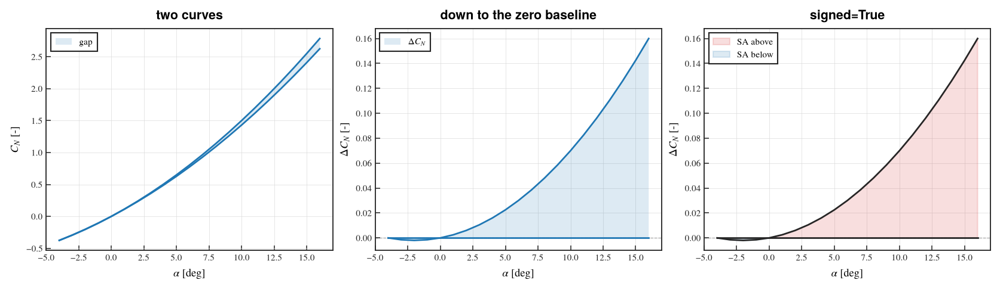

```python
fill_between_curves(ax, x, y1, y2=0.0, *, color=None, alpha=0.15, label=None,
                    lines=True, line_kwargs=None, signed=False,
                    signed_colors=("tab:red", "tab:blue"), signed_labels=(None, None),
                    **fill_kwargs) -> (list[Line2D], list[PolyCollection])
```

Where `plot_with_band` shades an *uncertainty band around a central line*, this shades the
*gap between two curves that both matter* — a baseline against a modified configuration,
CFD against wind-tunnel data, the upper and lower bounds of an envelope. Neither curve is
privileged and there is no central line.

```python
fill_between_curves(ax, alpha, cn_sa, cn_kw, label="gap")     # between two curves
fill_between_curves(ax, alpha, cn_sa - cn_kw)                 # down to the zero baseline
fill_between_curves(ax, alpha, cn_sa, cn_kw, lines=False)     # shading only
```

The fill and both boundaries share one colour — the next of the cycle unless you pass
`color` — so the group reads as a single object. Only the fill is labelled; pass
`line_kwargs={"label": …}` if you want a boundary in the legend too. Boundaries carry no
markers by default: they delimit a region rather than report measurements.

**`signed=True`** splits the fill in two, coloured by which curve is on top — the useful
mode for "where does A beat B?". `interpolate=True` is applied for you so each half stops
exactly at the crossings instead of at the last sample before them. Here the fills carry
the meaning, so both boundaries drop to one neutral colour rather than competing for
attention:

```python
fill_between_curves(ax, alpha, cn_sa - cn_kw, signed=True,
                    signed_labels=("SA above", "SA below"))
```

---

## 4. Titles and annotations


```python
set_title(ax, text, **kwargs)          # styled axes title
set_subtitle(ax, text, **kwargs)       # smaller grey line under the title
set_suptitle(fig, text, **kwargs)      # figure-level title
add_textbox(ax, text, *, loc="upper right", fontsize=None, **kwargs)
annotate_point(ax, text, xy, *, xytext=None, offset=(30, 20), **kwargs)
add_reference_lines(ax, *, hlines=None, vlines=None, **kwargs)
```

```python
set_title(ax, "Normal force polar")
set_subtitle(ax, "M = 0.7, Re = 6e6")            # call AFTER set_title
add_reference_lines(ax, hlines=[0.0], vlines=[0.0])
add_textbox(ax, "mesh: 20 M cells\nsolver: foamRun", loc="upper left")
annotate_point(ax, "stall onset", (12.0, 1.89), offset=(-90, 30))
```

Two ordering rules worth remembering:

- **`set_subtitle` must come after `set_title`** — it reads the resolved title font size to
  pick its own, and pushes the title up to make room.
- **`annotate_point`'s `offset` is in points**, relative to the annotated data point;
  negative x moves the label left. Use it instead of hand-computing `xytext` in data
  coordinates, which breaks the moment the axis limits change.

To name a *stretch* of the x axis rather than a point — a regime, a domain, a phase — see
[19. Domain regions](#19-domain-regions).

---

## 5. Axes helpers


```python
dual_axis(ax, *, ylabel="", color=None) -> Axes
set_axis_sci(ax, axis="y", *, scilimits=(0, 0), useMathText=True, useOffset=True)
sync_axes_limits(axes, *, which="y", margin=None)
apply_oldschool_axes(ax, *, legend=True, legend_kwargs=None)
```

**`dual_axis`** is a styled `twinx()`: pass `color=` and the right spine, ticks and label are
all tinted, so the reader can tell which curve belongs to which scale.

```python
ax_r = dual_axis(ax, ylabel=r"$C_D$ [-]", color="C3")
plot_line(ax_r, alpha, cd, marker="s", color="C3", label=r"$C_D$")
```

**`set_axis_sci`** forces clean scientific notation (`×10⁻⁴` in the corner) — the right call
for residuals and small pressure differences.

**`apply_oldschool_axes`** applies the spine/tick/legend polish on its own — useful when you
built the axes yourself and only want the finishing touches.

### `sync_axes_limits`

Panels drawn side by side autoscale independently, so a curve that looks steep in one panel
and flat in another may be the same curve. `sync_axes_limits` scans the *plotted data* of
every axes you give it, takes the global min/max, pads it the way Matplotlib's autoscale
would, and applies that one range everywhere. This is what makes multi-panel comparisons
honest:


```python
sync_axes_limits(axes, which="y")                # or "x", or "both"
sync_axes_limits(axes, which="y", margin=0.0)    # flush with the data — no padding
sync_axes_limits(fig.axes, which="both")         # accepts any Axes iterable, or a bare Axes
```

**Every kind of drawn data is scanned**, not just curves:

| Scanned | Covers |
|:---|:---|
| lines | `ax.plot`, `plot_line`, the line part of `ax.errorbar` |
| collections | `ax.scatter`, `ax.fill_between` — so the band of `plot_with_band` is included, not clipped — `pcolormesh`, … |
| patches | `ax.bar`, `plot_bar` |
| images | `ax.imshow`, via its extent |

**Deliberately ignored:** artists drawn in a *blended* transform, because they mark a
position rather than carry data — `ax.axhline`/`ax.axvline` (so `add_reference_lines`) and
`ax.axhspan`/`ax.axvspan`. A reference line at an arbitrary value therefore cannot blow up
the shared scale. Invisible artists are skipped too.

**Sticky edges are honoured**, like Matplotlib's own autoscale: a bar chart whose data starts
at zero keeps sitting on its baseline instead of floating above it.

Call it **after** plotting everything and before saving. It sets explicit limits, so anything
drawn afterwards will not re-trigger autoscale.

> Fixed in the current version: `sync_axes_limits` previously scanned only `Line2D` artists.
> Panels containing scatters, bars, images or fill-betweens were left unsynced — and a mix of
> a line panel and a scatter panel synced to the *line's* range, silently clipping the
> scatter. If you have code that worked around this, you can drop the workaround.

---

## 6. Legends


```python
make_legend(ax, **kwargs)
make_figure_legend(fig, axes=None, *, loc="center right", bbox_to_anchor=(1.02, 0.5),
                   ncol=1, dedupe=True, frame_linewidth=None, **kwargs)
```

`make_legend` is the per-axes legend with the house frame. `make_figure_legend` collects
handles from **every** axes, drops duplicate labels (`dedupe=True`) and places one legend
outside the figure — the right choice when panels share the same series:

```python
fig, axes = new_figure(1, 2)
# ... plot the same three series on both panels ...
make_figure_legend(fig, axes, loc="center right", bbox_to_anchor=(1.13, 0.5))
```

---

## 7. 2D scalar fields


```python
plot_contour(ax, x, y, z, *, levels=15, colors=None, cmap=None, linewidths=1.0, ...)
plot_contourf(ax, x, y, z, *, levels=20, cmap="viridis", colorbar=True, ...)
plot_pcolormesh(ax, x, y, z, *, cmap="viridis", shading="auto", colorbar=True, ...)
plot_imshow(ax, z, *, extent=None, origin="lower", cmap="viridis", colorbar=True, ...)
```

All four **return `(artist, colorbar)`** — the colorbar is `None` when `colorbar=False`.
Remember to unpack:

```python
mesh, cbar = plot_pcolormesh(ax, x, y, z, cmap="RdBu_r", cbar_label=r"$C_p$ [-]")
```

Which one to use:

| Function | Use when | Notes |
|:---|:---|:---|
| `plot_contour` | you want **lines only**, e.g. Mach isolines over a filled field | `colors="k"` for monochrome |
| `plot_contourf` | smooth filled field, publication look | interpolates between levels |
| `plot_pcolormesh` | you must show the **real cell values**, no interpolation | honest for coarse grids |
| `plot_imshow` | regularly-spaced data, fastest path | needs `extent=(x0, x1, y0, y1)` |

Shared keywords: `vmin`/`vmax`/`norm` (colour scaling), `cbar_label`, `bad_color` (colour for
masked cells), `aspect` (`"equal"` by default — geometry is not distorted).

`x` and `y` accept either 1D vectors or full 2D meshgrids; they are normalised internally.

---

## 8. Interpolation


```python
interpolate_field2d(x, y, z, *, factor=2, method="cubic") -> (xi, yi, zi)
plot_pcolormesh_interp(ax, x, y, z, *, factor=2, method="cubic", ...)
```

Refines a structured grid by `factor` in each direction (requires SciPy —
`pip install -e ".[interp]"`). `plot_pcolormesh_interp` interpolates and draws in one call.

> **Interpolation is cosmetic.** It makes a coarse CFD grid look smooth; it does not add
> information and it will happily smooth over a shock. For quantitative plots prefer
> `plot_pcolormesh` on the raw grid.

---

## 9. Masking bodies


```python
mask_field(z, condition, *, fill=None) -> np.ma.MaskedArray
dataframe_to_masked_grid(df, *, x="x", y="y", values=None, mask_column, mask_value,
                         keep=True, fill=None, sort=True)
```

`mask_field` blanks the cells where `condition` is `True` — typically the solid body inside
the domain. Then either grey them out with `bad_color`, or draw the silhouette with the
`mask_outline` family of keywords available on `plot_contourf`, `plot_pcolormesh` and
`plot_contour_quiver`:

```python
inside = (X**2 / 1.1**2 + Y**2 / 0.45**2) < 1.0
z_masked = mask_field(z, inside)

plot_pcolormesh(ax, x, y, z_masked, bad_color="0.85")                    # grey body

plot_contourf(ax, x, y, z_masked, bad_color="white",
              mask_outline=inside, mask_outline_color="k", mask_outline_width=1.8)
```

| Keyword | Meaning |
|:---|:---|
| `mask_outline` | boolean array — the region to outline |
| `mask_outline_color` / `_width` | stroke colour and width |
| `mask_outline_level` | contour level of the boolean field (default `0.5` — the edge) |
| `mask_outline_zorder` | draw order; raise it to keep the outline on top |

---

## 10. Vector fields


```python
compute_speed(u, v) -> np.ndarray
subsample_vectors(x, y, u, v, *, stride=None, target=25) -> (x, y, u, v)
plot_quiver(ax, x, y, u, v, *, color=None, scale=None, pivot="mid", stride=None,
            magnitude_color=False, cmap="viridis", colorbar=False, ...)
plot_streamplot(ax, x, y, u, v, *, density=1.2, color=None, linewidth=None,
                cmap="viridis", norm=None, colorbar=False, ...)
```

A full CFD grid has far too many cells to draw an arrow per cell. Two ways to thin it out:

```python
plot_quiver(ax, x, y, u, v, stride=4)                        # every 4th point
xs, ys, us, vs = subsample_vectors(x, y, u, v, target=18)    # ≈18 arrows per direction
```

`target=` is usually what you want: it picks the stride for you, so arrow density stays
readable no matter the grid resolution.

Colour the arrows by magnitude with `magnitude_color=True`, or colour streamlines by any field:

```python
speed = compute_speed(u, v)
plot_streamplot(ax, x, y, u, v, density=1.4, color=speed, cmap="plasma",
                colorbar=True, cbar_label=r"$|U|$ [m/s]")
```

---

## 11. Combined scalar + vector


```python
plot_contour_quiver(ax, x, y, z, u, v, *, scalar_kind="contourf", levels=20,
                    cmap="viridis", cbar_label=None, quiver_stride=4,
                    quiver_color="k", quiver_scale=None, mask_outline=None, ...)
```

Scalar background + velocity arrows in one call; returns `(scalar_artist, quiver, colorbar)`.
`scalar_kind` selects the background renderer (`"contourf"`, `"contour"`, `"pcolormesh"`).

The right-hand panel above shows the manual equivalent — draw the background yourself, then
overlay `subsample_vectors` + `plot_quiver` — which you want when the two layers need
different masks or colour scales.

---

## 12. Shared colorbar


```python
add_shared_colorbar(fig, mappable, *, axes=None, location="right", size="2%",
                    pad=0.02, match_axes=True, label=None, **kwargs)
```

One colour scale across several panels — mandatory when the panels are meant to be compared.
Two things must line up:

1. **Pin the scale on every panel** with the same `vmin`/`vmax`, otherwise each panel
   normalises independently and the shared bar lies.
2. **Turn off the per-panel colorbars** with `colorbar=False`.

```python
fig, axes = new_figure(1, 3, figsize=(14, 3.8))
for ax, mach in zip(axes, (0.5, 0.7, 0.85), strict=True):
    mappable, _ = plot_pcolormesh(ax, x, y, cp[mach], cmap="RdBu_r",
                                  colorbar=False, vmin=-0.9, vmax=0.9)
add_shared_colorbar(fig, mappable, axes=axes, location="right", label=r"$C_p$ [-]")
```

With `match_axes=True` (default) the bar height is computed from the bounding box of the
target axes, so it aligns with the panels instead of the whole figure.

---

## 13. Data preparation


Post-processing usually hands you a **long** table (one row per point), while the plotting
functions want a **2D grid**. These bridge the gap:

```python
reshape_structured2d(x, y, values, *, order="yx") -> (X, Y, Z)
dataframe_to_grid(df, *, x="x", y="y", values=None, sort=True) -> (x, y, Z)
dataframe_to_masked_grid(df, *, x="x", y="y", values=None, mask_column, mask_value, ...)
extract_slice2d(field, *, axis, index=None, coord=None, x=None, y=None, z=None)
mask_field(z, condition, *, fill=None)
```

```python
df = pd.read_csv("surface.csv")          # columns: x, y, cp
gx, gy, gz = dataframe_to_grid(df, x="x", y="y", values="cp")
plot_pcolormesh(ax, gx, gy, gz, cbar_label=r"$C_p$ [-]")
```

**`extract_slice2d` cuts a plane out of a 3D volume**, not a line out of a plane. The volume
must be shaped `(nx, ny, nz)` — i.e. `np.meshgrid(x, y, z, indexing="ij")` ordering — and it
returns `(c1, c2, plane)`:

```python
X, Y, Z = np.meshgrid(x, y, z, indexing="ij")
c1, c2, plane = extract_slice2d(volume, axis="z", coord=0.75, x=x, y=y, z=z)
plot_pcolormesh(ax, c1, c2, plane)
```

Use `index=` for a direct index or `coord=` for the nearest physical coordinate (which needs
the matching 1D coordinate vector).

---

## 14. Exporting figures

```python
save_figure(fig, path, *, formats=("png",), dpi=None, transparent=None,
            declassify=None, declassify_label="DECLASSIFIE",
            declassify_stamp_kw=None, report=False) -> list[Path]
print_file_report(files, *, title="Exported files")
```

`path` is a base path **without extension**; parent directories are created for you.
Supported formats: `png`, `svg`, `pdf`, `emf` (EMF goes through an SVG intermediate and needs
Inkscape on `PATH` — without it the SVG is kept and a warning is logged).

```python
files = save_figure(fig, "output/polar", formats=("png", "svg", "pdf"), report=True)
```

`report=True` prints a table of what was written (Rich if installed, plain text otherwise).

### Declassified variants

`declassify="x" | "y" | "both"` writes a **second** file alongside the normal one with the
tick labels stripped from those axes and a stamp in the corner — for sharing a trend without
disclosing the values.

| Normal | `declassify="y"` |
|:---:|:---:|
|  |  |

```python
save_figure(fig, "output/polar", formats=("png",), declassify="y")
# → output/polar.png  and  output/polar_declass_y.png
```

Override the stamp text with `declassify_label=`, its appearance with `declassify_stamp_kw=`.

---

## 15. Batch plotting

The problem: you have results from several sources (CFD codes, analytics, wind tunnel), for
many flight points, and you want the same comparison figure for every combination.
`batch_plot` takes four dictionaries and writes the whole tree.


### The four dictionaries

**`configuration_dict`** — one entry per data source. `df` is the loaded DataFrame; every key
Matplotlib recognises (`color`, `marker`, `linestyle`, the `lw`/`ls`/`ms` aliases, …) is
forwarded to `plot_line` as a style keyword.

```python
configuration_dict = {
    "KW":  {"name": "KW",  "label": r"$k$-$\omega$", "df": df_kw,  "color": "C0", "marker": "o"},
    "SA":  {"name": "SA",  "label": "SA",            "df": df_sa,  "color": "C1", "marker": "s"},
    "EXP": {"name": "REF", "label": "Ref.",          "df": df_exp, "color": "C2",
            "marker": "^", "linestyle": "--"},
}
```

Every *other* key is yours. An entry is the natural place to record what the source actually
is, and those keys are simply left alone — they never reach `ax.plot`:

```python
configuration_dict = {
    "KW": {"name": "KW", "label": r"$k$-$\omega$", "df": df_kw,
           "color": "C0", "marker": "o",     # → plot_line
           "masse": 1200.0, "maillage": "fin", "run": "2026-02-11_A"},   # → yours
}
```

The list of accepted keywords is asked of Matplotlib itself, so it follows the version you
have installed. Three helpers say which side of the line a key falls on, and `verbose=True`
prints a `Metadata keys` line naming everything kept aside — that is where a misspelt
`colour` shows up, since an unknown keyword is now ignored instead of raising:

```python
from cfd_plot import config_style_keys, config_extra_keys, ignored_config_keys

config_style_keys(configuration_dict["KW"])   # ['color', 'marker']
config_extra_keys(configuration_dict["KW"])   # ['maillage', 'masse', 'run']
ignored_config_keys(configuration_dict)       # {'KW': ['maillage', 'masse', 'run']}
```

If you ever need to force a keyword through untouched, put it under `style`: that sub-dict is
merged last and never filtered.

```python
"KW": {"df": df_kw, "color": "C0", "style": {"path_effects": [...], "gapcolor": "w"}},
```

**`y_axis_dict`** — the quantities of interest (one figure per entry).

```python
y_axis_dict = {
    "CN": {"col_name": "CN", "literal_name": "Normal force coefficient",
           "symbol": r"$C_N$", "unit": "-", "y_save_name": "CN"},
}
```

**`sweep_dict`** — the variables that can go on the X axis. `polar_prefix` names the top
directory level; `save_name` is used for sibling sweeps pinned in the path.

```python
sweep_dict = {
    "alpha": {"col_name": "alpha", "literal_name": "Angle of attack", "symbol": r"$\alpha$",
              "unit": "°", "x_save_name": "alpha", "polar_prefix": "ALPHA_POLAR",
              "label": r"$\alpha$", "save_name": "ALPHA"},
}
```

**`flight_point_dict`** — the parameters that define a flight point. `values` can be left
empty and discovered from the data:

```python
from cfd_plot import discover_flight_point_values

keys = ["Mach", "Altitude_m", "alpha", "beta"]
found = discover_flight_point_values(configuration_dict, keys)
flight_point_dict = {
    "Mach":       {"values": found["Mach"],       "label": "M", "save_name": "M", "unit": "-"},
    "Altitude_m": {"values": found["Altitude_m"], "label": "Z", "save_name": "Z", "unit": "m"},
    "alpha":      {"values": found["alpha"],      "label": r"$\alpha$", "save_name": "ALPHA", "unit": "°"},
    "beta":       {"values": found["beta"],       "label": r"$\beta$",  "save_name": "BETA",  "unit": "°"},
}
```

A key present in **both** `sweep_dict` and `flight_point_dict` is automatically dropped from
the flight point when it is the current X axis — so you can keep one reusable
`flight_point_dict` across projects instead of editing it per sweep.
`DEFAULT_FLIGHT_POINT_KEYS` is `("Mach", "Altitude_m", "DL", "DM", "DN")`.

### Running it

```python
from cfd_plot import batch_plot

written = batch_plot(
    configuration_dict=configuration_dict,
    y_axis_dict=y_axis_dict,
    sweep_dict=sweep_dict,
    flight_point_dict=flight_point_dict,
    output_base="09_POST_TRAITEMENT/FIGURE",
    style_profile="paper",
    formats=("svg",),
    n_jobs=-1,          # all cores; 1 = serial
    dry_run=False,      # True → report what would be written, draw nothing
    report=True,
)
```

Output tree — one directory level per varying parameter; levels for constant parameters are
omitted:

```
FIGURE/
└── ALPHA_POLAR/            ← sweep_dict[...]["polar_prefix"]
    ├── M_0.7/
    │   ├── Z_5000/
    │   │   ├── BETA_0/
    │   │   │   └── CN_vs_alpha.svg
    │   │   └── BETA_2/
    │   └── Z_10000/
    └── M_0.85/
```

Start with `dry_run=True` — it reports the figure count without rendering, which is how you
catch a dictionary mistake before waiting on 200 renders.

### Comparing flight points on one figure


`batch_compare_flight_points` puts several flight points side by side as subplots. Each entry
of `compare_flight_points` is **one panel** and must pin *every* active flight-point key:

```python
from cfd_plot import batch_compare_flight_points

compare = {
    "M 0.70": {"Mach": 0.70, "Altitude_m": 5000, "beta": 0.0},
    "M 0.80": {"Mach": 0.80, "Altitude_m": 5000, "beta": 0.0},
    "M 0.85": {"Mach": 0.85, "Altitude_m": 5000, "beta": 0.0},
}

batch_compare_flight_points(
    configuration_dict=configuration_dict, y_axis_dict=y_axis_dict,
    sweep_dict=sweep_dict, flight_point_dict=flight_point_dict,
    compare_flight_points=compare, output_base="FIGURE",
    max_cols=3,      # 1–3 panels per row
)
```

Omitting a key raises `KeyError: compare_flight_points['…'] missing flight-point keys: [...]`.
The sweep variable (`alpha` here) is excluded automatically.

### Cleaning the output tree

A batch tree is generated output, and the generator only ever *writes*. Rename a Y variable,
drop a flight point, change a `save_name` — the previous run's files stay where they were and
nothing overwrites them. What you open afterwards is a directory holding two studies with no
way to tell which figure came from which. `clean` is the answer:

```python
batch_plot(..., clean=True)     # or clean="figures" — same thing
batch_plot(..., clean="all")    # rm -rf the tree, non-figures included
```

`clean=True` deletes only files with a figure extension (`.svg`, `.png`, `.pdf`, `.gif`,
`.mp4`, …) and then prunes the directories left empty — a `notes.md` or a CSV you dropped in
there survives. `clean="all"` removes the whole tree. Both honour `dry_run`, so
`batch_plot(dry_run=True, clean=True, verbose=True)` tells you what would go *and* what would
arrive, without touching the disk.

The same argument works on `batch_compare_flight_points`. Standalone:

```python
from cfd_plot import clean_figure_dir

report = clean_figure_dir("09_POST_TRAITEMENT/FIGURE", mode="figures", dry_run=True)
print(report.summary())   # clean (figures): would remove 214 file(s) and 61 empty ...
```

`output_base` is almost always assembled from variables, and an empty one turns it into `/`
or `$HOME` — where `mode="all"` is unrecoverable. So `clean_figure_dir` refuses the filesystem
root, the home directory, any top-level directory, and the root of a git repository. A figure
directory *inside* a repository is fine; the repository itself is not.

### Folding: bonus sheets that gather siblings

A batch run produces one figure per (polar, condition, Y). That is the right unit to *produce*
and the wrong unit to *read*: comparing CN against CA at one condition means opening two files,
and comparing one Y across nine incidences means opening nine files in nine directories.
`fold` writes **bonus sheets** that gather those siblings onto one page. The individual figures
stay exactly where they were — a fold is an extra file, never a replacement.

```python
batch_plot(..., fold="y")                # every Y of one condition, on one sheet
batch_plot(..., fold="context")          # one Y across conditions, as panels
batch_plot(..., fold="context-overlay")  # ... or all on one axes
batch_plot(..., fold=True)               # shorthand for ("y", "context")
```

`fold` exists on `batch_plot` only. A compare figure is already several flight points on one
sheet, so there is nothing left to fold.

#### The study these examples fold

Everything below is one real run, with **two sweeps** — so `alpha` is the x axis of one polar
and a pinned directory level in the other:

```python
sweep_dict  = {"alpha": {...}, "beta": {...}}   # → ALPHA_POLAR and BETA_POLAR
y_axis_dict = {"CN": {...},    "CA": {...}}     # → two quantities
# discovered from the data: Mach ∈ {0.70, 0.85}, Altitude_m ∈ {5000, 8000, 10000},
#                           alpha ∈ 0…8 (nine values), beta ∈ {0, 2}
```

That is **132 figures**, one directory level per varying parameter:

```
FIGURE/
├── ALPHA_POLAR/                     ← x = alpha, so beta is pinned in the path
│   ├── M_0.7/
│   │   ├── Z_5000/
│   │   │   ├── BETA_0/
│   │   │   │   ├── CN_vs_alpha.svg
│   │   │   │   └── CA_vs_alpha.svg
│   │   │   └── BETA_2/              ← the same two files
│   │   ├── Z_8000/                  ← ... and again, per beta
│   │   └── Z_10000/
│   └── M_0.85/                      ← ... and again, per altitude and beta
└── BETA_POLAR/                      ← x = beta, so *alpha* is pinned in the path
    ├── M_0.7/
    │   ├── Z_5000/
    │   │   ├── ALPHA_0/
    │   │   │   ├── CN_vs_beta.svg
    │   │   │   └── CA_vs_beta.svg
    │   │   ├── ALPHA_1/             ← ...
    │   │   └── ALPHA_8/             ← nine incidences, two files each
    │   ├── Z_8000/
    │   └── Z_10000/
    └── M_0.85/
```

`BETA_POLAR` is where folding earns its keep: 108 of those 132 files, spread over 54
directories that differ by one number.

#### `fold="y"` — every Y of one condition

One sheet per condition, one panel per entry of `y_axis_dict`, written **beside** the figures
it folds:

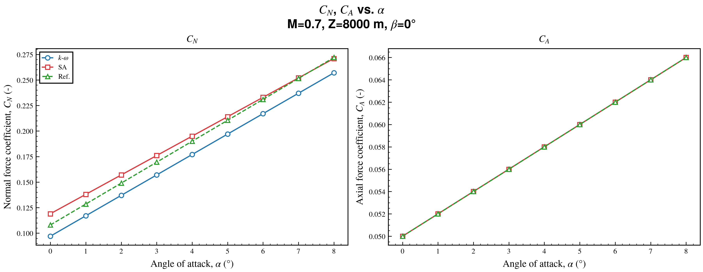

```
FIGURE/ALPHA_POLAR/M_0.7/Z_8000/BETA_0/
├── CN_vs_alpha.svg
├── CA_vs_alpha.svg
└── FOLD_Y_vs_alpha.svg      ← the fold: both quantities, same condition
```

**+66 sheets** here — one per leaf directory, in both polars (12 in `ALPHA_POLAR`, 54 in
`BETA_POLAR`). The panels keep **independent** axes: CN and CA have different units, so a
shared scale would flatten one of them. For the same reason `layout="overlay"` is rejected for
`kind="y"` — stacking quantities that share no unit on one axis is a coincidence, not a figure.

The heading names the quantities on the first line and the condition on the second, so the
sheet is readable out of context.

#### `fold="context"` — one Y across conditions

One sheet per Y, gathering the conditions that differ only by a directory level, under a
`FOLD/` sub-directory of the polar:

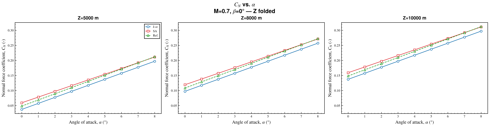

```python
batch_plot(..., fold=FoldSpec(kind="context", over=("Altitude_m",)))
```

```
FIGURE/ALPHA_POLAR/FOLD/
├── M_0.7/
│   ├── BETA_0/
│   │   ├── CN_vs_alpha_by_Z.svg     ← the three altitudes, one panel each
│   │   └── CA_vs_alpha_by_Z.svg
│   └── BETA_2/
└── M_0.85/
```

**+44 sheets**: 8 here (2 Mach × 2 beta × 2 Y), and 36 in `BETA_POLAR`, where the altitude
also varies under every pinned alpha.

Read the naming as a sentence: the **filename** says what was folded (`_by_Z`), the **path**
keeps what was not (`M_0.7/BETA_0`). Panels share their scales by default — same quantity,
same unit, so a common range is what makes them comparable.

#### `over=` — choosing what gets folded

`over` names the flight-point or sweep keys the sheet gathers. Left out, it folds *everything*
that varies inside the polar, which gives one family per Y covering the whole study.

The interesting case in this run is folding **over alpha**, in the polar where alpha is a
pinned directory level rather than the x axis:

```python
batch_plot(..., fold=FoldSpec(kind="context", over=("alpha",)))
```

```
FIGURE/BETA_POLAR/FOLD/
├── M_0.7/
│   ├── Z_5000/
│   │   ├── CN_vs_beta_by_ALPHA_p1of2.svg    ← alpha 0…5
│   │   ├── CN_vs_beta_by_ALPHA_p2of2.svg    ← alpha 6…8
│   │   ├── CA_vs_beta_by_ALPHA_p1of2.svg
│   │   └── CA_vs_beta_by_ALPHA_p2of2.svg
│   ├── Z_8000/
│   └── Z_10000/
└── M_0.85/
```

Nine directories of two files each collapse to two sheets per Y: **24 sheets standing in for
all 108 `BETA_POLAR` figures**. Nothing appears under `ALPHA_POLAR/` — there alpha is the
x axis, so there is no family of alphas to fold, and the key is skipped rather than erroring.
That is the general rule: a key that is a polar's own sweep, or that does not vary inside it,
simply produces no sheet there.

Naming a key that exists nowhere in the run *is* an error:

```
ValueError: FoldSpec.over refers to unknown keys ['Reynolds'].
            Available: ['Altitude_m', 'DL', 'DM', 'DN', 'Mach', 'alpha', 'beta'].
```

#### `max_panels` — a family too big for one sheet

A family larger than `max_panels` (6 by default) is **split**, never shrunk. The extra sheets
are numbered in the filename *and* in the subtitle, so a printed page still says which part it
is. The picture below is `CN_vs_beta_by_ALPHA_p1of2.svg` from the tree above — alpha 0 to 5,
with 6 to 8 on the second sheet:

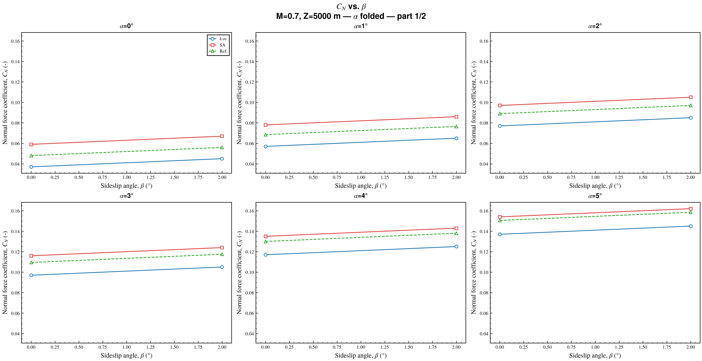

A family of **one** is skipped entirely — a single-panel sheet is a copy of the figure it
folds, under a name that suggests otherwise.

#### `layout="overlay"` — all conditions on one axes

The altitude family again — `over=("Altitude_m",)`, the same sheet as two sections above —
drawn together instead of side by side, under `FOLD_OVERLAY/`:

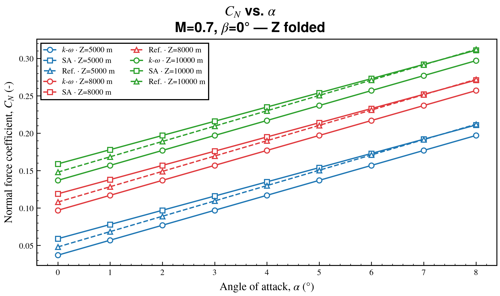

Colour reads the **condition**, marker and linestyle read the **source** — that assignment is
what keeps a legend of `n_conditions × n_sources` entries decodable. With a single source the
legend drops the source name and shows the conditions alone, which is what this layout is best
at: one CFD campaign, one model, several altitudes.

`overlay_color="source"` flips it — each source keeps its own colour, and the condition is read
off the dash pattern:

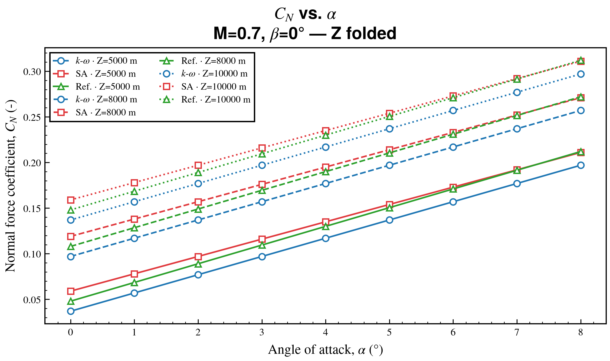

Whichever you pick, the style channel carrying the *condition* overrides what
`configuration_dict` set there — `color` under `"fold"`, `linestyle` under `"source"` — and the
other channel is passed through untouched.

#### Every option

```python
from cfd_plot import FoldSpec

batch_plot(
    ...,
    fold=[
        FoldSpec(kind="y"),
        FoldSpec(kind="context", over=("Altitude_m",), max_panels=6, max_cols=3),
        FoldSpec(kind="context", layout="overlay", over=("Altitude_m",)),
        FoldSpec(kind="context", layout="overlay", over=("Altitude_m",),
                 overlay_color="source", folder="FOLD_OVERLAY_SOURCE"),
    ],
)
```

| Field | Default | Meaning |
|:---|:---|:---|
| `kind` | `"y"` | `"y"` folds the quantities, `"context"` folds the conditions |
| `layout` | `"subplot"` | `"subplot"` or `"overlay"`; `"overlay"` is rejected for `kind="y"` |
| `over` | `None` | keys a context fold gathers; `None` = every key that varies in the polar |
| `max_panels` | `6` | panels (or overlaid conditions) per sheet; the rest go to `_p2of3`, … |
| `max_cols` | `3` | subplot grid width, 1–3 |
| `folder` | `None` | sub-directory of the polar; `None` → `FOLD` / `FOLD_OVERLAY` |
| `sync_axes` | `"auto"` | `"x"`, `"y"`, `"both"`, `None`; `"auto"` = `"both"` for context subplots, off elsewhere |
| `overlay_color` | `"fold"` | `"fold"` colours by condition, `"source"` colours by source |

Two specs of the same layout writing to the same folder would overwrite each other, which is
what `folder` is for — as in the fourth entry above.

Shorthand strings map onto specs: `"y"` → `FoldSpec(kind="y")`, `"context"` →
`FoldSpec(kind="context")`, `"context-overlay"` (alias `"overlay"`) →
`FoldSpec(kind="context", layout="overlay")`, and `fold=True` → `("y", "context")`. A typo is
reported with the list of valid names rather than silently folding nothing.

#### Folds in the rest of the pipeline

They are ordinary figures as far as everything else is concerned:

- `verbose=True` prints a *Folded sheets* table before anything is drawn, one row per spec
  with the number of sheets it will produce — including a **zero**, which is how a mistaken
  `over=` is caught early rather than by noticing an empty directory later;
- `dry_run=True` returns every path, folds included, without drawing;
- `n_jobs` renders them in the same process pool;
- `pdf_report` includes them, in a `Folded` section under their own polar rather than as an
  orphan chapter at the end;
- the returned list contains their paths;
- `on_before_save` is called once per axes, with `context.fold_kind`, `context.fold_layout`
  and `context.fold_label` set (an overlay has one axes, so it gets one call whose
  `fold_label` names every condition on it):

```python
def on_before_save(fig, ax, context):
    if context.fold_kind is not None and context.fold_layout == "subplot":
        add_textbox(ax, context.fold_label, loc="lower right")
```

Axis synchronisation happens **before** the hook, so a hook that pins its own limits still wins.

### Hooks

Two escape hatches keep the batch generic while letting you special-case individual figures.

**`include_curve(source_key, flight_point, x_key, y_key, fixed_sweeps) -> bool`** — return
`False` to omit one source from one figure:

```python
def include_curve(source_key, flight_point, x_key, y_key, fixed_sweeps):
    """Drop the experimental reference from axial-force polars."""
    return not (y_key == "CA" and source_key == "EXP")
```

**`on_before_save(fig, ax, context)`** — last call before writing, for extra artists or
axes-level tweaks. `context` is a `BatchPlotContext` with:

| Field | Meaning |
|:---|:---|
| `flight_point` | `dict` of the current flight-point values |
| `fixed_sweeps` | the sweeps pinned for this figure |
| `sweep_key`, `y_key` | current X and Y keys — **stable API, prefer these** |
| `x_spec`, `y_spec` | the matching dict entries |
| `polar_prefix` | top-level directory name |
| `output_path` | where the figure is about to be written |
| `compare_name` | set only in `batch_compare_flight_points` |
| `panel_index` | which panel this call is for, on compare figures and folded sheets |
| `fold_kind`, `fold_layout`, `fold_label` | set only on a [folded sheet](#folding-bonus-sheets-that-gather-siblings) |

```python
def on_before_save(fig, ax, context):
    if context.y_key == "CN":
        add_reference_lines(ax, hlines=[0.0])
    if context.flight_point.get("Mach", 0) > 0.8:
        add_textbox(ax, "transonic", loc="lower right")
```

Branch on `context.sweep_key` / `context.y_key`, not on `polar_prefix` — the keys are the
stable contract, the prefix is a path convenience.

### Path helpers

Available if you need to reproduce the naming outside a batch run: `build_output_path`,
`build_compare_output_path`, `format_axis_label`, `format_axis_title_label`,
`format_flight_point_title_suffix`, `format_plot_title`, `iter_flight_points`,
`iter_fixed_sweep_combinations`, `varying_flight_keys`. `FOLD_Y_STEM` is the filename stem a
`kind="y"` fold uses, if you need to find those sheets again.

### End-to-end example

```bash
cd tools/cfd-plot
python3 tests/E2E_MULTIPLE_PLOTTING/run_batch_plot.py
python3 tests/E2E_MULTIPLE_PLOTTING/run_batch_plot.py --dry-run --verbose
python3 tests/E2E_MULTIPLE_PLOTTING/run_batch_plot.py --n-jobs -1
python3 tests/E2E_MULTIPLE_PLOTTING/run_batch_plot.py --demo-hooks
python3 tests/E2E_MULTIPLE_PLOTTING/run_batch_plot.py --clean --fold y context
python3 tests/E2E_MULTIPLE_PLOTTING/run_batch_plot.py --fold context-overlay --fold-over Altitude_m
```

The CSV fixtures (`kw.csv`, `sa.csv`, `exp.csv`) show the expected column layout.

---

## 16. Animations (GIF / MP4)

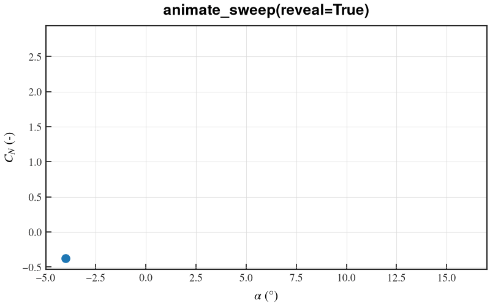

```python
from cfd_plot import animate_sweep

animate_sweep(alpha, cn, "polar.gif", reveal=True,
              xlabel=r"$\alpha$ (°)", ylabel=r"$C_N$ (-)")
```

### Why not `FuncAnimation` + `PillowWriter`?

Because the result shakes and boils, for four reasons that are not obvious until you
watch one:

| Symptom | Cause |
|:---|:---|
| Colours flicker frame to frame | the stock writers pick a **fresh 256-colour palette per frame** |
| The whole image jitters | `savefig.bbox: tight` — set by all three profiles — re-crops the figure to its ink on every save |
| The axes jump | `constrained_layout` re-solves the layout whenever a title or tick label changes width |
| The final state flashes past | no hold on the last frame; it gets one frame time, then the loop restarts |

`cfd_plot.anim` pins all four: one palette for the whole sequence, an `rc_context` that
switches tight cropping off for real, a layout frozen after the first frame, and a
`hold_last` in every preset. It never touches the global Matplotlib backend, so
animating from Spyder or Jupyter leaves your interactive session alone.

> Note: `savefig(bbox_inches=None)` does **not** disable tight cropping — `None` means
> "use the rcParam". Overriding the rcParam is the only way.

### Three layers

| Layer | Use when |
|:---|:---|
| `animate_sweep(...)` | one curve revealed, or one curve per frame |
| `animate(fig, ...)` | you own the loop — multi-panel, irregular data, anything else |
| `frames_to_gif` / `frames_to_mp4` | you already have images (ParaView, an earlier run) |

### Sweeping a family of curves

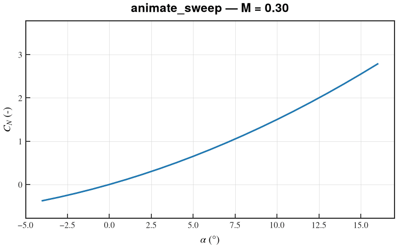

```python
animate_sweep(
    alpha, cn_per_mach, "sweep.gif",
    labels=[f"M = {m:.2f}" for m in mach],
    keep_previous=True,     # leave a faded trail
    boomerang=True,         # play back down instead of snapping to the start
)
```

`reveal` mode walks the *points* of a curve; sweep mode walks the *curves*. It is
inferred from the shape of `y` (1-D reveals, 2-D sweeps) and can be forced either way.
Labels follow the mode: in reveal mode they are legend entries (one per curve), in sweep
mode they name the frame and go to the title.

Axes are locked to the full dataset before the first frame. This is not cosmetic — a
revealed curve under per-frame autoscaling appears to *shrink* as it grows, and a swept
family appears to breathe. Pass `lock_axes=False` only if you set the limits yourself.

### Writing the loop yourself

```python
fig, (ax_conv, ax_polar) = new_figure(1, 2, figsize=(11.5, 4.6))
line_res = plot_line(ax_conv,  [], [], marker="")
line_pol = plot_line(ax_polar, [], [], marker="")
ax_conv.set(xlim=(1, n), ylim=(1e-6, 3), yscale="log")   # lock *before* capturing
ax_polar.set(xlim=(-4, 16), ylim=(-0.5, 3))

with animate(fig, "run.gif", preset="slides") as anim:
    for path in sorted(Path("runs").glob("iter_*.csv")):
        df = pd.read_csv(path)
        if df["residual"].iloc[-1] > 1e3:
            continue                                  # skip a diverged step
        line_res.set_data(df.iteration, df.residual)
        line_pol.set_data(df.alpha, df.CN)
        set_suptitle(fig, path.stem)
        anim.capture(hold=1.0 if converged else 0.0)  # linger on the moment

print(anim.result)   # run.gif — 140 frames at 20 fps (7.0 s), 1280x512 px, 167 kB
```

`capture(hold=...)` and `hold_first`/`hold_last` are expressed by *repeating* a frame,
not by per-frame delays: a repeated identical frame costs almost nothing in either
container, and variable delays are where GIF writers disagree with each other and with
browsers. (ffmpeg keeps the repeats; Pillow merges them into one longer delay. Same
playback time — do not assert on GIF frame count.) `animate_frames(fig, update, n, path)`
is the callback form for when every frame really is a pure function of an index.

### Presets

| Preset | Width | fps | Colours | Hold | For |
|:---|---:|---:|---:|---:|:---|
| `slides` *(default)* | 1280 | 20 | 256 | 1.0 s | projected, or pasted into PowerPoint |
| `readme` | 800 | 10 | 128 | 1.0 s | inline in a README or chat (GitHub stops rendering past ~10 MB) |
| `report` | 1600 | 25 | 256 | 1.5 s | written reports, high-DPI screens |

Every field is individually overridable (`fps=`, `width_px=`, `max_colors=`, `dither=`,
`hold_last=`), or pass your own `AnimPreset`. Sizing comes from `width_px`, **not** from
the profile DPI — `slides.mplstyle` asks for 600 dpi, which on its 12-inch figure would
be a 7200 px animation.

The shipped frame rates all divide 100 on purpose: GIF stores its delay in
centiseconds, so 15 fps is silently rounded to 70 ms (≈14.3 fps) by every viewer.

### Formats and encoders

```python
animate_sweep(alpha, cn, "polar", formats=("gif", "mp4"))   # one render, two files
```

GIF encoding uses **ffmpeg** when it is installed (two-pass `palettegen`/`paletteuse`)
and falls back to a pure-Pillow global-palette encoder when it is not — same stability,
larger files. MP4 requires ffmpeg and raises a message saying so. Use MP4 for
colour-mapped fields, where GIF must dither a continuous colormap into 256 entries and
the dither noise defeats its own compression; on line plots the two are comparable.

### Escape hatches

| Need | Knob |
|:---|:---|
| Decorate the axes yourself | `ax=` — nothing on it is overwritten but the limits |
| Change something per frame | `on_frame=lambda i, ax: ...`, run just before each capture |
| Keep the figure afterwards | `close_fig=False` → `result.fig`, `result.axes` |
| Keep the PNG frames | `keep_frames="dir/"` — re-encode later without re-rendering |
| See progress on a long run | `progress=True` (quiet when the output is not a terminal) |
| A file-size table | `report=True`, or `result.report()` |

A runnable walkthrough of all six lives in
[`01_EXEMPLE/demo_animation.py`](01_EXEMPLE/demo_animation.py).

---

## 17. Panel labels and palettes

Two things every publication figure needs, and neither of which the style
profiles can do for you.

### `panel_labels`

```python
from cfd_plot import new_figure, panel_labels, plot_line

fig, axes = new_figure(2, 2)
# ... plot into each panel ...
panel_labels(axes)                       # (a) (b) (c) (d), reading order
panel_labels(axes, fmt="{}.")            # a.  b.  c.  d.
panel_labels(axes, loc="upper right", outside=True)
```

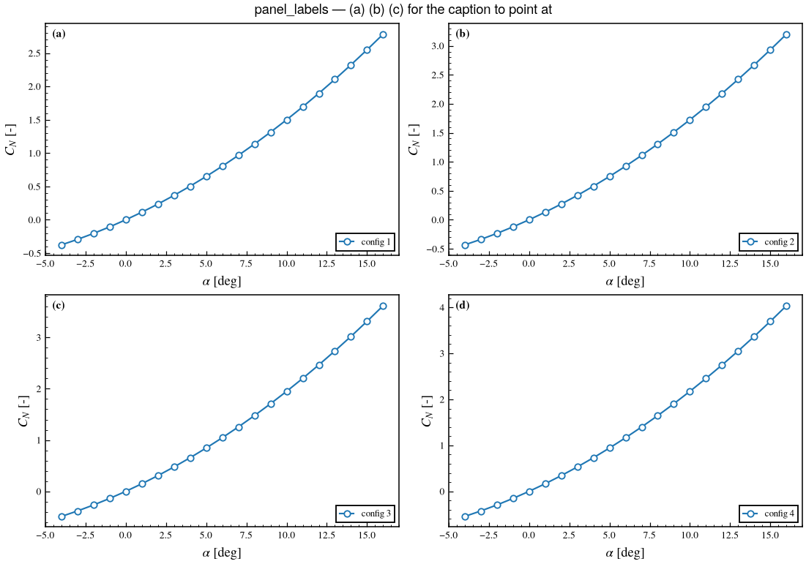

Labels are placed in **axes coordinates**, so they survive a limit change, a
shared axis, or a constrained-layout reflow. A 2-D array from `new_figure(2, 2)`
is flattened row-major — reading order. Panels that are not visible are skipped:
`plt.subplots` on an over-large grid leaves blank axes behind, and labelling
those would shift every subsequent letter onto the wrong panel.

Past 26 panels the default labels continue `aa`, `ab`, … rather than repeating.

### Palettes

Matplotlib's default `tab10` is fine on screen and poor everywhere else: two of
its ten colours are indistinguishable to a red-green deficiency, and the whole
cycle collapses when the paper is printed in black and white.

```python
from cfd_plot import palette_colors, palette_context, set_palette

with palette_context("okabe_ito"):        # global, restored on exit
    ...

set_palette("grayscale", ax=ax)           # scoped to one Axes — prefer this
colors = palette_colors("tol_bright", 5)  # assign by hand; cycles past the end
```

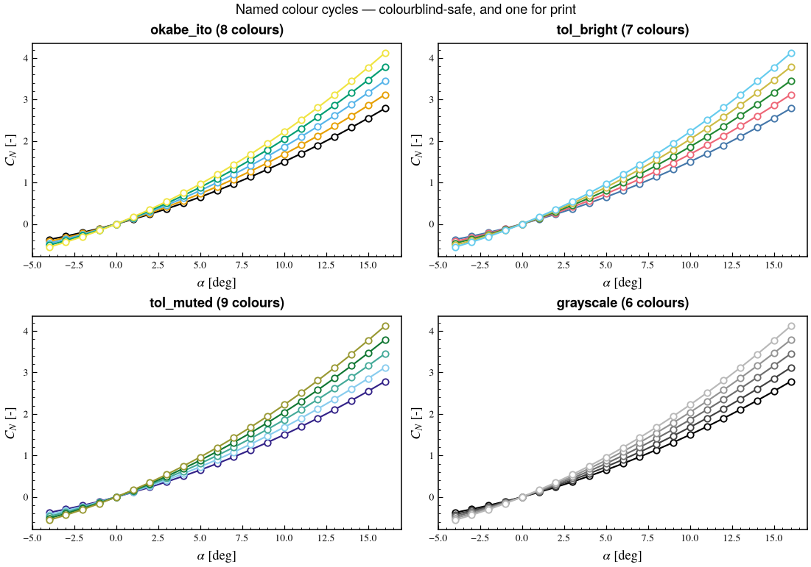

| Palette | Colours | For |
|:---|:--|:---|
| `okabe_ito` | 8 | The default recommendation — designed for all three common forms of colour blindness. Black first, so a single-series figure comes out black. |
| `tol_bright` | 7 | Paul Tol's bright qualitative scheme. |
| `tol_muted` | 9 | Tol's muted scheme; the trailing pale grey is his designated "bad data" colour. |
| `grayscale` | 6 | Print, and checking that a figure still reads with the colour gone. Spaced evenly in *luminance*, not in RGB. |
| `tab10` | 10 | Matplotlib's default, for when you deliberately want it. |

`set_palette(ax=...)` and `palette_context` exist because `set_palette()` on its
own mutates global rcParams permanently — occasionally what you want in a
notebook, almost never what you want in a script that also draws other figures.

---

## 18. PDF reports and contact sheets

A parametric study writes hundreds of figures into a nested tree. These two turn
that pile into something you can read, and hand to someone else.

### The short version

```python
from cfd_plot import batch_plot

batch_plot(..., output_base="figures/", pdf_report="ETUDE.pdf")
```

Cover page, table of contents, one divider per polar, one page per figure, page
numbers, and a clickable outline. The figures go in as **vector**.

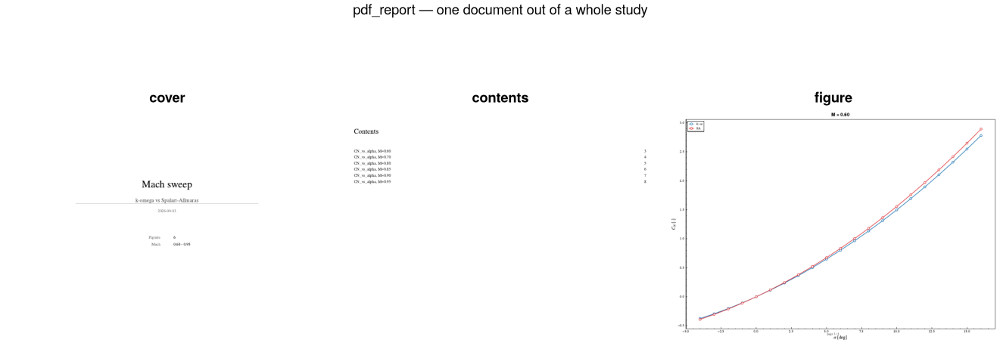

`formats=()` alongside it means *the report is the deliverable* — no loose figure
files at all.

### Why it is built during the run

Matplotlib has no vector-to-vector import: it cannot place an existing SVG or
PDF onto a page. A report assembled afterwards from the files on disk is
therefore necessarily **raster**. Building it while the figures are still open
keeps them vector, which is why `pdf_report=` is a `batch_plot` argument rather
than a post-processing step.

The cost is that rendering becomes sequential — `PdfPages` cannot cross a
process boundary — so `n_jobs` is forced to 1, with a warning. For a study whose
figures are ordinary line plots this is rarely the bottleneck. If it is, run the
batch in parallel with `formats=("png",)` and assemble afterwards:

```python
from cfd_plot import pdf_report
written = batch_plot(..., formats=("png",), n_jobs=-1)
pdf_report(written, "ETUDE.pdf", title="Etude")   # raster, but parallel
```

Memory is not a concern either way: the page plan — and therefore every table of
contents page number — is computed from the figure *labels* before anything is
drawn, so figures stream into the document one at a time.

### Building a report by hand

```python
from cfd_plot import ReportSection, pdf_report

pdf_report(
    [
        ReportSection("ALPHA_POLAR", [fig_a, fig_b]),
        ReportSection("BETA_POLAR", [fig_c]),
    ],
    "etude.pdf",
    title="Etude X",
    subtitle="k-omega vs SA vs essais",
    summary=[("Figures", "3"), ("Sources", "CFD, essais")],
)
```

Items are live `Figure` objects, paths to **raster** images, or nested
`ReportSection`s. Sections nest arbitrarily; `divider_depth` controls how deep a
section gets its own divider page (default: top level only — otherwise a
200-figure report is half divider pages), and `toc_depth` how deep the contents
list goes. Figures are listed by their `fig.set_label(...)`.

A figure you pass in is **not** closed and **not** permanently resized: a report
must not be a side effect that reshapes the figures it was handed.

### Options

| Argument | Default | Notes |
|:---|:--|:---|
| `page_size`, `landscape` | `"a4"`, `True` | `PAGE_SIZES` has A3/A4/A5/letter/legal. `page_size=None` keeps each figure's own size, giving mixed page sizes. |
| `n_up` | `None` | `(rows, cols)` to put several figures on a page. Figures are **rasterised** in this mode — compositing them is not otherwise possible. |
| `toc`, `toc_depth` | `True`, `1` | |
| `divider_depth` | `0` | |
| `footer` | `True` | `page n / N`, or a callable `(number, total) -> str`. |
| `metadata` | `None` | PDF document metadata. `title` fills `Title`. |
| `bookmarks` | `True` | Needs `pypdf`; see below. |

### The outline is optional

Matplotlib cannot write a PDF outline, so the clickable bookmark tree needs
[`pypdf`](https://pypi.org/project/pypdf/):

```bash
pip install 'cfd-plot[pdf]'
```

Without it the report is written **identically**, minus the outline, after one
`logging.info`. Nothing raises, and nothing is lost but navigation.

### Contact sheets

For triage rather than delivery: everything at once, so you can spot the one
that went wrong and go open it full size.

```python
from cfd_plot import contact_sheet

contact_sheet(pngs, "sheet.pdf", rows=4, cols=3, title="Study")
contact_sheet(pngs, "sheet.png", rows=2, cols=3)   # one PNG per page
```

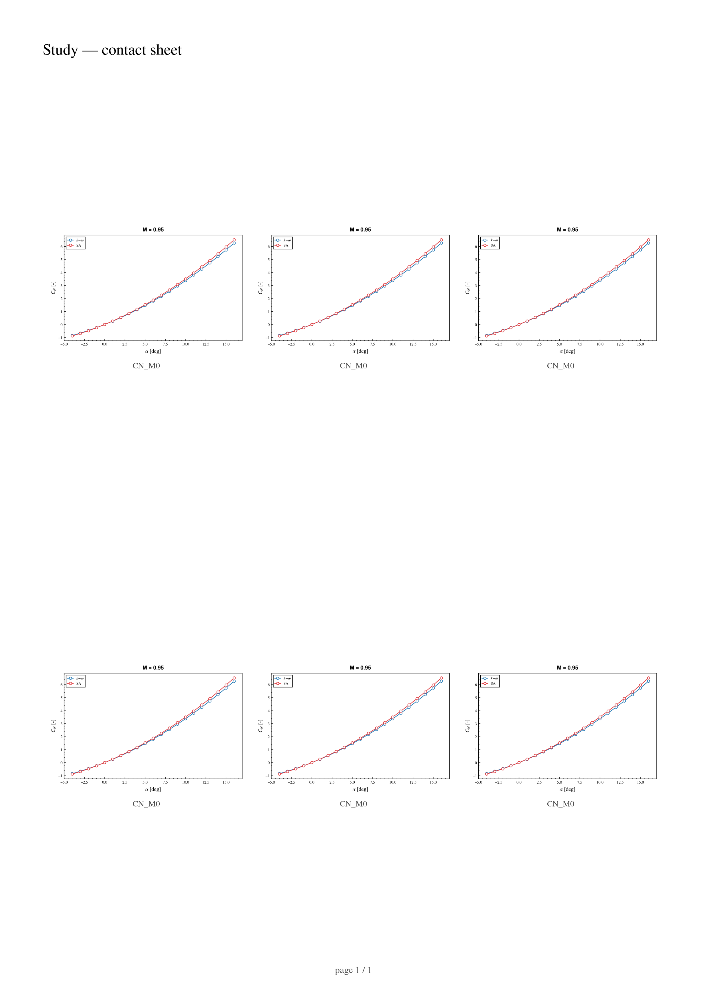

Each image is fitted to its own aspect ratio inside its cell and the axes sized
to match, rather than letterboxed inside a fixed cell — letterboxing leaves grey
margins that make a regular grid look ragged, and it is what the obvious
implementation gives you.

**Contact sheets read rasters, not SVG.** `batch_plot` writes SVG by default, so
export PNG as well (`formats=("svg", "png")`) or use `pdf_report=` instead. The
error message says so, because it is the first mistake everyone makes.


---

## 19. Domain regions

A sweep is rarely one regime. A Mach sweep goes subsonic, transonic, supersonic; a polar goes
attached, buffet, stalled. The model usually says so already, as an integer column sampled at
the same points as the curve — `iDomain`, `regime`, `flag`. `plot_domains` turns that column
into a light tint behind each region with its **name** written above it.

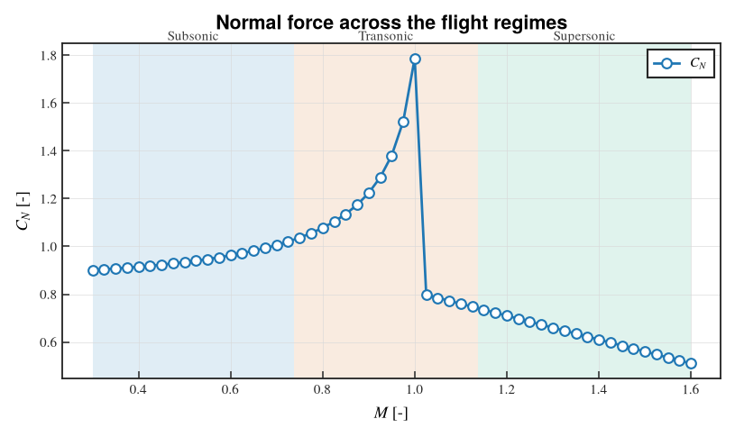

```python
from cfd_plot import plot_domains

plot_line(ax, mach, cn, label=r"$C_N$")
plot_domains(ax, mach, idomain, domains={
    0: "Subsonic",
    1: {"name": "Transonic", "color": "#D55E00"},
    2: "Supersonic",
})
```

`domains` maps a value to a name, to a dict (`name`, `color`, `hatch`, `alpha`), or to a
`Domain(...)`. It is optional: a value with no entry is named after itself and coloured from
the palette. Draw the curves **first** — the regions are sized from `x`.

### How the column is read

Consecutive points sharing a value form one region, so a value that comes back later gets a
*second* region rather than one stretched over the gap:

```python
domain_segments([0, 1, 2, 3], [0, 1, 1, 0])
# [(0, 0.0, 0.5), (1, 0.5, 2.5), (0, 2.5, 3.0)]
```

Three details that are decisions, not accidents:

- **The cut is halfway between the two samples that disagree.** The model only says the switch
  happened *between* them, and the midpoint is the only unbiased reading of that. Use
  `boundary="left"` or `"right"` to snap it to a sample instead.
- **Points are sorted by x first.** Solver output is not always monotonic, and unsorted input
  would produce regions that overlap each other.
- **A missing domain (`NaN`, `None`) breaks the run and is left blank.** Shading through a hole
  would claim a region the model never gave. A point with no `x` is simply dropped — it cannot
  be placed, and it says nothing about its neighbours.

### Ways to delimit, from lightest to heaviest

The default — a `0.12` fill plus a name above each region — is the quietest thing that still
reads at a glance. The alternatives exist because the right answer depends on how busy the
figure already is:

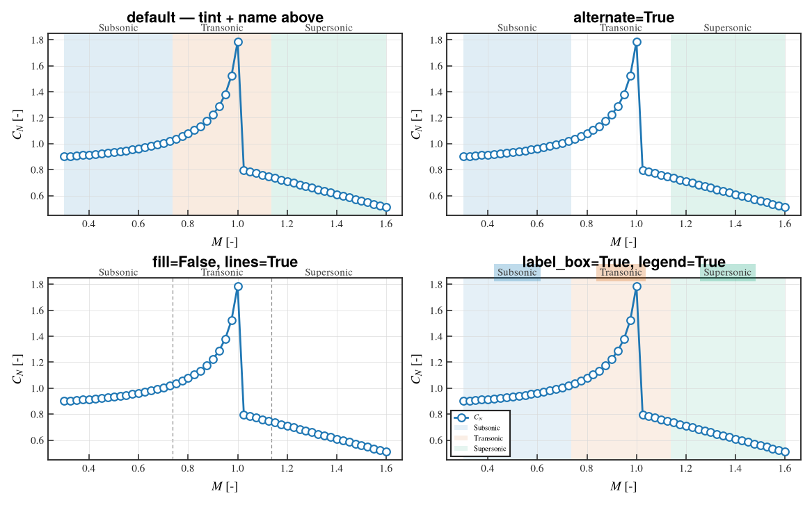

| Option | What it gives | When |
|:---|:---|:---|
| *(default)* | Tint + name above the frame | The general case |
| `alternate=True` | Tints every *other* region | A dense curve, or several overlapping ones — half the figure stays white |
| `lines=True` | A rule at each boundary | When *where* it changes matters more than *which* region it is; pass a dict to restyle |
| `fill=False, lines=True` | Boundaries only | Black-and-white printing, or a figure already carrying colour |
| `Domain(hatch="//")` | Hatching, drawn in the domain colour | The other black-and-white answer; survives a photocopier |
| `legend=True` | Names in the legend | Narrow regions, long names, small panels |
| `label_box=True` | Each name on a coloured chip | Reads as a ribbon above the axes, and ties a name to a pale tint |
| `label_loc="inside"` | Names under the top spine | When the header is already busy (a subtitle, a two-line suptitle) |

`label_loc="top"` (the default) writes the names just above the frame **and pushes the axes
title up** to make room — once per axes, no matter how many times you call it. `"inside"`,
`"bottom"` and `"none"` never touch the title.

### The rest of the arguments

```python
plot_domains(
    ax, x, domain, *,
    domains=None,            # {value: name | dict | Domain}
    palette="okabe_ito",     # colours for values without an explicit one
    alpha=0.12,              # fill opacity — context, never competing with the curve
    fill=True, alternate=False, lines=False,
    labels=True, label_loc="top", label_rotation=0.0, label_box=False,
    label_kwargs=None,       # forwarded to ax.text (fontsize, color, …)
    min_label_width=0.04,    # fraction of the x range below which a name is dropped
    legend=False,
    boundary="midpoint",     # "left" | "right"
    extend="data",           # "axes" → run the outer regions out to the axis limits
    zorder=0.0,
    **kwargs,                # forwarded to ax.axvspan
) -> list[DomainSpan]
```

- **`min_label_width`** is why a sliver region comes out unnamed: a name wider than its own
  region lands on its neighbour, which is worse than no name. Set it to `0.0` to force them
  all, or use `legend=True` to name the narrow ones somewhere they fit.
- **`extend="axes"`** removes the white slivers at the left and right edges (Matplotlib's
  autoscale margin sits outside the data). It reads the limits at call time, so call it last.
- **The returned `DomainSpan`s** carry `value`, `name`, `start`, `end`, `width`, `color`,
  `alpha`, and the `patch` / `text` artists — everything needed to keep tweaking.

### Colour stability across figures

Region colours are picked from the palette by the domain *value* when it is a non-negative
integer, not by order of appearance: `iDomain = 2` is the third palette colour whether or not
domains 0 and 1 occur in this particular sweep. A flight point that never leaves the transonic
range therefore keeps the colours of the one next to it — which is the whole point of a set of
figures meant to be compared. Pin them explicitly in `domains` when that is not enough.

With the default `okabe_ito` palette, domain `0` comes out neutral grey (its first colour is
black, faded to 12 %), which usually suits the baseline regime.

### In a batch

`plot_domains` is an ordinary axes helper, so in `batch_plot` it belongs in `on_before_save`.
Make the hook a **module-level** function or class — `batch_plot` silently drops to
`n_jobs=1` when its hook cannot be pickled:

```python
class DomainBands:
    """Shade the regime regions of whichever flight point is being drawn."""

    def __init__(self, df, *, column="iDomain", domains=None):
        self.df, self.column, self.domains = df, column, domains

    def __call__(self, fig, ax, context):
        sub = self.df
        for key, value in {**context.flight_point, **context.fixed_sweeps}.items():
            sub = sub[sub[key] == value]
        x_col = context.x_spec["col_name"]
        sub = sub.sort_values(x_col)
        plot_domains(ax, sub[x_col], sub[self.column], domains=self.domains)


batch_plot(..., on_before_save=DomainBands(df, domains={0: "Subsonic", 1: "Transonic"}))
```

---

## API reference

| Group | Functions |
|:---|:---|
| **Style** | `use_style`, `style_context`, `new_figure`, `register_fonts`, `BODY_FONT`, `TITLE_FONT` |
| **1D** | `plot_line`, `plot_with_band`, `fill_between_curves`, `plot_bar`, `apply_marker_style` |
| **2D scalar** | `plot_contour`, `plot_contourf`, `plot_pcolormesh`, `plot_imshow`, `plot_pcolormesh_interp`, `interpolate_field2d` |
| **2D vector** | `plot_quiver`, `plot_streamplot`, `compute_speed`, `subsample_vectors` |
| **2D composite** | `plot_contour_quiver` |
| **Annotations** | `set_title`, `set_subtitle`, `set_suptitle`, `add_textbox`, `annotate_point`, `add_reference_lines` |
| **Axes** | `dual_axis`, `set_axis_sci`, `sync_axes_limits`, `apply_oldschool_axes`, `add_shared_colorbar` |
| **Legends** | `make_legend`, `make_figure_legend` |
| **Data prep** | `reshape_structured2d`, `dataframe_to_grid`, `dataframe_to_masked_grid`, `mask_field`, `extract_slice2d` |
| **Export** | `save_figure`, `print_file_report` |
| **Batch** | `batch_plot`, `batch_compare_flight_points`, `BatchPlotContext`, `DEFAULT_FLIGHT_POINT_KEYS`, + path/label helpers |
| **Animation** | `animate_sweep`, `animate`, `animate_frames`, `Animator`, `AnimationResult` |
| **Animation → encoding** | `frames_to_gif`, `frames_to_mp4`, `ffmpeg_available`, `AnimPreset`, `PRESETS` |
| **Figure assembly** | `panel_labels`, `set_palette`, `palette_context`, `palette_colors`, `PALETTES` |
| **Domain regions** | `plot_domains`, `domain_segments`, `Domain`, `DomainSpan` |
| **PDF reports** | `pdf_report`, `contact_sheet`, `ReportSection`, `PdfReportSpec`, `PAGE_SIZES`; `batch_plot(..., pdf_report=...)` |

---

## Development

```
tools/cfd-plot/
├── pyproject.toml            # package metadata + ruff / mypy / pytest config
├── 00_DOC/
│   ├── generer_figures.py    # regenerates every picture in this README
│   └── FIGURES/              # the pictures (versioned)
├── 01_EXEMPLE/
│   ├── demo_plotting.py      # runnable tutorial, notebook-cell style
│   └── demo_animation.py     # animation walkthrough (GIF / MP4)
├── src/cfd_plot/
│   ├── __init__.py           # public API (grouped by topic — not alphabetical)
│   ├── mpl_template.py       # style, figure lifecycle, 1D, annotations, export
│   ├── field2d.py            # 2D scalar renderers + interpolation
│   ├── vector2d.py           # quiver / streamplot
│   ├── composite2d.py        # scalar + vector in one call
│   ├── batch.py              # dictionary-driven batch plotting
│   ├── prep.py               # long table → grid, slicing, masking
│   ├── _grid.py              # internal coordinate/cmap validators
│   ├── fonts/  styles/       # package data (TeX Gyre, 3 .mplstyle)
│   ├── layout.py             # panel labels
│   ├── palettes.py           # named colour cycles
│   ├── anim/                 # GIF / MP4 (encode → engine → sweep)
│   └── pdf/                  # reports (pages → sheet → assemble → bookmarks)
└── tests/
    ├── test_*.py
    ├── anim/
    ├── pdf/
    └── E2E_MULTIPLE_PLOTTING/   # batch driver + CSV fixtures
```

```bash
pytest                              # 590 tests
pytest --mpl                        # + compare figures against tests/baseline/
ruff check . && ruff format --check .
mypy src
python3 00_DOC/generer_figures.py   # rebuild the README pictures
```

### Image regression tests

`tests/test_images.py` renders 21 figures and compares them pixel-wise against
`tests/baseline/`, via [pytest-mpl](https://pytest-mpl.readthedocs.io). The rest
of the suite checks *structure* — a call returns a `Line2D`, limits match, a
colorbar exists — and is structurally blind to what the figure looks like, which
is the one thing this package exists to control.

- `pytest` alone builds the figures but **does not compare** them. That is
  pytest-mpl's design: you need `--mpl` to opt into comparison.
- After an *intended* visual change, regenerate and **look at the diffs**
  before committing:

  ```bash
  pytest tests/test_images.py --mpl-generate-path=tests/baseline
  ```

  A baseline nobody eyeballed is worse than no baseline: it locks in the
  regression.

The `tolerance=2` (RMS) was calibrated, not guessed. Injecting one deliberate
regression — `plot_line`'s white marker fill turned red — gives RMS 8.6–23.6 on
the affected tests, while an unchanged rerun gives < 0.01. At the tolerance of
20 originally tried, that regression slipped past 16 of the 18 tests unnoticed.
If you raise it, redo that experiment.

Note that pytest-mpl applies `style="classic"` by default, which would pin a
style this package never produces; the tests override it with `style="default"`
and establish the house profile themselves.

Every figure in this README is produced by `00_DOC/generer_figures.py`, one function per
section. **When you add a public helper, add a panel there too** — that is what keeps the
documentation honest.

Known debt, tracked in [`TODO.md`](TODO.md): mypy runs at `check_untyped_defs` level rather
than `strict` (the sibling packages are strict), and `ruff format` has never been applied to
this codebase.

---

## Troubleshooting

| Symptom | Cause | Fix |
|:---|:---|:---|
| `sync_axes_limits` leaves a panel unsynced | that panel's only data is a reference line / span — those are ignored by design | plot the real data, or set the limits by hand |
| `ModuleNotFoundError: No module named 'pandas'` on `import cfd_plot` | pandas is a hard dependency | `pip install pandas` |
| `ModuleNotFoundError: No module named 'scipy'` | `interpolate_field2d` needs SciPy | `pip install -e ".[interp]"` |
| `AttributeError: 'tuple' object has no attribute 'cmap'` | the 2D helpers return `(artist, colorbar)` | unpack: `artist, cbar = plot_pcolormesh(...)` |
| Shared colorbar does not match the panels | panels normalised independently | pass the same `vmin`/`vmax` everywhere and `colorbar=False` |
| `ValueError: field must be 3D` from `extract_slice2d` | it slices a 3D volume, not a 2D plane | index the 2D array directly, or pass an `(nx, ny, nz)` array |
| `KeyError: compare_flight_points[...] missing flight-point keys` | each compare entry must pin every active key | add the missing keys (the sweep variable is excluded) |
| Fonts look wrong / fall back to DejaVu | bundled fonts not registered | `register_fonts()`; check `src/cfd_plot/fonts/` was installed as package data |
| EMF export silently produces SVG | Inkscape not on `PATH` | install Inkscape, or export SVG/PDF |
| Image tests pass but never catch anything | `pytest` without `--mpl` builds figures without comparing | run `pytest --mpl` |
| `ValueError: Invalid RGBA argument: 'inherit'` | pre-1.1.0 `make_legend` under a style where `legend.edgecolor = "inherit"` (e.g. Matplotlib's `classic`) | fixed — upgrade |
| Title overlaps the subtitle | `set_subtitle` called before `set_title` | call `set_title` first |
| `AttributeError: 'Figure' object has no attribute 'get_layout_engine'` from `batch_compare_flight_points` or a folded sheet | Matplotlib older than 3.6 — typically one *provided* by the machine (module, container, site install) rather than the one `pyproject.toml` asked for | fixed — upgrade cfd-plot (the layout calls go through `cfd_plot._compat`, which speaks both APIs); `python -c "import matplotlib; print(matplotlib.__version__)"` tells you what you are actually running |
| `FigureCanvasAgg is non-interactive`, no window in Spyder / Jupyter / IPython | pre-1.1.0 `batch.py` called `matplotlib.use("Agg")` at import, so `import cfd_plot` forced a headless backend on the whole session | fixed — upgrade, then **restart the kernel** (the old backend is sticky in a running one) |
| `RuntimeError: the figure was resized mid-capture` | `set_size_inches` (or a helper that resizes) called inside the capture loop | size the figure before the first `capture()` |
| `ValueError: nothing was captured` | the loop never reached `capture()` — an empty iterable, or every frame hit a `continue` | check the loop actually yields frames |
| Animation colours flicker | a per-frame palette — you are not going through `cfd_plot.anim` | use `frames_to_gif`, which builds one palette for the sequence |
| The animation shakes or the axes jump | axis limits left to autoscale inside the loop | set the limits before the first capture, or let `animate_sweep` lock them |
| GIF too large for GitHub (~10 MB) | `slides`/`report` preset on a long sequence | `preset="readme"`, or `max_colors=64`, a lower `fps`, a smaller `width_px` — or emit MP4 |
| `RuntimeError: MP4 export requires ffmpeg` | ffmpeg not on `PATH` | `apt install ffmpeg` / `brew install ffmpeg`, or export GIF |
| GIF plays at the wrong speed | GIF delays are stored in centiseconds; an fps that does not divide 100 gets rounded | use 10, 20, 25 or 50 fps (all shipped presets already do) |
