# cfd-plot — Matplotlib figure template for CFD post-processing

A thin wrapper around Matplotlib that adds publication defaults (old-school framed axes,
white-filled markers, thick legend borders, bundled TeX Gyre fonts) **without hiding the
underlying API**. Every helper takes and returns ordinary Matplotlib objects, so you can
always drop back to `ax.something()` for anything the wrapper does not cover.

Three things it gives you that plain Matplotlib does not:

1. **Three consistent style profiles** — `notebook`, `slides`, `paper` — swapped with one call.
2. **CFD-shaped 2D helpers** — structured grids, masked bodies, vector fields, shared colorbars.
3. **Batch plotting** — generate hundreds of comparison figures across flight points from a
   handful of dictionaries.

---

## Table of contents

- [Install](#install)
- [Quick start](#quick-start)
- [1. Style profiles](#1-style-profiles)
- [2. Figure lifecycle](#2-figure-lifecycle)
- [3. 1D curves](#3-1d-curves)
- [4. Titles and annotations](#4-titles-and-annotations)
- [5. Axes helpers](#5-axes-helpers)
- [6. Legends](#6-legends)
- [7. 2D scalar fields](#7-2d-scalar-fields)
- [8. Interpolation](#8-interpolation)
- [9. Masking bodies](#9-masking-bodies)
- [10. Vector fields](#10-vector-fields)
- [11. Combined scalar + vector](#11-combined-scalar--vector)
- [12. Shared colorbar](#12-shared-colorbar)
- [13. Data preparation](#13-data-preparation)
- [14. Exporting figures](#14-exporting-figures)
- [15. Batch plotting](#15-batch-plotting)
- [16. Dispersion analysis](#16-dispersion-analysis)
- [API reference](#api-reference)
- [Development](#development)
- [Troubleshooting](#troubleshooting)

---

## Install

```bash
cd tools/cfd-plot
python3 -m venv .venv && source .venv/bin/activate
pip install -e ".[dev]"      # runtime deps + pytest / ruff / mypy
pytest                       # 239 tests
```

| Extra | Pulls | Needed for |
|:---|:---|:---|
| *(base)* | `matplotlib`, `numpy`, **`pandas`** | `import cfd_plot` |
| `.[dispersion]` | `scipy` | `cfd_plot.dispersion`, `interpolate_field2d` |
| `.[rich]` | `rich` | pretty terminal export reports |
| `.[dev]` | the above + `pytest`, `pytest-cov`, `pytest-mpl`, `ruff`, `mypy`, type stubs | development |

> **pandas is required, not optional.** `cfd_plot/__init__.py` re-exports `batch.py`, which
> imports pandas at module level — without it `import cfd_plot` raises `ImportError`.

Other packages in this repo (`cfd-perf`, `cfd-atm`, `cfd-stats`) import `cfd_plot`
*optionally*: install it next to them for house-styled figures, omit it and they fall back
to plain Matplotlib.

---

## Quick start

```python
import numpy as np
import matplotlib.pyplot as plt
from cfd_plot import use_style, plot_line, make_legend, save_figure

use_style("notebook")                       # or "slides", "paper"

alpha = np.linspace(-4, 16, 21)
fig, ax = plt.subplots()
plot_line(ax, alpha, 0.11 * alpha + 0.004 * alpha**2, label="SA")
plot_line(ax, alpha, 0.108 * alpha + 0.0035 * alpha**2, marker="s", label=r"$k$-$\omega$ SST")
ax.set_xlabel(r"$\alpha$ [deg]")
ax.set_ylabel(r"$C_N$ [-]")
make_legend(ax)

save_figure(fig, "output/polar", formats=("png", "svg"), report=True)
```

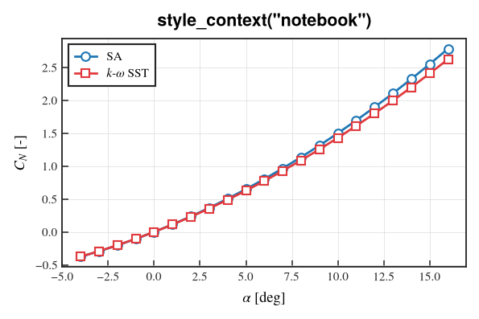

---

## 1. Style profiles

`use_style(profile)` applies a profile globally; `style_context(profile)` applies it to a
`with` block and restores the previous rcParams afterwards. Both accept `"notebook"`,
`"slides"`, `"paper"`.

| Profile | Target | Figsize | Base font | Line width | Grid | `savefig.dpi` |
|:---|:---|:---|:---|:---|:---|:---|
| `notebook` | screen, exploration | 8 × 5 | 11 | 1.8 | on | 150 |
| `slides` | projected slides | 12 × 7 | 16 | 2.8 | on | 600 |
| `paper` | reports, publications | 6 × 4 | 10 | 1.4 | **off** | 300 |

All three use a serif family (TeX Gyre Termes/Heros, bundled in `src/cfd_plot/fonts/` and
registered automatically at import — no system font install needed).

| `notebook` | `slides` | `paper` |
|:---:|:---:|:---:|
|  | 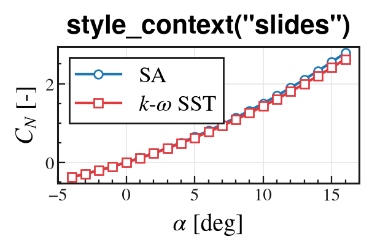 | 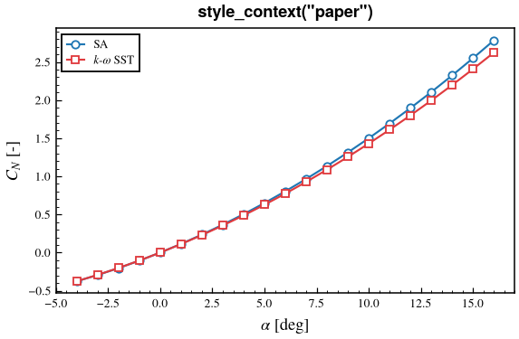 |

```python
from cfd_plot import use_style, style_context

use_style("paper")                  # global, stays until changed

with style_context("slides"):       # scoped, auto-restored
    ...                             # everything drawn here is slide-styled
```

**Rule of thumb:** use `style_context` in libraries and scripts that produce several figures
in different styles; use `use_style` once at the top of a notebook.

---

## 2. Figure lifecycle

```python
new_figure(nrows=1, ncols=1, *, profile=None, figsize=None, **subplots_kw) -> (fig, axes)
```

A `plt.subplots` wrapper that can apply a profile for this figure only. `axes` is a bare
`Axes` for 1×1, otherwise the usual NumPy array.

```python
from cfd_plot import new_figure

fig, ax = new_figure()                           # single axes
fig, axes = new_figure(2, 2, figsize=(12, 8))    # axes.ravel() to iterate
fig, axes = new_figure(1, 3, profile="paper")    # profile for this figure only
```

`register_fonts()` re-registers the bundled fonts; call it only if you dropped extra
`.otf`/`.ttf` files into `src/cfd_plot/fonts/` at runtime.

---

## 3. 1D curves

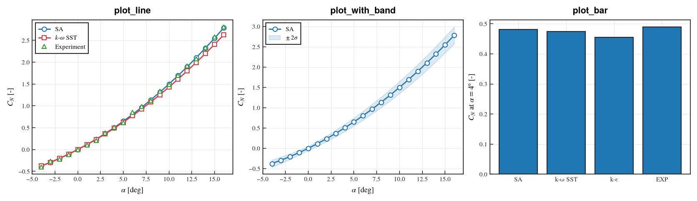

```python
plot_line(ax, x, y, *, marker="o", label=None, **kwargs) -> Line2D
plot_with_band(ax, x, y, *, y_low=None, y_high=None, band_alpha=0.15,
               band_color=None, band_label=None, **line_kwargs) -> (Line2D, PolyCollection | None)
plot_bar(ax, categories, values, *, label=None, color=None,
         edgecolor="0.15", edgewidth=None, **kwargs) -> BarContainer
```

`plot_line` is `ax.plot` plus the house marker treatment: white-filled markers with a
coloured edge, which stay readable when curves overlap. Any Matplotlib keyword passes
straight through (`ls`, `color`, `lw`, `alpha`, …).

```python
plot_line(ax, alpha, cn_sa, label="SA")
plot_line(ax, alpha, cn_kw, marker="s", label=r"$k$-$\omega$ SST")
plot_line(ax, alpha, cn_exp, marker="^", ls="none", label="Experiment")   # markers only
```

`plot_with_band` draws a curve plus a shaded envelope — uncertainty, min/max across a sweep,
±2σ from a dispersion study:

```python
plot_with_band(ax, alpha, cn, y_low=cn - 2 * sigma, y_high=cn + 2 * sigma,
               label="SA", band_label=r"$\pm\,2\sigma$")
```

`apply_marker_style(line)` retrofits the same marker treatment onto a `Line2D` you created
with plain `ax.plot`.

---

## 4. Titles and annotations

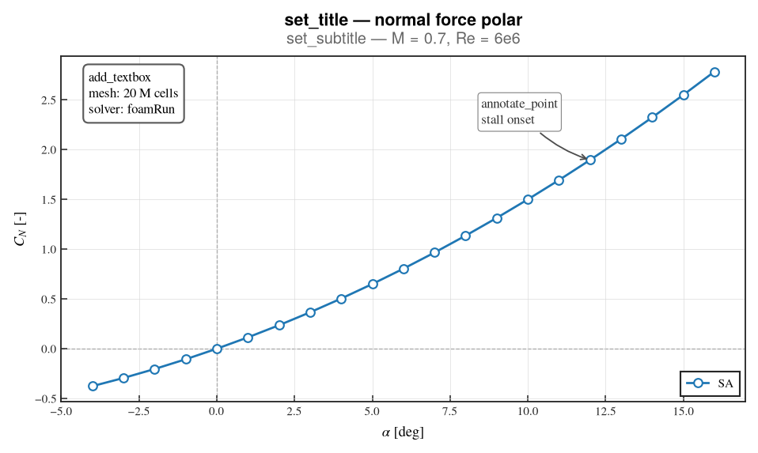

```python
set_title(ax, text, **kwargs)          # styled axes title
set_subtitle(ax, text, **kwargs)       # smaller grey line under the title
set_suptitle(fig, text, **kwargs)      # figure-level title
add_textbox(ax, text, *, loc="upper right", fontsize=None, **kwargs)
annotate_point(ax, text, xy, *, xytext=None, offset=(30, 20), **kwargs)
add_reference_lines(ax, *, hlines=None, vlines=None, **kwargs)
```

```python
set_title(ax, "Normal force polar")
set_subtitle(ax, "M = 0.7, Re = 6e6")            # call AFTER set_title
add_reference_lines(ax, hlines=[0.0], vlines=[0.0])
add_textbox(ax, "mesh: 20 M cells\nsolver: foamRun", loc="upper left")
annotate_point(ax, "stall onset", (12.0, 1.89), offset=(-90, 30))
```

Two ordering rules worth remembering:

- **`set_subtitle` must come after `set_title`** — it reads the resolved title font size to
  pick its own, and pushes the title up to make room.
- **`annotate_point`'s `offset` is in points**, relative to the annotated data point;
  negative x moves the label left. Use it instead of hand-computing `xytext` in data
  coordinates, which breaks the moment the axis limits change.

---

## 5. Axes helpers

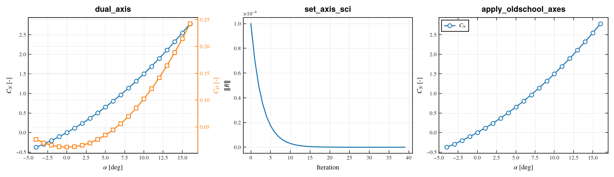

```python
dual_axis(ax, *, ylabel="", color=None) -> Axes
set_axis_sci(ax, axis="y", *, scilimits=(0, 0), useMathText=True, useOffset=True)
sync_axes_limits(axes, *, which="y", margin=None)
apply_oldschool_axes(ax, *, legend=True, legend_kwargs=None)
```

**`dual_axis`** is a styled `twinx()`: pass `color=` and the right spine, ticks and label are
all tinted, so the reader can tell which curve belongs to which scale.

```python
ax_r = dual_axis(ax, ylabel=r"$C_D$ [-]", color="C3")
plot_line(ax_r, alpha, cd, marker="s", color="C3", label=r"$C_D$")
```

**`set_axis_sci`** forces clean scientific notation (`×10⁻⁴` in the corner) — the right call
for residuals and small pressure differences.

**`apply_oldschool_axes`** applies the spine/tick/legend polish on its own — useful when you
built the axes yourself and only want the finishing touches.

### `sync_axes_limits`

Panels drawn side by side autoscale independently, so a curve that looks steep in one panel
and flat in another may be the same curve. `sync_axes_limits` scans the *plotted data* of
every axes you give it, takes the global min/max, pads it the way Matplotlib's autoscale
would, and applies that one range everywhere. This is what makes multi-panel comparisons
honest:

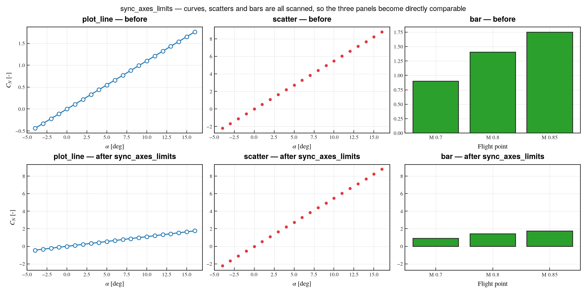

```python
sync_axes_limits(axes, which="y")                # or "x", or "both"
sync_axes_limits(axes, which="y", margin=0.0)    # flush with the data — no padding
sync_axes_limits(fig.axes, which="both")         # accepts any Axes iterable, or a bare Axes
```

**Every kind of drawn data is scanned**, not just curves:

| Scanned | Covers |
|:---|:---|
| lines | `ax.plot`, `plot_line`, the line part of `ax.errorbar` |
| collections | `ax.scatter`, `ax.fill_between` — so the band of `plot_with_band` is included, not clipped — `pcolormesh`, … |
| patches | `ax.bar`, `plot_bar` |
| images | `ax.imshow`, via its extent |

**Deliberately ignored:** artists drawn in a *blended* transform, because they mark a
position rather than carry data — `ax.axhline`/`ax.axvline` (so `add_reference_lines`) and
`ax.axhspan`/`ax.axvspan`. A reference line at an arbitrary value therefore cannot blow up
the shared scale. Invisible artists are skipped too.

**Sticky edges are honoured**, like Matplotlib's own autoscale: a bar chart whose data starts
at zero keeps sitting on its baseline instead of floating above it.

Call it **after** plotting everything and before saving. It sets explicit limits, so anything
drawn afterwards will not re-trigger autoscale.

> Fixed in the current version: `sync_axes_limits` previously scanned only `Line2D` artists.
> Panels containing scatters, bars, images or fill-betweens were left unsynced — and a mix of
> a line panel and a scatter panel synced to the *line's* range, silently clipping the
> scatter. If you have code that worked around this, you can drop the workaround.

---

## 6. Legends

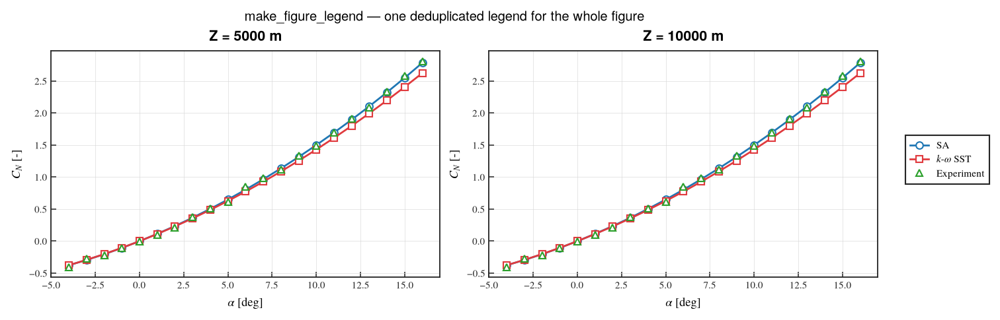

```python
make_legend(ax, **kwargs)
make_figure_legend(fig, axes=None, *, loc="center right", bbox_to_anchor=(1.02, 0.5),
                   ncol=1, dedupe=True, frame_linewidth=None, **kwargs)
```

`make_legend` is the per-axes legend with the house frame. `make_figure_legend` collects
handles from **every** axes, drops duplicate labels (`dedupe=True`) and places one legend
outside the figure — the right choice when panels share the same series:

```python
fig, axes = new_figure(1, 2)
# ... plot the same three series on both panels ...
make_figure_legend(fig, axes, loc="center right", bbox_to_anchor=(1.13, 0.5))
```

---

## 7. 2D scalar fields

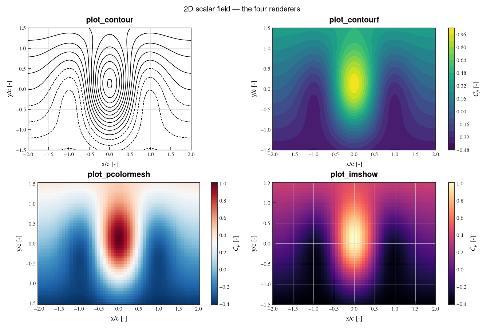

```python
plot_contour(ax, x, y, z, *, levels=15, colors=None, cmap=None, linewidths=1.0, ...)
plot_contourf(ax, x, y, z, *, levels=20, cmap="viridis", colorbar=True, ...)
plot_pcolormesh(ax, x, y, z, *, cmap="viridis", shading="auto", colorbar=True, ...)
plot_imshow(ax, z, *, extent=None, origin="lower", cmap="viridis", colorbar=True, ...)
```

All four **return `(artist, colorbar)`** — the colorbar is `None` when `colorbar=False`.
Remember to unpack:

```python
mesh, cbar = plot_pcolormesh(ax, x, y, z, cmap="RdBu_r", cbar_label=r"$C_p$ [-]")
```

Which one to use:

| Function | Use when | Notes |
|:---|:---|:---|
| `plot_contour` | you want **lines only**, e.g. Mach isolines over a filled field | `colors="k"` for monochrome |
| `plot_contourf` | smooth filled field, publication look | interpolates between levels |
| `plot_pcolormesh` | you must show the **real cell values**, no interpolation | honest for coarse grids |
| `plot_imshow` | regularly-spaced data, fastest path | needs `extent=(x0, x1, y0, y1)` |

Shared keywords: `vmin`/`vmax`/`norm` (colour scaling), `cbar_label`, `bad_color` (colour for
masked cells), `aspect` (`"equal"` by default — geometry is not distorted).

`x` and `y` accept either 1D vectors or full 2D meshgrids; they are normalised internally.

---

## 8. Interpolation

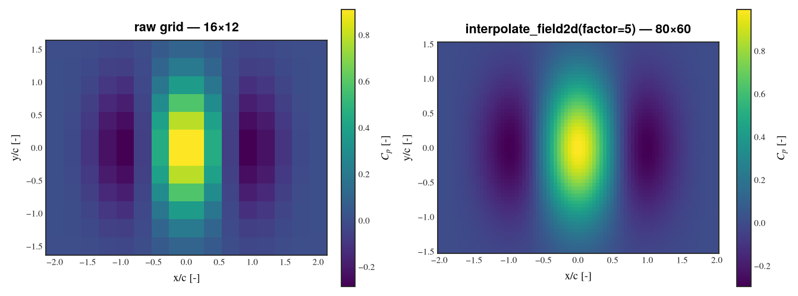

```python
interpolate_field2d(x, y, z, *, factor=2, method="cubic") -> (xi, yi, zi)
plot_pcolormesh_interp(ax, x, y, z, *, factor=2, method="cubic", ...)
```

Refines a structured grid by `factor` in each direction (requires SciPy —
`pip install -e ".[dispersion]"`). `plot_pcolormesh_interp` interpolates and draws in one call.

> **Interpolation is cosmetic.** It makes a coarse CFD grid look smooth; it does not add
> information and it will happily smooth over a shock. For quantitative plots prefer
> `plot_pcolormesh` on the raw grid.

---

## 9. Masking bodies

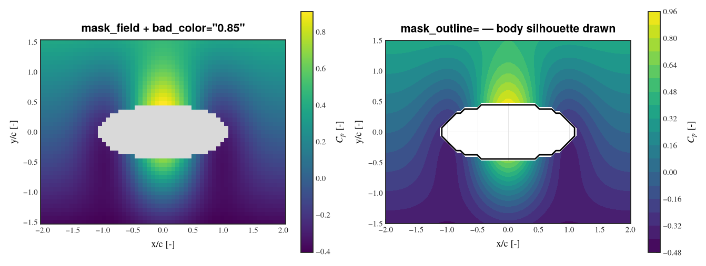

```python
mask_field(z, condition, *, fill=None) -> np.ma.MaskedArray
dataframe_to_masked_grid(df, *, x="x", y="y", values=None, mask_column, mask_value,
                         keep=True, fill=None, sort=True)
```

`mask_field` blanks the cells where `condition` is `True` — typically the solid body inside
the domain. Then either grey them out with `bad_color`, or draw the silhouette with the
`mask_outline` family of keywords available on `plot_contourf`, `plot_pcolormesh` and
`plot_contour_quiver`:

```python
inside = (X**2 / 1.1**2 + Y**2 / 0.45**2) < 1.0
z_masked = mask_field(z, inside)

plot_pcolormesh(ax, x, y, z_masked, bad_color="0.85")                    # grey body

plot_contourf(ax, x, y, z_masked, bad_color="white",
              mask_outline=inside, mask_outline_color="k", mask_outline_width=1.8)
```

| Keyword | Meaning |
|:---|:---|
| `mask_outline` | boolean array — the region to outline |
| `mask_outline_color` / `_width` | stroke colour and width |
| `mask_outline_level` | contour level of the boolean field (default `0.5` — the edge) |
| `mask_outline_zorder` | draw order; raise it to keep the outline on top |

---

## 10. Vector fields

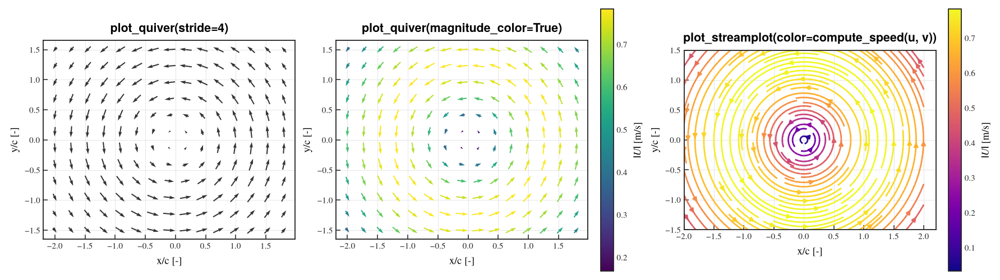

```python
compute_speed(u, v) -> np.ndarray
subsample_vectors(x, y, u, v, *, stride=None, target=25) -> (x, y, u, v)
plot_quiver(ax, x, y, u, v, *, color=None, scale=None, pivot="mid", stride=None,
            magnitude_color=False, cmap="viridis", colorbar=False, ...)
plot_streamplot(ax, x, y, u, v, *, density=1.2, color=None, linewidth=None,
                cmap="viridis", norm=None, colorbar=False, ...)
```

A full CFD grid has far too many cells to draw an arrow per cell. Two ways to thin it out:

```python
plot_quiver(ax, x, y, u, v, stride=4)                        # every 4th point
xs, ys, us, vs = subsample_vectors(x, y, u, v, target=18)    # ≈18 arrows per direction
```

`target=` is usually what you want: it picks the stride for you, so arrow density stays
readable no matter the grid resolution.

Colour the arrows by magnitude with `magnitude_color=True`, or colour streamlines by any field:

```python
speed = compute_speed(u, v)
plot_streamplot(ax, x, y, u, v, density=1.4, color=speed, cmap="plasma",
                colorbar=True, cbar_label=r"$|U|$ [m/s]")
```

---

## 11. Combined scalar + vector

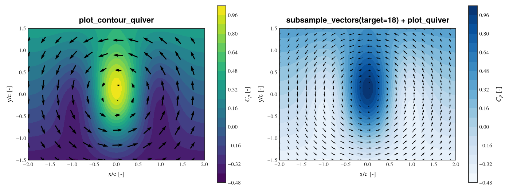

```python
plot_contour_quiver(ax, x, y, z, u, v, *, scalar_kind="contourf", levels=20,
                    cmap="viridis", cbar_label=None, quiver_stride=4,
                    quiver_color="k", quiver_scale=None, mask_outline=None, ...)
```

Scalar background + velocity arrows in one call; returns `(scalar_artist, quiver, colorbar)`.
`scalar_kind` selects the background renderer (`"contourf"`, `"contour"`, `"pcolormesh"`).

The right-hand panel above shows the manual equivalent — draw the background yourself, then
overlay `subsample_vectors` + `plot_quiver` — which you want when the two layers need
different masks or colour scales.

---

## 12. Shared colorbar

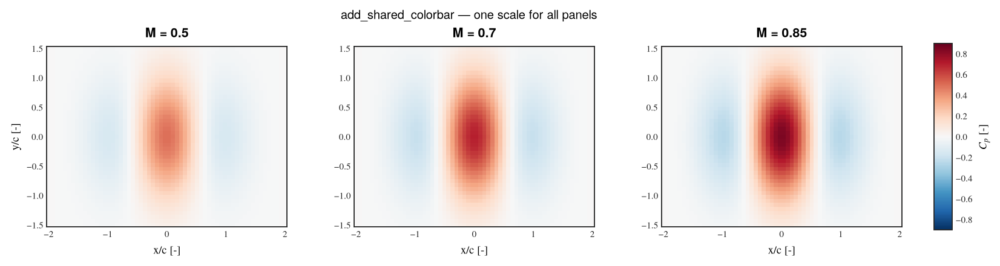

```python
add_shared_colorbar(fig, mappable, *, axes=None, location="right", size="2%",
                    pad=0.02, match_axes=True, label=None, **kwargs)
```

One colour scale across several panels — mandatory when the panels are meant to be compared.
Two things must line up:

1. **Pin the scale on every panel** with the same `vmin`/`vmax`, otherwise each panel
   normalises independently and the shared bar lies.
2. **Turn off the per-panel colorbars** with `colorbar=False`.

```python
fig, axes = new_figure(1, 3, figsize=(14, 3.8))
for ax, mach in zip(axes, (0.5, 0.7, 0.85), strict=True):
    mappable, _ = plot_pcolormesh(ax, x, y, cp[mach], cmap="RdBu_r",
                                  colorbar=False, vmin=-0.9, vmax=0.9)
add_shared_colorbar(fig, mappable, axes=axes, location="right", label=r"$C_p$ [-]")
```

With `match_axes=True` (default) the bar height is computed from the bounding box of the
target axes, so it aligns with the panels instead of the whole figure.

---

## 13. Data preparation

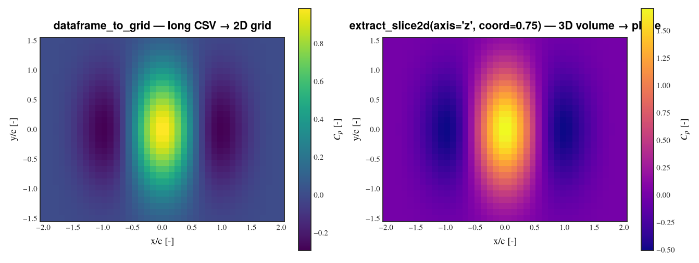

Post-processing usually hands you a **long** table (one row per point), while the plotting
functions want a **2D grid**. These bridge the gap:

```python
reshape_structured2d(x, y, values, *, order="yx") -> (X, Y, Z)
dataframe_to_grid(df, *, x="x", y="y", values=None, sort=True) -> (x, y, Z)
dataframe_to_masked_grid(df, *, x="x", y="y", values=None, mask_column, mask_value, ...)
extract_slice2d(field, *, axis, index=None, coord=None, x=None, y=None, z=None)
mask_field(z, condition, *, fill=None)
```

```python
df = pd.read_csv("surface.csv")          # columns: x, y, cp
gx, gy, gz = dataframe_to_grid(df, x="x", y="y", values="cp")
plot_pcolormesh(ax, gx, gy, gz, cbar_label=r"$C_p$ [-]")
```

**`extract_slice2d` cuts a plane out of a 3D volume**, not a line out of a plane. The volume
must be shaped `(nx, ny, nz)` — i.e. `np.meshgrid(x, y, z, indexing="ij")` ordering — and it
returns `(c1, c2, plane)`:

```python
X, Y, Z = np.meshgrid(x, y, z, indexing="ij")
c1, c2, plane = extract_slice2d(volume, axis="z", coord=0.75, x=x, y=y, z=z)
plot_pcolormesh(ax, c1, c2, plane)
```

Use `index=` for a direct index or `coord=` for the nearest physical coordinate (which needs
the matching 1D coordinate vector).

---

## 14. Exporting figures

```python
save_figure(fig, path, *, formats=("png",), dpi=None, transparent=None,
            declassify=None, declassify_label="DECLASSIFIE",
            declassify_stamp_kw=None, report=False) -> list[Path]
print_file_report(files, *, title="Exported files")
```

`path` is a base path **without extension**; parent directories are created for you.
Supported formats: `png`, `svg`, `pdf`, `emf` (EMF goes through an SVG intermediate and needs
Inkscape on `PATH` — without it the SVG is kept and a warning is logged).

```python
files = save_figure(fig, "output/polar", formats=("png", "svg", "pdf"), report=True)
```

`report=True` prints a table of what was written (Rich if installed, plain text otherwise).

### Declassified variants

`declassify="x" | "y" | "both"` writes a **second** file alongside the normal one with the
tick labels stripped from those axes and a stamp in the corner — for sharing a trend without
disclosing the values.

| Normal | `declassify="y"` |
|:---:|:---:|
| 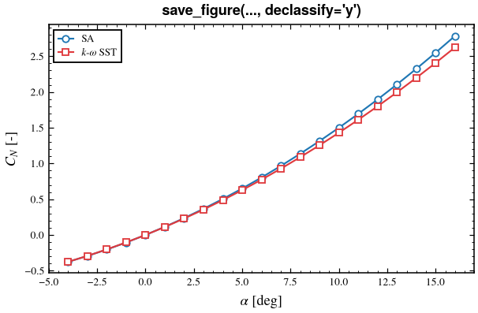 | 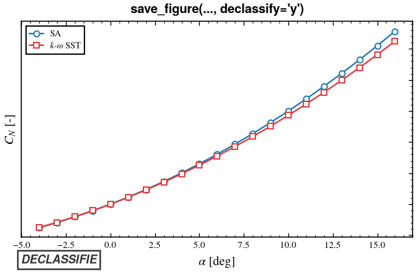 |

```python
save_figure(fig, "output/polar", formats=("png",), declassify="y")
# → output/polar.png  and  output/polar_declass_y.png
```

Override the stamp text with `declassify_label=`, its appearance with `declassify_stamp_kw=`.

---

## 15. Batch plotting

The problem: you have results from several sources (CFD codes, analytics, wind tunnel), for
many flight points, and you want the same comparison figure for every combination.
`batch_plot` takes four dictionaries and writes the whole tree.

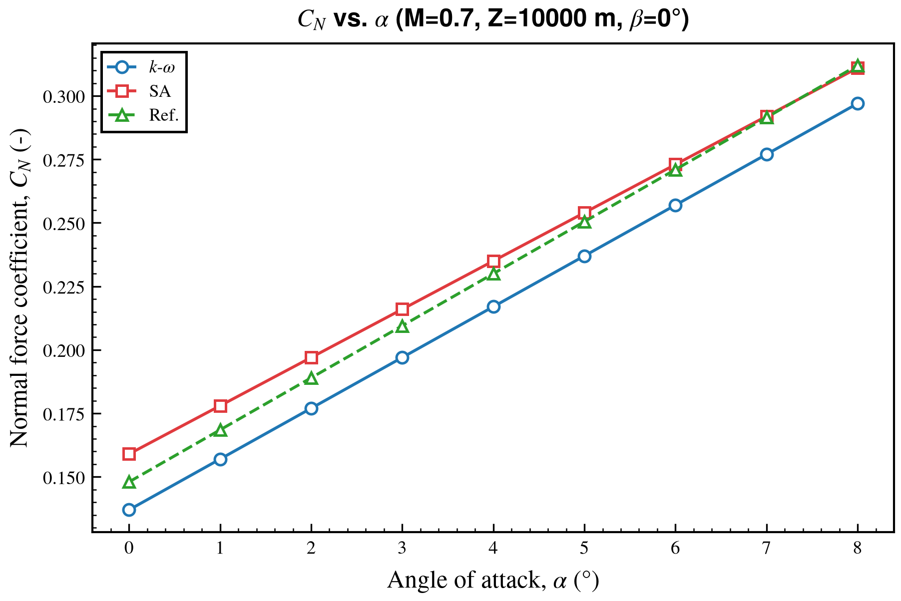

### The four dictionaries

**`configuration_dict`** — one entry per data source. `df` is the loaded DataFrame; every key
that is not metadata is forwarded to `plot_line` as a style keyword.

```python
configuration_dict = {
    "KW":  {"name": "KW",  "label": r"$k$-$\omega$", "df": df_kw,  "color": "C0", "marker": "o"},
    "SA":  {"name": "SA",  "label": "SA",            "df": df_sa,  "color": "C1", "marker": "s"},
    "EXP": {"name": "REF", "label": "Ref.",          "df": df_exp, "color": "C2",
            "marker": "^", "linestyle": "--"},
}
```

**`y_axis_dict`** — the quantities of interest (one figure per entry).

```python
y_axis_dict = {
    "CN": {"col_name": "CN", "literal_name": "Normal force coefficient",
           "symbol": r"$C_N$", "unit": "-", "y_save_name": "CN"},
}
```

**`sweep_dict`** — the variables that can go on the X axis. `polar_prefix` names the top
directory level; `save_name` is used for sibling sweeps pinned in the path.

```python
sweep_dict = {
    "alpha": {"col_name": "alpha", "literal_name": "Angle of attack", "symbol": r"$\alpha$",
              "unit": "°", "x_save_name": "alpha", "polar_prefix": "ALPHA_POLAR",
              "label": r"$\alpha$", "save_name": "ALPHA"},
}
```

**`flight_point_dict`** — the parameters that define a flight point. `values` can be left
empty and discovered from the data:

```python
from cfd_plot import discover_flight_point_values

keys = ["Mach", "Altitude_m", "alpha", "beta"]
found = discover_flight_point_values(configuration_dict, keys)
flight_point_dict = {
    "Mach":       {"values": found["Mach"],       "label": "M", "save_name": "M", "unit": "-"},
    "Altitude_m": {"values": found["Altitude_m"], "label": "Z", "save_name": "Z", "unit": "m"},
    "alpha":      {"values": found["alpha"],      "label": r"$\alpha$", "save_name": "ALPHA", "unit": "°"},
    "beta":       {"values": found["beta"],       "label": r"$\beta$",  "save_name": "BETA",  "unit": "°"},
}
```

A key present in **both** `sweep_dict` and `flight_point_dict` is automatically dropped from
the flight point when it is the current X axis — so you can keep one reusable
`flight_point_dict` across projects instead of editing it per sweep.
`DEFAULT_FLIGHT_POINT_KEYS` is `("Mach", "Altitude_m", "DL", "DM", "DN")`.

### Running it

```python
from cfd_plot import batch_plot

written = batch_plot(
    configuration_dict=configuration_dict,
    y_axis_dict=y_axis_dict,
    sweep_dict=sweep_dict,
    flight_point_dict=flight_point_dict,
    output_base="09_POST_TRAITEMENT/FIGURE",
    style_profile="paper",
    formats=("svg",),
    n_jobs=-1,          # all cores; 1 = serial
    dry_run=False,      # True → report what would be written, draw nothing
    report=True,
)
```

Output tree — one directory level per varying parameter; levels for constant parameters are
omitted:

```
FIGURE/
└── ALPHA_POLAR/            ← sweep_dict[...]["polar_prefix"]
    ├── M_0.7/
    │   ├── Z_5000/
    │   │   ├── BETA_0/
    │   │   │   └── CN_vs_alpha.svg
    │   │   └── BETA_2/
    │   └── Z_10000/
    └── M_0.85/
```

Start with `dry_run=True` — it reports the figure count without rendering, which is how you
catch a dictionary mistake before waiting on 200 renders.

### Comparing flight points on one figure

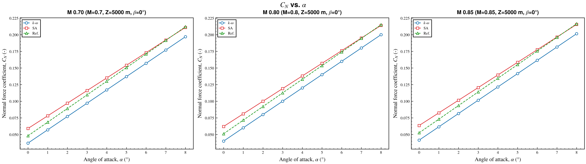

`batch_compare_flight_points` puts several flight points side by side as subplots. Each entry
of `compare_flight_points` is **one panel** and must pin *every* active flight-point key:

```python
from cfd_plot import batch_compare_flight_points

compare = {
    "M 0.70": {"Mach": 0.70, "Altitude_m": 5000, "beta": 0.0},
    "M 0.80": {"Mach": 0.80, "Altitude_m": 5000, "beta": 0.0},
    "M 0.85": {"Mach": 0.85, "Altitude_m": 5000, "beta": 0.0},
}

batch_compare_flight_points(
    configuration_dict=configuration_dict, y_axis_dict=y_axis_dict,
    sweep_dict=sweep_dict, flight_point_dict=flight_point_dict,
    compare_flight_points=compare, output_base="FIGURE",
    max_cols=3,      # 1–3 panels per row
)
```

Omitting a key raises `KeyError: compare_flight_points['…'] missing flight-point keys: [...]`.
The sweep variable (`alpha` here) is excluded automatically.

### Hooks

Two escape hatches keep the batch generic while letting you special-case individual figures.

**`include_curve(source_key, flight_point, x_key, y_key, fixed_sweeps) -> bool`** — return
`False` to omit one source from one figure:

```python
def include_curve(source_key, flight_point, x_key, y_key, fixed_sweeps):
    """Drop the experimental reference from axial-force polars."""
    return not (y_key == "CA" and source_key == "EXP")
```

**`on_before_save(fig, ax, context)`** — last call before writing, for extra artists or
axes-level tweaks. `context` is a `BatchPlotContext` with:

| Field | Meaning |
|:---|:---|
| `flight_point` | `dict` of the current flight-point values |
| `fixed_sweeps` | the sweeps pinned for this figure |
| `sweep_key`, `y_key` | current X and Y keys — **stable API, prefer these** |
| `x_spec`, `y_spec` | the matching dict entries |
| `polar_prefix` | top-level directory name |
| `output_path` | where the figure is about to be written |
| `compare_name`, `panel_index` | set only in `batch_compare_flight_points` |

```python
def on_before_save(fig, ax, context):
    if context.y_key == "CN":
        add_reference_lines(ax, hlines=[0.0])
    if context.flight_point.get("Mach", 0) > 0.8:
        add_textbox(ax, "transonic", loc="lower right")
```

Branch on `context.sweep_key` / `context.y_key`, not on `polar_prefix` — the keys are the
stable contract, the prefix is a path convenience.

### Path helpers

Available if you need to reproduce the naming outside a batch run: `build_output_path`,
`build_compare_output_path`, `format_axis_label`, `format_axis_title_label`,
`format_flight_point_title_suffix`, `format_plot_title`, `iter_flight_points`,
`iter_fixed_sweep_combinations`, `varying_flight_keys`.

### End-to-end example

```bash
cd tools/cfd-plot
python3 tests/E2E_MULTIPLE_PLOTTING/run_batch_plot.py
python3 tests/E2E_MULTIPLE_PLOTTING/run_batch_plot.py --dry-run --verbose
python3 tests/E2E_MULTIPLE_PLOTTING/run_batch_plot.py --n-jobs -1
python3 tests/E2E_MULTIPLE_PLOTTING/run_batch_plot.py --demo-hooks
```

The CSV fixtures (`kw.csv`, `sa.csv`, `exp.csv`) show the expected column layout.

---

## 16. Dispersion analysis

`cfd_plot.dispersion` turns uncertainty specifications into sampled distributions and
diagnostic figures. **Requires SciPy** (`pip install -e ".[dispersion]"`).

```python
from cfd_plot.dispersion import DispersionSpec, QuantityDispersion
```

### The model

A quantity is dispersed by a **bias** (additive) and a **scale** (multiplicative):

```
sample = (1 + scale) * nominal + bias
```

> **Two traps in one formula.** A *centred* scale error has `moy=0.0`, not `1.0` — passing
> `1.0` doubles your nominal. And `var` is a **half-range**, not a variance: for the Gaussian
> families `sigma = var / 2`.

`DispersionSpec(disp_type, moy, var)` selects a family:

| `disp_type` | Family | Meaning |
|:---:|:---|:---|
| 1 | Null | always 0 — component disabled |
| 2 | Constant | always `moy` |
| 3 | Uniform | uniform on `moy ± var` |
| 4 | Gaussian | `N(moy, var/2)`, untruncated |
| 5 | Gaussian ±3σ | truncated at ±3σ |
| 6 | Gaussian ±2σ | truncated at ±2σ |

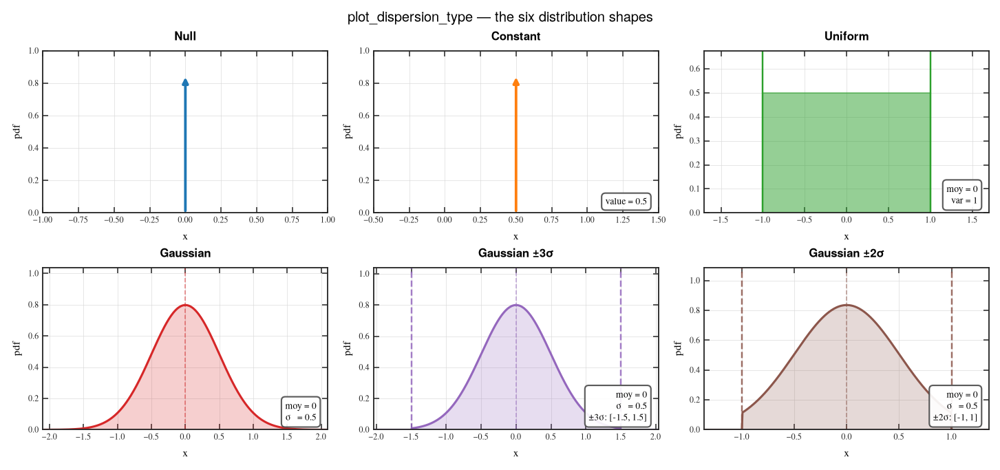

```python
from cfd_plot.dispersion import plot_dispersion_type

fig, ax = plot_dispersion_type(DispersionSpec(disp_type=4, moy=0.0, var=1.0))
```

### Per-quantity figures

```python
qty = QuantityDispersion(
    name=r"$C_{m\alpha}$",
    nominal=-0.42,
    bias=DispersionSpec(disp_type=4, moy=0.0, var=0.02),    # additive, σ = 0.01
    scale=DispersionSpec(disp_type=6, moy=0.0, var=0.10),   # multiplicative, σ = 5 %
)
```

| `plot_dispersion_pdf` | `plot_dispersion_cdf` |
|:---:|:---:|
| 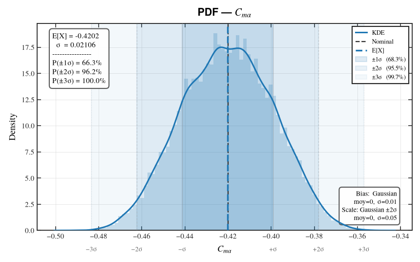 | 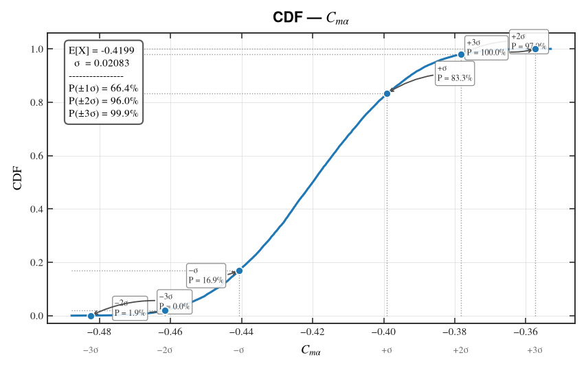 |

The PDF panel overlays a KDE, the nominal, the sampled mean and nested ±1/2/3σ bands with
their theoretical coverage. The CDF marks the same σ levels with empirical coverage.

**`plot_dispersion_dashboard`** — the two input components plus the resulting distribution:

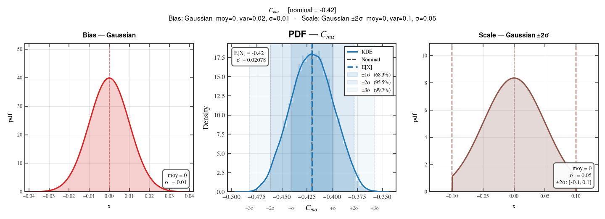

**`plot_dispersion_matrix`** — several quantities at once:

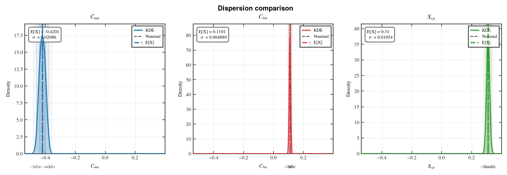

```python
from cfd_plot.dispersion import plot_dispersion_dashboard, plot_dispersion_matrix

fig, axes = plot_dispersion_dashboard(qty, n=20000)
fig, axes = plot_dispersion_matrix([qty, qty2, qty3], n=20000, ncols=3, share_x=True)
```

Pass `rng=np.random.default_rng(seed)` for reproducible sampling; without it the legacy
`np.random` global state is used, so `np.random.seed(...)` still works.

A runnable walkthrough lives in [`01_EXEMPLE/demo_dispersion.py`](01_EXEMPLE/demo_dispersion.py).

---

## API reference

| Group | Functions |
|:---|:---|
| **Style** | `use_style`, `style_context`, `new_figure`, `register_fonts`, `BODY_FONT`, `TITLE_FONT` |
| **1D** | `plot_line`, `plot_with_band`, `plot_bar`, `apply_marker_style` |
| **2D scalar** | `plot_contour`, `plot_contourf`, `plot_pcolormesh`, `plot_imshow`, `plot_pcolormesh_interp`, `interpolate_field2d` |
| **2D vector** | `plot_quiver`, `plot_streamplot`, `compute_speed`, `subsample_vectors` |
| **2D composite** | `plot_contour_quiver` |
| **Annotations** | `set_title`, `set_subtitle`, `set_suptitle`, `add_textbox`, `annotate_point`, `add_reference_lines` |
| **Axes** | `dual_axis`, `set_axis_sci`, `sync_axes_limits`, `apply_oldschool_axes`, `add_shared_colorbar` |
| **Legends** | `make_legend`, `make_figure_legend` |
| **Data prep** | `reshape_structured2d`, `dataframe_to_grid`, `dataframe_to_masked_grid`, `mask_field`, `extract_slice2d` |
| **Export** | `save_figure`, `print_file_report` |
| **Batch** | `batch_plot`, `batch_compare_flight_points`, `BatchPlotContext`, `DEFAULT_FLIGHT_POINT_KEYS`, + path/label helpers |
| **Dispersion** | `cfd_plot.dispersion`: `DispersionSpec`, `QuantityDispersion`, `plot_dispersion_{type,pdf,cdf,dashboard,matrix}`, `sigma`, `dispersion_type_label` |

---

## Development

```
tools/cfd-plot/
├── pyproject.toml            # package metadata + ruff / mypy / pytest config
├── 00_DOC/
│   ├── generer_figures.py    # regenerates every picture in this README
│   └── FIGURES/              # the pictures (versioned)
├── 01_EXEMPLE/
│   ├── demo_plotting.py      # runnable tutorial, notebook-cell style
│   └── demo_dispersion.py    # dispersion walkthrough
├── src/cfd_plot/
│   ├── __init__.py           # public API (grouped by topic — not alphabetical)
│   ├── mpl_template.py       # style, figure lifecycle, 1D, annotations, export
│   ├── field2d.py            # 2D scalar renderers + interpolation
│   ├── vector2d.py           # quiver / streamplot
│   ├── composite2d.py        # scalar + vector in one call
│   ├── batch.py              # dictionary-driven batch plotting
│   ├── prep.py               # long table → grid, slicing, masking
│   ├── _grid.py              # internal coordinate/cmap validators
│   ├── fonts/  styles/       # package data (TeX Gyre, 3 .mplstyle)
│   └── dispersion/           # dispersion analysis (needs scipy)
└── tests/
    ├── test_*.py
    ├── dispersion/
    └── E2E_MULTIPLE_PLOTTING/   # batch driver + CSV fixtures
```

```bash
pytest                              # 239 tests
pytest --mpl                        # + compare figures against tests/baseline/
ruff check . && ruff format --check .
mypy src
python3 00_DOC/generer_figures.py   # rebuild the README pictures
```

### Image regression tests

`tests/test_images.py` renders 18 figures and compares them pixel-wise against
`tests/baseline/`, via [pytest-mpl](https://pytest-mpl.readthedocs.io). The rest
of the suite checks *structure* — a call returns a `Line2D`, limits match, a
colorbar exists — and is structurally blind to what the figure looks like, which
is the one thing this package exists to control.

- `pytest` alone builds the figures but **does not compare** them. That is
  pytest-mpl's design: you need `--mpl` to opt into comparison.
- After an *intended* visual change, regenerate and **look at the diffs**
  before committing:

  ```bash
  pytest tests/test_images.py --mpl-generate-path=tests/baseline
  ```

  A baseline nobody eyeballed is worse than no baseline: it locks in the
  regression.

The `tolerance=2` (RMS) was calibrated, not guessed. Injecting one deliberate
regression — `plot_line`'s white marker fill turned red — gives RMS 8.6–23.6 on
the affected tests, while an unchanged rerun gives < 0.01. At the tolerance of
20 originally tried, that regression slipped past 16 of the 18 tests unnoticed.
If you raise it, redo that experiment.

Note that pytest-mpl applies `style="classic"` by default, which would pin a
style this package never produces; the tests override it with `style="default"`
and establish the house profile themselves.

Every figure in this README is produced by `00_DOC/generer_figures.py`, one function per
section. **When you add a public helper, add a panel there too** — that is what keeps the
documentation honest.

Known debt, tracked in [`TODO.md`](TODO.md): mypy runs at `check_untyped_defs` level rather
than `strict` (the sibling packages are strict), and `ruff format` has never been applied to
this codebase.

---

## Troubleshooting

| Symptom | Cause | Fix |
|:---|:---|:---|
| `sync_axes_limits` leaves a panel unsynced | that panel's only data is a reference line / span — those are ignored by design | plot the real data, or set the limits by hand |
| `ModuleNotFoundError: No module named 'pandas'` on `import cfd_plot` | pandas is a hard dependency | `pip install pandas` |
| `ModuleNotFoundError: No module named 'scipy'` | `cfd_plot.dispersion` / `interpolate_field2d` need SciPy | `pip install -e ".[dispersion]"` |
| `AttributeError: 'tuple' object has no attribute 'cmap'` | the 2D helpers return `(artist, colorbar)` | unpack: `artist, cbar = plot_pcolormesh(...)` |
| Shared colorbar does not match the panels | panels normalised independently | pass the same `vmin`/`vmax` everywhere and `colorbar=False` |
| `ValueError: field must be 3D` from `extract_slice2d` | it slices a 3D volume, not a 2D plane | index the 2D array directly, or pass an `(nx, ny, nz)` array |
| `KeyError: compare_flight_points[...] missing flight-point keys` | each compare entry must pin every active key | add the missing keys (the sweep variable is excluded) |
| Fonts look wrong / fall back to DejaVu | bundled fonts not registered | `register_fonts()`; check `src/cfd_plot/fonts/` was installed as package data |
| EMF export silently produces SVG | Inkscape not on `PATH` | install Inkscape, or export SVG/PDF |
| Image tests pass but never catch anything | `pytest` without `--mpl` builds figures without comparing | run `pytest --mpl` |
| `ValueError: Invalid RGBA argument: 'inherit'` | pre-1.0.1 `make_legend` under a style where `legend.edgecolor = "inherit"` (e.g. Matplotlib's `classic`) | fixed — upgrade |
| Title overlaps the subtitle | `set_subtitle` called before `set_title` | call `set_title` first |
