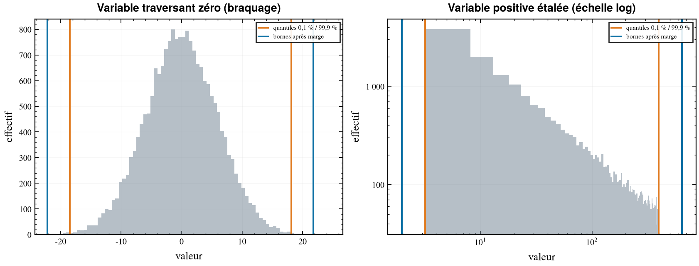

# La méthode

> Ce document explique **ce que calcule cfd-traj et pourquoi**. Pour s'en servir,
> voir [02_GUIDE_UTILISATEUR.md](02_GUIDE_UTILISATEUR.md).

Le problème : on dispose d'un lot de trajectoires dispersées — quelques dizaines
à quelques milliers de tirs Monte-Carlo — et il faut en déduire un plan de
calcul CFD qui couvre tout ce que l'engin rencontrera, sans gaspiller le budget
de simulation sur des points qu'il ne rencontrera jamais.

L'enchaînement est le suivant.

```
 Lot de trajectoires dispersées (un CSV par tir)
        │
        ▼
 [1] ADIMENSIONNEMENT
     (Mach, altitude, α, β) → (M, Re, α_tot, φ)
     l'altitude disparaît en tant que telle : elle est absorbée par le Reynolds
        │
        ▼
 [2] ENVELOPPE CONDITIONNELLE
     bandes de Mach → quantiles extrêmes + marge, bande par bande
     → un tableau d'une dizaine de lignes, relisible en revue
        │
        ▼
 [3] SYMÉTRIES
     repliement de φ, composantes nulles par théorème,
     configuration de calcul et coût affectés à chaque cas
        │
        ▼
 [4] PLAN D'EXPÉRIENCES
     grille anisotrope par bande + coins, ou hypercube latin
        │
        ▼
 [5] COUVERTURE
     rejeu de toutes les trajectoires à travers l'enveloppe
        │
        ▼
 Plan chiffré en équivalents configuration complète
```

---

## 1. Adimensionnement : isoler les vrais paramètres

À chaque instant, la trajectoire fournit `(Mach, Altitude, α, β, dl, dm, dn)`
plus les colonnes de paramètres. Ce jeu n'est pas celui que « voit »
l'écoulement : plusieurs de ces variables n'agissent qu'à travers des
combinaisons, et les traiter séparément gonfle artificiellement la dimension du
plan. C'est la première réduction, et la plus rentable de toutes, car elle agit
sur l'**exposant** de la malédiction de la dimension, pas sur sa base.

| Variable trajectoire | Ce qu'elle porte vraiment | Devient |
|:---|:---|:---|
| Mach | régime de compressibilité | `Mach`, dimension principale |
| Altitude | p∞, T∞, ρ∞ (atmosphère standard) | absorbée dans `Re_ref` |
| Mach × altitude | frottement, état de couche limite | `Re_ref`, facteur discret |
| α, β | orientation du vent relatif | `alpha_tot`, `phi_fold` |
| dl, dm, dn | braquages des gouvernes | plage **mécanique**, pas trajectoire |
| PARA… | ce que l'utilisateur y met | rôle auto-détecté ou déclaré |

### Incidence totale et roulis aérodynamique

L'**incidence totale** `α_tot` est l'angle entre le vecteur vitesse et l'axe de
l'engin ; le **roulis aérodynamique** `φ` est l'azimut de ce vecteur autour de
l'axe, mesuré depuis un plan de référence lié au corps.

```
v̂ = ( cos α · cos β ,  sin β ,  sin α · cos β )

α_tot = atan2( hypot(sin β, sin α·cos β) , cos α·cos β )
φ     = atan2( sin β , sin α·cos β )
```

Ces formules sont algébriquement identiques aux relations classiques
`tan(α_tot)·cos φ = tan α` et `tan(α_tot)·sin φ = tan β / cos α` — il suffit de
diviser numérateur et dénominateur par `cos α · cos β` pour le voir. La forme
`atan2` est retenue parce qu'elle est **uniformément précise** : la forme en
tangentes explose quand α approche 90°, et la forme `arccos(cos α · cos β)`
perd la moitié de ses chiffres significatifs près de `α_tot = 0`, c'est-à-dire
précisément dans la zone la plus fréquentée du vol.

Deux cas méritent d'être notés. Quand `α = β = 0`, φ est géométriquement
**indéfini** : toute attitude en roulis décrit le même écoulement. L'outil rend
alors `φ = 0` et une colonne `phi_defined` à faux, et ces lignes sont exclues
des quantiles sur φ sans être comptées comme non couvertes. Et une incidence
**négative** n'est pas un cas séparé : `α = −5°` devient `α_tot = 5°, φ = 180°`,
que le repliement de la section 3 ramène sur `φ = 0°`. C'est exactement le gain
que la symétrie procure.

---

## 2. L'enveloppe conditionnelle

### Le défaut de l'hyperrectangle

Connaître le min et le max de chaque variable définit un hyperrectangle. Ce
domaine est doublement défectueux.

```
 PARA
  │                                    ┌ coin de l'hyperrectangle :
  │ ┌─────────────────────────────────┐  Mach max ET PARA max en même temps
  │ │                        ▓▓▓▓▓▓▓  │  → jamais atteint, jamais utile
  │ │                    ▓▓▓▓▓▓▓▓▓▓▓  │
  │ │                ▓▓▓▓▓▓▓▓▓▓▓▓     │   ▓▓▓ : le « tube » réellement
  │ │            ▓▓▓▓▓▓▓▓▓▓▓          │         balayé par le faisceau
  │ │        ▓▓▓▓▓▓▓▓▓▓               │         de trajectoires
  │ │    ▓▓▓▓▓▓▓▓▓                    │
  │ │  ▓▓▓▓▓▓                         │
  │ │ ▓▓▓▓                            │
  │ └─────────────────────────────────┘
  └──────────────────────────────────────► Mach
```


**Premier défaut : il est immensément trop grand.** Il contient toutes les
combinaisons croisées inatteignables. En dimension quatre ou cinq, le tube réel
n'occupe typiquement que quelques pourcents du volume de l'hyperrectangle ; un
plan uniforme sur l'hyperrectangle gaspille donc l'essentiel du budget.

**Second défaut, plus insidieux : il décrit mal les vrais extrêmes.** Les coins
n'étant atteints par aucune trajectoire, un plan qui s'y appuie décrit mal,
paradoxalement, les points extrêmes réels — qui sont sur la frontière *oblique*
du tube, pas dans les coins.

### Bornes conditionnelles par bandes de Mach

Le Mach vient en tête parce que c'est lui qui organise tout le reste : le régime
aérodynamique, et — via l'altitude qui lui est liée le long des trajectoires —
le Reynolds et tout paramètre lié à l'altitude. Les autres variables sont donc
bornées **conditionnellement au Mach**.

Dans chaque bande, on relève pour chaque variable les **quantiles extrêmes**
(0,1 % et 99,9 % par défaut) et non les min/max absolus : sur un lot de
plusieurs milliers de tirs, le min/max est porté par un unique tirage extrême et
fluctue fortement d'un lot au suivant, alors que le quantile est statistiquement
stable.

On applique ensuite une **marge vers l'extérieur**, pour deux raisons : absorber
une évolution future des dispersions, et surtout garantir que tout point de
trajectoire tombera en *interpolation stricte*, jamais sur la frontière — car
les cas dimensionnants vivent précisément près des bornes.

> **Divergence assumée avec l'usage courant.** On écrit souvent la marge sous
> forme multiplicative, « quantile × (1 − marge) ». C'est faux dès qu'une
> variable traverse zéro ou l'approche : pour `alpha_tot` dont le quantile bas
> vaut 0,02°, une marge multiplicative n'élargit rien ; pour `dl` dont la borne
> basse vaut −20°, elle *rétrécit* le domaine. La marge est donc **absolue et
> proportionnelle à la largeur inter-quantile**, seul choix invariant par
> translation. Pour une variable en échelle `log`, la marge appliquée dans
> l'espace log **est** multiplicative dans l'espace physique : on retrouve le
> comportement voulu exactement là où il a un sens.



Deux variables échappent à ce traitement. Le **Mach** prend pour bornes la bande
elle-même : les bornes de bande sont exactes par construction, et les élargir
placerait des nœuds à un Mach n'appartenant à aucune bande. Les variables de rôle
**`mecanique`** prennent leur plage déclarée, identique dans toutes les bandes.

### Dimension intrinsèque

Une analyse en composantes principales du nuage adimensionné révèle combien de
directions il occupe réellement. Le long des trajectoires, Mach, Reynolds et
tout paramètre lié à l'altitude évoluent de concert ; l'ACP montre typiquement
que deux ou trois composantes expliquent plus de 95 % de la variance là où
l'espace en compte cinq.

Ce diagnostic **confirme que le conditionnement au Mach capture bien les
corrélations dominantes**. Si la dimension intrinsèque égale le nombre de
variables, une direction de corrélation forte échappe au conditionnement, et le
rapport le signale.

---

## 3. Les symétries

Voir [04_SYMETRIES.md](04_SYMETRIES.md) pour le détail et l'arbre de décision.

En une phrase : si une opération `g` du groupe de symétrie laisse invariants *à
la fois* la géométrie et les conditions aux limites — vent, braquages — alors le
champ solution est invariant par `g`, et les coefficients à l'attitude
transformée se déduisent sans calcul supplémentaire.

Trois conséquences, toutes exploitées :

1. **Repliement** — φ n'est décrit que sur le domaine fondamental du groupe :
   `[0°, 45°]` pour C4v au lieu du tour complet.
2. **Parités** — une réflexion par rapport au plan du vent conserve les
   composantes dans le plan (CA, CN, Cm) et change le signe des composantes hors
   plan (CY, Cn, Cl). Quand ce plan **est** un plan de miroir, les composantes
   hors plan sont identiquement **nulles** — non pas petites : nulles, par
   théorème. C'est à la fois une réduction de stockage et un contrôle qualité
   gratuit.
3. **Maillage** — chaque cas se calcule sur le plus petit domaine que sa
   symétrie autorise, du secteur 45° à la configuration complète.

---

## 4. Le plan d'expériences

Le plan est généré **bande par bande** : les niveaux de chaque bande sont placés
entre les bornes conditionnelles *de cette bande*, jamais entre les bornes
globales. Les combinaisons croisées inatteignables ne sont simplement jamais
générées.

**Méthode `tensoriel`** — produit tensoriel anisotrope des niveaux de la bande,
fin là où la physique varie vite, grossier ailleurs. Les **coins** du domaine
conditionnel sont inclus explicitement : ce sont eux qui séparent
l'interpolation stricte de l'extrapolation sur les cas dimensionnants.

> **Ce que le conditionnement ne supprime pas.** Le domaine d'une bande reste un
> pavé, et un pavé a des coins. Sur la figure du plan, on voit des nœuds de coin
> tomber nettement à côté du nuage : à l'intérieur d'une bande, la corrélation
> résiduelle entre le Mach et les autres variables rend certaines combinaisons
> extrêmes inatteignables, exactement comme l'hyperrectangle global le faisait à
> plus grande échelle. Le conditionnement réduit ce défaut d'un ordre de
> grandeur, il ne l'annule pas. Deux leviers : **resserrer les bandes**, ce qui
> rétrécit les coins résiduels ; ou passer en `lhs`, dont le test de rejet
> écarte les points intérieurs hors du tube. Les coins, eux, restent inclus
> dans les deux cas — un nœud d'encadrement légèrement hors du nuage coûte un
> calcul, alors qu'une base qui extrapole sur un cas dimensionnant coûte
> beaucoup plus.

**Méthode `lhs`** — pour les cas où la grille tensorielle explose au-delà de
quatre ou cinq axes. Un hypercube latin maximin est tiré, puis **rejeté** sur le
nuage de la bande : seuls survivent les points ayant de vrais points de
trajectoire autour d'eux. C'est ce test de rejet qui transforme le pavé
conditionnel en tube. Les coins restent inclus inconditionnellement.

Le compte de nœuds est calculé **avant toute allocation** : un plan qui
dépasserait le plafond déclaré s'arrête proprement et propose les deux issues
(passer en `lhs`, ou rétrograder des colonnes). Matérialiser deux cent mille
nœuds pour ensuite annoncer qu'il y en a trop n'aide personne.

Les **facteurs discrets** sont appliqués par superposition sur une fraction des
nœuds, pas en multipliant la grille : doubler tout le plan pour répondre à « est-
ce que l'état de couche limite compte ? » serait un mauvais emploi du budget.

---

## 5. Le contrôle de couverture

Pour chaque instant de chaque tir : trouver la bande de Mach, et vérifier que
chaque variable active tombe dans les bornes de cette bande. Un point dehors est
un point que la base finale devra **extrapoler**.

> **Ce que l'outil promet, et ce qu'il ne promet pas.** Avec
> `quantile_bas = 0`, `quantile_haut = 1` et n'importe quelle marge, la
> couverture du lot ayant servi à construire l'enveloppe est **exactement
> 100 %** : c'est un invariant démontrable, et il est testé. Avec les quantiles
> par défaut, environ 0,2 % des points sont hors quantiles par construction, et
> la marge les rattrape *en général*, pas *toujours*. La commande `couverture`
> **mesure** donc au lieu de promettre — et surtout, elle **nomme** les tirs et
> les instants fautifs, triés par excès décroissant. Un pourcentage seul n'est
> pas actionnable.

Les variables `mecanique` sont exclues du taux par définition : leur plage
déclarée est un sur-ensemble de tout ce que la trajectoire fait. Elles font
l'objet d'un contrôle distinct — une valeur de trajectoire hors de la plage
mécanique déclarée est une **erreur du fichier d'étude**, rapportée à part.
