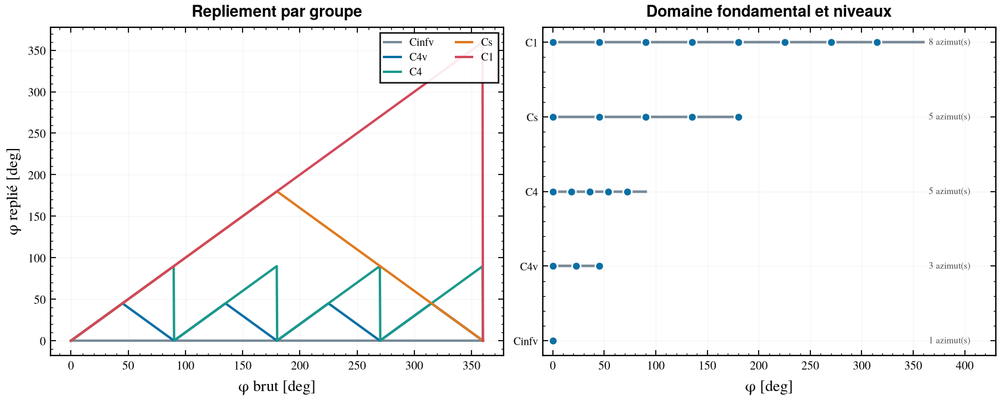
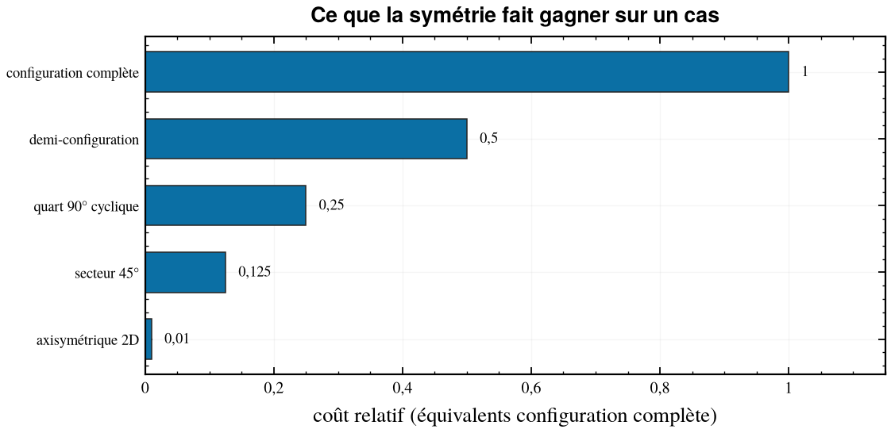

# Les symétries

> Après l'adimensionnement, c'est la réduction la plus rentable — et celle qui
> recèle les erreurs les plus coûteuses, parce qu'une symétrie supposée à tort
> produit un résultat faux **sans le moindre message d'erreur**.

## 1. Le principe

Une **opération de symétrie** d'une configuration est une transformation
géométrique — rotation, réflexion — qui superpose la configuration à elle-même.
L'ensemble de ces opérations forme le **groupe de symétrie**.

L'intérêt aérodynamique tient en une phrase : *si une opération `g` du groupe
laisse invariante à la fois la géométrie et les conditions aux limites — vent,
braquages — alors le champ solution est lui-même invariant par `g`, et les
coefficients à l'attitude transformée se déduisent de ceux à l'attitude
initiale sans calcul supplémentaire.*

Le domaine à calculer se replie donc selon le groupe **commun à tous les
ingrédients** du cas : cellule, braquages, vent. Toute la stratégie tient là.

## 2. Les cinq groupes

Nomenclature de Schoenflies, restreinte à ce qu'un corps de révolution muni de
voilures peut être.

| Groupe | Signification | Domaine de φ | Azimuts par défaut |
|:---|:---|:---|---:|
| `Cinfv` | corps de révolution : tout plan méridien est un miroir | `{0°}` | 1 |
| `C4v` | cruciforme : axe d'ordre 4 **et** quatre plans de miroir | `[0°, 45°]` | 3 |
| `C4` | axe d'ordre 4 seul : aucun miroir ne survit | `[0°, 90°[` | 5 |
| `Cs` | un unique plan de miroir | `[0°, 180°]` | 5 |
| `C1` | aucune symétrie | `[0°, 360°[` | 8 |

Le groupe **C4v**, celui d'une configuration cruciforme, contient exactement
huit opérations : l'identité, les rotations de 90°, 180° et 270° autour de l'axe
engin, et quatre plans de miroir contenant cet axe.

### Configuration en croix et configuration en X

Les deux ont **le même groupe C4v** — les huit opérations existent à
l'identique. Ce qui change est la position des plans de miroir par rapport à la
verticale, donc l'interprétation des azimuts remarquables :

```
        Configuration « + »                Configuration « X »

              σ1 (vertical,                      σd1 (vertical,
              contient 2 voilures)               ENTRE les voilures)
                    │                                  │
                    ▌                             ╲    │    ╱
                    ▌                              ╲   │   ╱
        ▬▬▬▬▬▬▬▬▬▬▬●▬▬▬▬▬▬▬▬▬▬  σ2          ──────── ● ────────  σd2
                    ▌                              ╱   │   ╲
                    ▌                             ╱    │    ╲
                    │                                  │

         ● = fuselage vu de face        ▌ ╲ ╱ = voilures
```

La différence est pratique, pas théorique. À `φ = 0°` sur une configuration en
X, le plan de coupe de la demi-configuration passe **entre** les voilures : le
demi-maillage contient deux voilures entières, situation confortable pour le
mailleur. À `φ = 45°`, la coupe tranche deux voilures le long de leur plan de
corde — licite, mais demandant un maillage soigné à l'emplanture.

Le paramètre `symetrie.plan_reference_deg` fixe quel plan du corps est appelé
`φ = 0°`.



## 3. Pourquoi trois azimuts suffisent pour C4v

La périodicité et les parités contraignent la forme fonctionnelle des
coefficients en φ. Tout coefficient de période 90° se développe en série de
Fourier en `4φ`, et les parités imposées par les miroirs trient les termes :

```
Composantes dans le plan (paires) :
   CA(φ), CN(φ), Cm(φ) = a0 + a1·cos(4φ) + a2·cos(8φ) + …

Composantes hors plan (impaires) :
   CY(φ), Cn(φ), Cl(φ) =      b1·sin(4φ) + b2·sin(8φ) + …
```

On lit directement : les composantes dans le plan sont extrémales à `φ = 0°` et
`45°`, et leur premier harmonique est capturé par **trois azimuts (0°, 22,5°,
45°)** — le point à 22,5° séparant `a0` de `a1`. Les composantes hors plan sont
*nulles* à 0° et 45° et *maximales* vers 22,5° : c'est le roulis induit
classique des configurations cruciformes aux azimuts intermédiaires.

Trois azimuts suffisent tant que l'harmonique en `8φ` est négligeable, ce qu'on
vérifie a posteriori en ajoutant un azimut de contrôle — `n_azimuts: 5` sur une
seule bande — et en regardant si le développement tronqué le reconstruit.

## 4. Composantes nulles par théorème

Une réflexion par rapport au plan du vent :

- **conserve** les composantes dans le plan : `CA`, `CN`, `Cm` ;
- **change le signe** des composantes hors plan : `CY`, `Cn`, `Cl`.

Si ce plan est un plan de miroir de la configuration **et** que les braquages
sont invariants par cette réflexion, alors l'écoulement l'est aussi, et par
conséquent `CY = Cn = Cl = 0` identiquement. Pas « petit » : **nul**.

C'est à la fois une réduction — trois composantes à stocker au lieu de six — et
un contrôle qualité gratuit : un `CY` non nul au résidu machine près, sur un cas
censé être symétrique, signale un maillage dissymétrique ou une convergence
insuffisante.

La colonne `composantes_nulles` du plan porte cette information pour chaque cas.

## 5. Les braquages : le piège

Les braquages sont le troisième ingrédient du groupe commun, et le plus souvent
oublié. Une réflexion par rapport au plan du vent envoie roulis → −roulis et
lacet → −lacet, tangage → tangage. Un jeu de braquages est donc :

| Classement | Condition | Effet |
|:---|:---|:---|
| `nulle` | `dl = dm = dn = 0` | le miroir survit |
| `symetrique` | `dl = 0` et `dn = 0` | le miroir survit — commande de tangage pure |
| `antisymetrique` | `dm = 0`, et `dl ≠ 0` ou `dn ≠ 0` | le miroir est détruit — roulis, lacet |
| `quelconque` | tout le reste | le miroir est détruit |

> **Le piège classique** : calculer un braquage de **roulis** en
> demi-configuration. Le solveur imposera silencieusement la symétrie que le
> braquage a détruite, convergera sans avertissement, et rendra un résultat
> faux. cfd-traj classe chaque jeu de braquages une fois pour toutes et porte le
> verdict sur **chaque ligne du plan** ; un jeu antisymétrique n'obtient jamais
> autre chose que la configuration complète.

## 6. Affectation de la configuration de calcul

| α_tot | braquages | miroir sur le plan du vent | configuration | coût |
|:---|:---|:---|:---|---:|
| 0 | nuls | — (`Cinfv`) | axisymétrique 2D | 0,01 |
| 0 | nuls | — (`C4v`) | secteur 45° | 0,125 |
| 0 | nuls | — (`C4`) | quart 90° cyclique | 0,25 |
| 0 | nuls | — (`Cs`) | demi-configuration | 0,5 |
| 0 | nuls | — (`C1`) | configuration complète | 1 |
| > 0 | nuls ou symétriques | oui | demi-configuration | 0,5 |
| > 0 | nuls ou symétriques | non | configuration complète | 1 |
| > 0 | antisymétriques ou quelconques | — | configuration complète | 1 |



### Condition de symétrie et condition de périodicité

Les deux ne sont pas interchangeables et correspondent à deux groupes
différents :

```
  Condition de SYMÉTRIE (miroir)          Condition de PÉRIODICITÉ (rotation)

     face A du secteur                       face A            face B
        │  vitesse normale nulle,              │  le champ de la face B est
        │  le champ est son propre             │  celui de la face A TOURNÉ :
        ▼  reflet : v_n = 0                    ▼      u(B) = R90 · u(A)
   ╔═════════╗                            ╔═════════╗
   ║ secteur ║                            ║  quart  ║   une vitesse tangente
   ║   45°   ║                            ║   90°   ║   peut traverser : un
   ╚═════════╝                            ╚═════════╝   écoulement d'ensemble
                                                        en rotation est admis
   exige un miroir physique                exige seulement la rotation
   → licite ssi le groupe contient σ       → licite dès que C4 survit
```

Employer une condition de symétrie là où seule la rotation survit produit un
résultat faux : le solveur convergera sans avertissement vers la solution d'un
problème qui n'est pas le bon.

## 7. Choisir le groupe : arbre de décision

**cfd-traj ne peut pas détecter un groupe déclaré à tort.** C'est une donnée de
conception, pas quelque chose que le code puisse lire dans les trajectoires.
Déclarer `C4v` une configuration qui n'est en réalité que `C4` replie `φ = 60°`
sur `30°`, fusionne deux attitudes physiquement distinctes, et **ampute le plan
de moitié**. Le rapport de la commande `analyser` affiche donc en évidence ce
que le groupe déclaré implique, pour que l'erreur saute aux yeux en revue.

```
La cellule est-elle un corps de révolution nu ?
├─ oui ────────────────────────────────────────────────────────► Cinfv
└─ non
   │
   Combien de voilures, et sont-elles identiques et régulièrement réparties ?
   ├─ quatre, à 90° l'une de l'autre
   │  │
   │  Un élément quelconque de la configuration (entrée d'air, antenne,
   │  bossage, voilure vrillée) brise-t-il les plans de miroir ?
   │  ├─ non ──────────────────────────────────────────────────► C4v
   │  └─ oui, mais la rotation de 90° reste valable ───────────► C4
   │
   ├─ deux, ou une géométrie plane symétrique ─────────────────► Cs
   └─ quoi que ce soit d'autre ────────────────────────────────► C1
```

Deux vérifications valent d'être faites explicitement :

1. **La chiralité tue les miroirs.** Une voilure vrillée, ou tout élément muni
   d'un sens de rotation, rend `C4v` impossible même si la géométrie « paraît »
   cruciforme : aucune réflexion ne superpose plus le motif à lui-même. Le
   groupe tombe à `C4`, les six composantes doivent être stockées partout, et
   la configuration complète devient obligatoire sous incidence.
2. **Le doute se tranche vers le bas.** Déclarer un groupe plus petit que la
   réalité coûte des calculs ; déclarer un groupe plus grand rend la base
   fausse. En cas d'hésitation, prendre le plus petit des deux.
