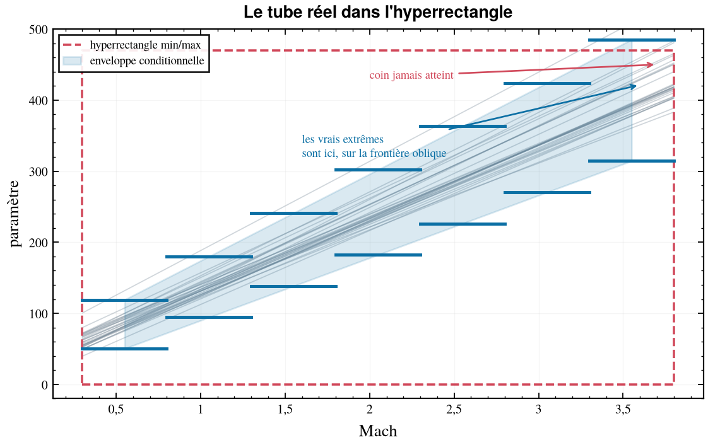

# cfd-traj

**Réduire un lot de trajectoires dispersées à un plan de calcul CFD minimal.**

On donne à `cfd-traj` un lot de trajectoires — un CSV par tir Monte-Carlo — et
il rend un plan d'expériences prêt à lancer, plus les analyses qui permettent de
le justifier en revue de définition.

```bash
cfd-traj example --output /tmp/essai
cd /tmp/essai && bash RUN_EXEMPLE.sh
```



---

* [1. Ce que ça fait](#1-ce-que-ça-fait)
* [2. Installation](#2-installation)
* [3. Prise en main](#3-prise-en-main)
* [4. Les entrées](#4-les-entrées)
* [5. Documentation](#5-documentation)
* [6. Développement](#6-développement)
* [7. Dépannage](#7-dépannage)

---

## 1. Ce que ça fait

Le problème est banal et coûteux : on a quelques milliers de trajectoires
dispersées, un budget de simulation fini, et il faut décider quels calculs CFD
lancer. Prendre le min et le max de chaque variable produit un hyperrectangle
qui, en dimension quatre ou cinq, est **cent fois trop grand** — et qui décrit
*mal* les vrais points extrêmes, puisque ceux-ci sont sur la frontière oblique
du tube réel et non dans les coins du pavé.

`cfd-traj` enchaîne cinq étapes :

1. **Adimensionnement** — l'altitude disparaît en tant que variable : elle est
   absorbée par le Reynolds. `(α, β)` deviennent l'incidence totale et le roulis
   aérodynamique. C'est la réduction la plus rentable, car elle agit sur
   l'*exposant* de la malédiction de la dimension.
2. **Enveloppe conditionnelle** — le domaine est borné bande de Mach par bande
   de Mach, sur des quantiles extrêmes élargis d'une marge, plutôt que sur un
   hyperrectangle global. Résultat : un tableau d'une dizaine de lignes,
   vérifiable ligne à ligne.
3. **Symétries** — repliement de l'azimut sur le domaine fondamental du groupe,
   composantes identiquement nulles par théorème, et affectation à chaque cas de
   la plus petite configuration de calcul que sa symétrie autorise.
4. **Plan d'expériences** — grille anisotrope par bande avec coins explicites,
   ou hypercube latin rejeté sur le nuage quand la grille explose.
5. **Couverture** — rejeu de toutes les trajectoires à travers le résultat, avec
   la liste nommée des points qui tomberaient en extrapolation.

Le plan sort chiffré en **équivalents configuration complète**, c'est-à-dire en
budget de simulation réel.

### Les colonnes de paramètres sont génériques

Les fichiers d'entrée portent huit colonnes obligatoires — `time, Mach,
Altitude, alpha, beta, dl, dm, dn` — **plus autant de colonnes de paramètres
qu'on veut, sous n'importe quels noms**. Rien dans l'outil ne reconnaît une
colonne autrement que par ses valeurs, ou par ce que le fichier d'étude en
déclare. Un fichier de tests (`tests/test_genericite.py`) le vérifie
mécaniquement : le même lot renommé produit un plan identique au nœud près.

---

## 2. Installation

`cfd-traj` dépend de **`cfd-atm`**, paquet frère de ce dépôt qui porte le modèle
d'atmosphère. Ce n'est pas une publication PyPI, il faut donc l'installer
d'abord.

```bash
cd tools/cfd-traj
python -m venv .venv && . .venv/bin/activate

pip install -e ../cfd-atm      # dépendance dure
pip install -e ../cfd-plot     # optionnel : figures stylées
pip install -e ".[dev]"
```

L'environnement virtuel dédié n'est pas une précaution de style : les paquets
frères exigent `matplotlib >= 3.8`, souvent plus récent que le Python système.

Sans `cfd-plot`, tout fonctionne : les figures sont rendues en Matplotlib nu.

Python ≥ 3.12. Dépendances : `numpy`, `pandas`, `scipy`, `matplotlib`, `rich`,
`pyyaml`.

---

## 3. Prise en main

### Sans données à soi

```bash
cfd-traj generer --sortie TRAJECTOIRES --n-tirs 40
```

Produit un lot de trajectoires synthétiques crédibles et son étude compagnon.
Le modèle de vol ne représente aucun engin réel ; il sert à faire tourner la
chaîne et à démontrer la méthode. Voir [00_DOC/05_GENERATEUR.md](00_DOC/05_GENERATEUR.md).

### Le déroulé complet

```bash
# 1. comprendre ce qu'il y a dans les fichiers
cfd-traj inspecter TRAJECTOIRES --proposer

# 2. construire l'enveloppe conditionnelle
cfd-traj analyser ETUDE.yaml --figure SORTIE/enveloppe.png --csv SORTIE/enveloppe.csv

# 3. en tirer le plan
cfd-traj doe ETUDE.yaml --sortie SORTIE/PLAN.csv --figure SORTIE/plan.png

# 4. vérifier qu'il couvre bien les trajectoires
cfd-traj couverture ETUDE.yaml --csv SORTIE/hors_domaine.csv
```

`--proposer` affiche le bloc `parametres:` prêt à coller dans l'étude. À faire
systématiquement : les rôles auto-détectés sont une heuristique, et les figer
transforme une devinette en décision documentée.

### Codes de retour

| Code | Signification |
|---:|:---|
| `0` | succès |
| `1` | erreur d'entrée — panneau rouge nommant le fichier et le problème, jamais de trace d'appels |
| `2` | la commande a abouti mais **le résultat exige une action** : couverture incomplète, plan dépassant le plafond |

Le code `2` n'est pas une panne, c'est un résultat.

---

## 4. Les entrées

### Les CSV de trajectoire

Séparateur virgule, séparateur décimal point, un fichier par tir.

```csv
time,Mach,Altitude,alpha,beta,dl,dm,dn,PARA1,PARA2
0,0.103027,150,4.11365,0.727837,0,-4.11365,-0.800621,60.3529,779.05
0.25,0.216041,155.216,4.00784,1.03428,0.0854,-4.00784,-1.13771,63.4523,782.7
```

Sont tolérés : des tirs de longueurs différentes (c'est le cas normal), des
valeurs manquantes, un temps non strictement croissant, des noms de colonnes
avec espaces et accents.

### Le fichier d'étude

Un seul YAML décrit le lot et le plan qu'on veut en tirer. Il se commite à côté
des CSV, se diffe, se relit en revue. **Toute clé inconnue est une erreur** :
une faute de frappe ne doit jamais produire silencieusement un plan amputé d'une
dimension.

```yaml
etude:
  nom: "LOT_MC_2026_REV_B"
  source: "TRAJECTOIRES/tir_*.csv"

reference:
  longueur_m: 2.5

symetrie:
  groupe: "C4v"          # C4v | C4 | Cs | C1 | Cinfv

bandes:
  bornes: [0.5, 0.8, 0.95, 1.2, 1.8, 2.5, 3.2]

parametres:
  PARA1: { role: conditionnel, niveaux: 3 }
  dl:    { role: mecanique, plage: [-20.0, 20.0] }
```

Schéma complet : [00_DOC/03_FORMAT_ENTREE.md](00_DOC/03_FORMAT_ENTREE.md).

---

## 5. Documentation

| Document | Contenu |
|:---|:---|
| [00_DOC/01_METHODE.md](00_DOC/01_METHODE.md) | ce que l'outil calcule et pourquoi |
| [00_DOC/02_GUIDE_UTILISATEUR.md](00_DOC/02_GUIDE_UTILISATEUR.md) | les six commandes, la lecture des rapports |
| [00_DOC/03_FORMAT_ENTREE.md](00_DOC/03_FORMAT_ENTREE.md) | format CSV et schéma d'étude, clé par clé |
| [00_DOC/04_SYMETRIES.md](00_DOC/04_SYMETRIES.md) | groupes, repliement, pièges, arbre de décision |
| [00_DOC/05_GENERATEUR.md](00_DOC/05_GENERATEUR.md) | le modèle de vol synthétique |
| [01_EXEMPLE/](01_EXEMPLE/) | un lot de 24 tirs et son étude, exécutables |

---

## 6. Développement

### Architecture

```
cli/      →  report, synth, engine, data, core     argparse, codes de retour     FR
report/   →          synth, engine, data, core     Rich et Matplotlib            FR
synth/    →                         data, core     générateur de trajectoires    EN
engine/   →                         data, core     bandes, enveloppe, DOE        EN
data/     →                               core     conteneurs typés et E/S       EN
core/     →  numpy, scipy, cfd_atm.core            mathématiques pures           EN
```

La règle de couche n'est pas décorative : c'est elle qui garantit que `core`
reste du calcul pur sur tableaux typés — seule raison pour laquelle mypy strict
est tenable en présence de pandas — et que rien ne décide dans la couche qui
affiche. `tests/test_architecture.py` la vérifie par analyse d'arbre syntaxique.

```
src/cfd_traj/
├── core/     angles.py symmetry.py adim.py stats.py sampling.py
├── data/     columns.py dataset.py derive.py study.py plan_io.py
├── engine/   bands.py envelope.py doe.py coverage.py inspect.py
├── synth/    flight.py autopilot.py parametres.py lot.py
├── report/   console.py figures.py _plotting_lib.py
└── cli/      main.py
```

### Enchaînement des données

```
CSV ──load_dataset──► TrajectoryDataset
                            │
                    add_derived_columns   (angles + adimensionnement + repliement)
                            │
                      build_specs         (rôles : déclarés ou auto-détectés)
                            │
                      build_bands ──► build_envelope ──► build_plan
                                            │                 │
                                     check_coverage      PLAN.csv
```

### Tests

```bash
pytest -q                                   # ~670 tests
pytest -q --cov=cfd_traj --cov-report=term-missing
pytest -q -m "not slow"                     # sans les tests qui lancent un sous-processus
ruff check . && ruff format --check .
mypy src/
```

Les invariants centraux ont chacun un test nommé :

- aller-retour `(α, β) ↔ (α_tot, φ)` exact à 1e-10 sur 10 000 couples ;
- **idempotence du repliement** pour les cinq groupes ;
- `borne_basse ≤ quantile_bas ≤ médiane ≤ quantile_haut ≤ borne_haute` ;
- **les coins du plan sont dans l'enveloppe** de leur bande ;
- **couverture exactement 100 %** quand l'enveloppe est construite sur la plage
  complète du lot qu'on lui rejoue ;
- **un braquage de roulis n'obtient jamais la demi-configuration** ;
- même graine → plan identique nœud par nœud, pour les deux méthodes.

Deux fichiers de tests transverses méritent d'être connus :
`tests/test_genericite.py` vérifie qu'aucune couche ne reconnaît une colonne à
son nom, et `tests/test_architecture.py` vérifie la matrice d'import.

### Régénérer les figures de la documentation

```bash
python 00_DOC/generer_figures.py
```

### Conventions

- `from __future__ import annotations` en tête de chaque module ;
- dataclasses gelées, validation dans `__post_init__`, pas de pydantic ;
- `StrEnum` pour tout ce qui apparaît dans le YAML ;
- erreurs métier héritant de `ValueError` et portant le chemin fautif ;
- pandas confiné à `data/` et `report/` ;
- les fichiers écrits gardent le point décimal machine ; le formatage français
  est réservé aux rapports du terminal.

---

## 7. Dépannage

**« colonne(s) requise(s) absente(s) »** — un fichier n'a pas les huit colonnes
obligatoires. Le message nomme le fichier et les colonnes.

**« colonnes incohérentes avec … »** — deux fichiers n'ont pas le même jeu de
colonnes. Le message donne le delta dans les deux sens.

**« une seule colonne détectée »** — le CSV utilise `;` ou la virgule décimale.

**« nom(s) de colonne réservé(s) au calcul »** — une colonne s'appelle comme une
grandeur dérivée (`alpha_tot`, `Re_ref`, `q_inf`…). Renommez-la.

**« le plan demanderait N nœuds »** — la grille tensorielle explose. Passez en
`--methode lhs`, ou rétrogradez des colonnes en `discret` ou `ignore`.

**La couverture n'est pas de 100 %** — c'est une mesure, pas une panne. Regardez
la liste des points fautifs : concentrés sur un tir ? sur une phase ? Un excès
de 0,01 n'a pas le même sens qu'un excès de 2,0. Puis élargissez la marge,
desserrez les quantiles, ou documentez l'exception.

**Le plan avale son propre résultat** — si `etude.source` est un répertoire et
que la sortie va au même endroit, le plan écrit y sera relu comme un tir.
Utilisez un motif (`TRAJECTOIRES/tir_*.csv`), ce que fait `cfd-traj generer`.

**`ModuleNotFoundError: cfd_atm`** — voir §2 : c'est une dépendance dure qu'il
faut installer à la main depuis le dépôt.
